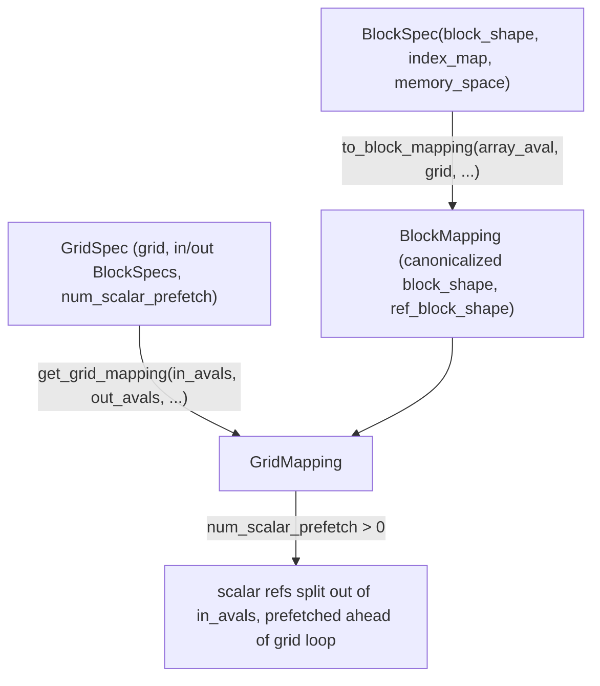

# jax._src.pallas.core — BlockSpec/BlockMapping and grid-mapping construction

## Overview

[`BlockSpec`](../catalog/jax/_src/pallas/core.md#BlockSpec) is Pallas's core kernel-authoring
abstraction: it specifies, per input/output array, how that array should be tiled into blocks for
each grid invocation of a kernel — a `block_shape` (with `None` entries squeezed out of the kernel
view, and `BlockDim` variants like `pl.Element`/`pl.Blocked`/`pl.BoundedSlice` for finer control)
plus an `index_map` function computing which block to fetch for a given grid position.
[`BlockSpec.to_block_mapping`](../catalog/jax/_src/pallas/core.md#BlockSpec.to_block_mapping)
canonicalizes a `BlockSpec` against a concrete array's abstract value into a
a `BlockMapping` (see its
[`block_shape`](../catalog/jax/_src/pallas/core.md#BlockMapping.block_shape) field).
[`get_grid_mapping`](../catalog/jax/_src/pallas/core.md#get_grid_mapping) assembles the full
grid/mapping structure for a `pallas_call`, including scalar-prefetch handling.

## Diagram

## Design rationale (why it's built this way)

**`block_shape` uses `None` to squeeze a dimension entirely out of the kernel's view, rather than
requiring every kernel to handle a size-1 dimension explicitly.**
[`BlockSpec`](../catalog/jax/_src/pallas/core.md#BlockSpec)'s docstring states "`None` is used to
specify a dimension that is squeezed out of the kernel" — this lets a kernel author write indexing
logic against only the dimensions that actually matter to the kernel body, while `BlockSpec`
handles reconstructing the full-rank block shape (`ref_block_shape`) for the underlying memory
reference.

**Scalar-prefetch inputs are split out of the ordinary grid-mapped inputs and given their own
avals before the main grid loop, rather than being treated like any other blocked input.**
[`get_grid_mapping`](../catalog/jax/_src/pallas/core.md#get_grid_mapping)'s
`num_scalar_prefetch` branch splits `in_avals` into `scalar_avals`/`unflat_in_avals`, builds
dedicated `scalar_ref_avals` via `grid_spec._make_scalar_ref_aval`, and folds them into the
index-map's own aval list — since scalar-prefetch values are meant to be available to every grid
step's index-map computation (e.g. to compute data-dependent block offsets) rather than sliced per
grid step like ordinary inputs, they need a structurally different aval/plumbing path.

## Entry points

- [`BlockSpec`](../catalog/jax/_src/pallas/core.md#BlockSpec) — the primary
  kernel-authoring-facing type; constructed once per kernel input/output to describe its tiling.
- [`BlockSpec.to_block_mapping`](../catalog/jax/_src/pallas/core.md#BlockSpec.to_block_mapping) —
  reached once per input/output during `pallas_call` tracing to canonicalize a `BlockSpec` against
  the actual array's abstract value.
- [`get_grid_mapping`](../catalog/jax/_src/pallas/core.md#get_grid_mapping) — reached once per
  `pallas_call` to assemble the complete grid/mapping structure from all inputs/outputs.

## Mechanism (step-by-step)

1. **[`BlockSpec.to_block_mapping`](../catalog/jax/_src/pallas/core.md#BlockSpec.to_block_mapping)
   canonicalizes `block_shape`** (defaulting to the array's own full shape if unset), validates its
   rank matches the array, and computes `ref_block_shape` (the squeezed-dimension-aware shape for
   the underlying memory reference).
2. **[`get_grid_mapping`](../catalog/jax/_src/pallas/core.md#get_grid_mapping) normalizes the grid
   dimensions** (marking non-constant dims as `dynamic_grid_dim` unless dynamic-shape export is
   enabled), then builds `index_map_avals` shared across every grid dimension's index-map call.
3. **If `num_scalar_prefetch` is set,** [`get_grid_mapping`](../catalog/jax/_src/pallas/core.md#get_grid_mapping)
   **splits scalar inputs out and gives them dedicated ref avals**, folded into the index-map's
   aval/tree structure ahead of the ordinary blocked inputs.

## Key data structures

- **[`BlockSpec`](../catalog/jax/_src/pallas/core.md#BlockSpec)** —
  [`block_shape`](../catalog/jax/_src/pallas/core.md#BlockSpec.block_shape) (`BlockDim | int | None`
  sequence), `index_map`, `memory_space`, `pipeline_mode`.
- **`BlockMapping`** — the canonicalized per-input/output mapping `to_block_mapping` produces,
  including [`block_shape`](../catalog/jax/_src/pallas/core.md#BlockMapping.block_shape) as a
  concrete `tuple[BlockDim, ...]`.
- **`GridMapping`** — the assembled whole-kernel grid structure
  [`get_grid_mapping`](../catalog/jax/_src/pallas/core.md#get_grid_mapping) returns.

## Dynamics (design intent)

Because `index_map_avals` is shared across every grid dimension and (when scalar prefetch is used)
extended with `scalar_ref_avals`, the index-map function signature is uniform regardless of how many
ordinary vs. scalar-prefetch inputs a kernel has — the grid-mapping machinery, not the kernel
author, absorbs the complexity of wiring scalar-prefetch values into index-map calls.

## Edge cases

- [`BlockSpec.to_block_mapping`](../catalog/jax/_src/pallas/core.md#BlockSpec.to_block_mapping)
  raises `ValueError` if the array's abstract value has no `shape` attribute, or if a specified
  `block_shape`'s rank doesn't match the array's rank — both are caught before any block-mapping
  construction proceeds.
- [`get_grid_mapping`](../catalog/jax/_src/pallas/core.md#get_grid_mapping) treats a non-constant
  grid dimension as `dynamic_grid_dim` only when dynamic-shape export is *not* enabled — under
  dynamic-shape export, such dimensions are handled differently (via `jax_core.is_dim`).

## Open questions

- What performance difference exists between scalar-prefetch inputs and ordinary blocked inputs at
  runtime (beyond the structural difference in how their avals are threaded through) is not
  addressed by this packet's cited subgraph.

## See also
- [jax-_src-pallas-mosaic-lowering](jax-_src-pallas-mosaic-lowering.md) — the TPU (Mosaic)
  lowering path that consumes `BlockMapping`/`GridMapping` to generate pipelined kernel code.
- [jax-_src-pallas-fuser-block_spec](jax-_src-pallas-fuser-block_spec.md) — block-spec
  transformation logic used when fusing Pallas kernels.
