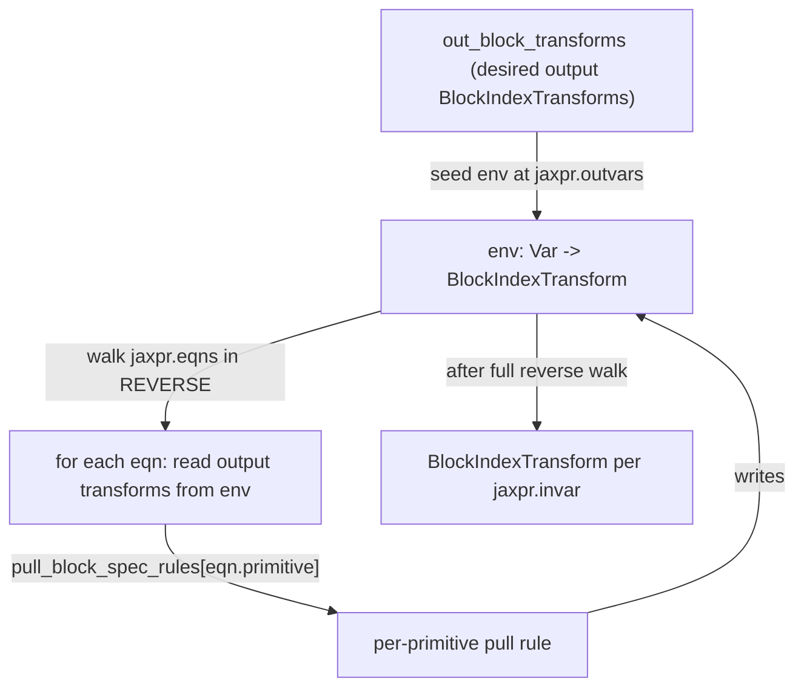

# jax._src.pallas.fuser.block_spec — backward BlockSpec propagation for kernel fusion

<!-- connect:up:begin -->
> **Cross-repo concept:** part of [pallas-kernel](../../../concepts/pallas-kernel.md) across this wiki's repos.
<!-- connect:up:end -->
## Overview

[`_pull_block_transform`](../catalog/jax/_src/pallas/fuser/block_spec.md#_pull_block_transform)
implements block-spec inference for Pallas kernel fusion: given a jaxpr and the desired
[`BlockIndexTransform`](../catalog/jax/_src/pallas/fuser/block_spec.md#BlockIndexTransform)s on its
outputs, it walks the jaxpr's equations *in reverse* to derive what block-index transform each
input (and intermediate) needs, dispatching per-primitive through a `pull_block_spec_rules`
registry. This is how the fuser determines what tiling an upstream op must produce so that a
downstream fused-kernel's desired output tiling is satisfied, without the kernel author manually
working out block shapes for every intermediate value.

## Diagram

## Design rationale (why it's built this way)

**Block-spec propagation walks the jaxpr in reverse (outputs to inputs), mirroring how the *desired*
tiling is naturally known at the output and must be inferred backward toward the inputs.**
[`_pull_block_transform`](../catalog/jax/_src/pallas/fuser/block_spec.md#_pull_block_transform)
seeds its `env` dict at `jaxpr.outvars` with the caller-supplied `out_block_transforms`, then iterates
`reversed(list(enumerate(jaxpr.eqns)))` — this is the natural direction for the question being
asked ("what block spec must this op's *inputs* have to produce this op's desired *output* block
spec"), the same way reverse-mode autodiff walks a computation graph backward from outputs.

**Propagation is dispatched per-primitive through an extensible registry
(`pull_block_spec_rules`), not a single generic rule.** Each jaxpr equation looks up
`pull_block_spec_rules.get(eqn.primitive, None)` and raises `NotImplementedError` if no rule is
registered for that primitive — since different primitives transform block indices completely
differently (an elementwise op propagates block specs unchanged; a reshape or transpose needs
primitive-specific index-transform logic), a per-primitive rule table is the only way to support
fusion across an open-ended set of ops, with graceful (explicit) failure for unsupported ones.

## Entry points

- [`_pull_block_transform`](../catalog/jax/_src/pallas/fuser/block_spec.md#_pull_block_transform) —
  the core backward-propagation pass, reached once per fused-kernel jaxpr with the desired output
  block transforms.
- [`kernel_fn`](../catalog/jax/_src/pallas/fuser/block_spec.md#make_kernel_function.kernel_fn) — a generated kernel
  function (built by `make_kernel_function`) that consumes the block specs this module infers.

## Mechanism (step-by-step)

1. **[`_pull_block_transform`](../catalog/jax/_src/pallas/fuser/block_spec.md#_pull_block_transform)
   seeds `env` at every `jaxpr.outvars`** with the corresponding `out_block_transforms` entry.
2. **For each equation, in reverse order,**
   [`_pull_block_transform`](../catalog/jax/_src/pallas/fuser/block_spec.md#_pull_block_transform)
   **reads each output variable's current block transform from `env`** (skipping the equation
   entirely if none of its outputs have a live transform), looks up the primitive's
   `pull_block_spec_rules` entry, and raises `NotImplementedError` if none is registered.
3. **The rule computes the equation's *input* block transforms** from its output transform(s) (via
   a `PullRuleContext` carrying `avals_in`/`avals_out`/usage information), and these are written
   back into `env` for the invars by
   [`_pull_block_transform`](../catalog/jax/_src/pallas/fuser/block_spec.md#_pull_block_transform).
4. **After the full reverse walk,**
   [`_pull_block_transform`](../catalog/jax/_src/pallas/fuser/block_spec.md#_pull_block_transform)'s
   **`env` holds a [`BlockIndexTransform`](../catalog/jax/_src/pallas/fuser/block_spec.md#BlockIndexTransform)
   (or `NoBlockIndexTransform`) per `jaxpr.invar`**, which becomes the inferred block spec each
   kernel input must use.

## Key data structures

- **[`BlockIndexTransform`](../catalog/jax/_src/pallas/fuser/block_spec.md#BlockIndexTransform)** —
  `block_shape`, `block_index_transform` (a callable, defaulting to a no-op
  `_null_block_index_trafo`), `memory_space`, `pipeline_mode`; the unit of information propagated
  through the reverse walk.
- **`pull_block_spec_rules`** — `dict[core.Primitive, PullBlockSpecRuleFn]`, the per-primitive
  registry `_pull_block_transform` dispatches through.
- **`PullRuleContext`** — the context object (avals, usages, `scalar_prefetch_handler`, `grid_len`,
  `strict_mode`) passed to each pull rule.

## Dynamics (design intent)

Because equations whose outputs have no live `BlockIndexTransform` in `env` are skipped entirely
(`continue` when `all(bs is no_block_index_transform ...)`), the reverse walk's cost scales with
the portion of the jaxpr actually relevant to the fused output's block structure, not the whole
jaxpr unconditionally.

## Edge cases

- An equation whose primitive has no registered `pull_block_spec_rules` entry raises
  `NotImplementedError` immediately (with the primitive and its output transforms in the error) —
  fusion silently falls back to nothing; unsupported primitives are a hard stop, not a
  best-effort skip.
- [`BlockIndexTransform`](../catalog/jax/_src/pallas/fuser/block_spec.md#BlockIndexTransform)'s
  default `block_index_transform` is `_null_block_index_trafo`, which always returns `None`
  regardless of its inputs — a transform that hasn't been given a real index-remapping function is
  effectively inert.

## Open questions

- How large the `pull_block_spec_rules` registry is in practice (which primitive classes are
  covered) and how often `NotImplementedError` is hit in real fusion attempts is not addressed by
  this packet's cited subgraph.

## See also
- [jax-_src-pallas-core](jax-_src-pallas-core.md) — `BlockSpec`/`BlockMapping`, the forward-facing
  (kernel-author-supplied) counterpart this module infers automatically for fused intermediates.
