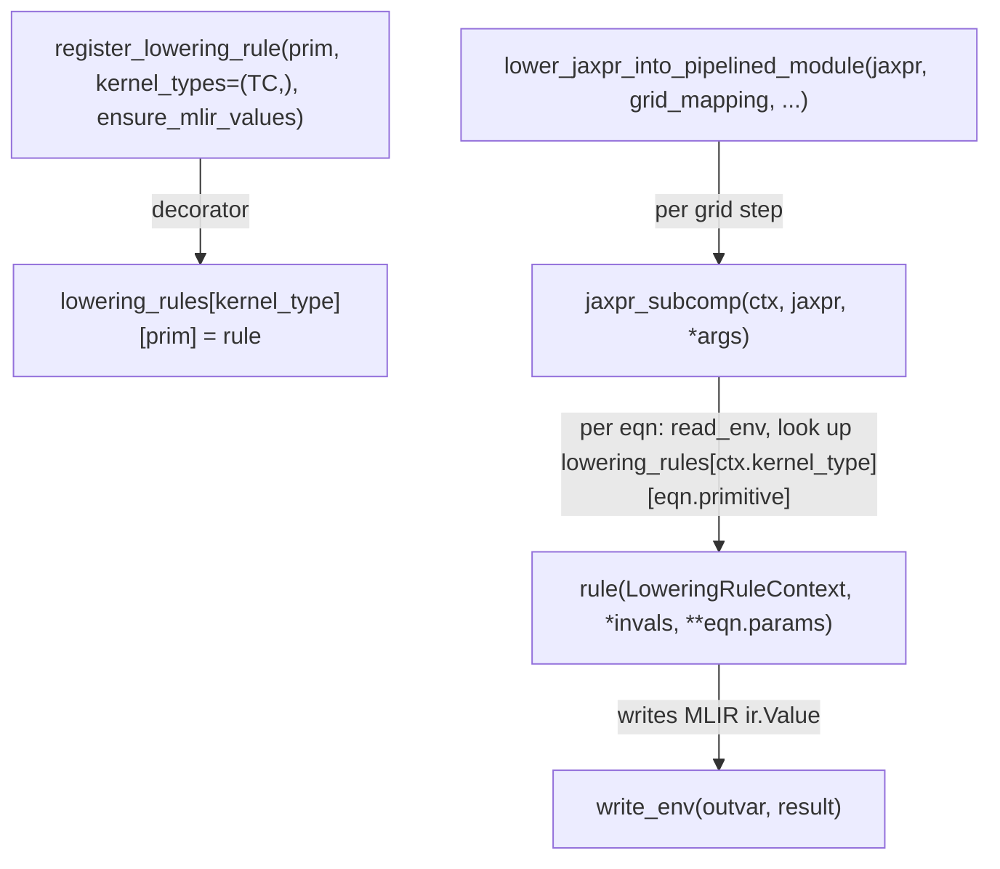

# jax._src.pallas.mosaic.lowering — jaxpr-to-Mosaic lowering via per-(kernel_type, primitive) rules

<!-- connect:up:begin -->
> **Cross-repo concept:** part of [mosaic-kernel](../../../concepts/mosaic-kernel.md), [pallas-kernel](../../../concepts/pallas-kernel.md) across this wiki's repos.
<!-- connect:up:end -->
## Overview

This module lowers a Pallas kernel's jaxpr to TPU Mosaic MLIR.
[`jaxpr_subcomp`](../catalog/jax/_src/pallas/mosaic/lowering.md#jaxpr_subcomp) walks a jaxpr's
equations in order, dispatching each primitive through a per-`(kernel_type, primitive)` lowering
rule registered by [`register_lowering_rule`](../catalog/jax/_src/pallas/mosaic/lowering.md#register_lowering_rule) —
`kernel_type` distinguishing which TPU core class (e.g. `tpu_core.CoreType.TC`) a rule applies to,
since different core types may lower the same primitive differently.
[`LoweringRuleContext`](../catalog/jax/_src/pallas/mosaic/lowering.md#LoweringRuleContext) is the
per-equation context every rule receives, carrying input/output avals, block shapes, and
version-gating helpers (`is_cloud_tpu_older_than`).
[`lower_jaxpr_into_pipelined_module`](../catalog/jax/_src/pallas/mosaic/lowering.md#lower_jaxpr_into_pipelined_module)
is the top-level entry producing the full pipelined Mosaic module for a kernel.

## Diagram

## Design rationale (why it's built this way)

**Lowering rules are keyed by both primitive *and* `kernel_type`, not just primitive.**
[`register_lowering_rule`](../catalog/jax/_src/pallas/mosaic/lowering.md#register_lowering_rule)'s
`kernel_types` parameter (defaulting to `(tpu_core.CoreType.TC,)`) writes the rule into
`lowering_rules[kernel_type][prim]` for every listed kernel type — since TPU has more than one core
class with different capabilities, the same JAX primitive may need a genuinely different Mosaic
lowering depending on which core the kernel targets, so the registry's key space includes core type
explicitly rather than assuming one universal lowering per primitive.

**`ensure_mlir_values=False` opts a rule out of automatic literal-to-MLIR-value conversion, tracked
via a separate `skip_mlir_conversions` set.**
[`register_lowering_rule`](../catalog/jax/_src/pallas/mosaic/lowering.md#register_lowering_rule)
adds `(prim, kernel_type)` to `skip_mlir_conversions` when `ensure_mlir_values=False`, and
[`jaxpr_subcomp`](../catalog/jax/_src/pallas/mosaic/lowering.md#jaxpr_subcomp) checks this set before
calling `_ensure_mlir_value` on each input — most rules want plain MLIR values, but some rules
(handling e.g. `KeyScalarBundle`-typed inputs) need to see the raw, unconverted value, so this is an
explicit per-rule opt-out rather than a universal behavior.

## Entry points

- [`lower_jaxpr_into_pipelined_module`](../catalog/jax/_src/pallas/mosaic/lowering.md#lower_jaxpr_into_pipelined_module) —
  the top-level entry, reached once per Pallas TPU kernel compilation to produce the full pipelined
  Mosaic module.
- [`jaxpr_subcomp`](../catalog/jax/_src/pallas/mosaic/lowering.md#jaxpr_subcomp) — reached
  (potentially recursively, for control-flow primitives) to lower one jaxpr's equations to MLIR.
- [`register_lowering_rule`](../catalog/jax/_src/pallas/mosaic/lowering.md#register_lowering_rule) —
  the decorator every per-primitive Mosaic lowering rule uses to register itself.

## Mechanism (step-by-step)

1. **[`jaxpr_subcomp`](../catalog/jax/_src/pallas/mosaic/lowering.md#jaxpr_subcomp) binds each
   jaxpr invar to its corresponding MLIR value/block-shape** in `env`/`block_shape_env`.
2. **For each equation,**
   [`jaxpr_subcomp`](../catalog/jax/_src/pallas/mosaic/lowering.md#jaxpr_subcomp) **reads input
   values from `env`**, and — unless the primitive is in `skip_mlir_conversions` for the current
   `kernel_type` — ensures every input is an actual MLIR `ir.Value` via `_ensure_mlir_value`.
3. **It looks up `lowering_rules[ctx.kernel_type][eqn.primitive]`** and calls the registered rule
   with a [`LoweringRuleContext`](../catalog/jax/_src/pallas/mosaic/lowering.md#LoweringRuleContext)
   carrying `avals_in`/`avals_out`/`block_shapes`, writing the rule's result(s) back into `env` for
   the equation's outvars.

## Key data structures

- **[`LoweringRuleContext`](../catalog/jax/_src/pallas/mosaic/lowering.md#LoweringRuleContext)** —
  `lowering_context`, `avals_in`, `avals_out`, `block_shapes`; exposes
  `is_cloud_tpu_older_than(year, month, day)` for version-gated lowering behavior and
  `aval_to_ir_type` for MLIR type conversion.
- **`lowering_rules`** — `dict[CoreType, dict[Primitive, rule]]`, the registry
  [`register_lowering_rule`](../catalog/jax/_src/pallas/mosaic/lowering.md#register_lowering_rule)
  populates and [`jaxpr_subcomp`](../catalog/jax/_src/pallas/mosaic/lowering.md#jaxpr_subcomp)
  dispatches through.

## Dynamics (design intent)

Because `LoweringRuleContext.is_cloud_tpu_older_than` always assumes "the oldest possible backend"
when the actual TPU version can't be queried, lowering rules that branch on hardware generation are
written to degrade toward the more conservative/compatible code path whenever version information
is unavailable, rather than risk generating code that assumes unavailable newer capabilities.

## Edge cases

- [`jaxpr_subcomp`](../catalog/jax/_src/pallas/mosaic/lowering.md#jaxpr_subcomp) asserts
  `not jaxpr.constvars` — a jaxpr with unlowered constants is not a valid input to this function;
  constants must already be resolved before reaching this lowering pass.
- [`LoweringRuleContext.is_cloud_tpu_older_than`](../catalog/jax/_src/pallas/mosaic/lowering.md#LoweringRuleContext)
  returns `True` (i.e. "assume oldest") whenever `self.lowering_context.backend is None` — there is
  no way to query the actual version in that case, so the conservative assumption is hardcoded, not
  left to raise or default the other way.

## Open questions

- How many distinct `kernel_types` beyond `tpu_core.CoreType.TC` exist and how their lowering rule
  sets diverge is not addressed by this packet's cited subgraph.

## See also
- [jax-_src-pallas-core](jax-_src-pallas-core.md) — `BlockSpec`/`GridMapping`, the block/grid
  structure `lower_jaxpr_into_pipelined_module` consumes to build the pipelined kernel.
- [jax-_src-pallas-mosaic_gpu-lowering](jax-_src-pallas-mosaic_gpu-lowering.md) — the analogous
  per-primitive lowering-rule pattern for the GPU (Mosaic GPU) backend.
