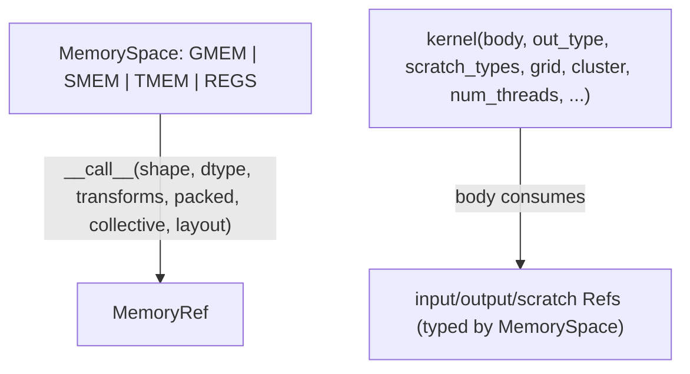

# jax._src.pallas.mosaic_gpu.core — MemorySpace hierarchy and the kernel() entry point

## Overview

[`MemorySpace`](../catalog/jax/_src/pallas/mosaic_gpu/core.md#MemorySpace) is an enum naming the
GPU memory hierarchy Pallas Mosaic-GPU kernels can target — global memory (`GMEM`), shared memory
(`SMEM`), tensor memory (`TMEM`, new on Blackwell, unavailable on Hopper), and registers (`REGS`) —
and each member is itself callable, acting as a `MemoryRef` constructor
(`MemorySpace.SMEM(shape, dtype)`).
[`kernel`](../catalog/jax/_src/pallas/mosaic_gpu/core.md#kernel) is the top-level entry point for
defining a Mosaic GPU kernel, exposing `grid`/`cluster`/`num_threads` (warpgroup-granularity, "not...
CUDA threads") parameters that map directly onto GPU launch-configuration concepts.

## Diagram

## Design rationale (why it's built this way)

**Each `MemorySpace` enum member is callable and acts as its own type constructor, rather than a
separate factory function per memory space.** `MemorySpace.__call__(self, shape, dtype, ...)`
returns a `pallas_core.MemoryRef` (with a `TMEM`-specific branch, since tensor memory needs extra
parameters like `layout`/`packed`/`collective` that don't apply to the other spaces) — writing
`pl.SMEM((128, 128), jnp.float32)`-style calls directly on the enum member is more compact than a
separate `smem_ref(shape, dtype)` function per memory kind, and it keeps the "which memory space"
and "what shape/dtype" concerns visually attached at the call site.

**`num_threads` in `kernel()` is explicitly documented as warpgroup-granularity, not CUDA-thread
granularity — the docstring corrects a natural misreading up front.** The parameter doc states:
"Note that these do not correspond to CUDA threads, but rather to warpgroups on Hopper and Blackwell
GPUs" — since "thread" in CUDA vocabulary normally means an individual SIMT lane, and Pallas Mosaic
GPU kernels instead schedule at warpgroup granularity (a NVIDIA Hopper/Blackwell-specific concept),
this note heads off the most likely misunderstanding for anyone porting CUDA-thread intuition
directly.

## Entry points

- [`kernel`](../catalog/jax/_src/pallas/mosaic_gpu/core.md#kernel) — the primary entry point,
  usable either as a decorator (`body` omitted) or a direct call (`body` provided), defining a full
  Mosaic GPU kernel with its grid/cluster/thread launch configuration.
- [`MemorySpace`](../catalog/jax/_src/pallas/mosaic_gpu/core.md#MemorySpace) — reached wherever a
  kernel input/output/scratch buffer's memory space must be specified (e.g. `pl.SMEM(shape,
  dtype)`).
- [`GPUMemoryRef.get_ref_aval`](../catalog/jax/_src/pallas/mosaic_gpu/core.md#GPUMemoryRef.get_ref_aval) — reached to obtain
  the abstract `Ref` value for a memory-space-typed buffer.

## Mechanism (step-by-step)

1. **A kernel author calls a [`MemorySpace`](../catalog/jax/_src/pallas/mosaic_gpu/core.md#MemorySpace)
   member as a constructor** (e.g. `MemorySpace.SMEM(shape, dtype, transforms=...)`), producing a
   `pallas_core.MemoryRef` — with a dedicated branch for `TMEM` (accepting
   `layout`/`packed`/`collective` parameters the other spaces don't use).
2. **[`kernel`](../catalog/jax/_src/pallas/mosaic_gpu/core.md#kernel) accepts a `body` function**
   (or, if omitted, returns a decorator), plus `out_type`/`scratch_types` describing the kernel's
   output/scratch buffer pytree shapes, and `grid`/`grid_names`/`cluster`/`cluster_names`/
   `num_threads`/`thread_name` describing the launch configuration.
3. **The callable [`kernel`](../catalog/jax/_src/pallas/mosaic_gpu/core.md#kernel) returns runs the
   kernel** over any number of input operands, producing an output with the same pytree structure
   as `out_type`.

## Key data structures

- **[`MemorySpace`](../catalog/jax/_src/pallas/mosaic_gpu/core.md#MemorySpace)** — `GMEM`/`SMEM`/
  `TMEM`/`REGS` enum members, each callable as a `MemoryRef` constructor.
- **`MemoryRef`** (from `pallas_core`) — the typed buffer reference `MemorySpace.__call__`
  constructs.

## Dynamics (design intent)

Because `num_threads` maps to warpgroups rather than individual CUDA threads, the actual SIMT
parallelism within one Pallas "thread" (warpgroup) is implicit in the Mosaic GPU lowering rather
than something the kernel author configures directly through this API — kernel authors reason at
the warpgroup/block/cluster granularity this module exposes, not raw thread counts.

## Edge cases

- `TMEM` is explicitly documented as "New addition to Blackwell. Not available on Hopper" — a
  kernel targeting `TMEM` on Hopper hardware is unsupported by construction, not merely
  unoptimized.

## Open questions

- Whether `MemorySpace.__call__`'s `packed`/`collective` parameters (beyond the `TMEM`-specific
  branch) have documented effects for the other memory spaces is not addressed by this packet's
  cited subgraph.

## See also
- [jax-_src-pallas-mosaic_gpu-lowering](jax-_src-pallas-mosaic_gpu-lowering.md) — the lowering
  pass that consumes kernels defined via `kernel()`/`MemorySpace`-typed refs.
- [jax-experimental-mosaic-gpu-core](jax-experimental-mosaic-gpu-core.md) — the lower-level Mosaic
  GPU dialect primitives (`Warpgroup`, `Lane`) this module's `num_threads`/warpgroup concepts build
  on.
