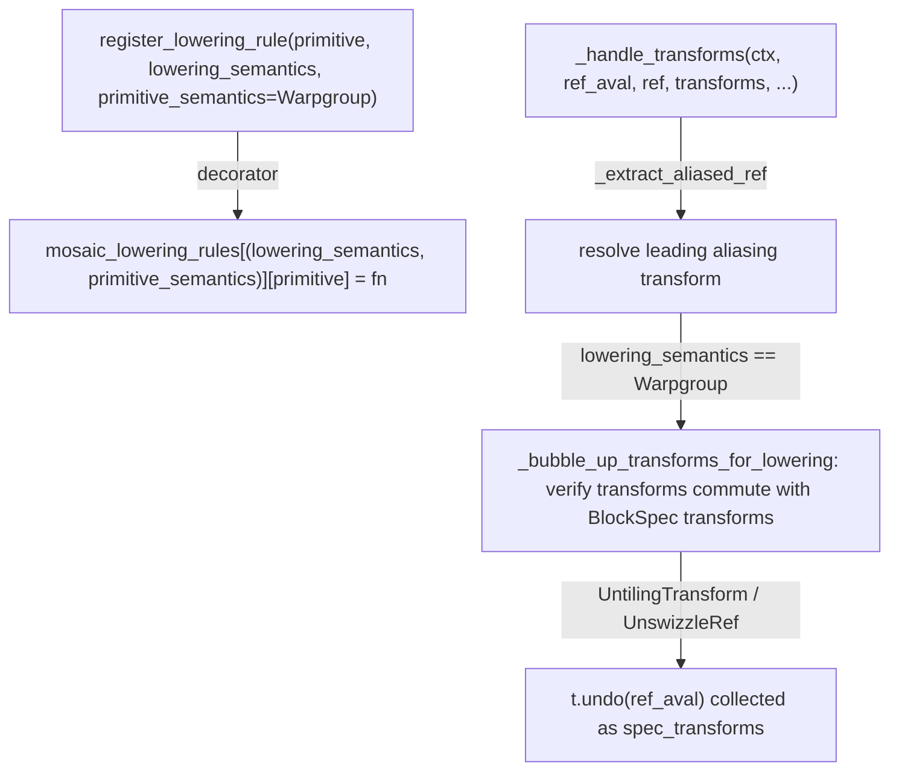

# jax._src.pallas.mosaic_gpu.lowering — (lowering_semantics, primitive_semantics)-keyed rules and ref-transform handling

## Overview

This module lowers Pallas Mosaic-GPU kernels to MLIR, with lowering rules keyed by a
`(lowering_semantics, primitive_semantics)` pair — `lowering_semantics` distinguishing `Lane`-level
from warpgroup-level (`WGxWG`/`WGxWARP`) code generation, `primitive_semantics` further
distinguishing e.g. per-warpgroup behavior — registered via
[`register_lowering_rule`](../catalog/jax/_src/pallas/mosaic_gpu/lowering.md#register_lowering_rule).
[`_handle_transforms`](../catalog/jax/_src/pallas/mosaic_gpu/lowering.md#_handle_transforms)
resolves ref transforms (tiling, swizzling, aliasing) on a memory reference before an op actually
lowers, including "bubbling up" transforms to verify they commute correctly with a `BlockSpec`'s own
transforms.

## Diagram

## Design rationale (why it's built this way)

**Lowering rules are keyed by a `(lowering_semantics, primitive_semantics)` pair, not primitive
alone — reflecting that Mosaic GPU supports multiple distinct code-generation strategies for the
same primitive.** [`register_lowering_rule`](../catalog/jax/_src/pallas/mosaic_gpu/lowering.md#register_lowering_rule)
writes into `mosaic_lowering_rules[(lowering_semantics, primitive_semantics)][primitive]` — since
Mosaic GPU distinguishes `Lane`-level lowering from warpgroup-level lowering (with `WGxWG`/
`WGxWARP` further splitting warpgroup semantics), and a given primitive may need genuinely different
generated code under each, the registry's key space must include both axes, not just the primitive
being lowered.

**Ref transforms (tiling/swizzling) are explicitly "bubbled up" and checked for commutativity with
`BlockSpec` transforms before lowering proceeds, rather than assumed compatible.**
[`_handle_transforms`](../catalog/jax/_src/pallas/mosaic_gpu/lowering.md#_handle_transforms)'s
comment states this bubbling exists "to verify that all the specified transforms can be commuted
correctly with the `BlockSpec` transforms" — since a ref's own layout transforms (e.g. untiling,
unswizzling for shared-memory bank-conflict avoidance) and the block-level tiling from a
`BlockSpec` are two independently-specified transform layers, lowering must confirm they don't
conflict before generating code that assumes both apply correctly together.

## Entry points

- [`register_lowering_rule`](../catalog/jax/_src/pallas/mosaic_gpu/lowering.md#register_lowering_rule) —
  the decorator every per-primitive Mosaic GPU lowering rule uses to register itself.
- [`_handle_transforms`](../catalog/jax/_src/pallas/mosaic_gpu/lowering.md#_handle_transforms) —
  reached by lowering rules that operate on a transformed `Ref` (tiled/swizzled/aliased memory
  reference) before performing the actual op lowering.

## Mechanism (step-by-step)

1. **[`register_lowering_rule`](../catalog/jax/_src/pallas/mosaic_gpu/lowering.md#register_lowering_rule)
   writes a rule function into `mosaic_lowering_rules`** under the `(lowering_semantics,
   primitive_semantics)` key, defaulting `primitive_semantics` to `Warpgroup`.
2. **[`_handle_transforms`](../catalog/jax/_src/pallas/mosaic_gpu/lowering.md#_handle_transforms)
   first resolves any leading aliasing transform** via `_extract_aliased_ref`.
3. **Under `Warpgroup` lowering semantics,**
   [`_handle_transforms`](../catalog/jax/_src/pallas/mosaic_gpu/lowering.md#_handle_transforms)
   **bubbles up the ref's remaining transforms** to verify commutativity with `BlockSpec`
   transforms, collecting `UntilingTransform`/`UnswizzleRef` instances (via their `.undo(ref_aval)`)
   as `spec_transforms` to be applied at the block-spec level rather than the ref-access level.

## Key data structures

- **`mosaic_lowering_rules`** — `dict[(LoweringSemantics, PrimitiveSemantics), dict[Primitive,
  rule]]`, the two-axis-keyed registry this module's lowering dispatch walks.
- **[`ModuleContext.lowering_semantics`](../catalog/jax/_src/pallas/mosaic_gpu/lowering.md#ModuleContext.lowering_semantics)** —
  the per-module lowering context's field recording which `mgpu.LoweringSemantics` mode (`Lane` vs.
  warpgroup) the current lowering pass is targeting.

## Dynamics (design intent)

Because ref-transform resolution happens once, before the op-specific lowering rule runs, every
lowering rule that touches a transformed ref can assume `_handle_transforms` has already validated
transform commutativity — individual rules don't need to re-derive or re-check tiling/swizzling
compatibility themselves.

## Edge cases

- [`_handle_transforms`](../catalog/jax/_src/pallas/mosaic_gpu/lowering.md#_handle_transforms)'s
  bubble-up step under `Warpgroup` semantics passes `handle_transposes=False` explicitly — transpose
  transforms are deliberately excluded from this particular commutativity check at this call site,
  while `handle_reshapes` is passed through from the caller's own setting.
- [`register_lowering_rule`](../catalog/jax/_src/pallas/mosaic_gpu/lowering.md#register_lowering_rule)
  defaults `primitive_semantics` to `Warpgroup` — a rule registered without specifying
  `primitive_semantics` silently applies only to the warpgroup case, not to every possible
  `primitive_semantics` value.

## Open questions

- How much of the `mosaic_lowering_rules` table is duplicated across the `Lane`/`WGxWG`/`WGxWARP`
  semantics (i.e. how many primitives share one lowering across all three) versus needing a
  genuinely distinct rule per semantics is not addressed by this packet's cited subgraph.

## See also
- [jax-_src-pallas-mosaic_gpu-core](jax-_src-pallas-mosaic_gpu-core.md) — `MemorySpace`/`kernel`,
  the kernel-authoring surface this lowering pass compiles.
- [jax-_src-pallas-mosaic_gpu-primitives](jax-_src-pallas-mosaic_gpu-primitives.md) — specific
  primitive lowering rules (async copy/semaphore ops) registered through this module's mechanism.
