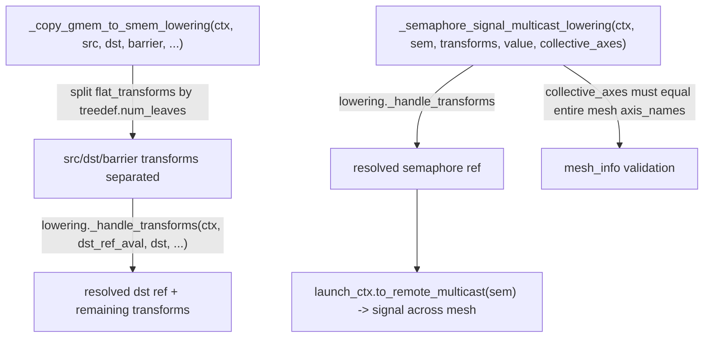

# jax._src.pallas.mosaic_gpu.primitives — async copy and multicast-semaphore lowering rules

## Overview

This module defines the lowering rules for Pallas Mosaic-GPU's low-level asynchronous-copy and
cross-device-collective primitives:
[`_copy_gmem_to_smem_lowering`](../catalog/jax/_src/pallas/mosaic_gpu/primitives.md#_copy_gmem_to_smem_lowering)/
[`_copy_smem_to_gmem_lowering`](../catalog/jax/_src/pallas/mosaic_gpu/primitives.md#_copy_smem_to_gmem_lowering)
implement barrier-synchronized async copies between global and shared memory (TMA-style transfers),
[`_async_store_smem_lowering`](../catalog/jax/_src/pallas/mosaic_gpu/primitives.md#_async_store_smem_lowering)
handles async shared-memory stores, and
[`_semaphore_signal_multicast_lowering`](../catalog/jax/_src/pallas/mosaic_gpu/primitives.md#_semaphore_signal_multicast_lowering)
implements a semaphore signal broadcast across a mesh's `collective_axes` — used for
cross-device-cluster synchronization on multi-GPU/NVLink setups. Every rule reuses
[`_handle_transforms`](jax-_src-pallas-mosaic_gpu-lowering.md) to resolve ref transforms (tiling,
swizzling) before issuing the actual memory operation.

## Diagram

## Design rationale (why it's built this way)

**`_semaphore_signal_multicast_lowering` requires `collective_axes` to exactly equal the entire
mesh's axis names, not a subset — raising if they differ.** The function checks `set(collective_axes)
!= set(mesh_info.axis_names)` and raises `ValueError` if so — a partial-mesh multicast signal isn't
supported by this lowering rule; the semaphore signal broadcast semantics only cover "every device
in the mesh," so specifying a strict subset would silently under-specify (or mismatch) the intended
collective scope, which is treated as a hard configuration error rather than a partial-broadcast
fallback.

**Every copy/signal lowering rule resolves ref transforms via the shared
`lowering._handle_transforms` helper before doing the actual memory operation**, rather than each
handling tiling/swizzling inline. [`_copy_gmem_to_smem_lowering`](../catalog/jax/_src/pallas/mosaic_gpu/primitives.md#_copy_gmem_to_smem_lowering)
and [`_semaphore_signal_multicast_lowering`](../catalog/jax/_src/pallas/mosaic_gpu/primitives.md#_semaphore_signal_multicast_lowering)
both call the same shared transform-resolution logic (see
[jax-_src-pallas-mosaic_gpu-lowering](jax-_src-pallas-mosaic_gpu-lowering.md)) — keeping this
non-trivial logic (tiling/swizzling/aliasing resolution, `Warpgroup`-vs-`Lane` semantics handling)
centralized rather than duplicated per primitive rule.

## Entry points

- [`_copy_gmem_to_smem_lowering`](../catalog/jax/_src/pallas/mosaic_gpu/primitives.md#_copy_gmem_to_smem_lowering) /
  [`_copy_smem_to_gmem_lowering`](../catalog/jax/_src/pallas/mosaic_gpu/primitives.md#_copy_smem_to_gmem_lowering) —
  reached when lowering a Pallas kernel's async GMEM↔SMEM copy primitives.
- [`_async_store_smem_lowering`](../catalog/jax/_src/pallas/mosaic_gpu/primitives.md#_async_store_smem_lowering) —
  reached when lowering an async shared-memory store.
- [`_semaphore_signal_multicast_lowering`](../catalog/jax/_src/pallas/mosaic_gpu/primitives.md#_semaphore_signal_multicast_lowering) —
  reached when lowering a semaphore-signal broadcast across a mesh's collective axes.

## Mechanism (step-by-step)

1. **[`_copy_gmem_to_smem_lowering`](../catalog/jax/_src/pallas/mosaic_gpu/primitives.md#_copy_gmem_to_smem_lowering)
   splits its flattened transform list** back into per-ref (src/dst/barrier) transform groups via
   [`split_list`](jax-_src-util.md) keyed by each treedef's `num_leaves`.
2. **It resolves the destination ref's transforms** via
   [`lowering._handle_transforms`](jax-_src-pallas-mosaic_gpu-lowering.md), with
   `handle_transposes` set based on whether the current
   [`ModuleContext.lowering_semantics`](../catalog/jax/_src/pallas/mosaic_gpu/lowering.md#ModuleContext.lowering_semantics)
   is `Warpgroup`.
3. **[`_semaphore_signal_multicast_lowering`](../catalog/jax/_src/pallas/mosaic_gpu/primitives.md#_semaphore_signal_multicast_lowering)
   resolves the semaphore ref's transforms**, validates `collective_axes` against the mesh's full
   axis set, and calls `ctx.launch_ctx.to_remote_multicast(sem)` to obtain a multicast-addressed
   reference before issuing the signal.

## Key data structures

- **[`LoweringRuleContext`](../catalog/jax/_src/pallas/mosaic_gpu/lowering.md#LoweringRuleContext)** —
  the per-equation context (`avals_in`, `launch_ctx`, `module_ctx`) every lowering rule in this
  module receives.
- **`AbstractRef`** — the abstract value type every src/dst/semaphore ref argument is asserted to
  be an instance of before lowering proceeds.

## Dynamics (design intent)

Because [`_semaphore_signal_multicast_lowering`](../catalog/jax/_src/pallas/mosaic_gpu/primitives.md#_semaphore_signal_multicast_lowering)
requires `collective_axes` to cover the whole mesh, the multicast signal's cost/fan-out is always
proportional to the full device count in the mesh — there is no partial-broadcast code path to
optimize for smaller collective scopes within this primitive.

## Edge cases

- [`_semaphore_signal_multicast_lowering`](../catalog/jax/_src/pallas/mosaic_gpu/primitives.md#_semaphore_signal_multicast_lowering)
  raises `NotImplementedError` if any ref transform remains on the semaphore after
  `_handle_transforms` resolution — a semaphore ref with unhandled transforms is a hard failure,
  not a best-effort application.
- [`_semaphore_signal_multicast_lowering`](../catalog/jax/_src/pallas/mosaic_gpu/primitives.md#_semaphore_signal_multicast_lowering)
  raises `ValueError` if `ctx.module_ctx.mesh_info` is `None` — a collective-axes signal requires an
  active mesh context; there is no implicit single-device fallback.

## Open questions

- Whether `_copy_gmem_to_smem_lowering`'s barrier-based synchronization protocol has documented
  performance characteristics (e.g. overlap potential with compute) beyond what's shown in this
  packet's cited subgraph is not addressed here.

## See also
- [jax-_src-pallas-mosaic_gpu-lowering](jax-_src-pallas-mosaic_gpu-lowering.md) —
  `register_lowering_rule`/`_handle_transforms`, the shared registration and ref-transform
  machinery every rule in this module builds on.
- [jax-_src-util](jax-_src-util.md) — `split_list`, used to partition flattened transform lists.
