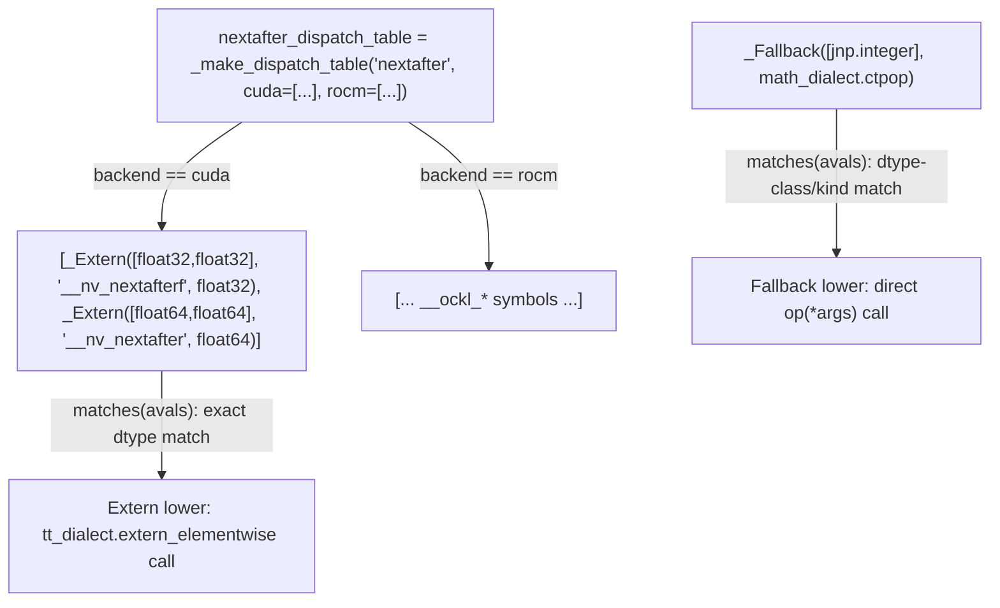

# jax._src.pallas.triton.lowering — backend-specific (CUDA/ROCm) math dispatch tables

## Overview

This module lowers Pallas Triton-backend kernels' jaxprs to Triton IR
([`lower_jaxpr_to_triton_ir`](../catalog/jax/_src/pallas/triton/lowering.md#lower_jaxpr_to_triton_ir)/
[`lower_jaxpr_to_triton_module`](../catalog/jax/_src/pallas/triton/lowering.md#lower_jaxpr_to_triton_module)).
For math functions without a native Triton IR op, lowering dispatches through backend-specific
tables (e.g. [`nextafter_dispatch_table`](../catalog/jax/_src/pallas/triton/lowering.md#nextafter_dispatch_table))
built from [`_Extern`](../catalog/jax/_src/pallas/triton/lowering.md#_Extern) entries (calling a
vendor libdevice symbol like `__nv_nextafterf` on CUDA) and
[`_Fallback`](../catalog/jax/_src/pallas/triton/lowering.md#_Fallback) entries (calling a native
Triton/MLIR dialect op directly), matched by exact or dtype-class match against the operation's
input avals.

## Diagram

## Design rationale (why it's built this way)

**Math functions without a native Triton op are dispatched through backend-specific (CUDA vs.
ROCm) tables of candidate lowerings, not a single universal implementation.**
[`nextafter_dispatch_table`](../catalog/jax/_src/pallas/triton/lowering.md#nextafter_dispatch_table)
(and similar tables for popcount/clz/etc.) are built via `_make_dispatch_table(name, cuda=[...],
rocm=[...])` — since CUDA and ROCm expose different libdevice math libraries with different symbol
names (`__nv_nextafterf` vs. an AMD-specific equivalent), and a single dtype's operation may need a
completely different external call per backend, the dispatch table structure keeps this
backend-specific knowledge in one declarative table rather than scattered conditionals.

**`_Extern` matches by exact dtype (with a weak-type exception), while `_Fallback` matches by dtype
*class/kind* — reflecting that external symbol calls need an exact type match but native ops can be
more permissive.** `_Extern`'s `matches`
requires `aval.dtype == jnp.dtype(arg_type)` (or a weak-type-compatible kind match), since calling
an external libdevice symbol like `__nv_nextafterf` requires the exact expected C type; `_Fallback`'s own match check
instead checks `jnp.issubdtype(aval.dtype, arg_class)` — a broader class match — because a native
Triton/MLIR op (like `math_dialect.ctpop`) can typically operate across a whole dtype class (e.g.
"any integer type") without needing an exact-width match.

## Entry points

- [`lower_jaxpr_to_triton_ir`](../catalog/jax/_src/pallas/triton/lowering.md#lower_jaxpr_to_triton_ir) /
  [`lower_jaxpr_to_triton_module`](../catalog/jax/_src/pallas/triton/lowering.md#lower_jaxpr_to_triton_module) —
  the top-level entries lowering a Pallas Triton kernel's jaxpr to Triton IR/module.
- [`_dot_general_lowering`](../catalog/jax/_src/pallas/triton/lowering.md#_dot_general_lowering) —
  reached when lowering `dot_general` (matmul) operations to Triton's dot primitive.
- [`register_lowering`](../catalog/jax/_src/pallas/triton/lowering.md#register_lowering) — the
  decorator every per-primitive Triton lowering rule uses to register itself.

## Mechanism (step-by-step)

1. **A dispatch table like [`nextafter_dispatch_table`](../catalog/jax/_src/pallas/triton/lowering.md#nextafter_dispatch_table)
   is built once, per backend, as an ordered list of [`_Extern`](../catalog/jax/_src/pallas/triton/lowering.md#_Extern)/
   [`_Fallback`](../catalog/jax/_src/pallas/triton/lowering.md#_Fallback) candidates.**
2. **At lowering time, the current backend selects the appropriate candidate list** from a table
   such as [`nextafter_dispatch_table`](../catalog/jax/_src/pallas/triton/lowering.md#nextafter_dispatch_table),
   and each candidate's match check is evaluated (in order) against the operation's actual input
   abstract values.
3. **The first matching candidate's `lower(ctx, *args)` is invoked** — an
   [`_Extern`](../catalog/jax/_src/pallas/triton/lowering.md#_Extern) entry broadcasts/casts
   arguments to the exact expected type and emits an `extern_elementwise` call; a
   [`_Fallback`](../catalog/jax/_src/pallas/triton/lowering.md#_Fallback) entry broadcasts
   arguments and calls the native op directly.

## Key data structures

- **[`_Extern`](../catalog/jax/_src/pallas/triton/lowering.md#_Extern)** —
  `arg_types`, `symbol` (the external libdevice symbol name), `result_type`.
- **[`_Fallback`](../catalog/jax/_src/pallas/triton/lowering.md#_Fallback)** — `arg_classes`
  (dtype classes to match against), `op` (the native Triton/MLIR dialect callable).
- **`nextafter_dispatch_table`** — a representative backend-keyed dispatch table built from these
  two entry types.

## Dynamics (design intent)

Because each dispatch table's candidate list is checked in order and the first match wins, table
authors control fallback priority explicitly by list ordering — e.g. listing exact-dtype
`_Extern` entries before a broader `_Fallback` entry ensures the more specific (potentially faster
or more precise) external call is preferred when its exact dtype match applies, falling back to the
native op only when no exact-dtype external symbol matches.

## Edge cases

- `_Extern`'s `matches` returns
  `False` immediately if the argument count doesn't match `len(self.arg_types)` — a dispatch
  table entry never partially matches a call with a different arity.
- `_Extern`'s `lower` casts an argument
  only when it is `weak_type` *and* its dtype differs from the entry's expected `arg_type` — a
  strongly-typed argument with a mismatched dtype is not silently cast, relying instead on
  `matches` having already filtered it out.

## Open questions

- How the "no candidate matches" case is handled (e.g. whether it falls through to a generic error
  or a further fallback path) is not addressed by this packet's cited subgraph.

## See also
- [jax-_src-pallas-mosaic-lowering](jax-_src-pallas-mosaic-lowering.md) — the analogous
  per-`(kernel_type, primitive)` lowering-rule registry pattern for the TPU (Mosaic) backend.
- [jax-_src-dtypes](jax-_src-dtypes.md) — `issubdtype`, used by `_Fallback`'s own match check for its
  dtype-class matching.
