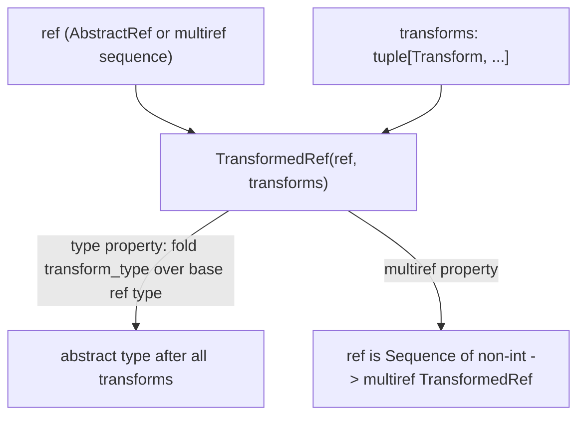

# jax._src.state.types — AbstractRef and the composable Transform protocol

## Overview

[`AbstractRef`](../catalog/jax/_src/state/types.md#AbstractRef) is JAX's abstract mutable-array-
reference type, wrapping an `inner_aval` plus a `memory_space` (unifying how refs to TPU/GPU
memory spaces are represented at the type level).
[`Transform`](../catalog/jax/_src/state/types.md#Transform) is a `Protocol` for composable
operations applied to a ref (indexing, bitcasting, and similar) — each transform knows how to
change a ref's abstract type (`transform_type`) and how to invert itself (`undo`).
[`TransformedRef`](../catalog/jax/_src/state/types.md#TransformedRef) bundles a base `ref` with a
tuple of such [`transforms`](../catalog/jax/_src/state/types.md#TransformedRef.transforms) applied
in sequence, with its own abstract `type` computed by folding each transform's `transform_type`
over the base ref's type.

## Diagram

## Design rationale (why it's built this way)

**`Transform` is a `Protocol`, not a single concrete class hierarchy, letting different transform
kinds (indexing, bitcasting) share one composable interface without a common base implementation.**
[`Transform`](../catalog/jax/_src/state/types.md#Transform) declares `transform_type`/`undo`/
`pretty_print` as the interface every transform must implement — concrete transforms like
`BitcastTransform` implement `transform_type` according to their own semantics (bitcasting changes
dtype, not shape), while `TransformedRef.type` (see below) can uniformly fold over any sequence of
transforms regardless of their concrete kind.

**`TransformedRef.__post_init__` enforces that a "multiref" transformed ref carries exactly one
`MultiRefTransform`, not an arbitrary transform chain.** The constructor raises `ValueError` if
`self.multiref` is true and `len(self.transforms) != 1` — since a multi-ref transform (one that
combines several underlying refs into one logical value) doesn't compose the same way single-ref
transforms do, this invariant is enforced structurally at construction rather than relying on every
consumer to separately validate it.

**`AbstractRef.__init__` hides the wrapped aval's own memory space, always normalizing it to
`Device`, and validates that any pre-existing non-`Device` memory space matches the ref's requested
one.** [`AbstractRef.__init__`](../catalog/jax/_src/state/types.md#AbstractRef) raises `ValueError`
if `inner_aval.memory_space` is set to something other than `None`/`Device` and disagrees with the
ref's own `memory_space` — the comment marks this area "TODO... merge memory spaces," indicating
this is a known, currently-worked-around inconsistency between how memory space is tracked on the
inner value type versus the ref wrapping it.

## Entry points

- [`AbstractRef`](../catalog/jax/_src/state/types.md#AbstractRef) — the core abstract-value type
  for mutable references, reached wherever a `Ref` (as opposed to a plain value) is being typed.
- [`TransformedRef`](../catalog/jax/_src/state/types.md#TransformedRef) — reached to represent a
  ref with one or more composed transforms (e.g. after indexing/slicing) applied.
- [`get_ref_and_transforms`](../catalog/jax/_src/state/primitives.md#get_ref_and_transforms) — reached
  to decompose a (possibly already-transformed) ref expression into its base ref and transform
  list.

## Mechanism (step-by-step)

1. **[`AbstractRef.__init__`](../catalog/jax/_src/state/types.md#AbstractRef) validates and
   normalizes the wrapped `inner_aval`'s memory space** to `Device`, storing the ref's own
   `memory_space`/`kind`.
2. **A [`TransformedRef`](../catalog/jax/_src/state/types.md#TransformedRef) bundles a base
   `ref` with a `transforms` tuple**, validating the multiref invariant in `__post_init__`.
3. **[`TransformedRef.type`](../catalog/jax/_src/state/types.md#TransformedRef) computes the
   ref's abstract type after all transforms** by folding `transform_type` across `self.transforms`
   in order (or, for a multiref ref, calling the single `MultiRefTransform`'s `transform_types` over
   every underlying ref's type).

## Key data structures

- **[`AbstractRef`](../catalog/jax/_src/state/types.md#AbstractRef)** — `inner_aval`,
  `memory_space`, `kind`; a `core.AbstractValue` subclass.
- **[`Transform`](../catalog/jax/_src/state/types.md#Transform)** — the `Protocol` interface
  (`transform_type`, `undo`, `pretty_print`) every ref transform implements.
- **[`TransformedRef`](../catalog/jax/_src/state/types.md#TransformedRef)** — `ref`,
  [`transforms`](../catalog/jax/_src/state/types.md#TransformedRef.transforms) (a tuple of
  `Transform`); exposes `multiref`, `is_dynamic_size`, and cached `type`.

## Dynamics (design intent)

Because `TransformedRef.type` recomputes by folding over `self.transforms` (cached via
`functools.cached_property`), the abstract type of a transformed ref is derived, not independently
tracked — adding a new transform kind only requires implementing `transform_type` correctly; no
change is needed to `TransformedRef` itself to support it.

## Edge cases

- [`TransformedRef.multiref`](../catalog/jax/_src/state/types.md#TransformedRef) has a special
  case: if `self.ref` is a `Sequence` of all-`int` elements, it is *not* treated as multiref — that
  shape is interpreted as "an array's shape... in lowering," not a sequence of refs, so the same
  Python type (`Sequence`) means different things depending on element type.
- [`TransformedRef.__post_init__`](../catalog/jax/_src/state/types.md#TransformedRef) asserts that
  any `MultiRefTransform` present implies `self.multiref and len(self.transforms) == 1` — a
  `MultiRefTransform` mixed into a longer transform chain, or applied to a non-multiref ref, would
  fail this assertion rather than silently misbehaving.

## Open questions

- What concrete `Transform` implementations exist beyond `BitcastTransform` (e.g. indexing
  transforms) and how their `undo` methods are used during lowering is not fully addressed by this
  packet's cited subgraph.

## See also
- [jax-_src-pallas-mosaic_gpu-lowering](jax-_src-pallas-mosaic_gpu-lowering.md) —
  `_handle_transforms`, the lowering-side consumer that resolves a `TransformedRef`'s transform
  chain against `BlockSpec` transforms.
- [jax-_src-core](jax-_src-core.md) — `AbstractValue`, the base class `AbstractRef` extends.
