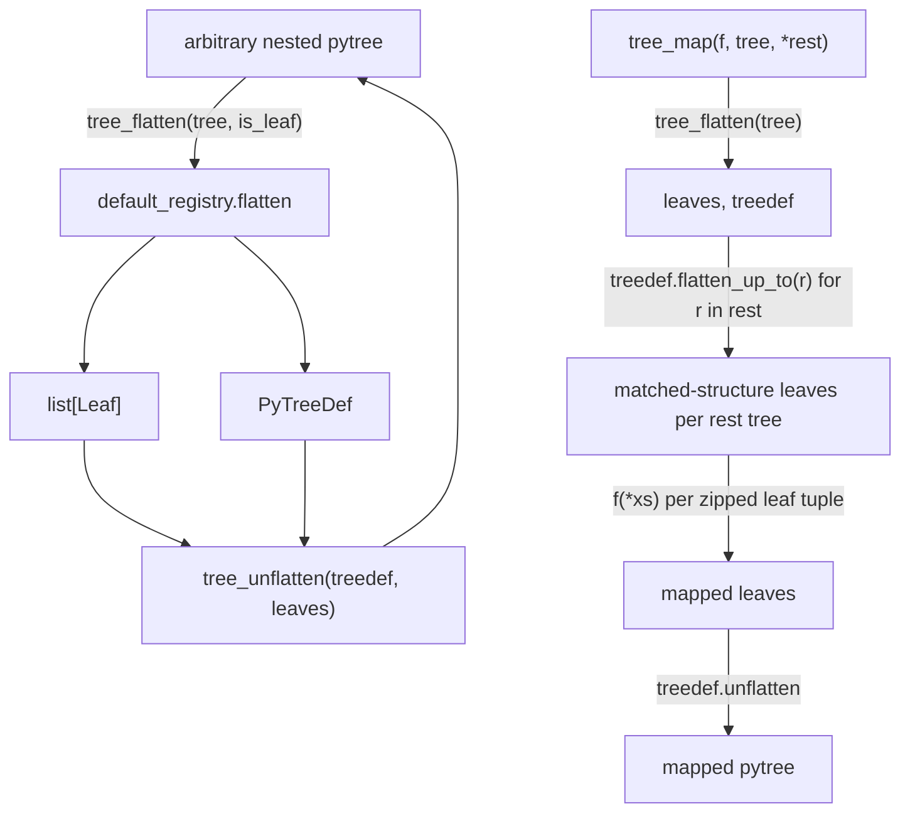

# jax._src.tree_util — pytree flatten/unflatten/map over a compiled registry

## Overview

[`tree_flatten`](../catalog/jax/_src/tree_util.md#tree_flatten)/
[`tree_unflatten`](../catalog/jax/_src/tree_util.md#tree_unflatten)/
[`tree_map`](../catalog/jax/_src/tree_util.md#tree_map) are the core pytree operations every JAX
transformation (`jit`, `vmap`, `grad`) uses to decompose arbitrary nested Python containers into
flat leaf lists plus a structural [`PyTreeDef`](../catalog/jax/_src/tree_util.md#PyTreeDef), and
reassemble them afterward. All flattening routes through `default_registry` — a compiled (C++-backed)
pytree type registry — rather than a pure-Python dispatch table.

## Diagram

## Design rationale (why it's built this way)

**`tree_flatten`/`tree_unflatten`/`tree_leaves`/`tree_structure` are all thin aliases delegating to
`default_registry`, not independent implementations.** Every one of these functions' docstrings
literally reads "Alias of `jax.tree.xxx`," and each body is a one-line call into
`default_registry.flatten`/`treedef.unflatten` — centralizing the actual flattening logic in one
compiled registry object means every public alias stays trivially consistent with the others by
construction, with no risk of subtly divergent flattening behavior between e.g.
[`tree_flatten`](../catalog/jax/_src/tree_util.md#tree_flatten) and
[`tree_leaves`](../catalog/jax/_src/tree_util.md#tree_flatten) (which discards the treedef half of
the same `default_registry.flatten` call).

**`tree_map` requires every `rest` tree to match the main tree's *structure up to* what
`flatten_up_to` accepts, and produces a helpful structural-mismatch error rather than a raw
exception.** [`tree_map`](../catalog/jax/_src/tree_util.md#tree_map) wraps
`treedef.flatten_up_to(r)` in a `try`/`except`, and on failure calls `_prefix_error` to construct a
more specific diagnostic before re-raising — since a pytree-structure mismatch between `tree` and
one of `*rest` is a common user error, surfacing a targeted error (rather than whatever generic
exception `flatten_up_to` happened to raise) is worth the extra code path.

## Entry points

- [`tree_flatten`](../catalog/jax/_src/tree_util.md#tree_flatten) — reached to decompose any pytree
  into its flat leaves plus structural [`PyTreeDef`](../catalog/jax/_src/tree_util.md#PyTreeDef).
- [`tree_unflatten`](../catalog/jax/_src/tree_util.md#tree_unflatten) — reached to reassemble a
  pytree from a `PyTreeDef` and a matching flat leaf iterable.
- [`tree_map`](../catalog/jax/_src/tree_util.md#tree_map) — reached to apply a function
  leaf-wise across one or more structurally-matching pytrees.

## Mechanism (step-by-step)

1. **[`tree_flatten`](../catalog/jax/_src/tree_util.md#tree_flatten) calls
   `default_registry.flatten(tree, is_leaf)`**, returning `(leaves, treedef)`.
2. **[`tree_map`](../catalog/jax/_src/tree_util.md#tree_map) flattens the primary `tree`**, then for
   each additional tree in `*rest`, calls `treedef.flatten_up_to(r)` to extract leaves matching the
   primary tree's structure (raising a targeted error via `_prefix_error` on structural mismatch).
3. **The leaves from all trees are zipped and mapped through `f`**, then reassembled via
   [`tree_unflatten`](../catalog/jax/_src/tree_util.md#tree_unflatten) using the primary tree's
   `treedef`.

## Key data structures

- **[`PyTreeDef`](../catalog/jax/_src/tree_util.md#PyTreeDef)** — the compiled structural
  descriptor produced by flattening; supports `unflatten`/`flatten_up_to`/`compose`/`num_leaves`.
- **`default_registry`** — the compiled pytree-type registry every alias in this module delegates
  to for the actual flatten operation.

## Dynamics (design intent)

Because flattening is delegated to a compiled `default_registry` rather than a pure-Python
recursive walk, the cost of decomposing a pytree (which happens on every `jit`/`vmap`/`grad`-wrapped
call, often per-call rather than once) is kept low relative to what an equivalent Python
implementation would cost.

## Edge cases

- [`tree_map`](../catalog/jax/_src/tree_util.md#tree_map)'s error-reporting path only fires "on
  Exception" from `flatten_up_to` — if `_prefix_error` itself yields no error (returns `None` from
  its generator), the original exception `e` is re-raised instead, so a truly novel mismatch still
  surfaces some diagnostic rather than being silently swallowed.

## Open questions

- Whether `default_registry`'s dispatch is why a "Python-side registry" (`_registry`,
  `_RegistryEntry`) still coexists in this module — the code comment marks it as removable "once we
  have a flatten_one function" — is not further elaborated within this packet's cited subgraph.

## See also
- [jax-_src-util](jax-_src-util.md) — `safe_map`/`safe_zip`, commonly used alongside flattened
  leaf lists this module produces.
