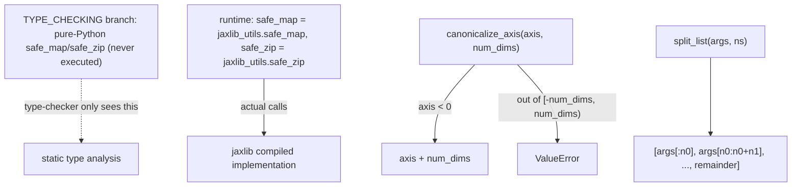

# jax._src.util — safe_map/safe_zip (jaxlib-backed), axis canonicalization, list splitting

## Overview

This module provides the small utility primitives used pervasively across JAX's tracing/lowering
code: [`safe_map`](../catalog/jax/_src/util.md#safe_map)/
[`safe_zip`](../catalog/jax/_src/util.md#safe_zip) are length-checked variants of `map`/`zip` whose
*actual runtime implementation* is a `jaxlib_utils` compiled extension, not the Python fallback
defined in this file (which exists only for type-checking).
[`canonicalize_axis`](../catalog/jax/_src/util.md#canonicalize_axis) normalizes a possibly-negative
axis index into `[0, num_dims)`, and [`split_list`](../catalog/jax/_src/util.md#split_list) divides
a flat list into sublists of given sizes — both used constantly when JAX's tracing machinery must
manipulate flattened pytree-derived argument/axis lists.

## Diagram

## Design rationale (why it's built this way)

**`safe_map`/`safe_zip`'s actual implementation is a compiled `jaxlib_utils` extension; the
Python versions in this file only exist inside a `TYPE_CHECKING` guard.** At runtime, `safe_zip =
jaxlib_utils.safe_zip` and `safe_map = jaxlib_utils.safe_map` — the Python function bodies (with
their overload type stubs) are never actually called; they exist purely so type checkers see
properly overloaded signatures, while the hot-path implementation runs compiled code. Since these
two functions are called extremely frequently across JAX's tracing internals, this split lets JAX
keep expressive Python-level type signatures without paying Python-interpreter overhead for the
actual length-checked map/zip logic.

**`canonicalize_axis` validates range before normalizing, so an out-of-range axis raises immediately
rather than wrapping to an unrelated valid index.**
[`canonicalize_axis`](../catalog/jax/_src/util.md#canonicalize_axis) checks `-num_dims <= axis <
num_dims` and raises `ValueError` before applying the `axis + num_dims` shift for negative axes —
this ordering (check first, then normalize) prevents a badly out-of-range negative axis from
silently landing on some unrelated valid position after the shift.

## Entry points

- [`safe_map`](../catalog/jax/_src/util.md#safe_map) / [`safe_zip`](../catalog/jax/_src/util.md#safe_zip) —
  reached throughout JAX's tracing/lowering code wherever a length-checked `map`/`zip` is needed
  (mismatched-length inputs are a common source of subtle pytree bugs, which these catch eagerly).
- [`canonicalize_axis`](../catalog/jax/_src/util.md#canonicalize_axis) — reached wherever a
  user-supplied axis (possibly negative) must be normalized to a definite non-negative index.
- [`split_list`](../catalog/jax/_src/util.md#split_list) — reached to divide a flattened argument
  list into per-group sublists of specified sizes.

## Mechanism (step-by-step)

1. **At import time, the `TYPE_CHECKING` branch is always `False` at runtime**, so
   [`safe_map`](../catalog/jax/_src/util.md#safe_map)/[`safe_zip`](../catalog/jax/_src/util.md#safe_zip)
   are bound directly to `jaxlib_utils.safe_map`/`jaxlib_utils.safe_zip`.
2. **[`canonicalize_axis`](../catalog/jax/_src/util.md#canonicalize_axis) calls `operator.index(axis)`**
   (accepting anything implementing `__index__`), range-checks it, and shifts negative values by
   `num_dims`.
3. **[`split_list`](../catalog/jax/_src/util.md#split_list) iterates `ns`, repeatedly slicing off
   the front `n` elements** of a mutable copy of `args`, appending the final remainder as the last
   sublist.

## Key data structures

- **`jaxlib_utils`** — the compiled extension module actually backing
  [`safe_map`](../catalog/jax/_src/util.md#safe_map)/[`safe_zip`](../catalog/jax/_src/util.md#safe_zip)
  at runtime.

## Dynamics (design intent)

Because [`safe_map`](../catalog/jax/_src/util.md#safe_map)/[`safe_zip`](../catalog/jax/_src/util.md#safe_zip)
are called on essentially every pytree-flattened argument list JAX's tracing machinery touches, their
compiled-extension backing (rather than pure Python) keeps this ubiquitous length-checking overhead
low relative to an equivalent pure-Python implementation.

## Edge cases

- [`split_list`](../catalog/jax/_src/util.md#split_list) does not validate that `sum(ns) ==
  len(args)` — a sibling function, `split_list_checked`, adds that assertion; callers needing the
  stricter guarantee must use the checked variant explicitly.
- [`canonicalize_axis`](../catalog/jax/_src/util.md#canonicalize_axis)'s error message reports the
  original (pre-normalization) `axis` value, so a negative out-of-range axis is reported in its
  original negative form, not the (also invalid) shifted value.

## Open questions

- What measurable difference the `jaxlib_utils`-backed implementation of `safe_map`/`safe_zip`
  has versus a pure-Python equivalent (e.g. via a microbenchmark) is not addressed by this packet's
  cited subgraph.

## See also
- [jax-_src-tree_util](jax-_src-tree_util.md) — `tree_flatten`/`tree_map`, which frequently produce
  the flattened argument lists `safe_map`/`safe_zip`/`split_list` operate on.
