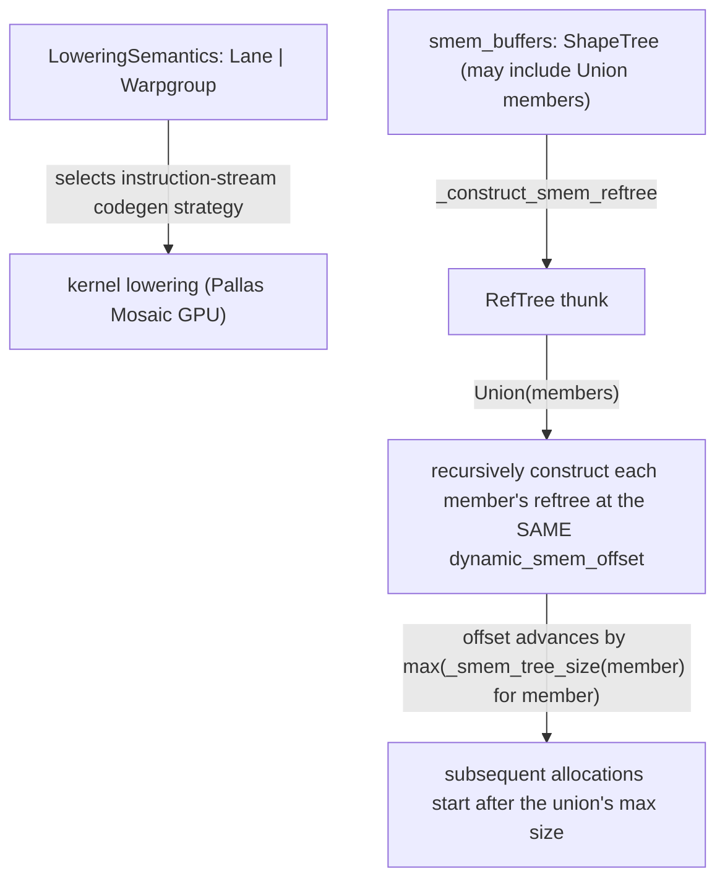

# jax.experimental.mosaic.gpu.core — LoweringSemantics and shared-memory reftree allocation

## Overview

[`LoweringSemantics`](../catalog/jax/experimental/mosaic/gpu/core.md#LoweringSemantics) is the
top-level enum (`Lane`/`Warpgroup`) selecting which instruction-stream code-generation strategy a
Mosaic GPU kernel compiles to — the same axis referenced throughout the Pallas Mosaic-GPU lowering
modules (see [jax-_src-pallas-mosaic_gpu-lowering](jax-_src-pallas-mosaic_gpu-lowering.md)).
[`_construct_smem_reftree`](../catalog/jax/experimental/mosaic/gpu/core.md#_construct_smem_reftree)
allocates a kernel's shared-memory buffers within one flat SMEM region, laid out as a "reftree" that
supports `Union`-typed buffer groups — mutually exclusive buffer sets (e.g. from different branches
of control flow) that can share the same physical SMEM offset rather than each getting separate,
additive allocations.

## Diagram

## Design rationale (why it's built this way)

**Mutually-exclusive shared-memory buffer groups are represented as `Union` members in the
`smem_buffers` shape tree, letting them share the same physical SMEM offset rather than being
allocated additively.** [`_construct_smem_reftree`](../catalog/jax/experimental/mosaic/gpu/core.md#_construct_smem_reftree)'s
`case Union(members)` branch constructs each member's reftree at the *same*
`dynamic_smem_offset`, only advancing the offset once (by the union's overall size, per the code
comment noting this computation "is quadratic, but it shouldn't matter for now") — since shared
memory on GPU is a scarce, tightly-budgeted resource, buffer sets that are never live
simultaneously (e.g. distinct branches of a kernel's control flow) can safely overlap in physical
SMEM, and expressing this via `Union` in the shape tree lets the allocator reclaim that space
automatically rather than requiring the kernel author to manually manage SMEM offsets.

**Barrier memref type depends on `lowering_semantics` — `Warpgroup` semantics use a dedicated
`BarrierType` MLIR type, while other semantics use a plain `i64`.** The `barrier_memref` closure in
[`_construct_smem_reftree`](../catalog/jax/experimental/mosaic/gpu/core.md#_construct_smem_reftree)
selects `dialect.BarrierType.get()` specifically when `lowering_semantics ==
LoweringSemantics.Warpgroup`, else `i64` — the warpgroup lowering path has a richer, dedicated MLIR
barrier abstraction that the `Lane`-level path doesn't use, so barrier allocation must branch on
which semantics mode is active.

## Entry points

- [`LoweringSemantics`](../catalog/jax/experimental/mosaic/gpu/core.md#LoweringSemantics) — the
  enum selecting `Lane` vs. `Warpgroup` code generation for an entire kernel.
- [`_construct_smem_reftree`](../catalog/jax/experimental/mosaic/gpu/core.md#_construct_smem_reftree) —
  reached once per kernel compilation to lay out and allocate all shared-memory buffers.

## Mechanism (step-by-step)

1. **[`_construct_smem_reftree`](../catalog/jax/experimental/mosaic/gpu/core.md#_construct_smem_reftree)
   flattens `smem_buffers`** (treating `Union` as a pytree leaf via `is_leaf`), producing one
   flat list of ref types to allocate.
2. **For each ref type,**
   [`_construct_smem_reftree`](../catalog/jax/experimental/mosaic/gpu/core.md#_construct_smem_reftree)
   **dispatches by kind** — e.g. barrier types allocate via `barrier_memref`, choosing
   `BarrierType` vs. `i64` per `lowering_semantics`; `Union` members recursively construct their
   own reftrees sharing one `dynamic_smem_offset`.
3. **[`_construct_smem_reftree`](../catalog/jax/experimental/mosaic/gpu/core.md#_construct_smem_reftree)
   returns a thunk (`Callable[[], RefTree]`)** — allocation is deferred until the thunk is called,
   letting the same construction logic build the ref structure before all MLIR values are
   necessarily available.

## Key data structures

- **[`LoweringSemantics`](../catalog/jax/experimental/mosaic/gpu/core.md#LoweringSemantics)** —
  [`Lane`](../catalog/jax/experimental/mosaic/gpu/core.md#LoweringSemantics.Lane)/
  [`Warpgroup`](../catalog/jax/experimental/mosaic/gpu/core.md#LoweringSemantics.Warpgroup) enum
  members.
- **`RefTree`** — the returned nested structure of allocated shared-memory refs, mirroring the
  input `smem_buffers` shape tree (including `Union` groups).

## Dynamics (design intent)

Because `Union` members share one `dynamic_smem_offset` rather than each incrementing it
independently, the total SMEM footprint of a kernel with mutually-exclusive buffer sets is bounded
by the *maximum* of those sets' individual sizes, not their sum — this directly reduces peak shared
memory usage for kernels with such branching allocation patterns.

## Edge cases

- The code comment explicitly flags the union-size computation as "quadratic" (repeatedly computing
  `_smem_tree_size` for nested unions) but "shouldn't matter for now" — a known, accepted
  algorithmic inefficiency in the allocator itself (not the generated kernel code), left
  unaddressed pending a more compelling perf need.
- Barrier memref allocation advances `dynamic_smem_offset` by `num_barriers *
  utils.MBARRIER_BYTES` regardless of `lowering_semantics` — only the barrier's MLIR *type*
  differs per semantics, not its physical memory footprint.

## Open questions

- Whether kernels commonly use `Union`-typed SMEM buffer groups in practice, or whether this is a
  rarely-exercised path, is not addressed by this packet's cited subgraph.

## See also
- [jax-_src-pallas-mosaic_gpu-lowering](jax-_src-pallas-mosaic_gpu-lowering.md) — the
  `(lowering_semantics, primitive_semantics)`-keyed lowering-rule registry that reads the same
  `LoweringSemantics` value defined here.
- [jax-_src-pallas-mosaic_gpu-core](jax-_src-pallas-mosaic_gpu-core.md) — `MemorySpace.SMEM`, the
  kernel-authoring-facing shared-memory type this module's allocator ultimately backs.
