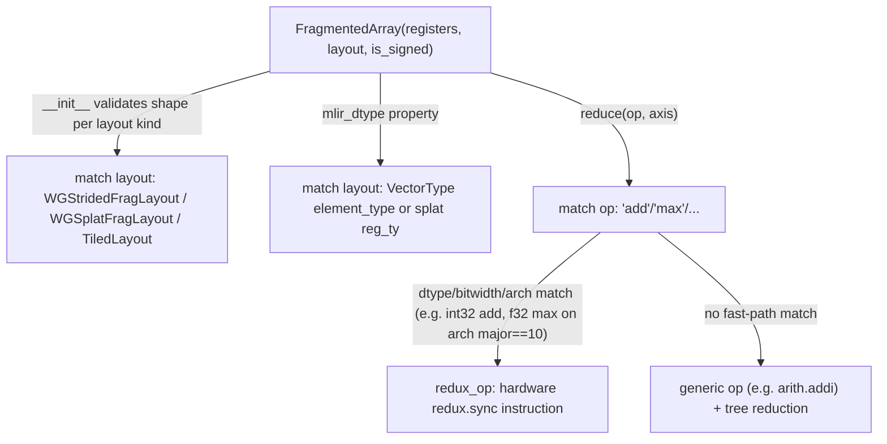

# jax.experimental.mosaic.gpu.fragmented_array — FragmentedArray, register-distributed values, hardware-reduction fast paths

## Overview

[`FragmentedArray`](../catalog/jax/experimental/mosaic/gpu/fragmented_array.md#FragmentedArray)
represents a logical array value distributed across a warpgroup's registers: a `registers` array of
MLIR `ir.Value`s (one register-worth of the value per thread/lane group), interpreted according to
a [`layout`](../catalog/jax/experimental/mosaic/gpu/fragmented_array.md#FragmentedArray.layout)
(`WGStridedFragLayout`, `WGSplatFragLayout`, `TiledLayout`) that determines how the flat register
array maps back to the full logical shape.
[`FragmentedArray.reduce`](../catalog/jax/experimental/mosaic/gpu/fragmented_array.md#FragmentedArray.reduce)
implements reductions with dedicated hardware-instruction fast paths (e.g. `redux.sync`) for
specific dtype/bitwidth/architecture combinations, falling back to a general tree-reduction
otherwise.

## Diagram

## Design rationale (why it's built this way)

**`FragmentedArray.__init__` validates register-array shape against its declared `layout` via
structural pattern matching, catching a shape/layout mismatch immediately rather than at first
use.** The constructor's `match self.layout` branch checks, for `WGStridedFragLayout(shape)`, that
`math.prod(shape) == math.prod(_registers.shape) * WARPGROUP_SIZE * reg_size` — since a
`FragmentedArray`'s registers are only meaningful in light of its layout's interpretation, an
inconsistent pairing (registers that don't actually tile up to the claimed logical shape) is
detected at construction, not discovered later as a subtly wrong computed result.

**`is_signed` must be set if and only if the underlying MLIR dtype is an integer type — enforced as
a hard invariant, not left implicit.** `FragmentedArray.__init__` raises `TypeError` if
`(_is_signed is not None) != isinstance(self.mlir_dtype, ir.IntegerType)` — since MLIR integer
types don't inherently carry signedness (unlike float types), every integer-valued
`FragmentedArray` must explicitly declare its sign interpretation, and this invariant is checked
structurally rather than trusted to be set correctly by every construction path.

**`reduce` special-cases specific `(op, dtype, bitwidth, architecture)` combinations to use a
hardware `redux.sync`-style instruction, falling back to software reduction otherwise.**
[`FragmentedArray.reduce`](../catalog/jax/experimental/mosaic/gpu/fragmented_array.md#FragmentedArray.reduce)'s
`"add"` branch sets `redux_op` only for 32-bit integers, and its `"max"` branch sets `redux_op` only
for `f32` when `utils.get_arch().major == 10` (Blackwell) — the code comment for the `"add"` path
even flags a further optimization opportunity ("Use redux.sync on Blackwell for f32") not yet
implemented — reflecting that these hardware reduction instructions exist only for specific
dtype/width/architecture combinations, so the fast path must be conditionally selected per
combination rather than assumed universally available.

## Entry points

- [`FragmentedArray`](../catalog/jax/experimental/mosaic/gpu/fragmented_array.md#FragmentedArray) —
  the core register-distributed-value type, constructed (per its own docstring) preferably via
  classmethods rather than this low-level `__init__` directly.
- [`FragmentedArray.reduce`](../catalog/jax/experimental/mosaic/gpu/fragmented_array.md#FragmentedArray.reduce) —
  reached to perform an axis reduction (`"add"`/`"max"`/etc.) over a fragmented array.
- [`FragmentedArray.mlir_dtype`](../catalog/jax/experimental/mosaic/gpu/fragmented_array.md#FragmentedArray.mlir_dtype) —
  reached to obtain the element MLIR type, dispatching on layout kind.

## Mechanism (step-by-step)

1. **[`FragmentedArray.__init__`](../catalog/jax/experimental/mosaic/gpu/fragmented_array.md#FragmentedArray)
   stores `registers`/`layout`/`is_signed`** (via `object.__setattr__` due to `frozen=True`), then
   validates the integer/signedness invariant and the register-shape/layout consistency.
2. **[`FragmentedArray.mlir_dtype`](../catalog/jax/experimental/mosaic/gpu/fragmented_array.md#FragmentedArray.mlir_dtype)
   dispatches on layout kind**: `WGStridedFragLayout`/`TiledLayout` read the element type from a
   `VectorType`; `WGSplatFragLayout` uses the register type directly (a splat holds one scalar
   value replicated, not a vector).
3. **[`FragmentedArray.reduce`](../catalog/jax/experimental/mosaic/gpu/fragmented_array.md#FragmentedArray.reduce)
   matches on the reduction op name and current dtype**, selecting a hardware `redux_op` when the
   specific dtype/bitwidth/architecture combination supports it, otherwise falling back to a
   generic element-wise op (`arith.addi`, etc.) combined with a software reduction tree.

## Key data structures

- **[`FragmentedArray`](../catalog/jax/experimental/mosaic/gpu/fragmented_array.md#FragmentedArray)** —
  [`registers`](../catalog/jax/experimental/mosaic/gpu/fragmented_array.md#FragmentedArray.registers)
  (`np.ndarray` of `ir.Value`),
  [`layout`](../catalog/jax/experimental/mosaic/gpu/fragmented_array.md#FragmentedArray.layout)
  (a `FragmentedLayout`), `is_signed`.
- **`TiledLayout`** — one of the supported layout kinds, used both for general fragmented arrays
  and (per `reduce`'s helper) for describing a reduced value's resulting layout.

## Dynamics (design intent)

Because `reduce`'s hardware fast-path selection is keyed on the exact dtype/bitwidth/architecture
triple, the same JAX-level reduction call can silently compile to very different generated code
(single hardware instruction vs. a full software tree reduction) depending purely on the target
GPU architecture and operand dtype — portable code gets correct results either way, but performance
varies by which path is taken.

## Edge cases

- [`FragmentedArray.reduce`](../catalog/jax/experimental/mosaic/gpu/fragmented_array.md#FragmentedArray.reduce)'s
  `"add"` case raises `NotImplementedError` for any `mlir_dtype` that is neither `ir.FloatType` nor
  `ir.IntegerType` — there is no generic fallback for other MLIR type categories.
- [`FragmentedArray.__init__`](../catalog/jax/experimental/mosaic/gpu/fragmented_array.md#FragmentedArray)'s
  layout-shape validation match statement has a bare `case _: raise NotImplementedError` — any
  layout kind not explicitly handled in the match is rejected outright, rather than skipping
  validation.

## Open questions

- The full set of `(op, dtype, bitwidth, architecture)` combinations with a hardware `redux_op`
  fast path (beyond the `"add"`/`"max"` examples shown) is not fully enumerated within this
  packet's cited subgraph.

## See also
- [jax-experimental-mosaic-gpu-core](jax-experimental-mosaic-gpu-core.md) — `LoweringSemantics`,
  the broader lowering-mode context `FragmentedArray`-based code generation operates within.
- [jax-experimental-mosaic-gpu-utils](jax-experimental-mosaic-gpu-utils.md) — `bitwidth`, used by
  `reduce` to select dtype-width-specific fast paths.
