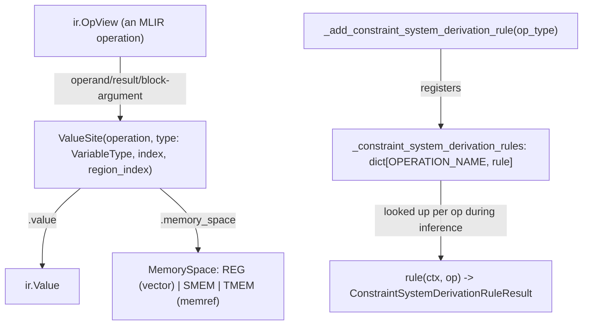

# jax.experimental.mosaic.gpu.layout_inference — ValueSite constraint-based layout inference

## Overview

This module infers the physical register/memory layout of every MLIR value in a Mosaic GPU kernel
via a constraint-solving system.
[`ValueSite`](../catalog/jax/experimental/mosaic/gpu/layout_inference.md#ValueSite) uniquely
identifies one "variable" in the constraint system — an operand, result, or block argument of a
specific MLIR operation, distinguished by
[`VariableType`](../catalog/jax/experimental/mosaic/gpu/layout_inference.md#VariableType)
(`OPERAND`/`RESULT`/`ARGUMENT`).
[`_add_constraint_system_derivation_rule`](../catalog/jax/experimental/mosaic/gpu/layout_inference.md#_add_constraint_system_derivation_rule)
registers, per-MLIR-op-type, a rule function that derives the layout constraints for that op's
operands/results — mirroring the same per-type registry pattern used by the lowering-rule
mechanisms elsewhere in Mosaic GPU.

## Diagram

## Design rationale (why it's built this way)

**`ValueSite` unifies operands, results, and block arguments under one identifier type, with a
`__post_init__` invariant tying `region_index` presence exactly to the `ARGUMENT` variant.**
[`ValueSite.__post_init__`](../catalog/jax/experimental/mosaic/gpu/layout_inference.md#ValueSite)
asserts `(self.type != VariableType.ARGUMENT) == (self.region_index is None)` — since only block
arguments need a region index (to locate which region's first block the argument belongs to),
enforcing this bidirectional implication at construction prevents a `ValueSite` from ever being in
the inconsistent state of claiming to be a non-argument while still carrying a region index (or
vice versa).

**Layout-constraint derivation rules are registered per-MLIR-operation-type via a decorator-based
registry keyed by `OPERATION_NAME`, mirroring the lowering-rule registration pattern used
elsewhere.** [`_add_constraint_system_derivation_rule`](../catalog/jax/experimental/mosaic/gpu/layout_inference.md#_add_constraint_system_derivation_rule)
asserts the given `op` type has an `OPERATION_NAME` attribute and writes the rule into
`_constraint_system_derivation_rules[op.OPERATION_NAME]` — this is the same "open per-type registry,
dispatch by lookup" idiom seen in
[jax-_src-pallas-mosaic-lowering](jax-_src-pallas-mosaic-lowering.md)'s
`register_lowering_rule`/`lowering_rules`, applied here to layout constraint generation instead of
code generation.

## Entry points

- [`ValueSite`](../catalog/jax/experimental/mosaic/gpu/layout_inference.md#ValueSite) — the
  identifier type for every constraint-system variable; constructed for each operand/result/
  argument that needs a layout inferred.
- [`_add_constraint_system_derivation_rule`](../catalog/jax/experimental/mosaic/gpu/layout_inference.md#_add_constraint_system_derivation_rule) —
  the decorator every per-op-type constraint derivation rule uses to register itself.
- [`DerivationContext.producer_ref`](../catalog/jax/experimental/mosaic/gpu/layout_inference.md#DerivationContext.producer_ref) —
  reached by derivation rules needing to trace a value's producing operation.

## Mechanism (step-by-step)

1. **For each MLIR operation in the kernel, [`ValueSite`](../catalog/jax/experimental/mosaic/gpu/layout_inference.md#ValueSite)
   instances are constructed** for its operands, results, and (if it defines regions) block
   arguments.
2. **[`ValueSite.value`](../catalog/jax/experimental/mosaic/gpu/layout_inference.md#ValueSite.value)
   resolves the identifier back to a concrete `ir.Value`**, dispatching by
   [`VariableType`](../catalog/jax/experimental/mosaic/gpu/layout_inference.md#VariableType) (
   [`OPERAND`](../catalog/jax/experimental/mosaic/gpu/layout_inference.md#VariableType.OPERAND) →
   `operation.operands[index]`, etc.).
3. **[`ValueSite.memory_space`](../catalog/jax/experimental/mosaic/gpu/layout_inference.md#ValueSite)
   inspects the value's MLIR type**, returning `REG` for a `VectorType`, or `SMEM`/`TMEM` for a
   `MemRefType` (per `utils.is_smem_ref`/`is_tmem_ref` checks), raising `ValueError` for anything
   else.
4. **During inference, each operation's `OPERATION_NAME` is looked up in
   `_constraint_system_derivation_rules`** (populated via
   [`_add_constraint_system_derivation_rule`](../catalog/jax/experimental/mosaic/gpu/layout_inference.md#_add_constraint_system_derivation_rule)),
   and the matching rule derives that operation's layout constraints in terms of its
   [`ValueSite`](../catalog/jax/experimental/mosaic/gpu/layout_inference.md#ValueSite)s.

## Key data structures

- **[`ValueSite`](../catalog/jax/experimental/mosaic/gpu/layout_inference.md#ValueSite)** —
  `operation`, `type` (
  [`VariableType`](../catalog/jax/experimental/mosaic/gpu/layout_inference.md#VariableType)),
  `index`, `region_index`.
- **[`VariableType`](../catalog/jax/experimental/mosaic/gpu/layout_inference.md#VariableType)** —
  `enum.IntEnum` with
  [`OPERAND`](../catalog/jax/experimental/mosaic/gpu/layout_inference.md#VariableType.OPERAND) = 0,
  `RESULT` = 1, `ARGUMENT` = 2.
- **`_constraint_system_derivation_rules`** — `dict[str, ConstraintSystemDerivationRule]`, the
  per-`OPERATION_NAME` registry.
- **`_DEFAULT_LAYOUT_INFERENCE_FUEL`** — a fuel/iteration-budget constant (100,000) bounding the
  constraint solver's search before giving up.

## Dynamics (design intent)

Because constraint derivation is dispatched purely by MLIR `OPERATION_NAME` string lookup, adding
layout-inference support for a new MLIR op is a matter of registering one new rule function — the
core `ValueSite`/inference-loop machinery needs no changes to accommodate additional op types.

## Edge cases

- [`ValueSite.memory_space`](../catalog/jax/experimental/mosaic/gpu/layout_inference.md#ValueSite)
  raises `ValueError` for any `ir.MemRefType` that is neither a TMEM nor SMEM/cluster-SMEM ref —
  there is no default/unknown memory-space fallback.
- The presence of `_DEFAULT_LAYOUT_INFERENCE_FUEL` implies the constraint solver can fail to
  converge and must be bounded — a kernel whose constraint system doesn't resolve within the fuel
  budget presumably surfaces as an inference failure rather than an infinite loop (the failure
  handling itself is outside this packet's cited subgraph).

## Open questions

- What happens when `_DEFAULT_LAYOUT_INFERENCE_FUEL` is exhausted (error raised, partial result
  accepted, or something else) is not addressed by this packet's cited subgraph.

## See also
- [jax-experimental-mosaic-gpu-fragmented_array](jax-experimental-mosaic-gpu-fragmented_array.md) —
  `FragmentedArray.layout`, the concrete layout representation this inference system ultimately
  assigns to register-resident values.
- [jax-_src-pallas-mosaic-lowering](jax-_src-pallas-mosaic-lowering.md) — the analogous
  per-op-type registry pattern (`register_lowering_rule`) used for code generation rather than
  constraint derivation.
