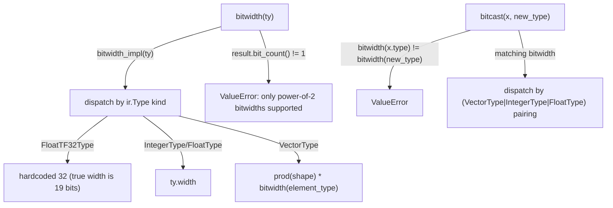

# jax.experimental.mosaic.gpu.utils — bitwidth (TF32 exception), power-of-2 bitcast, ThreadSubset

## Overview

[`bitwidth`](../catalog/jax/experimental/mosaic/gpu/utils.md#bitwidth) computes an MLIR type's bit
width, enforcing that the result is a power of 2, and special-cases TF32 to report 32 bits despite
its true 19-bit precision, for MLIR compatibility reasons.
[`bitcast`](../catalog/jax/experimental/mosaic/gpu/utils.md#bitcast) reinterprets an `ir.Value`'s
bits as a different type, validating equal bit width across scalar/vector/integer/float
combinations before dispatching to the appropriate MLIR bitcast operation.
[`ThreadSubset`](../catalog/jax/experimental/mosaic/gpu/utils.md#ThreadSubset) (`WARP`/`WARPGROUP`/
`BLOCK`) parametrizes which granularity of the GPU thread hierarchy a "single thread" predicate
selects from. [`c`](../catalog/jax/experimental/mosaic/gpu/utils.md#c) is a generic scalar/vector
MLIR constant constructor.

## Diagram

## Design rationale (why it's built this way)

**`bitwidth`'s internal implementation reports TF32 as 32 bits despite its actual 19-bit mantissa+exponent precision,
citing upstream MLIR compatibility as the explicit reason.** The code comment states TF32's "actual
width is 19 bits. However, we need to treat it as 32 bits for compatibility reasons" (linking a
specific upstream MLIR commit that changed TF32's declared width) — since TF32 values are physically
stored/passed around as 32-bit containers even though only 19 bits carry meaningful precision, this
module deliberately reports the *storage* width, not the *precision* width, to stay consistent with
how the rest of the MLIR/Mosaic pipeline expects to reason about TF32's size.

**`bitwidth` enforces its result must be a power of 2, rejecting any other width outright.**
[`bitwidth`](../catalog/jax/experimental/mosaic/gpu/utils.md#bitwidth) computes the type's width then
raises `ValueError` if `result.bit_count() != 1` — since the surrounding Mosaic GPU code (bitcasting,
register packing) generally assumes power-of-2-sized types, this check catches a type whose true
width doesn't fit that assumption immediately, rather than letting arithmetic based on a
non-power-of-2 width silently produce wrong packing/alignment downstream.

**`bitcast` validates equal bit width across the *entire* source/destination type pair before
attempting any type-specific dispatch.** [`bitcast`](../catalog/jax/experimental/mosaic/gpu/utils.md#bitcast)
computes `bitwidth(x.type)` and `bitwidth(new_type)` up front and raises `ValueError` immediately on
mismatch, before any of the vector/integer/float-specific branches run — since a genuine bit-level
reinterpretation is only valid between equal-sized representations, this single early check
guards every downstream branch rather than requiring each type-pair-specific branch to redundantly
verify sizes.

## Entry points

- [`bitwidth`](../catalog/jax/experimental/mosaic/gpu/utils.md#bitwidth) — reached wherever a
  type's bit width is needed (e.g. for register packing, memory offset computation).
- [`bitcast`](../catalog/jax/experimental/mosaic/gpu/utils.md#bitcast) — reached to reinterpret an
  `ir.Value`'s bits as a different (equal-width) type.
- [`ThreadSubset`](../catalog/jax/experimental/mosaic/gpu/utils.md#ThreadSubset) — reached to
  parametrize thread-hierarchy-scoped operations like single-thread election.
- [`c`](../catalog/jax/experimental/mosaic/gpu/utils.md#c) — reached to construct an MLIR scalar or
  broadcast-vector constant of a given value and type.

## Mechanism (step-by-step)

1. **[`bitwidth`](../catalog/jax/experimental/mosaic/gpu/utils.md#bitwidth) computes the type's raw width**,
   which dispatches by `ir.Type` kind (`FloatTF32Type` → hardcoded 32;
   `IntegerType`/`FloatType` → native `.width`; `dialect.BarrierType` →
   `MBARRIER_BYTES * 8`; `VectorType` → `prod(shape) * bitwidth(element_type)` recursively), then
   validates the result is a power of 2.
2. **[`bitcast`](../catalog/jax/experimental/mosaic/gpu/utils.md#bitcast) short-circuits if
   `x.type == new_type`**, otherwise validates matching bit width, then dispatches on the
   `(source_type_kind, dest_type_kind)` pairing to the appropriate MLIR `vector.bitcast`/
   `arith.bitcast` operation (including a vector↔integer packing/unpacking special case via
   `vector.extract`/`vector.broadcast`).
3. **[`c`](../catalog/jax/experimental/mosaic/gpu/utils.md#c) branches on `ty`'s kind**
   (`IntegerType`/`IndexType` → `IntegerAttr`; `FloatType` → `FloatAttr`; `VectorType` → recursively
   constructs the scalar constant then broadcasts it).

## Key data structures

- **[`ThreadSubset`](../catalog/jax/experimental/mosaic/gpu/utils.md#ThreadSubset)** — `enum.IntEnum`
  with `WARP`/`WARPGROUP`/`BLOCK` members, used to scope thread-hierarchy-level operations.

## Dynamics (design intent)

Because `bitwidth`'s power-of-2 enforcement runs on every call (not just at type-registration time),
any newly-added MLIR type handled by `bitwidth`'s width computation automatically inherits this validation — a
type whose width computation logic is added incorrectly (yielding a non-power-of-2 result) fails
immediately at first use rather than silently propagating a wrong size.

## Edge cases

- [`bitwidth`](../catalog/jax/experimental/mosaic/gpu/utils.md#bitwidth)'s underlying
  implementation raises `NotImplementedError` for any `ir.Type` not matched by its explicit
  branches — there is no generic/default width computation.
- [`bitcast`](../catalog/jax/experimental/mosaic/gpu/utils.md#bitcast)'s vector↔integer branches
  assert the packed width relationship (`new_type.width == bitwidth(element_type) *
  prod(shape)`) even after the earlier top-level bitwidth check — a redundant internal consistency
  check on the specific packing arithmetic, not just the overall bit count.

## Open questions

- Whether TF32's "treat as 32 bits" compatibility workaround has a tracked plan for removal once
  upstream MLIR settles on a final representation is not addressed by this packet's cited
  subgraph.

## See also
- [jax-experimental-mosaic-gpu-fragmented_array](jax-experimental-mosaic-gpu-fragmented_array.md) —
  `reduce`, which calls `bitwidth` to select dtype-width-specific hardware reduction fast paths.
