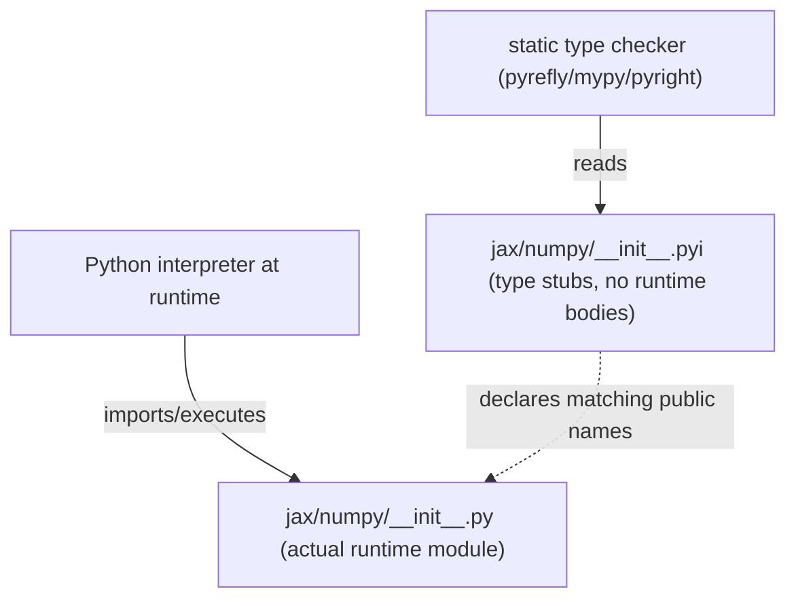

# jax.numpy.__init__.pyi — type stub surface for jax.numpy's public dtypes/functions

## Overview

This is a `.pyi` type-stub file, not runtime code: it declares the public surface of `jax.numpy`
(dtype names like [`float32`](../catalog/jax/numpy/__init__.pyi.md#float32.float32)/
[`int32`](../catalog/jax/numpy/__init__.pyi.md#int32.int32)/
[`float64`](../catalog/jax/numpy/__init__.pyi.md#float64.float64), and function signatures like
[`issubdtype`](../catalog/jax/numpy/__init__.pyi.md#issubdtype)) purely for static type checkers —
every dtype constant is typed `Any`, and every function stub ends in `...` with no body. The actual
runtime implementations live elsewhere (e.g.
[jax-_src-dtypes](jax-_src-dtypes.md)'s `issubdtype`).

## Diagram

## Design rationale (why it's built this way)

**Every dtype constant is declared with type `Any`, not a specific numeric type, because dtype
objects don't have a single precise static type worth expressing.** `float32: Any` /
`int32: Any` / `float64: Any` (and every other dtype constant in the file) are all typed `Any` —
since these are actually NumPy-dtype-like objects whose exact runtime type varies by backend/version
detail, declaring them precisely would either be overly restrictive or require a bespoke stub type
that adds little static-checking value over `Any`.

**Function stubs carry full parameter/return type signatures with `...` bodies, separating the
type contract from the implementation.** [`issubdtype`](../catalog/jax/numpy/__init__.pyi.md#issubdtype)'s
stub declares `(arg1: DTypeLike, arg2: DTypeLike) -> builtins.bool: ...` — the real logic (handling
JAX's extended dtypes, as documented in [jax-_src-dtypes](jax-_src-dtypes.md)) lives entirely in the
`.py` runtime module; this `.pyi` file's only job is to present that function's type signature to
static analysis tools without duplicating or risking drifting from the implementation.

## Entry points

- [`issubdtype`](../catalog/jax/numpy/__init__.pyi.md#issubdtype) — the type-checked public
  signature; the actual behavior is implemented by
  [jax-_src-dtypes](jax-_src-dtypes.md)'s `issubdtype`.
- [`float32`](../catalog/jax/numpy/__init__.pyi.md#float32.float32) /
  [`int32`](../catalog/jax/numpy/__init__.pyi.md#int32.int32) /
  [`float64`](../catalog/jax/numpy/__init__.pyi.md#float64.float64) — declared dtype-constant
  names, typed `Any`.

## Mechanism (step-by-step)

1. **A static type checker processing user code that imports `jax.numpy`** reads this `.pyi` file
   (which Python's import machinery prioritizes over the `.py` module for type-checking purposes)
   to resolve names like [`float32`](../catalog/jax/numpy/__init__.pyi.md#float32.float32)/
   [`issubdtype`](../catalog/jax/numpy/__init__.pyi.md#issubdtype).
2. **At actual runtime, Python instead imports and executes the corresponding `.py` module**,
   whose real definitions (e.g. [jax-_src-dtypes](jax-_src-dtypes.md)'s `issubdtype`) provide the
   real behavior — this stub's own
   [`issubdtype`](../catalog/jax/numpy/__init__.pyi.md#issubdtype) declaration contributes nothing
   at runtime.

## Key data structures

- **`DTypeLike`** — `Union[str, type[Any], np.dtype, SupportsDType]`, the parameter type used by
  [`issubdtype`](../catalog/jax/numpy/__init__.pyi.md#issubdtype)'s stub signature.

## Dynamics (design intent)

Because this file has zero runtime cost (Python never executes `.pyi` files), maintaining an
accurate, comprehensive stub surface is purely a static-type-checking-quality concern, not a
performance concern — there is no tradeoff between stub completeness and runtime overhead.

## Edge cases

- Since every dtype constant here is typed `Any`, a type checker cannot catch a caller passing
  e.g. `jnp.float32` where a specific narrower dtype type were expected — the stub intentionally
  does not provide that level of precision.

## Open questions

- Whether keeping this `.pyi` file in sync with the runtime `jax/numpy/__init__.py` module is
  automated (e.g. via a stub-generation tool) or manually maintained is not addressed by this
  packet's cited subgraph.

## See also
- [jax-_src-dtypes](jax-_src-dtypes.md) — `issubdtype`, the actual runtime implementation behind
  this stub file's type-only declaration.
