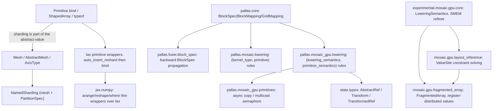
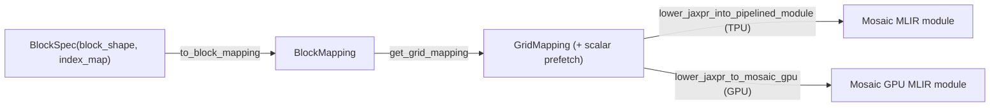

# jax — what it is and how it fits together

## In one paragraph

This wiki subtree covers the slice of JAX scoped by `index_shards` (`jax/experimental/pallas/**`,
`jax/_src/pallas/**`, `jax/experimental/shard_map.py`) plus the core tracing/typing infrastructure
those areas depend on: `jax._src.core`'s `Primitive.bind`/`ShapedArray` trace protocol, the
mesh/sharding system (`Mesh`/`AbstractMesh`/`NamedSharding`), and the Pallas kernel-authoring and
lowering stack for both TPU (Mosaic) and GPU (Mosaic GPU / Triton) backends. The unifying idea
across this slice is **layered dispatch by explicit registry, not by inheritance**: primitives
dispatch through `bind`, TPU/GPU lowering rules dispatch through per-`(kernel_type|semantics,
primitive)` tables, and even GPU layout inference dispatches per-MLIR-op-type — the same
registry-and-lookup idiom recurs at every layer, letting each backend/mode extend coverage without
touching the dispatch machinery itself.

## Core architecture

## Main concepts

**Sharding is part of a value's abstract type, not side-channel metadata.**
[`ShapedArray`](concepts/jax-_src-core.md) carries `sharding`/`manual_axis_type`/`memory_space`
directly, and [`Primitive.bind`](concepts/jax-_src-core.md) reacts to mesh mismatches (auto-reshard
or hard error) using this information — the whole `Auto`/`Explicit`/`Manual` axis-type system (
[jax-_src-mesh](concepts/jax-_src-mesh.md)) is built on this foundation.

**`AbstractMesh` trades device identity for cache stability.**
[jax-_src-mesh](concepts/jax-_src-mesh.md)'s `AbstractMesh` deliberately omits concrete devices so
that tracing/lowering caches don't miss when the same logical mesh shape binds to different
physical devices — a specific, documented performance property, not an incidental simplification.

**Reshard reconciliation happens at the `lax` wrapper level, before `bind`.**
[jax-_src-lax](concepts/jax-_src-lax.md)'s primitive wrappers call `core.auto_insert_reshard` ahead
of `.bind`, making `bind`'s own (more restrictive) mesh-mismatch handling a fallback path rather
than the primary reconciliation mechanism.

**`BlockSpec`/`BlockMapping`/`GridMapping` are Pallas's shape-and-tiling contract.**
[jax-_src-pallas-core](concepts/jax-_src-pallas-core.md) defines how a kernel's inputs/outputs are
tiled per grid step, including scalar-prefetch inputs that bypass ordinary per-step blocking; the
fuser ([jax-_src-pallas-fuser-block_spec](concepts/jax-_src-pallas-fuser-block_spec.md)) infers
compatible tilings for fused intermediates by walking a jaxpr *backward* from a desired output
tiling.

**Lowering is dispatched through explicit per-(mode, primitive) registries, not virtual
dispatch.** TPU lowering ([jax-_src-pallas-mosaic-lowering](concepts/jax-_src-pallas-mosaic-lowering.md))
keys rules by `(kernel_type, primitive)`; GPU lowering
([jax-_src-pallas-mosaic_gpu-lowering](concepts/jax-_src-pallas-mosaic_gpu-lowering.md)) keys by
`(lowering_semantics, primitive_semantics, primitive)`; Triton lowering
([jax-_src-pallas-triton-lowering](concepts/jax-_src-pallas-triton-lowering.md)) further dispatches
math functions through backend-specific (CUDA/ROCm) `_Extern`/`_Fallback` candidate tables. GPU
layout inference ([jax-experimental-mosaic-gpu-layout_inference](concepts/jax-experimental-mosaic-gpu-layout_inference.md))
uses the identical per-MLIR-op-type registry idiom for constraint derivation instead of codegen.

**Ref transforms (tiling, swizzling, bitcasting, aliasing) compose and must be resolved before
lowering an op that touches a transformed ref.** [jax-_src-state-types](concepts/jax-_src-state-types.md)'s
`Transform` protocol and `TransformedRef` are resolved via `_handle_transforms`
([jax-_src-pallas-mosaic_gpu-lowering](concepts/jax-_src-pallas-mosaic_gpu-lowering.md)), which also
verifies ref-level transforms commute correctly with `BlockSpec`-level transforms.

**GPU values are register-distributed (`FragmentedArray`), with hardware-instruction reduction fast
paths gated by exact dtype/bitwidth/architecture.**
[jax-experimental-mosaic-gpu-fragmented_array](concepts/jax-experimental-mosaic-gpu-fragmented_array.md)'s
`reduce` uses `redux.sync`-style instructions only for specific combinations, falling back to
software tree reduction otherwise — and its own hardware-facing utilities
([jax-experimental-mosaic-gpu-utils](concepts/jax-experimental-mosaic-gpu-utils.md)) enforce
power-of-2 bit widths and special-case TF32's storage-vs-precision width discrepancy.

**Hot-path operations (pytree flatten, safe_map/zip, sharding hash/eq) are delegated to compiled
extensions, not left in pure Python.** [jax-_src-util](concepts/jax-_src-util.md)'s `safe_map`/
`safe_zip` and [jax-_src-named_sharding](concepts/jax-_src-named_sharding.md)'s `NamedSharding`
hot methods are both backed by C++ implementations, keeping Python-interpreter overhead out of
code paths exercised on every traced call.

## How a request flows

A Pallas kernel is authored against [`BlockSpec`](concepts/jax-_src-pallas-core.md)/
[`kernel()`](concepts/jax-_src-pallas-mosaic_gpu-core.md), traced to a jaxpr, and its grid/block
structure assembled via `get_grid_mapping`. Lowering dispatches per-primitive through the
appropriate backend's rule registry (Mosaic TPU, Mosaic GPU, or Triton), resolving any ref
transforms along the way, to produce the target MLIR module. Every primitive that touches a
sharded value flows through [`Primitive.bind`](concepts/jax-_src-core.md), which is where the
mesh/axis-type system's cache-preserving `AbstractMesh` abstraction and `auto_insert_reshard`
reconciliation ultimately connect back to ordinary `jax.numpy` code.

## Map of the wiki

- **"How does sharding show up in traced abstract values?"** → [jax-_src-core](concepts/jax-_src-core.md),
  [jax-_src-mesh](concepts/jax-_src-mesh.md), [jax-_src-named_sharding](concepts/jax-_src-named_sharding.md).
- **"How does a Pallas kernel's block/tile structure get built and lowered?"** →
  [jax-_src-pallas-core](concepts/jax-_src-pallas-core.md),
  [jax-_src-pallas-mosaic-lowering](concepts/jax-_src-pallas-mosaic-lowering.md),
  [jax-_src-pallas-mosaic_gpu-lowering](concepts/jax-_src-pallas-mosaic_gpu-lowering.md).
- **"How are GPU-register-resident values represented and reduced?"** →
  [jax-experimental-mosaic-gpu-fragmented_array](concepts/jax-experimental-mosaic-gpu-fragmented_array.md),
  [jax-experimental-mosaic-gpu-layout_inference](concepts/jax-experimental-mosaic-gpu-layout_inference.md).
- For exhaustive per-symbol lookup (signatures, call sites), see `catalog/`; for the full concept
  list with one-line summaries, see `../index.md`.
