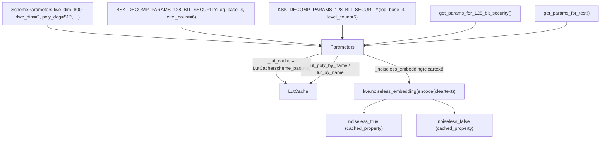

# jaxite.jaxite_bool.bool_params — Parameters, the shared config/LUT-cache bundle for gates

## Overview

`Parameters` is the single object every
gate function in [jaxite-jaxite_bool](jaxite-jaxite_bool.md) takes: it bundles
[`scheme_params`](../catalog/jaxite/jaxite_bool/bool_params.md#Parameters.scheme_params) (LWE/RLWE
dimensions), [`ks_decomp_params`](../catalog/jaxite/jaxite_bool/bool_params.md#Parameters.ks_decomp_params)/
[`bs_decomp_params`](../catalog/jaxite/jaxite_bool/bool_params.md#Parameters.bs_decomp_params) (the
two independent decomposition configs for key switching and blind rotation), and a lazily-built
lookup-table cache that turns a truth table into the RLWE-encoded test polynomial each bootstrap
needs. It also exposes
[`noiseless_true`](../catalog/jaxite/jaxite_bool/bool_params.md#Parameters.noiseless_true)/
[`noiseless_false`](../catalog/jaxite/jaxite_bool/bool_params.md#Parameters.noiseless_false) —
public, deterministic ciphertexts anyone can construct without a secret key, used for
[`constant`](../catalog/jaxite/jaxite_bool/jaxite_bool.md)/
[`not_`](../catalog/jaxite/jaxite_bool/jaxite_bool.md). This module is also where the concrete
128-bit-security and test-only parameter sets are hardcoded.

## Diagram

## Design rationale (why it's built this way)

**`Parameters` owns a `LutCache` internally rather than requiring callers to manage lookup-table
polynomials themselves.** The constructor eagerly builds `self._lut_cache =
bool_lut.LutCache(self._scheme_params)`, and every gate function (
[`and_`](../catalog/jaxite/jaxite_bool/jaxite_bool.md#and_),
[`lut2`](../catalog/jaxite/jaxite_bool/jaxite_bool.md#lut2),
[`lut3`](../catalog/jaxite/jaxite_bool/jaxite_bool.md#lut3), etc.) calls
`lut_poly_by_name`/
`lut_poly` through `Parameters` rather than touching `LutCache` directly — this keeps test-polynomial
caching (avoiding re-encoding the same LUT polynomial on every gate call) entirely internal to
`Parameters`, invisible to gate-composition code.

**Noiseless constants are `functools.cached_property`, computed once per `Parameters` instance, not
per call.** [`noiseless_true`](../catalog/jaxite/jaxite_bool/bool_params.md#Parameters.noiseless_true)/
[`noiseless_false`](../catalog/jaxite/jaxite_bool/bool_params.md#Parameters.noiseless_false) never
change for a given [`scheme_params`](../catalog/jaxite/jaxite_bool/bool_params.md#Parameters.scheme_params)
(they are a deterministic function of `lwe_dimension` and the fixed
[`ENCODING_PARAMS`](../catalog/jaxite/jaxite_bool/bool_params.md#ENCODING_PARAMS)), so caching them
avoids reconstructing the same zero-vector-plus-plaintext array on every
[`constant`](../catalog/jaxite/jaxite_bool/jaxite_bool.md)/`not_` call.

**Two separate `DecompositionParameters` instances, tuned differently, reflect genuinely different
noise/cost tradeoffs for key switching vs. blind rotation.**
`BSK_DECOMP_PARAMS_128_BIT_SECURITY`
uses `level_count=6` while
`KSK_DECOMP_PARAMS_128_BIT_SECURITY`
uses `level_count=5` (both `log_base=4`) — a source comment notes the KSK parameters are
deliberately "an approximate decomposition" (referencing a separate error-analysis doc), i.e. the
two operations tolerate different amounts of decomposition-induced noise, so the module hardcodes
each with its own empirically-chosen level count rather than sharing one.

## Entry points

- [`get_params_for_128_bit_security`](../catalog/jaxite/jaxite_bool/bool_params.md) /
  `get_params_for_test` — the two canned
  `Parameters` constructors most callers
  use, wiring together the module's hardcoded
  [`SchemeParameters`](../catalog/jaxite/jaxite_cggi/parameters.md#SchemeParameters)/
  [`DecompositionParameters`](../catalog/jaxite/jaxite_cggi/decomposition.md#DecompositionParameters)
  constants.
- [`Parameters._noiseless_embedding`](../catalog/jaxite/jaxite_bool/bool_params.md#Parameters._noiseless_embedding) —
  reached (via the
  [`noiseless_true`](../catalog/jaxite/jaxite_bool/bool_params.md#Parameters.noiseless_true)/
  [`noiseless_false`](../catalog/jaxite/jaxite_bool/bool_params.md#Parameters.noiseless_false)
  cached properties) wherever a constant boolean ciphertext is needed without encryption.
- `Parameters.lut_poly_by_name`/`lut_by_name` — reached by every named 2-input gate in
  [jaxite-jaxite_bool](jaxite-jaxite_bool.md) to fetch its test polynomial and cleartext-list debug
  view, ultimately built from the same
  [`scheme_params`](../catalog/jaxite/jaxite_bool/bool_params.md#Parameters.scheme_params) the
  `LutCache` was constructed with.

## Mechanism (step-by-step)

1. **Construction.** `Parameters.__init__`
   stores [`scheme_params`](../catalog/jaxite/jaxite_bool/bool_params.md#Parameters.scheme_params)/
   [`ks_decomp_params`](../catalog/jaxite/jaxite_bool/bool_params.md#Parameters.ks_decomp_params)/
   [`bs_decomp_params`](../catalog/jaxite/jaxite_bool/bool_params.md#Parameters.bs_decomp_params) and
   builds a fresh `LutCache` keyed on
   [`scheme_params`](../catalog/jaxite/jaxite_bool/bool_params.md#Parameters.scheme_params).
2. **Noiseless-constant construction.**
   [`_noiseless_embedding`](../catalog/jaxite/jaxite_bool/bool_params.md#Parameters._noiseless_embedding)
   calls [`encoding.encode`](../catalog/jaxite/jaxite_cggi/encoding.md#encode) on a cleartext under
   [`ENCODING_PARAMS`](../catalog/jaxite/jaxite_bool/bool_params.md#ENCODING_PARAMS), then
   [`lwe.noiseless_embedding`](../catalog/jaxite/jaxite_cggi/lwe.md#noiseless_embedding) with the
   scheme's [`lwe_dimension`](../catalog/jaxite/jaxite_cggi/parameters.md#SchemeParameters.lwe_dimension).
3. **LUT lookup delegates entirely to the internal cache.** `lut_poly`/`lut_poly_by_name`/`lut`/
   `lut_by_name` each simply forward to the corresponding `self._lut_cache` method, keyed on the
   same [`scheme_params`](../catalog/jaxite/jaxite_bool/bool_params.md#Parameters.scheme_params)
   the cache was built from — `Parameters` adds no logic here beyond ownership of the cache
   instance.
4. **Canned parameter construction.**
   [`get_params_for_128_bit_security`](../catalog/jaxite/jaxite_bool/bool_params.md) builds a
   `Parameters` from the three hardcoded 128-bit-security constants, populating the same
   [`scheme_params`](../catalog/jaxite/jaxite_bool/bool_params.md#Parameters.scheme_params)/
   [`bs_decomp_params`](../catalog/jaxite/jaxite_bool/bool_params.md#Parameters.bs_decomp_params)/
   [`ks_decomp_params`](../catalog/jaxite/jaxite_bool/bool_params.md#Parameters.ks_decomp_params)
   fields step 1 stores;
   [`get_lwe_rng_for_128_bit_security`](../catalog/jaxite/jaxite_bool/bool_params.md)/
   [`get_rlwe_rng_for_128_bit_security`](../catalog/jaxite/jaxite_bool/bool_params.md) separately
   supply the matching noise-standard-deviation-tuned `PseudorandomSource`s.

## Key data structures

- **`Parameters`** —
  [`_scheme_params`](../catalog/jaxite/jaxite_bool/bool_params.md#Parameters._scheme_params)/
  [`_ks_decomp_params`](../catalog/jaxite/jaxite_bool/bool_params.md#Parameters._ks_decomp_params)/
  [`_bs_decomp_params`](../catalog/jaxite/jaxite_bool/bool_params.md#Parameters._bs_decomp_params)
  plus `_lut_cache`; a plain class (not a dataclass), with read-only properties over the private
  fields.
- **`SCHEME_PARAMS_128_BIT_SECURITY`** —
  `lwe_dimension=800`, `plaintext_modulus=2^32`, `rlwe_dimension=2`,
  `polynomial_modulus_degree=512`; the module's one canonical production parameter set.
- **`TEST_SCHEME_PARAMS`** — a
  much smaller (`lwe_dimension=4`, `rlwe_dimension=1`) parameter set purely for fast unit tests, not
  cryptographically secure.

## Dynamics (design intent)

The source comment on
`BSK_DECOMP_PARAMS_128_BIT_SECURITY`
notes a hard algebraic constraint: `(2^log_base)^level_count == plaintext_modulus` is required "to
avoid loss of precision" — i.e. the decomposition must exactly cover the plaintext modulus's bit
width, tying the decomposition parameters and scheme parameters together even though they're
independently-constructed objects.

## Edge cases

- [`get_lwe_rng_for_128_bit_security`](../catalog/jaxite/jaxite_bool/bool_params.md)/
  [`get_rlwe_rng_for_128_bit_security`](../catalog/jaxite/jaxite_bool/bool_params.md) hardcode very
  different `normal_std` values (`2**14` vs. `256`) — these are not interchangeable, and using the
  wrong one for a given secret-key type would silently produce an insecure or incorrect noise
  distribution rather than raising an error.
- The source comment notes "TPU performance has been optimized for decomposition base < 8" for the
  128-bit BSK parameters — `log_base=4` is not an arbitrary choice but a hardware-tuned value.

## Open questions

- Whether changing `polynomial_modulus_degree` away from 512 in a custom
  [`SchemeParameters`](../catalog/jaxite/jaxite_cggi/parameters.md#SchemeParameters) while reusing
  the 128-bit-security decomposition constants would silently violate the
  `(2^log_base)^level_count == plaintext_modulus` invariant is not checked anywhere in this
  packet's cited subgraph.

## See also
- [jaxite-jaxite_bool](jaxite-jaxite_bool.md) — every gate function that consumes `Parameters`.
- [jaxite-jaxite_cggi-parameters](jaxite-jaxite_cggi-parameters.md) — `SchemeParameters`, the
  dimension/modulus knobs `Parameters.scheme_params` wraps.
- [jaxite-jaxite_cggi-decomposition](jaxite-jaxite_cggi-decomposition.md) — `DecompositionParameters`,
  the two independently-tuned configs `Parameters` holds for key switching and blind rotation.
