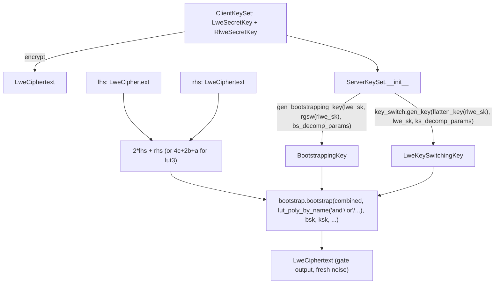

# jaxite.jaxite_bool.jaxite_bool — programmable-bootstrap boolean gates

## Overview

This module is the public API of jaxite: a full set of two-input boolean gates
([`and_`](../catalog/jaxite/jaxite_bool/jaxite_bool.md#and_),
[`or_`](../catalog/jaxite/jaxite_bool/jaxite_bool.md#or_),
[`xor_`](../catalog/jaxite/jaxite_bool/jaxite_bool.md#xor_), and their negated/asymmetric
variants), plus general N-input lookup tables (`lut1`/`lut2`/`lut3`), all implemented as a single
mechanism: pack the input ciphertexts into one linear combination, then call
[`bootstrap.bootstrap`](../catalog/jaxite/jaxite_cggi/bootstrap.md#bootstrap) with a
gate-specific test polynomial (the "programmable bootstrap" trick — see
[jaxite-jaxite_cggi-bootstrap](jaxite-jaxite_cggi-bootstrap.md)). Every gate call is therefore
*exactly* one bootstrap, which both computes the gate's truth table and refreshes the ciphertext's
noise in the same operation — there is no separate "evaluate then bootstrap" step.
`ClientKeySet`/
[`ServerKeySet`](../catalog/jaxite/jaxite_bool/jaxite_bool.md#ServerKeySet) package the
client-side secret keys and server-side public evaluation keys respectively.

## Diagram

## Design rationale (why it's built this way)

**Every 2-input gate is the same shape: a fixed linear combination plus a gate-specific LUT, not a
distinct algorithm per gate.** [`and_`](../catalog/jaxite/jaxite_bool/jaxite_bool.md#and_),
[`or_`](../catalog/jaxite/jaxite_bool/jaxite_bool.md#or_), `nand_`, `nor_`,
[`xor_`](../catalog/jaxite/jaxite_bool/jaxite_bool.md#xor_), `xnor_`, and the four asymmetric
`andny_`/`andyn_`/`orny_`/`oryn_` variants all call
[`bootstrap.bootstrap`](../catalog/jaxite/jaxite_cggi/bootstrap.md#bootstrap) with `2 * lhs + rhs`
as the input and differ *only* in which named lookup-table polynomial
(`params.lut_poly_by_name(...)`) they pass — the boolean logic itself lives entirely in the
precomputed test polynomial, not in any per-gate JAX code.

**`ServerKeySet` derives both evaluation keys from the *same* RLWE secret key the client holds, via
two different wrapping paths.** [`ServerKeySet.__init__`](../catalog/jaxite/jaxite_bool/jaxite_bool.md#ServerKeySet)
wraps `client_key_set.rlwe_sk` as an RGSW key (for the bootstrapping key, via
`rgsw.key_from_rlwe` (see [jaxite-jaxite_cggi-rgsw](jaxite-jaxite_cggi-rgsw.md))) and separately
flattens it to an LWE-shaped key (for the key-switching key's *target*, via
[`rlwe.flatten_key`](../catalog/jaxite/jaxite_cggi/rlwe.md#flatten_key)) — both derivations exist
because blind rotation temporarily "switches" the ciphertext's effective secret key to one derived
from the RLWE key, and the key-switching key's job is to switch it back to the original LWE key.

**`encrypt`/`decrypt` fix the encoding to a single hardcoded
[`ENCODING_PARAMS`](../catalog/jaxite/jaxite_bool/bool_encoding.md#ENCODING_PARAMS) constant, not a
per-call parameter.** Unlike the generic CGGI layer where encoding parameters are always passed
explicitly, `jaxite_bool` bakes in one fixed encoding (3 message bits, 1 padding bit) because
boolean gates only ever need to represent `{0, 1}` (or small LUT indices) — there is no use case in
this module for a caller-configurable message width.

## Entry points

- [`encrypt`](../catalog/jaxite/jaxite_bool/jaxite_bool.md#encrypt) /
  `decrypt` — the client-side round trip; `encrypt` composes
  [`encoding.encode`](../catalog/jaxite/jaxite_cggi/encoding.md#encode) and
  [`lwe.encrypt`](../catalog/jaxite/jaxite_cggi/lwe.md#encrypt) under
  [`ENCODING_PARAMS`](../catalog/jaxite/jaxite_bool/bool_encoding.md#ENCODING_PARAMS).
- [`and_`](../catalog/jaxite/jaxite_bool/jaxite_bool.md#and_) /
  [`or_`](../catalog/jaxite/jaxite_bool/jaxite_bool.md#or_) /
  [`xor_`](../catalog/jaxite/jaxite_bool/jaxite_bool.md#xor_) (and their siblings) — reached for
  every gate evaluation in a boolean circuit; each is one call to
  [`bootstrap.bootstrap`](../catalog/jaxite/jaxite_cggi/bootstrap.md#bootstrap).
- `lut1`/`lut2`/`lut3` — reached wherever a circuit needs an arbitrary N-input truth table rather
  than one of the named 2-input gates, calling the same
  [`bootstrap.bootstrap`](../catalog/jaxite/jaxite_cggi/bootstrap.md#bootstrap) primitive with a
  caller-specified rather than named truth table (e.g. multi-bit adders built from `lut3` per the
  module's own README example).
- `ServerKeySet.__init__` — reached once per deployment to derive
  [`gen_bootstrapping_key`](../catalog/jaxite/jaxite_cggi/bootstrap.md#gen_bootstrapping_key)'s and
  `key_switch.gen_key`'s outputs from a `ClientKeySet`.

## Mechanism (step-by-step)

1. **Key setup.** `ClientKeySet`
   generates an [`LweSecretKey`](../catalog/jaxite/jaxite_cggi/lwe.md#LweSecretKey) via
   [`lwe.gen_key`](../catalog/jaxite/jaxite_cggi/lwe.md#gen_key) and an `RlweSecretKey` via
   [`rlwe.gen_key`](../catalog/jaxite/jaxite_cggi/rlwe.md#gen_key); `ServerKeySet` then derives the
   [`BootstrappingKey`](../catalog/jaxite/jaxite_cggi/bootstrap.md#gen_bootstrapping_key) and
   `LweKeySwitchingKey` from those two secrets.
2. **Encryption.** [`encrypt`](../catalog/jaxite/jaxite_bool/jaxite_bool.md#encrypt) maps a Python
   `bool` to `CLEARTEXT_TRUE`/`CLEARTEXT_FALSE`, calls
   [`encoding.encode`](../catalog/jaxite/jaxite_cggi/encoding.md#encode), then
   [`lwe.encrypt`](../catalog/jaxite/jaxite_cggi/lwe.md#encrypt).
3. **Gate evaluation packs both inputs into one integer and bootstraps.** A 2-input gate computes
   `2 * lhs + rhs` (interpreting the pair as a 2-bit unsigned value) and calls
   [`bootstrap.bootstrap`](../catalog/jaxite/jaxite_cggi/bootstrap.md#bootstrap) with the
   corresponding named LUT polynomial, the
   [`ServerKeySet.bsk`](../catalog/jaxite/jaxite_bool/jaxite_bool.md#ServerKeySet.bsk)/
   [`ksk`](../catalog/jaxite/jaxite_bool/jaxite_bool.md#ServerKeySet.ksk), and both
   [`bs_decomp_params`](../catalog/jaxite/jaxite_bool/bool_params.md#Parameters.bs_decomp_params)/
   [`ks_decomp_params`](../catalog/jaxite/jaxite_bool/bool_params.md#Parameters.ks_decomp_params).
4. **`lut2`/`lut3` generalize step 3** to `2*b + a` / `4*c + 2*b + a`, calling the same
   [`bootstrap.bootstrap`](../catalog/jaxite/jaxite_cggi/bootstrap.md#bootstrap) with an arbitrary
   caller-specified truth table (`params.lut_poly(num_inputs=N, truth_table=...)`) rather than a
   fixed named gate.
5. **`pmap_lut2_impl`/`pmap_lut3_impl` vectorize the same call across devices** via `jax.pmap` with
   `static_broadcasted_argnums` for the shared
   [`ServerKeySet`](../catalog/jaxite/jaxite_bool/jaxite_bool.md#ServerKeySet)/`params`, letting
   independent gate evaluations (e.g. every gate in one circuit
   layer) run in parallel across TPU/GPU cores.

## Key data structures

- **`ClientKeySet`** — holds
  [`lwe_sk`](../catalog/jaxite/jaxite_bool/jaxite_bool.md#ClientKeySet.lwe_sk)/`rlwe_sk`; the
  private material that must never leave the client.
- **[`ServerKeySet`](../catalog/jaxite/jaxite_bool/jaxite_bool.md#ServerKeySet)** — holds
  [`bsk`](../catalog/jaxite/jaxite_bool/jaxite_bool.md#ServerKeySet.bsk)/
  [`ksk`](../catalog/jaxite/jaxite_bool/jaxite_bool.md#ServerKeySet.ksk) plus an optional
  [`bootstrap_callback`](../catalog/jaxite/jaxite_bool/jaxite_bool.md#ServerKeySet.bootstrap_callback)
  (test/debug hook into each bootstrap's intermediate stages); the public material safe to hand to
  an untrusted evaluation server.
- **[`Parameters`](../catalog/jaxite/jaxite_bool/jaxite_bool.md#Parameters)** (re-exported from
  `bool_params`) — the shared
  [`scheme_params`](../catalog/jaxite/jaxite_bool/bool_params.md#Parameters.scheme_params)/decomposition-params/LUT-cache
  bundle every gate function threads through.

## Dynamics (design intent)

Because every gate is exactly one [`bootstrap.bootstrap`](../catalog/jaxite/jaxite_cggi/bootstrap.md#bootstrap)
call, circuit depth in this scheme is purely a count of sequential bootstraps — there is no notion
of "cheap" vs. "expensive" gates at the ciphertext level; a NAND and an 8-way `lut3`-composed adder
step cost the same per-gate bootstrap latency, and circuit optimization in this codebase is about
*minimizing gate/bootstrap count*, not about picking cheaper primitive operations.

## Edge cases

- [`decrypt`](../catalog/jaxite/jaxite_bool/jaxite_bool.md) asserts the decoded cleartext is never
  `CLEARTEXT_UNUSED` (2) — a correctness self-check that would only fire if accumulated ciphertext
  noise had already corrupted the result beyond the scheme's noise budget.
- `lut1` special-cases truth tables 0/1/2/3 to avoid a bootstrap entirely for degenerate 1-input
  LUTs (constant, NOT, identity) — only these four are legal; anything else raises `ValueError`
  rather than falling through to a general (unsupported) 1-input bootstrap.

## Open questions

- Whether the `pmap`-based gate-parallel evaluation composes with `jaxite_bool` circuits that have
  genuine data dependencies between gates (i.e. whether callers are expected to manually batch only
  independent gates), or whether some scheduling layer exists elsewhere to detect this, isn't
  addressed by this packet's cited subgraph.

## See also
- [jaxite-jaxite_cggi-bootstrap](jaxite-jaxite_cggi-bootstrap.md) — `bootstrap`/`gen_bootstrapping_key`,
  the mechanism every gate in this module is built on.
- [jaxite-jaxite_bool-bool_params](jaxite-jaxite_bool-bool_params.md) — `Parameters`, the
  scheme/decomposition/LUT-cache bundle this module's functions all take.
- [jaxite-jaxite_cggi-lwe](jaxite-jaxite_cggi-lwe.md) — `encrypt`/`decrypt`, the underlying
  ciphertext round-trip `jaxite_bool.encrypt`/`decrypt` wrap.
