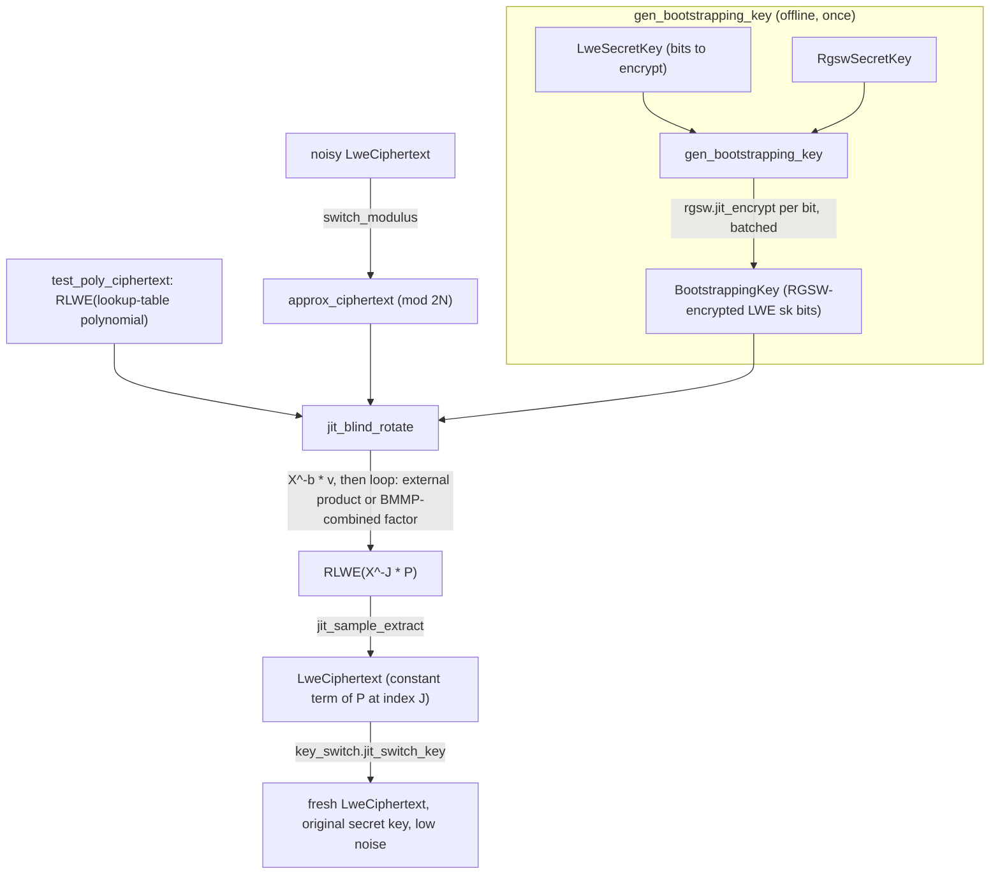

# jaxite.jaxite_cggi.bootstrap — CGGI functional bootstrapping (blind rotate + BMMP + key switch)

## Overview

This module is the heart of CGGI: it turns a noisy LWE ciphertext into a fresh, low-noise LWE
ciphertext that encrypts the *same* message (functional bootstrapping), which is what lets a CGGI
circuit chain arbitrarily many gates without noise ever overflowing. The pipeline
[`bootstrap`](../catalog/jaxite/jaxite_cggi/bootstrap.md#bootstrap) implements is: modulus-switch
down → [`jit_blind_rotate`](../catalog/jaxite/jaxite_cggi/bootstrap.md#jit_blind_rotate) an
RLWE-encrypted lookup-table polynomial by the (encrypted) input value → sample-extract the constant
term as a fresh LWE ciphertext → key-switch back to the caller's original secret key. Blind rotation
is itself a sequence of external products (RGSW × RLWE, from
[jaxite-jaxite_cggi-rgsw](jaxite-jaxite_cggi-rgsw.md)/[jaxite-jaxite_cggi-decomposition](jaxite-jaxite_cggi-decomposition.md)),
optionally accelerated by the BMMP17 optimization that halves the number of external products at
the cost of a larger bootstrapping key.

## Diagram

## Design rationale (why it's built this way)

**Bootstrapping key generation is batched specifically to bound peak memory, not for speed.**
[`gen_bootstrapping_key`](../catalog/jaxite/jaxite_cggi/bootstrap.md#gen_bootstrapping_key) splits
`num_bsk_encryptions` RGSW encryptions into `GEN_BSK_NUM_BATCHES` (20) batches via a
`process_one_batch` closure, rather than encrypting all of them in one vectorized call — generating
every LWE secret-key bit's RGSW encryption simultaneously would require holding
`num_bsk_encryptions` full RGSW ciphertexts' worth of intermediate randomness in memory at once,
which the module considers prohibitive at production security parameters (the docstring's
`NON_DIVISIBLE_BATCH_SIZE_WARNING` constant is emitted when the LWE dimension doesn't evenly divide
into a batch, falling back to unbatched generation for small test parameters).

**BMMP17 trades a larger bootstrapping key for half as many external products per blind
rotation.** When `use_bmmp=True`,
[`gen_bootstrapping_key`](../catalog/jaxite/jaxite_cggi/bootstrap.md#gen_bootstrapping_key)
generates `lwe_sk_dim + lwe_sk_dim // 2` RGSW encryptions instead of `lwe_sk_dim`, and
[`jit_blind_rotate`](../catalog/jaxite/jaxite_cggi/bootstrap.md#jit_blind_rotate)'s
[`one_external_product`](../catalog/jaxite/jaxite_cggi/bootstrap.md#jit_blind_rotate.one_external_product)
loop body combines *three* bootstrapping-key rows (via
`matrix_utils.scale_by_x_power_n_minus_1`, weighted by combinations of two consecutive secret-key
bits) into a single `bmmp_factor` before doing one external product per pair of bits, instead of one
external product per bit — external products are by far the most expensive step in blind rotation,
so this is the module's primary lever for bootstrap latency, paid for with roughly 50% more
bootstrapping-key storage.

**`jax.lax.fori_loop` with a static `unroll` factor drives the external-product chain, not a Python
loop.** [`jit_blind_rotate`](../catalog/jaxite/jaxite_cggi/bootstrap.md#jit_blind_rotate) computes
`unroll_factor = 8 if num_loop_terms % 8 == 0 else None` and passes it to `jax.lax.fori_loop` — a
`fori_loop` (rather than unrolling in Python at trace time) keeps the compiled program size roughly
constant regardless of the LWE dimension, while the conditional unroll-by-8 lets XLA batch multiple
loop iterations' external products together when the iteration count divides evenly, improving
pipelining without inflating program size when it doesn't.

## Entry points

- [`gen_bootstrapping_key`](../catalog/jaxite/jaxite_cggi/bootstrap.md#gen_bootstrapping_key) —
  reached once per deployment (analogous to `rlwe.gen_key`/`rgsw.gen_key`, see
  [jaxite-jaxite_cggi-rlwe](jaxite-jaxite_cggi-rlwe.md)/[jaxite-jaxite_cggi-rgsw](jaxite-jaxite_cggi-rgsw.md)),
  producing the `BootstrappingKey` every subsequent bootstrap call needs.
- [`bootstrap`](../catalog/jaxite/jaxite_cggi/bootstrap.md#bootstrap) — the per-gate entry point;
  called after every CGGI homomorphic operation that would otherwise let noise grow unbounded (in
  `jaxite_bool`, effectively after every logic gate).
- [`blind_rotate`](../catalog/jaxite/jaxite_cggi/bootstrap.md#blind_rotate) — the core primitive
  `bootstrap` calls; also independently testable/usable wherever a caller needs "rotate an
  RLWE-encrypted polynomial by an encrypted amount" without the full bootstrap pipeline.

## Mechanism (step-by-step)

1. **Key generation batches RGSW encryptions of each LWE secret-key bit.**
   [`gen_bootstrapping_key`](../catalog/jaxite/jaxite_cggi/bootstrap.md#gen_bootstrapping_key)
   computes `num_bsk_encryptions` (`lwe_sk_dim` or `1.5×` under BMMP), splits into
   `GEN_BSK_NUM_BATCHES` batches, and calls
   [`process_one_batch`](../catalog/jaxite/jaxite_cggi/bootstrap.md#gen_bootstrapping_key.process_one_batch)
   (wrapping [`rgsw.jit_encrypt`](../catalog/jaxite/jaxite_cggi/rgsw.md#jit_encrypt)) per batch.
2. **[`bootstrap`](../catalog/jaxite/jaxite_cggi/bootstrap.md#bootstrap) modulus-switches the input
   ciphertext down** to `2 × polynomial_modulus_degree` via
   [`lwe.switch_modulus`](../catalog/jaxite/jaxite_cggi/lwe.md#switch_modulus), so the ciphertext's
   coefficients can index directly into the test polynomial's `2N` possible rotation amounts.
3. **[`jit_blind_rotate`](../catalog/jaxite/jaxite_cggi/bootstrap.md#jit_blind_rotate) computes the
   initial rotation** `c' = X^{-b̃} · v` via `matrix_utils.monomial_mul_list`, using the ciphertext's
   own `b̃` component (no secret-key dependence yet — this part is public arithmetic).
4. **The loop conditionally rotates further by each encrypted mask coefficient.** Under BMMP, each
   [`one_external_product`](../catalog/jaxite/jaxite_cggi/bootstrap.md#jit_blind_rotate.one_external_product)
   iteration combines three bootstrapping-key rows into one `bmmp_factor` and does a single
   [`jit_external_product`](../catalog/jaxite/jaxite_cggi/bootstrap.md#jit_external_product) against
   the running accumulator; without BMMP, each iteration instead runs a full CMUX (multiply by
   `X^{ã_j}` then select via external product) per secret-key bit.
5. **The rotated RLWE ciphertext's constant term is sample-extracted** into a plain
   [`LweCiphertext`](../catalog/jaxite/jaxite_cggi/types.md#LweCiphertext) — the target
   lookup-table value now sits in an LWE ciphertext, but encrypted under a *different*
   (bootstrapping-key-derived) secret key.
6. **Key switching restores the original secret key.**
   [`key_switch.jit_switch_key`](../catalog/jaxite/jaxite_cggi/key_switch.md#jit_switch_key) uses
   the caller-supplied `ksk` and `ks_decomposition_params` to re-encrypt the extracted value under
   the original LWE secret key, completing the bootstrap.

## Key data structures

- **`BootstrappingKey`** — `encrypted_lwe_sk_bits` (the array of RGSW ciphertexts), plus
  `use_bmmp`/`use_bat` flags recording which blind-rotation optimization the key was generated to
  support (BMMP row-combining requires the larger key; BAT is a separate Conv-Adapt-Conv external
  product formulation).
- **The `bootstrap` argument bundle** —
  [`DecompositionParameters`](../catalog/jaxite/jaxite_cggi/decomposition.md#DecompositionParameters)
  appears *twice*, independently, as `ks_decomposition_params` and `bs_decomposition_params` — key
  switching and blind rotation are tuned with separate base/level tradeoffs since they have
  different noise/cost profiles.

## Dynamics (design intent)

Every jitted function in this module (`jit_bootstrap`, `jit_blind_rotate`,
`jit_external_product`) marks its `DecompositionParameters`/boolean-flag arguments `static`, so a
change to `use_bmmp`, `use_bat`, or the decomposition base/level counts triggers a recompile while
the actual ciphertext data flows as regular traced arguments — the optimization strategy is
compiled into the program's control flow, not branched on at runtime.

## Edge cases

- [`gen_bootstrapping_key`](../catalog/jaxite/jaxite_cggi/bootstrap.md#gen_bootstrapping_key) raises
  `ValueError` if `lwe_sk_dim` is odd — the BMMP loop-unrolling technique processes secret-key bits
  in pairs and has no fallback for an odd dimension.
- The `unroll_factor` in
  [`jit_blind_rotate`](../catalog/jaxite/jaxite_cggi/bootstrap.md#jit_blind_rotate) is only set to
  8 when `num_loop_terms % 8 == 0`; otherwise it falls back to `None` (no unrolling) rather than a
  partial unroll — an LWE dimension not divisible by 16 (since BMMP halves the loop count) gets no
  unroll-driven pipelining benefit at all.

## Open questions

- Whether `use_bat` (Conv-Adapt-Conv) and `use_bmmp` can be combined simultaneously, or are meant
  to be mutually exclusive optimization strategies, is not resolved by this packet's cited
  subgraph — `jit_blind_rotate` accepts both flags but their interaction inside
  `one_external_product` is only shown for the BMMP branch.

## See also
- [jaxite-jaxite_cggi-rgsw](jaxite-jaxite_cggi-rgsw.md) — `RgswCiphertext`, the type every
  bootstrapping-key row and blind-rotation external product operates on.
- [jaxite-jaxite_cggi-decomposition](jaxite-jaxite_cggi-decomposition.md) — `DecompositionParameters`,
  shared configuration for both blind rotation's and key switching's internal decompositions.
- [jaxite-jaxite_cggi-lwe](jaxite-jaxite_cggi-lwe.md) — `switch_modulus`, the pre-rotation step that
  discretizes the input ciphertext's coefficients.
- [jaxite-jaxite_cggi-rlwe](jaxite-jaxite_cggi-rlwe.md) — `RlweCiphertext`, the type blind rotation
  operates and returns.
