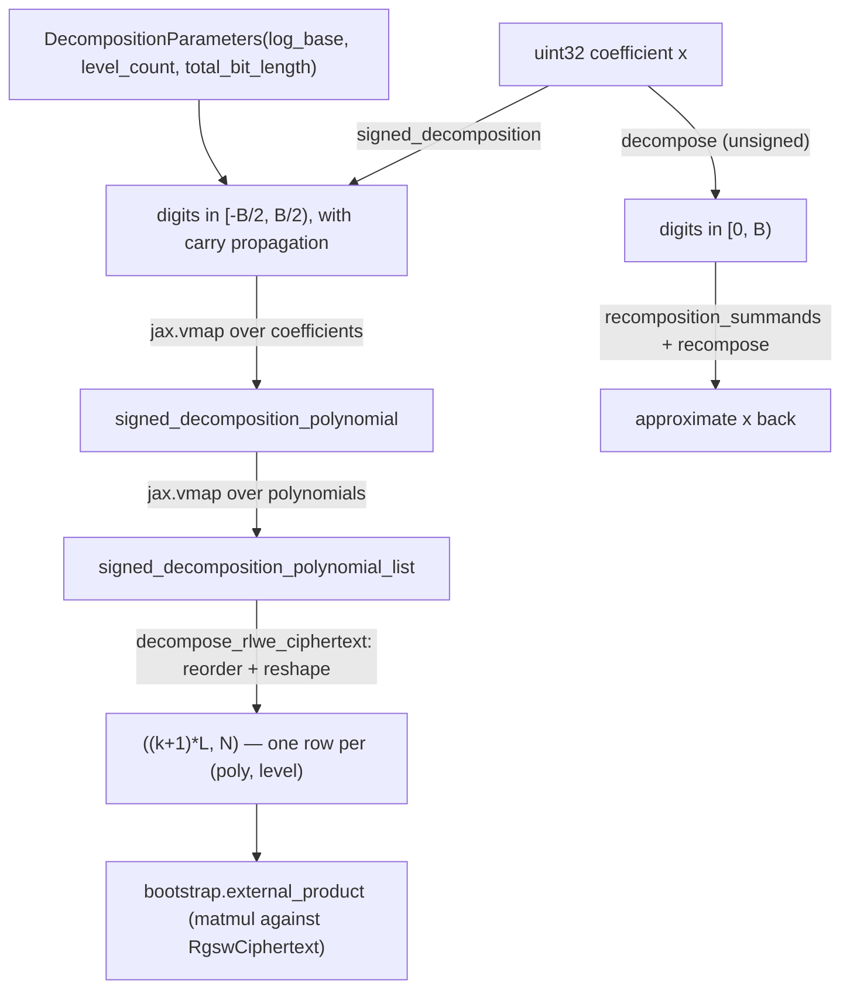

# jaxite.jaxite_cggi.decomposition — signed base-B gadget decomposition

## Overview

Every noise-reducing homomorphic operation in CGGI (external product, key switching) works by
decomposing a ciphertext's coefficients into a small number of low-magnitude "digits" in some base
`B = 2^log_base`, multiplying each digit against a correspondingly-scaled RGSW/key-switching-key
row, and summing — this keeps the noise growth from each multiply bounded by the *digit* size
rather than the full coefficient size.
[`DecompositionParameters`](../catalog/jaxite/jaxite_cggi/decomposition.md#DecompositionParameters)
holds `log_base`/`level_count`;
[`signed_decomposition`](../catalog/jaxite/jaxite_cggi/decomposition.md#signed_decomposition) is the
scalar primitive (digits in `[-B/2, B/2)` rather than `[0, B)`, which halves the average digit
magnitude and thus the noise contribution per level); and
[`decompose_rlwe_ciphertext`](../catalog/jaxite/jaxite_cggi/decomposition.md#decompose_rlwe_ciphertext)
vmaps that scalar primitive across every coefficient of every polynomial in an RLWE ciphertext, in
the exact row layout the external product's matrix multiply expects.

## Diagram

## Design rationale (why it's built this way)

**Signed digits, not unsigned, because they roughly halve the noise each decomposition level
contributes.** [`signed_decomposition`](../catalog/jaxite/jaxite_cggi/decomposition.md#signed_decomposition)'s
docstring frames it as "analogous to `decompose`... restricts the digits... to `[-B/2, B/2)`" —
using unsigned digits in `[0, B)` would have an average magnitude of `B/2`, whereas signed digits
centered on zero average roughly `B/4`; since gadget decomposition's whole purpose is to control the
noise contributed by each digit times its corresponding key-switching/RGSW row, halving the typical
digit magnitude directly reduces the accumulated noise.

**Signed digits require explicit carry propagation, computed with an unrolled Python loop, not a
vectorized closed form.** Converting a digit `d ∈ [0, B)` to `[-B/2, B/2)` means subtracting `B`
whenever `d ≥ B/2`, which then requires incrementing the *next* digit to compensate — a genuine
sequential dependency between digits. [`signed_decomposition`](../catalog/jaxite/jaxite_cggi/decomposition.md#signed_decomposition)
computes this with an explicit `for i in range(len(result))` loop carrying a `carry` variable
between iterations, unlike the unsigned `decompose` (which has no inter-digit dependency and is
written as pure vectorized bit masking).

**Signed digit computation is unrolled at Python level, then the whole function is `vmap`'d twice
for polynomial and ciphertext shapes, rather than vectorizing the carry loop itself.**
[`signed_decomposition_polynomial`](../catalog/jaxite/jaxite_cggi/decomposition.md#signed_decomposition_polynomial)
and
[`signed_decomposition_polynomial_list`](../catalog/jaxite/jaxite_cggi/decomposition.md#signed_decomposition_polynomial_list)
are plain `jax.vmap` wrappers around
[`signed_decomposition`](../catalog/jaxite/jaxite_cggi/decomposition.md#signed_decomposition) — the
carry-propagation loop stays scalar-sequential (it's short, bounded by `total_bit_length /
log_base`), while the *embarrassingly parallel* axis (every coefficient of every polynomial is
independent of every other) is what gets vectorized.

## Entry points

- [`decompose_rlwe_ciphertext`](../catalog/jaxite/jaxite_cggi/decomposition.md#decompose_rlwe_ciphertext) —
  the primary entry point for the bootstrapping pipeline; reached by
  [`bootstrap.external_product`](../catalog/jaxite/jaxite_cggi/bootstrap.md#external_product) and
  [`key_switch.gen_key`](../catalog/jaxite/jaxite_cggi/key_switch.md)'s
  `decompose_and_encrypt` closure to turn an RLWE ciphertext into gadget-decomposed rows.
- [`DecompositionParameters`](../catalog/jaxite/jaxite_cggi/decomposition.md#DecompositionParameters) —
  the shared configuration every decomposition/recomposition function reads
  ([`log_base`](../catalog/jaxite/jaxite_cggi/decomposition.md#DecompositionParameters.log_base),
  [`level_count`](../catalog/jaxite/jaxite_cggi/decomposition.md#DecompositionParameters.level_count),
  [`total_bit_length`](../catalog/jaxite/jaxite_cggi/decomposition.md#DecompositionParameters.total_bit_length)).
- [`gadget_matrix`](../catalog/jaxite/jaxite_cggi/decomposition.md#gadget_matrix) /
  [`inverse_gadget`](../catalog/jaxite/jaxite_cggi/decomposition.md#inverse_gadget) — the
  matrix-form counterparts used in tests to verify `decompose`/`recompose` round-trip identities
  algebraically (`gadget_matrix · inverse_gadget(x) ≈ x`).

## Mechanism (step-by-step)

1. **A caller has an RLWE ciphertext's raw coefficient array**, shape `(k+1, N)`, and a
   [`DecompositionParameters`](../catalog/jaxite/jaxite_cggi/decomposition.md#DecompositionParameters)
   instance.
2. **[`decompose_rlwe_ciphertext`](../catalog/jaxite/jaxite_cggi/decomposition.md#decompose_rlwe_ciphertext)
   calls [`signed_decomposition_polynomial_list`](../catalog/jaxite/jaxite_cggi/decomposition.md#signed_decomposition_polynomial_list)**,
   which vmaps [`signed_decomposition`](../catalog/jaxite/jaxite_cggi/decomposition.md#signed_decomposition)
   over both the polynomial axis and the coefficient axis, producing a `(k+1, N, level_count)`
   array of signed digits.
3. **Each scalar [`signed_decomposition`](../catalog/jaxite/jaxite_cggi/decomposition.md#signed_decomposition)
   call runs the carry-propagation loop**: extract the next unsigned `base_log`-bit chunk plus
   carry-in, test if it's `≥ B/2`, optionally subtract `B` and set carry-out to 1, store the signed
   digit.
4. **The result is transposed and reshaped** from `(polynomial, coefficient, level)` order to
   `((k+1)*level_count, N)`, i.e. one row per `(polynomial, level)` pair — exactly the row layout
   [`bootstrap.external_product`](../catalog/jaxite/jaxite_cggi/bootstrap.md#external_product)'s
   matrix multiply against an `RgswCiphertext` expects.

## Key data structures

- **[`DecompositionParameters`](../catalog/jaxite/jaxite_cggi/decomposition.md#DecompositionParameters)** —
  frozen dataclass:
  [`log_base`](../catalog/jaxite/jaxite_cggi/decomposition.md#DecompositionParameters.log_base),
  [`level_count`](../catalog/jaxite/jaxite_cggi/decomposition.md#DecompositionParameters.level_count),
  [`total_bit_length`](../catalog/jaxite/jaxite_cggi/decomposition.md#DecompositionParameters.total_bit_length)
  (default 32) — the single shared decomposition config for both the bootstrapping key and the key
  switching key (each with their own separate `DecompositionParameters` instance, since they
  typically use different base/level tradeoffs).
- **`DecomposedInt`/`GadgetMatrix`/`GadgetDecomp`** — `NewType` aliases over `jnp.ndarray`, purely
  for documentation (no runtime enforcement), marking which shape-convention a given array follows.

## Dynamics (design intent)

`decompose`/`recomposition_summands`/`signed_decomposition` are all marked static over
`base_log`/`num_levels`/`total_bit_length` — these are genuinely compile-time constants for a given
scheme deployment, so JAX bakes the digit-extraction bit masks into the compiled kernel rather than
computing them as runtime values on every call.

## Edge cases

- [`signed_decomposition`](../catalog/jaxite/jaxite_cggi/decomposition.md#signed_decomposition)
  computes *all* `total_bit_length // base_log` digits internally (even though only `num_levels` are
  ultimately kept) because a carry can cascade from any lower digit up through higher ones — the
  function's own comment notes truncating early would risk missing a carry that should have
  propagated into a kept digit.
- The signed-to-unsigned reinterpretation (`jnp.int32(unsigned_digit) - jnp.int32(carry_mask <<
  1)`, then re-cast to `uint32`) deliberately relies on twos-complement wraparound semantics being
  preserved by later `uint32` arithmetic — the comment calls this out explicitly ("future arithmetic
  operations as uint32 will wrap around and treat 2**32-1 properly as -1").

## Open questions

- Whether `total_bit_length` ever needs to differ from 32 in practice (it's the default for every
  call site cited in this packet's subgraph) is not addressed here.

## See also
- [jaxite-jaxite_cggi-rgsw](jaxite-jaxite_cggi-rgsw.md) — the RGSW gadget-matrix ciphertext whose
  rows are scaled by the same base/level structure this module decomposes into.
- [jaxite-jaxite_cggi-bootstrap](jaxite-jaxite_cggi-bootstrap.md) — `external_product`, the main
  consumer of `decompose_rlwe_ciphertext`.
