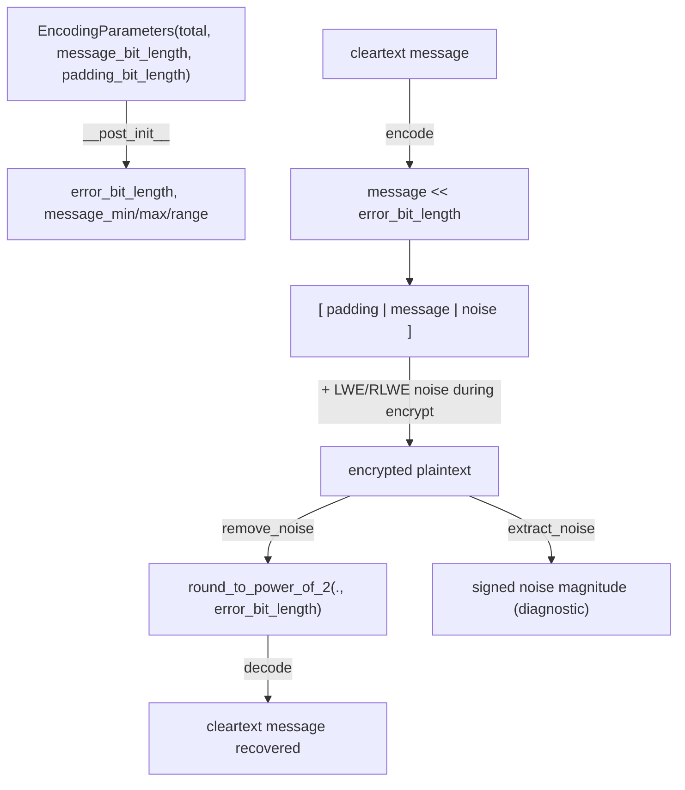

# jaxite.jaxite_cggi.encoding — the padding/message/noise bit layout for TFHE plaintexts

## Overview

TFHE ciphertexts encrypt a fixed-width integer whose bits are split into three regions: padding
(most significant), message, and noise (least significant), and every LWE/RLWE plaintext in this
codebase uses that same layout. [`EncodingParameters`](../catalog/jaxite/jaxite_cggi/encoding.md#EncodingParameters)
computes the derived `error_bit_length`/`message_min`/`message_max` fields from the three
user-specified bit-length knobs; [`encode`](../catalog/jaxite/jaxite_cggi/encoding.md#encode)/
[`decode`](../catalog/jaxite/jaxite_cggi/encoding.md#decode) shift a cleartext into and out of that
layout, and [`remove_noise`](../catalog/jaxite/jaxite_cggi/encoding.md#remove_noise) is the
noise-tolerant rounding step every decryption path calls to strip accumulated LWE noise before
reading the message bits back out.

## Diagram

## Design rationale (why it's built this way)

**Padding exists specifically to survive blind rotation's index arithmetic, not for message
capacity.** The [`EncodingParameters.padding_bit_length`](../catalog/jaxite/jaxite_cggi/encoding.md#EncodingParameters.padding_bit_length)
docstring explains it is "needed to avoid the negation that occurs when blind_rotate ends up
indexing past the degree of the test polynomial" — i.e. a top reserved bit absorbs the sign flip
that happens when a rotation amount wraps around the polynomial ring's negacyclic boundary, so the
message bits underneath are never corrupted by that wraparound.

**Rounding to the nearest power of two, not truncation, is what makes noise removal
correctness-preserving.** `round_to_power_of_2` (the helper
[`remove_noise`](../catalog/jaxite/jaxite_cggi/encoding.md#remove_noise) delegates to) inspects the
single bit just below the rounding boundary (`round_up_or_down_bit = log_pow_of_2 - 1`) to decide
whether to round up, rather than always truncating — this is what lets
[`remove_noise`](../catalog/jaxite/jaxite_cggi/encoding.md#remove_noise)
correctly recover a message even when accumulated LWE noise has pushed the plaintext value slightly
above or below its true encoded value, as long as the noise stays within half the error bit budget.

**`decode` masks to `message_bit_length` while `decode_without_removing_padding` masks to
`message_bit_length + padding_bit_length`.** [`decode`](../catalog/jaxite/jaxite_cggi/encoding.md#decode)
additionally computes a "final modulus with respect to the message space size" specifically because
operations like modulus switching (elsewhere in the LWE pipeline) can push a decrypted value
outside its nominal bit range even when the underlying cleartext is correct — the comment notes
this matters "only for tests where we are not using all the bits of the message space."

## Entry points

- [`encode`](../catalog/jaxite/jaxite_cggi/encoding.md#encode) — reached whenever a cleartext
  (scalar or array, e.g. a test-polynomial's coefficients via `test_polynomial_encoding=True`) must
  become a plaintext ready for encryption; validates the message against
  [`message_min`](../catalog/jaxite/jaxite_cggi/encoding.md#EncodingParameters.message_max)/
  [`message_max`](../catalog/jaxite/jaxite_cggi/encoding.md#EncodingParameters.message_max) bounds
  before shifting.
- [`decode`](../catalog/jaxite/jaxite_cggi/encoding.md#decode) /
  [`decode_without_removing_padding`](../catalog/jaxite/jaxite_cggi/encoding.md#decode_without_removing_padding) —
  reached at the end of every decryption to recover the cleartext, called by
  [`rlwe.decrypt`](../catalog/jaxite/jaxite_cggi/rlwe.md#decrypt) and
  [`lwe.decrypt`](../catalog/jaxite/jaxite_cggi/lwe.md#decrypt) indirectly via `remove_noise`.
- [`remove_noise`](../catalog/jaxite/jaxite_cggi/encoding.md#remove_noise) — reached from every
  decrypt path (`rlwe.decrypt`, `lwe.decrypt`) as the noise-tolerant rounding step, and from
  [`extract_noise`](../catalog/jaxite/jaxite_cggi/encoding.md#extract_noise) for noise-budget
  diagnostics.

## Mechanism (step-by-step)

1. **Parameter derivation.** [`EncodingParameters.__post_init__`](../catalog/jaxite/jaxite_cggi/encoding.md#EncodingParameters.__post_init__)
   validates the three bit-length inputs are non-negative and fit within `total_bit_length`, then
   computes [`error_bit_length`](../catalog/jaxite/jaxite_cggi/encoding.md#EncodingParameters.error_bit_length)
   as the remaining space and derives `message_min`/`message_max`/`message_range` from
   [`message_bit_length`](../catalog/jaxite/jaxite_cggi/encoding.md#EncodingParameters.message_bit_length).
2. **Encoding.** [`encode`](../catalog/jaxite/jaxite_cggi/encoding.md#encode) validates the message
   is within bounds (using a wider bound when `test_polynomial_encoding=True`, since a test
   polynomial's coefficients may legitimately use the padding bits too), then left-shifts by
   `error_bit_length` to place the message in its designated bit region.
3. **Decoding strips noise then shifts back down.** Both
   [`decode`](../catalog/jaxite/jaxite_cggi/encoding.md#decode) and
   [`decode_without_removing_padding`](../catalog/jaxite/jaxite_cggi/encoding.md#decode_without_removing_padding)
   call [`remove_noise`](../catalog/jaxite/jaxite_cggi/encoding.md#remove_noise), right-shift by
   `error_bit_length`, then mask to either the message-only or message+padding bit width.
4. **Noise removal is a rounding operation.** [`remove_noise`](../catalog/jaxite/jaxite_cggi/encoding.md#remove_noise)
   calls `round_to_power_of_2`, which shifts away the low `error_bit_length` bits, optionally
   incrementing by 1 based on the highest discarded bit (banker's-style round-to-nearest), then
   shifts back up to restore alignment.
5. **Noise extraction for diagnostics.** [`extract_noise`](../catalog/jaxite/jaxite_cggi/encoding.md#extract_noise)
   computes `int(plaintext) - int(remove_noise(plaintext))` as a signed value, giving the actual
   accumulated noise magnitude for a given ciphertext — used in tests to verify noise stays within
   budget.

## Key data structures

- **[`EncodingParameters`](../catalog/jaxite/jaxite_cggi/encoding.md#EncodingParameters)** —
  [`message_bit_length`](../catalog/jaxite/jaxite_cggi/encoding.md#EncodingParameters.message_bit_length),
  [`padding_bit_length`](../catalog/jaxite/jaxite_cggi/encoding.md#EncodingParameters.padding_bit_length),
  and derived
  [`error_bit_length`](../catalog/jaxite/jaxite_cggi/encoding.md#EncodingParameters.error_bit_length)/
  message bounds — the single source of truth for how many bits of noise budget a given scheme
  configuration has.

## Dynamics (design intent)

Because `error_bit_length` is computed once at `EncodingParameters` construction and is purely a
function of the three input bit-lengths, every encode/decode/remove_noise call across the whole
LWE/RLWE/bootstrap pipeline shares an identical, consistent noise budget — there is no per-call
recomputation or drift.

## Edge cases

- [`encode`](../catalog/jaxite/jaxite_cggi/encoding.md#encode) raises `ValueError` if any element of
  `message` falls outside `[message_min, message_max]` — silently wrapping an out-of-range message
  is explicitly rejected rather than allowed to alias into a different valid message.
- [`EncodingParameters.__post_init__`](../catalog/jaxite/jaxite_cggi/encoding.md#EncodingParameters.__post_init__)
  raises if `total_bit_length` is exceeded by `message_bit_length + padding_bit_length` — there is
  no automatic reduction of noise budget to make an over-specified encoding fit.

## Open questions

- Whether `padding_bit_length` should ever be automatically derived from `SchemeParameters` rather
  than manually specified is flagged as an open `TODO(b/238643320)` directly in the source, not yet
  resolved.

## See also
- [jaxite-jaxite_cggi-rlwe](jaxite-jaxite_cggi-rlwe.md) — `decrypt`, which calls `remove_noise` to
  recover an `RlwePlaintext`.
- [jaxite-jaxite_cggi-parameters](jaxite-jaxite_cggi-parameters.md) — `SchemeParameters`, the
  companion scheme-level knobs (dimension, modulus) that pair with `EncodingParameters`' bit-layout
  knobs.
