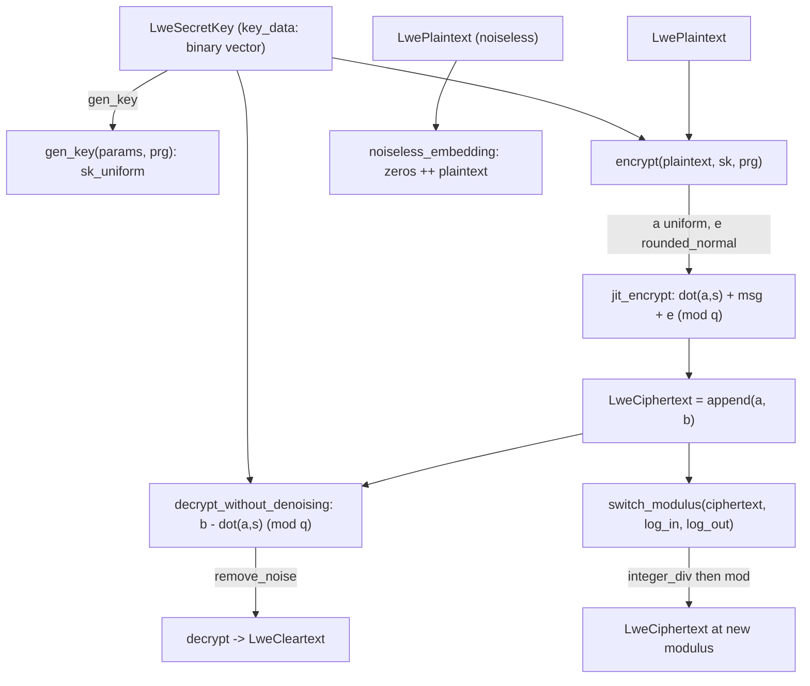

# jaxite.jaxite_cggi.lwe — plain LWE encryption, modulus switching, and noiseless embedding

## Overview

This module is the scalar (non-ring) counterpart to
[jaxite-jaxite_cggi-rlwe](jaxite-jaxite_cggi-rlwe.md): an
[`LweSecretKey`](../catalog/jaxite/jaxite_cggi/lwe.md#LweSecretKey) is a binary vector, and
[`encrypt`](../catalog/jaxite/jaxite_cggi/lwe.md#encrypt)/[`decrypt`](../catalog/jaxite/jaxite_cggi/lwe.md#decrypt)
implement the textbook LWE construction with a single dot product instead of a polynomial one.
Plain LWE ciphertexts are what a CGGI *gate* actually operates on end-to-end (the bootstrapping
step temporarily lifts to RLWE and back); this module also owns
`switch_modulus`, the operation that rescales
a ciphertext's modulus after a homomorphic operation has grown its noise, trading a small,
quantifiable amount of extra error for a smaller modulus more suitable for the next gate.

## Diagram

## Design rationale (why it's built this way)

**`decrypt_without_denoising` is exposed as a separate, public function from `decrypt`.** Splitting
the raw dot-product-and-subtract step from the noise-rounding step lets callers (e.g. tests
verifying noise budget, or the mid-bootstrap decryption helpers used in test infrastructure)
inspect the pre-denoised value directly — [`decrypt`](../catalog/jaxite/jaxite_cggi/lwe.md#decrypt)
is a thin composition of
[`decrypt_without_denoising`](../catalog/jaxite/jaxite_cggi/lwe.md#decrypt_without_denoising) and
[`encoding.remove_noise`](../catalog/jaxite/jaxite_cggi/encoding.md#remove_noise), not a monolithic
routine.

**`switch_modulus` is a pure integer-division-plus-mod operation, not a re-encryption.** It rescales
`ciphertext` by `2^(log_input_modulus - log_output_modulus)` via
`matrix_utils.integer_div` — this is standard LWE modulus switching, which changes the *scale* of
the ciphertext's values (and thus of the noise it carries) without touching the secret key or
re-randomizing anything; the docstring explicitly bounds the extra error introduced
(`0.5 * (lwe_dim + 1)` in the new modulus) so a caller can reason about the noise budget after the
switch.

**`noiseless_embedding` exists as a distinct, cheap constructor for trivial ciphertexts.** Rather
than calling [`encrypt`](../catalog/jaxite/jaxite_cggi/lwe.md#encrypt) with a zero-noise
[`RandomSource`](../catalog/jaxite/jaxite_cggi/random_source.md#ZeroRng),
`noiseless_embedding` directly builds
`append(zeros(lwe_dimension), plaintext)` — a "ciphertext" that anyone (not just the secret-key
holder) can construct, used for public constants like the CGGI gate library's `constant(True)`.

## Entry points

- [`gen_key`](../catalog/jaxite/jaxite_cggi/lwe.md#gen_key) — reached to create a fresh
  [`LweSecretKey`](../catalog/jaxite/jaxite_cggi/lwe.md#LweSecretKey), drawing bits via
  [`RandomSource.sk_uniform`](../catalog/jaxite/jaxite_cggi/random_source.md#RandomSource.sk_uniform).
- [`encrypt`](../catalog/jaxite/jaxite_cggi/lwe.md#encrypt) /
  [`decrypt`](../catalog/jaxite/jaxite_cggi/lwe.md#decrypt) — the round-trip API, mirroring
  [jaxite-jaxite_cggi-rlwe](jaxite-jaxite_cggi-rlwe.md)'s `encrypt`/`decrypt` but for scalar
  ciphertexts.
- `switch_modulus` — reached after a homomorphic operation to rescale a
  [`LweCiphertext`](../catalog/jaxite/jaxite_cggi/types.md#LweCiphertext)'s modulus down before the
  next gate.
- `noiseless_embedding` — reached wherever a public, deterministic
  [`LweCiphertext`](../catalog/jaxite/jaxite_cggi/types.md#LweCiphertext) (no secret key needed)
  must represent a known constant.

## Mechanism (step-by-step)

1. **Key generation.** [`gen_key`](../catalog/jaxite/jaxite_cggi/lwe.md#gen_key) draws
   `lwe_dimension` binary values via
   [`RandomSource.sk_uniform`](../catalog/jaxite/jaxite_cggi/random_source.md#RandomSource.sk_uniform), wrapped
   in an [`LweSecretKey`](../catalog/jaxite/jaxite_cggi/lwe.md#LweSecretKey) carrying
   [`SchemeParameters`](../catalog/jaxite/jaxite_cggi/parameters.md#SchemeParameters)`.log_plaintext_modulus`/`lwe_dimension`.
2. **Encryption.** [`encrypt`](../catalog/jaxite/jaxite_cggi/lwe.md#encrypt) draws a uniform vector
   `ai_samples` and a rounded-normal `error_sample`, then
   [`jit_encrypt`](../catalog/jaxite/jaxite_cggi/lwe.md#jit_encrypt) computes
   `dot(a, s) + plaintext + error (mod q)` and appends `a` to form the full ciphertext vector.
3. **Denoised decryption is two steps.**
   [`decrypt_without_denoising`](../catalog/jaxite/jaxite_cggi/lwe.md#decrypt_without_denoising)
   computes `b - dot(a, s) (mod q)`;
   [`decrypt`](../catalog/jaxite/jaxite_cggi/lwe.md#decrypt) then pipes that through
   [`encoding.remove_noise`](../catalog/jaxite/jaxite_cggi/encoding.md#remove_noise) to strip
   accumulated noise and recover the [`LweCleartext`](../catalog/jaxite/jaxite_cggi/types.md#LweCleartext).
4. **Modulus switching.** `switch_modulus` integer-divides every
   [`LweCiphertext`](../catalog/jaxite/jaxite_cggi/types.md#LweCiphertext) coefficient by
   `2^(log_input_modulus - log_output_modulus)`, then reduces modulo the new modulus.

## Key data structures

- **[`LweSecretKey`](../catalog/jaxite/jaxite_cggi/lwe.md#LweSecretKey)** —
  [`log_modulus`](../catalog/jaxite/jaxite_cggi/lwe.md#LweSecretKey.log_modulus),
  [`lwe_dimension`](../catalog/jaxite/jaxite_cggi/lwe.md#LweSecretKey.lwe_dimension), binary
  [`key_data`](../catalog/jaxite/jaxite_cggi/lwe.md#LweSecretKey.key_data) vector.
- **[`LweCiphertext`](../catalog/jaxite/jaxite_cggi/types.md#LweCiphertext)** — not a distinct
  dataclass here (unlike RLWE); it's a bare `jnp.ndarray` of length `lwe_dimension + 1`, the last
  entry being the "b" component.

## Dynamics (design intent)

`jit_encrypt` and `switch_modulus` are both `jax.jit`-compiled, with `log_modulus` marked static on
`jit_encrypt` — the same pattern as RLWE's `jit_encrypt`, keeping modulus-size-dependent control
flow (the conditional `% modulus` reduction) baked into the compiled kernel rather than evaluated
as a runtime branch on every call.

## Edge cases

- `switch_modulus` assumes both moduli are
  powers of two (passed as their logarithms) — passing a non-power-of-two modulus has no explicit
  guard and would silently produce incorrect results.
- Like RLWE's `jit_encrypt`, the explicit `% modulus` step is skipped when `log_modulus >= 32`,
  relying on native `uint32` wraparound instead.

## Open questions

- Whether `noiseless_embedding`'s output can safely be homomorphically combined with a genuinely
  noisy ciphertext without extra bookkeeping (since it has literally zero noise budget consumed) is
  not addressed by this packet's cited subgraph.

## See also
- [jaxite-jaxite_cggi-rlwe](jaxite-jaxite_cggi-rlwe.md) — the ring-valued analog of this module's
  scalar LWE scheme.
- [jaxite-jaxite_cggi-encoding](jaxite-jaxite_cggi-encoding.md) — `remove_noise`, the noise-rounding
  step `decrypt` depends on.
- [jaxite-jaxite_cggi-random_source](jaxite-jaxite_cggi-random_source.md) — `RandomSource`, the
  pluggable randomness `gen_key`/`encrypt` draw from.
