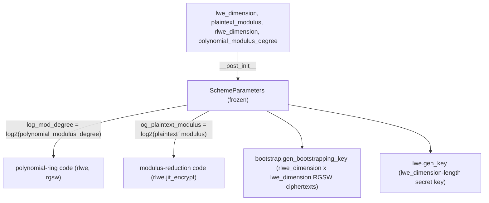

# jaxite.jaxite_cggi.parameters — SchemeParameters, the single source of truth for TFHE dimensions

## Overview

[`SchemeParameters`](../catalog/jaxite/jaxite_cggi/parameters.md#SchemeParameters) is the frozen
dataclass every layer of the CGGI/TFHE pipeline — LWE, RLWE, RGSW, bootstrapping, key switching —
is parameterized by. It holds the four independent dimensions a TFHE deployment must choose
([`lwe_dimension`](../catalog/jaxite/jaxite_cggi/parameters.md#SchemeParameters.lwe_dimension),
`plaintext_modulus`,
[`rlwe_dimension`](../catalog/jaxite/jaxite_cggi/parameters.md#SchemeParameters.rlwe_dimension),
[`polynomial_modulus_degree`](../catalog/jaxite/jaxite_cggi/parameters.md#SchemeParameters.polynomial_modulus_degree))
and derives the two log-scale values (`log_mod_degree`, `log_plaintext_modulus`) that downstream
modulus-arithmetic code needs, so that every function that needs "the modulus" or
"the polynomial degree" gets it from one place rather than recomputing `log2` locally.

## Diagram

## Design rationale (why it's built this way)

**The dataclass is frozen, and derived fields use `object.__setattr__` to bypass immutability just
once, at construction time.** [`SchemeParameters.__post_init__`](../catalog/jaxite/jaxite_cggi/parameters.md#SchemeParameters.__post_init__)
must use `object.__setattr__` specifically because `frozen=True` blocks normal attribute
assignment even inside `__post_init__` — the pattern computes `log_mod_degree`/
`log_plaintext_modulus` once and locks them in place afterward, so a `SchemeParameters` instance is safe to share/hash
across the whole pipeline without risk of one caller mutating dimensions another caller already
compiled against.

**Only four independent numbers are exposed; everything else is derived.** Rather than storing
`log_plaintext_modulus` as an independent field a caller could set inconsistently with
`plaintext_modulus`, the module computes it via `round(math.log2(...))` — collapsing what could be
five potentially-inconsistent knobs down to four genuinely independent ones plus two guaranteed-
consistent derived values.

## Entry points

- [`SchemeParameters`](../catalog/jaxite/jaxite_cggi/parameters.md#SchemeParameters) construction —
  reached at the start of any TFHE deployment (e.g.
  [`bool_params.get_params_for_128_bit_security`](../catalog/jaxite/jaxite_bool/bool_params.md#SCHEME_PARAMS_128_BIT_SECURITY)
  in `jaxite_bool`), fixing the dimensions every downstream `gen_key`/`encrypt`/`bootstrap` call
  reads.
- [`polynomial_modulus_degree`](../catalog/jaxite/jaxite_cggi/parameters.md#SchemeParameters.polynomial_modulus_degree) /
  [`rlwe_dimension`](../catalog/jaxite/jaxite_cggi/parameters.md#SchemeParameters.rlwe_dimension) —
  read directly by [`rlwe.gen_key`](../catalog/jaxite/jaxite_cggi/rlwe.md#gen_key) to shape the
  secret-key array.
- [`lwe_dimension`](../catalog/jaxite/jaxite_cggi/parameters.md#SchemeParameters.lwe_dimension) —
  read by [`lwe.gen_key`](../catalog/jaxite/jaxite_cggi/lwe.md#gen_key) to size the plain-LWE secret
  key.

## Mechanism (step-by-step)

1. **A caller supplies the four independent dimensions** (`lwe_dimension`, `plaintext_modulus`,
   `rlwe_dimension`, `polynomial_modulus_degree`) to the
   [`SchemeParameters`](../catalog/jaxite/jaxite_cggi/parameters.md#SchemeParameters) constructor.
2. **[`SchemeParameters.__post_init__`](../catalog/jaxite/jaxite_cggi/parameters.md#SchemeParameters.__post_init__)
   derives the two log-scale fields** — `log_plaintext_modulus` as `round(log2(plaintext_modulus))`
   and `log_mod_degree` as `round(log2(polynomial_modulus_degree))` — via `object.__setattr__`
   since the dataclass is frozen.
3. **Every downstream module reads whichever fields it needs directly off the shared instance** —
   e.g. [`rlwe.gen_key`](../catalog/jaxite/jaxite_cggi/rlwe.md#gen_key) reads
   [`rlwe_dimension`](../catalog/jaxite/jaxite_cggi/parameters.md#SchemeParameters.rlwe_dimension)
   and
   [`polynomial_modulus_degree`](../catalog/jaxite/jaxite_cggi/parameters.md#SchemeParameters.polynomial_modulus_degree)
   to shape its random key array — there is no scheme-parameters "registry"; the instance itself is
   threaded explicitly through every call.

## Key data structures

- **[`SchemeParameters`](../catalog/jaxite/jaxite_cggi/parameters.md#SchemeParameters)** — frozen
  dataclass:
  [`lwe_dimension`](../catalog/jaxite/jaxite_cggi/parameters.md#SchemeParameters.lwe_dimension),
  `plaintext_modulus`,
  [`rlwe_dimension`](../catalog/jaxite/jaxite_cggi/parameters.md#SchemeParameters.rlwe_dimension),
  [`polynomial_modulus_degree`](../catalog/jaxite/jaxite_cggi/parameters.md#SchemeParameters.polynomial_modulus_degree)
  (all `init=True`), plus derived `log_mod_degree`/`log_plaintext_modulus`
  (`init=False`, computed in `__post_init__`).

## Dynamics (design intent)

Because the dataclass is frozen and every derived field is computed exactly once, a single
`SchemeParameters` instance can safely be captured as a Python closure variable inside multiple
`jax.jit`-compiled functions (e.g.
[`rlwe.jit_encrypt`](../catalog/jaxite/jaxite_cggi/rlwe.md)'s `log_coefficient_modulus` argument)
without risking a stale-parameter bug from later mutation.

## Edge cases

- `math.log2` combined with `round()` silently accepts a `polynomial_modulus_degree` or
  `plaintext_modulus` that isn't an exact power of two — the rounded log will not exactly invert
  back to the original value in that case, and no validation in `__post_init__` catches it.

## Open questions

- Whether any validation exists elsewhere in the codebase to reject non-power-of-two
  `polynomial_modulus_degree`/`plaintext_modulus` values before they reach `SchemeParameters` is not
  addressed by this packet's cited subgraph.

## See also
- [jaxite-jaxite_cggi-rlwe](jaxite-jaxite_cggi-rlwe.md) — `gen_key`, a direct consumer of
  `rlwe_dimension`/`polynomial_modulus_degree`.
- [jaxite-jaxite_cggi-encoding](jaxite-jaxite_cggi-encoding.md) — `EncodingParameters`, the
  companion bit-layout parameters that pair with `SchemeParameters`' dimension/modulus parameters.
