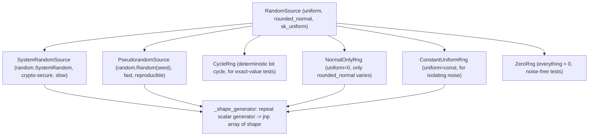

# jaxite.jaxite_cggi.random_source — pluggable randomness for TFHE encryption

## Overview

Every LWE/RLWE encryption in this codebase draws randomness through the
[`RandomSource`](../catalog/jaxite/jaxite_cggi/random_source.md#RandomSource) abstract interface —
three methods ([`uniform`](../catalog/jaxite/jaxite_cggi/random_source.md#RandomSource.uniform),
[`rounded_normal`](../catalog/jaxite/jaxite_cggi/random_source.md#RandomSource.rounded_normal),
`sk_uniform`) — rather than calling `jax.random` or `numpy.random` directly. This indirection
exists because TFHE has two
fundamentally different randomness needs that pull in opposite directions: cryptographic security
(slow, CPU-serial, unpredictable) for real use, and deterministic reproducibility (fast, fixed
outputs) for tests — and this module ships both, plus several intentionally-broken generators used
only to isolate noise sources in unit tests.

## Diagram

## Design rationale (why it's built this way)

**All non-trivial generators funnel through one scalar-repeating helper.**
[`_shape_generator`](../catalog/jaxite/jaxite_cggi/random_source.md#_shape_generator) calls a
parameterless scalar generator function once per output element and reshapes the flat list into
the requested shape — because Python's `random` module and `SystemRandom` only produce one value
at a time and are inherently CPU-serial, there is no way to vectorize them into a single JAX-native
call; this module accepts that cost for the security/reproducibility properties `random` provides,
rather than trying to make TFHE's key/noise generation itself JIT-traceable.

**`_normalize_value` exists because NumPy stopped silently wrapping out-of-range values into
unsigned dtypes.** Values from Python's signed `random.randint`/`randrange` can be negative or
exceed a `uint32`'s range; `_normalize_value` explicitly computes `value % (max+1)` for unsigned
dtypes before array construction, avoiding the deprecated (and now erroring) implicit
out-of-bounds-conversion NumPy used to perform.

**Deliberately "broken" RNGs are first-class citizens, not test-only hacks bolted on.**
[`ZeroRng`](../catalog/jaxite/jaxite_cggi/random_source.md#ZeroRng),
[`ConstantUniformRng`](../catalog/jaxite/jaxite_cggi/random_source.md#ConstantUniformRng), and
[`NormalOnlyRng`](../catalog/jaxite/jaxite_cggi/random_source.md#NormalOnlyRng) each hold exactly
one of the three randomness axes (mask, key, noise) fixed while letting the others vary — this
lets tests isolate, e.g., "is decryption correct with zero noise" from "is decryption correct with
a fixed mask", without needing a mocking framework layered over a single generic RNG.

## Entry points

- [`RandomSource.uniform`](../catalog/jaxite/jaxite_cggi/random_source.md#RandomSource.uniform) —
  called wherever a fresh uniform mask/sample is needed, e.g.
  [`rlwe.encrypt`](../catalog/jaxite/jaxite_cggi/rlwe.md#encrypt)'s `ai_samples`.
- [`RandomSource.rounded_normal`](../catalog/jaxite/jaxite_cggi/random_source.md#RandomSource.rounded_normal) —
  called wherever LWE/RLWE noise must be sampled, e.g.
  [`rlwe.encrypt`](../catalog/jaxite/jaxite_cggi/rlwe.md#encrypt)'s `error_sample`.
- `RandomSource.sk_uniform` — called specifically for secret-key generation (binary-valued), e.g.
  [`rlwe.gen_key`](../catalog/jaxite/jaxite_cggi/rlwe.md#gen_key)/
  [`rgsw.gen_key`](../catalog/jaxite/jaxite_cggi/rgsw.md#gen_key), kept distinct from
  [`uniform`](../catalog/jaxite/jaxite_cggi/random_source.md#RandomSource.uniform) since key bits
  are always `{0, 1}` regardless of the ciphertext modulus.
- [`ALL_RNGS`](../catalog/jaxite/jaxite_cggi/random_source.md#ALL_RNGS) /
  [`VARYING_MAGNITUDE_TEST_RNGS`](../catalog/jaxite/jaxite_cggi/random_source.md#VARYING_MAGNITUDE_TEST_RNGS) —
  test-parametrization lists letting a test suite run against every concrete `RandomSource`
  implementation, or against a range of noise magnitudes.

## Mechanism (step-by-step)

1. **A concrete `RandomSource` subclass wraps a scalar RNG.**
   [`SystemRandomSource`](../catalog/jaxite/jaxite_cggi/random_source.md#SystemRandomSource) wraps
   `random.SystemRandom()`;
   [`PseudorandomSource`](../catalog/jaxite/jaxite_cggi/random_source.md#PseudorandomSource) wraps a
   seeded `random.Random(seed)` for reproducible-but-still-pseudorandom test runs.
2. **Each of the three interface methods defines its own scalar-generator closure** and passes it to
   [`_shape_generator`](../catalog/jaxite/jaxite_cggi/random_source.md#_shape_generator) — e.g.
   [`PseudorandomSource.uniform`](../catalog/jaxite/jaxite_cggi/random_source.md#PseudorandomSource.uniform)
   closes over `self.rng.randint(*self.uniform_bounds)`, while
   [`PseudorandomSource.rounded_normal`](../catalog/jaxite/jaxite_cggi/random_source.md#PseudorandomSource.rounded_normal)
   closes over `round(self.rng.normalvariate(0, self.normal_std))`.
3. **[`_shape_generator`](../catalog/jaxite/jaxite_cggi/random_source.md#_shape_generator) computes
   the total element count**, calls the generator that many times (applying
   [`_normalize_value`](../catalog/jaxite/jaxite_cggi/random_source.md) per element for unsigned
   dtypes), and reshapes the flat Python list into a JAX array of the requested shape and dtype.
4. **Test-only variants special-case one axis.**
   [`CycleRng`](../catalog/jaxite/jaxite_cggi/random_source.md#CycleRng)'s
   [`uniform`](../catalog/jaxite/jaxite_cggi/random_source.md#CycleRng.uniform) cycles through a
   fixed binary sequence derived from a hardcoded constant rather than calling any RNG, giving
   bit-exact reproducible test vectors;
   [`ZeroRng`](../catalog/jaxite/jaxite_cggi/random_source.md#ZeroRng) skips
   [`_shape_generator`](../catalog/jaxite/jaxite_cggi/random_source.md#_shape_generator) entirely
   and returns `jnp.zeros`/`jnp.ones` directly for every method.

## Key data structures

- **[`RandomSource`](../catalog/jaxite/jaxite_cggi/random_source.md#RandomSource)** — the abstract
  base (`abc.ABC`) every scheme-level `gen_key`/`encrypt` function is parameterized over; new
  randomness backends (e.g. a hardware TRNG) only need to implement the three methods to plug in
  everywhere.
- **`uniform_bounds`/`normal_std`** — per-instance configuration on
  [`SystemRandomSource`](../catalog/jaxite/jaxite_cggi/random_source.md#SystemRandomSource)/
  [`PseudorandomSource`](../catalog/jaxite/jaxite_cggi/random_source.md#PseudorandomSource)
  controlling the uniform sampling range and Gaussian noise standard deviation independently of the
  scheme parameters themselves.

## Dynamics (design intent)

`_shape_generator`'s per-element Python loop is explicitly documented as serving "RNGs that run on
CPU serially" — this is a deliberate performance/security tradeoff: cryptographic security in this
codebase currently costs vectorization, and the module does not attempt to hide that cost behind a
JAX-native (and therefore much harder to audit for genuine randomness) alternative.

## Edge cases

- [`CycleRng`](../catalog/jaxite/jaxite_cggi/random_source.md#CycleRng)'s `sk_uniform` override
  simply calls `self.uniform(shape, dtype=dtype)` rather than drawing independent randomness —
  correct only because `CycleRng`'s `uniform` is binary-valued by construction (cycling through a
  fixed bit sequence), so reusing it happens to satisfy `sk_uniform`'s `{0,1}` contract without a
  dedicated implementation, unlike every other concrete subclass which implements the two methods
  with genuinely different bodies.
- `ConstantUniformRng.uniform` returns `const_uniform` broadcast to every element, which is *not*
  binary-valued by default — it must not be used as a stand-in for `sk_uniform` despite sharing the
  `uniform` name, since `ConstantUniformRng` defines `sk_uniform` separately (via the RNG's
  `randint(0, 1)`) specifically to keep the two axes independent.

## Open questions

- Whether `SystemRandomSource` is actually used in any production code path in this repo, or exists
  purely as the "correct" reference implementation while all current callers use
  `PseudorandomSource`, is not resolved by this packet's cited symbols.

## See also
- [jaxite-jaxite_cggi-rlwe](jaxite-jaxite_cggi-rlwe.md) — `gen_key`/`encrypt`, the primary
  consumers of `sk_uniform`/`uniform`/`rounded_normal`.
- [jaxite-jaxite_cggi-parameters](jaxite-jaxite_cggi-parameters.md) — `SchemeParameters`, which
  determines the shapes passed to `RandomSource` methods but not the randomness source itself.
