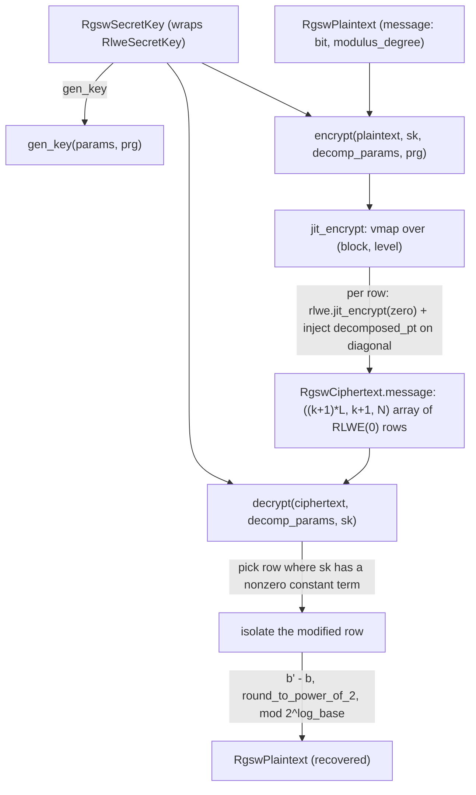

# jaxite.jaxite_cggi.rgsw — RGSW gadget encryption for CGGI bootstrapping

## Overview

RGSW ("RLWE-based GSW") is the ciphertext type CGGI's bootstrapping key uses to encrypt each bit of
the LWE secret key, because it supports the **external product** — multiplying an RGSW ciphertext
by an RLWE ciphertext without a costly bootstrap in between, which is exactly what blind rotation
needs. An [`RgswCiphertext`](../catalog/jaxite/jaxite_cggi/rgsw.md#RgswCiphertext) is a
gadget-matrix-shaped grid of RLWE encryptions of zero, with the plaintext bit injected additively
into specific diagonal-block positions per the CGGI/Joye gadget construction; that gadget structure
is exactly what [`DecompositionParameters`](../catalog/jaxite/jaxite_cggi/decomposition.md#DecompositionParameters)
(see [jaxite-jaxite_cggi-decomposition](jaxite-jaxite_cggi-decomposition.md)) parameterizes, and
what [`decrypt`](../catalog/jaxite/jaxite_cggi/rgsw.md#decrypt) inverts by picking out the
highest-precision row.

## Diagram

## Design rationale (why it's built this way)

**The plaintext bit is injected into the constant coefficient of one polynomial per gadget row, not
encrypted as its own ciphertext.**
[`jit_encrypt`](../catalog/jaxite/jaxite_cggi/rgsw.md#jit_encrypt)'s inner
`encrypt_and_modify_one_row` first generates a genuine fresh
`rlwe.jit_encrypt` (see [jaxite-jaxite_cggi-rlwe](jaxite-jaxite_cggi-rlwe.md)) of zero, then adds
`plaintext_message << (log_coefficient_modulus - log_base * level)` to just the constant
coefficient of one polynomial in that row — this is the standard Z = m·Gᵀ gadget construction (the
module's own comment cites "the Joye paper, p. 19"), where each row of the output corresponds to
one entry of the gadget matrix Gᵀ, scaled by a different power of the decomposition base.

**Encryption is `vmap`'d over levels and blocks, with an outer `batch_vmap` specifically to bound
GPU memory.** [`jit_encrypt`](../catalog/jaxite/jaxite_cggi/rgsw.md#jit_encrypt) nests
`jax.vmap(encrypt_and_modify_one_row, ...)` (over decomposition levels) inside
[`jax_helpers.batch_vmap`](../catalog/jaxite/jaxite_cggi/jax_helpers.md#batch_vmap) (over blocks,
`batch_size=1`) rather than a single flat `vmap` — the source comment explains this is because
`i32_as_u8_matmul` (used inside RLWE encryption's polynomial multiplication) uses too much memory
under a fully-batched `vmap` on GPU; since key/bootstrapping-key generation is a one-time,
typically-CPU-bound cost, trading vectorization for memory headroom here doesn't hurt steady-state
gate throughput.

**Decryption picks whichever secret-key row has a nonzero constant term, not a fixed row.**
[`decrypt`](../catalog/jaxite/jaxite_cggi/rgsw.md#decrypt) searches for `sk_index` such that
`rlwe_sk.data[sk_index, 0] == 1` and raises `ValueError` if none exists — because the reconstruction
identity `b' - b = s_j · m · B^{s-1} - e` only recovers `m` when the corresponding secret-key
coefficient `s_j` is exactly 1; a secret key with an all-zero constant-term column would make RGSW
undecryptable by this method, so the function fails loudly rather than silently returning garbage.

## Entry points

- [`gen_key`](../catalog/jaxite/jaxite_cggi/rgsw.md#gen_key) /
  [`key_from_rlwe`](../catalog/jaxite/jaxite_cggi/rgsw.md#key_from_rlwe) — reached to produce an
  [`RgswSecretKey`](../catalog/jaxite/jaxite_cggi/rgsw.md#RgswSecretKey), either freshly or by
  wrapping an existing [`RlweSecretKey`](../catalog/jaxite/jaxite_cggi/rlwe.md#RlweSecretKey) (the
  latter used when the bootstrapping key must encrypt the *same* RLWE key already in use
  elsewhere).
- [`encrypt`](../catalog/jaxite/jaxite_cggi/rgsw.md#encrypt) — reached once per LWE secret-key bit
  when building a bootstrapping key (see
  [`bootstrap.gen_bootstrapping_key`](../catalog/jaxite/jaxite_cggi/bootstrap.md#gen_bootstrapping_key)).
- [`decrypt`](../catalog/jaxite/jaxite_cggi/rgsw.md#decrypt) — used mainly for testing/debugging an
  RGSW ciphertext directly, since in the actual bootstrapping pipeline RGSW ciphertexts are only
  ever consumed via the external product, never decrypted end-to-end.

## Mechanism (step-by-step)

1. **Key setup.** [`gen_key`](../catalog/jaxite/jaxite_cggi/rgsw.md#gen_key) wraps a freshly
   generated `rlwe.gen_key` (see [jaxite-jaxite_cggi-rlwe](jaxite-jaxite_cggi-rlwe.md)) result in an
   [`RgswSecretKey`](../catalog/jaxite/jaxite_cggi/rgsw.md#RgswSecretKey).
2. **Randomness is shaped to match the gadget matrix layout.**
   [`encrypt`](../catalog/jaxite/jaxite_cggi/rgsw.md#encrypt) draws `ai_samples` of shape
   `(num_blocks+1, levels, k, N)` and `error_samples` of shape `(num_blocks+1, levels)` — one full
   set of RLWE-encryption randomness per gadget-matrix row.
3. **Each row is a fresh RLWE(0) with the decomposed plaintext injected.**
   [`jit_encrypt`](../catalog/jaxite/jaxite_cggi/rgsw.md#jit_encrypt)'s
   `encrypt_and_modify_one_row` computes `decomposed_pt = plaintext << (log_coefficient_modulus -
   log_base * level)`, calls `rlwe.jit_encrypt` (see [jaxite-jaxite_cggi-rlwe](jaxite-jaxite_cggi-rlwe.md))
   on zero, and adds `decomposed_pt` into the constant coefficient of the polynomial at index
   `block`.
4. **Blocks and levels are vmapped, then the result is reshaped** into the final
   `((k+1)*levels, k+1, N)` shape stored as
   [`RgswCiphertext.message`](../catalog/jaxite/jaxite_cggi/rgsw.md#RgswCiphertext.message).
5. **Decryption isolates the maximal-precision row.**
   [`decrypt`](../catalog/jaxite/jaxite_cggi/rgsw.md#decrypt) finds the secret-key index with a
   nonzero constant term, picks the ciphertext row at `level_count * sk_index` (the
   `level=1`/highest-precision row), computes `b' - b` via
   [`matrix_utils.poly_mul`](../catalog/jaxite/jaxite_cggi/matrix_utils.md#poly_mul) against the
   secret key, rounds via `encoding.round_to_power_of_2`, and reduces mod `2^log_base` to recover
   the plaintext bit.

## Key data structures

- **[`RgswPlaintext`](../catalog/jaxite/jaxite_cggi/rgsw.md#RgswPlaintext)** —
  [`modulus_degree`](../catalog/jaxite/jaxite_cggi/rgsw.md#RgswPlaintext.modulus_degree) plus a
  single-bit [`message`](../catalog/jaxite/jaxite_cggi/rgsw.md#RgswPlaintext.message) (RGSW in this
  codebase only ever encrypts LWE secret-key bits, so the plaintext is restricted to `{0,1}` rather
  than a general ring element).
- **[`RgswCiphertext`](../catalog/jaxite/jaxite_cggi/rgsw.md#RgswCiphertext)** — a 3D
  [`message`](../catalog/jaxite/jaxite_cggi/rgsw.md#RgswCiphertext.message) array, `(row, poly,
  coeff)`-shaped, where each row is one RLWE encryption (of zero, modified on one coefficient).
- **[`RgswSecretKey`](../catalog/jaxite/jaxite_cggi/rgsw.md#RgswSecretKey)** — a thin wrapper
  ([`key`](../catalog/jaxite/jaxite_cggi/rgsw.md#RgswSecretKey.key)) around an
  [`RlweSecretKey`](../catalog/jaxite/jaxite_cggi/rlwe.md#RlweSecretKey), with
  [`to_rlwe_secret_key`](../catalog/jaxite/jaxite_cggi/rgsw.md#RgswSecretKey.to_rlwe_secret_key)/
  [`data_at_index`](../catalog/jaxite/jaxite_cggi/rgsw.md#RgswSecretKey.data_at_index) accessors —
  RGSW reuses the RLWE key wholesale rather than defining an independent key format.

## Dynamics (design intent)

Because every row of an `RgswCiphertext` is an independent RLWE encryption of zero (differing only
in which coefficient carries the injected plaintext and at what decomposition level), the external
product's correctness reduces entirely to RLWE's own correctness plus the gadget-decomposition
identity — this module deliberately does not introduce any new cryptographic primitive beyond what
[jaxite-jaxite_cggi-rlwe](jaxite-jaxite_cggi-rlwe.md) already provides.

## Edge cases

- [`decrypt`](../catalog/jaxite/jaxite_cggi/rgsw.md#decrypt) raises `ValueError` if the secret key
  has no index with a nonzero constant term — this is a real (if statistically rare, for a
  sufficiently large `rlwe_dimension`) failure mode that callers relying on
  [`RgswSecretKey.data_at_index`](../catalog/jaxite/jaxite_cggi/rgsw.md#RgswSecretKey.data_at_index)
  independently should be aware of.
- The `RgswCiphertext.modulus_degree` field is set from `plaintext.modulus_degree`, not from
  `rlwe_sk.modulus_degree`, in [`encrypt`](../catalog/jaxite/jaxite_cggi/rgsw.md#encrypt) — these
  are expected to always agree, but nothing enforces it at the type level.

## Open questions

- Whether `batch_vmap`'s `batch_size=1` (fully serializing over blocks) is tuned for a specific
  target hardware, or is a conservative default that could be relaxed for larger available memory,
  is not addressed by this packet's cited subgraph.

## See also
- [jaxite-jaxite_cggi-rlwe](jaxite-jaxite_cggi-rlwe.md) — the RLWE encryption every RGSW row is
  built from.
- [jaxite-jaxite_cggi-decomposition](jaxite-jaxite_cggi-decomposition.md) — `DecompositionParameters`,
  the gadget-matrix shape parameters `encrypt`/`decrypt` both depend on.
- [jaxite-jaxite_cggi-bootstrap](jaxite-jaxite_cggi-bootstrap.md) — `gen_bootstrapping_key`/
  `external_product`, the consumers of `RgswCiphertext` in the actual CGGI gate pipeline.
