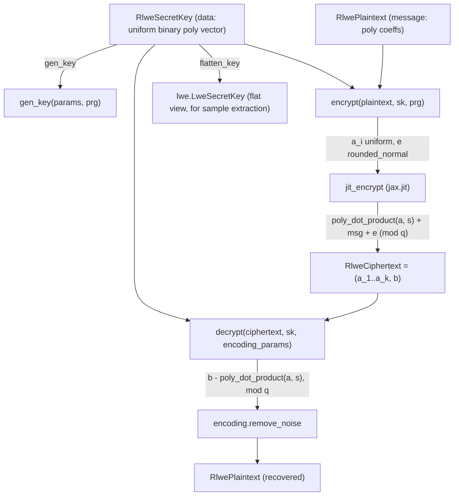

# jaxite.jaxite_cggi.rlwe — RLWE encryption over Z/qZ[X]/(X^N+1)

## Overview

This module implements Ring-LWE (RLWE) encryption, the polynomial-ring generalization of LWE that
underlies TFHE's bootstrapping key and the ciphertexts a CGGI blind rotation operates on. An
[`RlweCiphertext`](../catalog/jaxite/jaxite_cggi/rlwe.md#RlweCiphertext) packs `rlwe_dimension + 1`
polynomials in `(Z/qZ)[X]/(X^N+1)`; [`encrypt`](../catalog/jaxite/jaxite_cggi/rlwe.md#encrypt) and
[`decrypt`](../catalog/jaxite/jaxite_cggi/rlwe.md#decrypt) implement the standard "mask + dot
product with secret key + noise" LWE-style construction, just with polynomial ring elements instead
of scalars. `flatten_key` is the bridge to plain LWE: it re-views an RLWE secret key's coefficients
as a flat LWE key vector, which is exactly what a *sample extraction* (pulling one LWE ciphertext
out of an RLWE ciphertext without any FHE operation) needs on the decryption side.

## Diagram

## Design rationale (why it's built this way)

**Randomness is generated once, outside the `jax.jit` boundary, and passed in as data.**
[`encrypt`](../catalog/jaxite/jaxite_cggi/rlwe.md#encrypt) draws `ai_samples` and `error_sample`
from a [`RandomSource`](../catalog/jaxite/jaxite_cggi/random_source.md#RandomSource) *before*
calling the jitted `jit_encrypt`, rather than threading a PRNG key through the traced function —
keeping the compiled kernel purely deterministic-given-its-inputs, and letting the RNG
implementation (secure or test-only) vary independently of the encryption math.

**The modulus reduction is conditional on `log_coefficient_modulus < 32`.** `jit_encrypt` only
applies an explicit `% modulus` when the modulus fits in fewer bits than the `uint32` container —
when `log_coefficient_modulus == 32`, the natural wraparound of unsigned 32-bit arithmetic already
implements the modular reduction for free, so the extra masking op is skipped.

**Ciphertexts and secret keys are separate dataclasses from plaintexts, but structurally similar,
because RLWE plaintexts, ciphertext rows, and secret-key rows are all "just polynomials."**
[`RlwePlaintext`](../catalog/jaxite/jaxite_cggi/rlwe.md#RlwePlaintext),
[`RlweCiphertext`](../catalog/jaxite/jaxite_cggi/rlwe.md#RlweCiphertext), and
[`RlweSecretKey`](../catalog/jaxite/jaxite_cggi/rlwe.md#RlweSecretKey) all carry the same
`log_coefficient_modulus`/`modulus_degree` pair redundantly — a deliberate duplication that keeps
each object self-describing (e.g. printable via `__str__`) without needing a shared
`SchemeParameters` reference at every call site.

## Entry points

- [`gen_key`](../catalog/jaxite/jaxite_cggi/rlwe.md#gen_key) — reached whenever a fresh RLWE secret
  key is needed, e.g. as the key the CGGI bootstrapping key is built to encrypt under (see
  [jaxite-jaxite_cggi-bootstrap](jaxite-jaxite_cggi-bootstrap.md)'s key generation), drawing key
  bits via
  [`RandomSource.sk_uniform`](../catalog/jaxite/jaxite_cggi/random_source.md#RandomSource.sk_uniform).
- [`encrypt`](../catalog/jaxite/jaxite_cggi/rlwe.md#encrypt) /
  [`decrypt`](../catalog/jaxite/jaxite_cggi/rlwe.md#decrypt) — the round-trip API; `decrypt` takes
  an [`EncodingParameters`](../catalog/jaxite/jaxite_cggi/encoding.md#EncodingParameters) to know
  how many noise bits to strip via `encoding.remove_noise`.
- `flatten_key` — reached after a blind rotation and sample extraction, to convert the
  [`RlweSecretKey`](../catalog/jaxite/jaxite_cggi/rlwe.md#RlweSecretKey) used during bootstrapping
  into an `lwe.LweSecretKey` shape suitable for decrypting the extracted LWE ciphertext directly.

## Mechanism (step-by-step)

1. **Key generation.** [`gen_key`](../catalog/jaxite/jaxite_cggi/rlwe.md#gen_key) draws a
   `(rlwe_dimension, polynomial_modulus_degree)` array of uniform bits from
   [`PseudorandomSource`](../catalog/jaxite/jaxite_cggi/random_source.md#PseudorandomSource)/
   [`CycleRng`](../catalog/jaxite/jaxite_cggi/random_source.md#CycleRng)-style sources, wrapped in
   an [`RlweSecretKey`](../catalog/jaxite/jaxite_cggi/rlwe.md#RlweSecretKey) carrying
   [`SchemeParameters`](../catalog/jaxite/jaxite_cggi/parameters.md#SchemeParameters)' modulus/degree
   fields.
2. **Encryption draws randomness, then jits the arithmetic.**
   [`encrypt`](../catalog/jaxite/jaxite_cggi/rlwe.md#encrypt) samples `ai_samples` (uniform) and
   `error_sample` (rounded normal), then calls `jit_encrypt`, which computes
   `poly_dot_product(a, s) + plaintext + error (mod q)` and appends the `a` rows to form the full
   `RlweCiphertext`.
3. **Decryption undoes the dot product and strips noise.**
   [`decrypt`](../catalog/jaxite/jaxite_cggi/rlwe.md#decrypt) computes
   `b - poly_dot_product(a, s) (mod q)`, then calls `encoding.remove_noise` (rounding to the
   nearest multiple of `2^error_bit_length`) to recover the clean
   [`RlwePlaintext`](../catalog/jaxite/jaxite_cggi/rlwe.md#RlwePlaintext) message.
4. **Key flattening for sample extraction.** `flatten_key` reshapes an
   [`RlweSecretKey`](../catalog/jaxite/jaxite_cggi/rlwe.md#RlweSecretKey)'s
   `(rlwe_dimension, modulus_degree)` data into a single length-`modulus_degree * rlwe_dimension`
   vector, matching the shape a sample-extracted LWE ciphertext expects its secret key to have.

## Key data structures

- **[`RlwePlaintext`](../catalog/jaxite/jaxite_cggi/rlwe.md#RlwePlaintext)** —
  [`log_coefficient_modulus`](../catalog/jaxite/jaxite_cggi/rlwe.md#RlwePlaintext.log_coefficient_modulus),
  [`modulus_degree`](../catalog/jaxite/jaxite_cggi/rlwe.md#RlwePlaintext.modulus_degree),
  [`message`](../catalog/jaxite/jaxite_cggi/rlwe.md#RlwePlaintext.message) (a single polynomial's
  coefficients, lowest degree first).
- **[`RlweCiphertext`](../catalog/jaxite/jaxite_cggi/rlwe.md#RlweCiphertext)** — same modulus/degree
  fields plus a 2D [`message`](../catalog/jaxite/jaxite_cggi/rlwe.md#RlweCiphertext.message) array,
  one row per polynomial (`rlwe_dimension` mask rows + 1 combined row).
- **[`RlweSecretKey`](../catalog/jaxite/jaxite_cggi/rlwe.md#RlweSecretKey)** —
  [`rlwe_dimension`](../catalog/jaxite/jaxite_cggi/rlwe.md#RlweSecretKey.rlwe_dimension) rows of
  binary polynomial [`data`](../catalog/jaxite/jaxite_cggi/rlwe.md#RlweSecretKey.data).

## Dynamics (design intent)

`jit_encrypt` is marked `static_argnames='log_coefficient_modulus'`, so a change in modulus size
triggers a recompile while the actual array-shaped arguments (`plaintext`, `key_data`,
`ai_samples`, `error_sample`) can vary freely across calls without retracing — the scheme parameter
is baked into the compiled kernel's control flow (the conditional mod-reduction), not treated as
runtime data.

## Edge cases

- The `% modulus` step in `jit_encrypt` is skipped entirely when `log_coefficient_modulus >= 32`
  (relying on native `uint32` wraparound) — a caller changing `SchemeParameters` to use the full
  32-bit modulus must not assume an explicit reduction happens at this layer.
- `decrypt` requires a caller-supplied
  [`EncodingParameters`](../catalog/jaxite/jaxite_cggi/encoding.md#EncodingParameters) purely to
  know the noise/message bit split — it does not derive this from the ciphertext or secret key
  itself, so passing mismatched encoding parameters silently produces a wrong (but not
  error-raising) decoded message.

## Open questions

- Whether `flatten_key`'s specific row-major reshape order is required to exactly match the sample
  extraction's own indexing convention (in the blind-rotate module, outside this packet's subgraph)
  is not verifiable from this packet's cited symbols alone.

## See also
- [jaxite-jaxite_cggi-encoding](jaxite-jaxite_cggi-encoding.md) — `EncodingParameters`/
  `remove_noise`, the noise-budget bookkeeping `decrypt` depends on.
- [jaxite-jaxite_cggi-random_source](jaxite-jaxite_cggi-random_source.md) — `RandomSource`, the
  pluggable randomness `gen_key`/`encrypt` draw from.
- [jaxite-jaxite_cggi-parameters](jaxite-jaxite_cggi-parameters.md) — `SchemeParameters`, the
  modulus/dimension/degree knobs `gen_key` reads.
