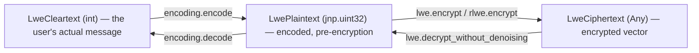

# jaxite.jaxite_cggi.types — the shared vocabulary for LWE value kinds

## Overview

This module is three type aliases —
[`LweCleartext`](../catalog/jaxite/jaxite_cggi/types.md#LweCleartext) (`int`),
[`LwePlaintext`](../catalog/jaxite/jaxite_cggi/types.md#LwePlaintext) (`jnp.uint32`), and
[`LweCiphertext`](../catalog/jaxite/jaxite_cggi/types.md#LweCiphertext) (`Any`) — and nothing else.
Its entire value is documentation-as-code: every function signature across
[jaxite-jaxite_cggi-encoding](jaxite-jaxite_cggi-encoding.md),
[jaxite-jaxite_cggi-lwe](jaxite-jaxite_cggi-lwe.md), and the bootstrapping/gate layers built on top
uses these names instead of bare `int`/`jnp.uint32`/`Any`, so a reader can tell at a glance which
"stage" of the encode → encrypt → decrypt → decode pipeline a given value belongs to, even though
at runtime they are frequently the exact same underlying representation.

## Diagram

## Design rationale (why it's built this way)

**Three names instead of one, despite largely overlapping runtime representations.** A `LweCleartext`
is the smallest, most user-facing value (a plain Python `int` — e.g. a boolean or a LUT index); an
`LwePlaintext` is the same value after
[`encoding.encode`](../catalog/jaxite/jaxite_cggi/encoding.md#encode) has shifted it into its
bit-layout position (still an unencrypted `jnp.uint32`); an
[`LweCiphertext`](../catalog/jaxite/jaxite_cggi/types.md#LweCiphertext) is the encrypted vector.
Keeping them as distinct aliases (rather than a single `int`/`jnp.ndarray` used everywhere) is a
purely-documentation-level type distinction — Python does not enforce it — but it is what makes
function signatures like
[`encoding.decode`](../catalog/jaxite/jaxite_cggi/encoding.md#decode)`(plaintext: LwePlaintext) ->
LweCleartext` self-explanatory about which pipeline stage a value is at.

**`LweCiphertext = Any` reflects real representational polymorphism, not laziness.** A ciphertext is
a bare `jnp.ndarray` for scalar LWE, but the RLWE-side ciphertext type (`RlweCiphertext`, see
[jaxite-jaxite_cggi-rlwe](jaxite-jaxite_cggi-rlwe.md)) is a full dataclass — both flow through logic
that's conceptually "ciphertext-shaped" (e.g. gate composition in `jaxite_bool`), so `Any` is the
honest upper bound rather than a false promise of a single concrete shape.

## Entry points

- [`LweCleartext`](../catalog/jaxite/jaxite_cggi/types.md#LweCleartext) — used as the return type of
  [`encoding.decode`](../catalog/jaxite/jaxite_cggi/encoding.md#decode) and
  [`lwe.decrypt`](../catalog/jaxite/jaxite_cggi/lwe.md#decrypt); the "final" value a caller actually
  wants.
- [`LwePlaintext`](../catalog/jaxite/jaxite_cggi/types.md#LwePlaintext) — the type
  [`encoding.encode`](../catalog/jaxite/jaxite_cggi/encoding.md#encode) produces and
  [`lwe.encrypt`](../catalog/jaxite/jaxite_cggi/lwe.md#encrypt) consumes.
- [`LweCiphertext`](../catalog/jaxite/jaxite_cggi/types.md#LweCiphertext) — the type every
  homomorphic gate operates on and returns, e.g.
  [`lwe.decrypt_without_denoising`](../catalog/jaxite/jaxite_cggi/lwe.md#decrypt_without_denoising)'s
  input.

## Mechanism (step-by-step)

1. **A value starts as an [`LweCleartext`](../catalog/jaxite/jaxite_cggi/types.md#LweCleartext)** —
   an ordinary Python `int` the application logic (e.g. a boolean circuit's literal) works with.
2. **[`encoding.encode`](../catalog/jaxite/jaxite_cggi/encoding.md#encode) promotes it to an
   [`LwePlaintext`](../catalog/jaxite/jaxite_cggi/types.md#LwePlaintext)** by shifting it into the
   message-bit region of the padding/message/noise layout.
3. **[`lwe.encrypt`](../catalog/jaxite/jaxite_cggi/lwe.md#encrypt) (or `rlwe.encrypt`, see
   [jaxite-jaxite_cggi-rlwe](jaxite-jaxite_cggi-rlwe.md)) promotes it to an
   [`LweCiphertext`](../catalog/jaxite/jaxite_cggi/types.md#LweCiphertext)** by combining it with
   secret-key-dependent randomness.
4. **The reverse path** —
   [`lwe.decrypt_without_denoising`](../catalog/jaxite/jaxite_cggi/lwe.md#decrypt_without_denoising)
   demotes ciphertext back to plaintext, and
   [`encoding.decode`](../catalog/jaxite/jaxite_cggi/encoding.md#decode) demotes plaintext back to
   cleartext.

## Key data structures

- **[`LweCleartext`](../catalog/jaxite/jaxite_cggi/types.md#LweCleartext)`= int`**,
  **[`LwePlaintext`](../catalog/jaxite/jaxite_cggi/types.md#LwePlaintext)`= jnp.uint32`**,
  **[`LweCiphertext`](../catalog/jaxite/jaxite_cggi/types.md#LweCiphertext)`= Any`** — the entire
  module.

## Dynamics (design intent)

None of these are `NewType`-wrapped or otherwise runtime-checked — they are plain assignment
aliases, so type-checker tools (pytype/pyright) can still catch a misuse (e.g. passing a plaintext
where a cleartext is expected reads as a type mismatch to static analysis) even though nothing
prevents it at runtime.

## Edge cases

- Because [`LweCleartext`](../catalog/jaxite/jaxite_cggi/types.md#LweCleartext) is a bare `int`
  alias, there is no enforced bound on its value at the type level — the actual bounds checking
  happens in [`encoding.encode`](../catalog/jaxite/jaxite_cggi/encoding.md#encode) against
  `EncodingParameters.message_max`/`message_min`, not in this module.

## Open questions

- Whether `LweCiphertext` will eventually be narrowed to a `Union[jax.Array, RlweCiphertext]` or
  similar as the codebase matures, versus staying `Any` indefinitely, isn't addressed by anything
  in this packet's cited subgraph.

## See also
- [jaxite-jaxite_cggi-encoding](jaxite-jaxite_cggi-encoding.md) — `encode`/`decode`, the functions
  that convert between `LweCleartext` and `LwePlaintext`.
- [jaxite-jaxite_cggi-lwe](jaxite-jaxite_cggi-lwe.md) — `encrypt`/`decrypt`, the functions that
  convert between `LwePlaintext` and `LweCiphertext`.
