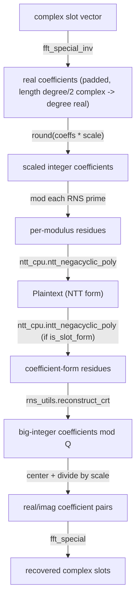

# jaxite.jaxite_ckks.encode — canonical-embedding encode/decode for CKKS

## Overview

CKKS's defining trick is encoding a vector of complex numbers ("slots") into a real polynomial via
the inverse canonical embedding (a specialized FFT), scaling by a large factor to preserve
precision, then rounding to integer RNS coefficients. [`Encode`](../catalog/jaxite/jaxite_ckks/encode.md#Encode)
implements exactly this: [`fft_special_inv`](../catalog/jaxite/jaxite_ckks/encode.md#fft_special_inv)
(a direct port of OpenFHE's `FFTSpecialInv`) turns the slot vector into real coefficients, which are
scaled, reduced mod each RNS prime, and converted to NTT form via `ntt_cpu`.
[`Decode`](../catalog/jaxite/jaxite_ckks/encode.md#Decode) is the exact reverse: CRT-reconstruct
the RNS coefficients back to a single big integer per coefficient, center it, divide by the scale,
and apply the forward [`fft_special`](../catalog/jaxite/jaxite_ckks/encode.md#fft_special) to
recover the complex slot values. Both directions run on CPU/numpy — this module is explicitly a
reference/precompute-time implementation, not the TPU-accelerated path (that's
[jaxite-jaxite_ckks-ntt](jaxite-jaxite_ckks-ntt.md)/[jaxite-jaxite_ckks-mul](jaxite-jaxite_ckks-mul.md)).

## Diagram

## Design rationale (why it's built this way)

**Encoding is a direct, credited port of OpenFHE's specialized FFT, not a from-scratch
reimplementation.** Both [`fft_special_inv`](../catalog/jaxite/jaxite_ckks/encode.md#fft_special_inv)
and [`fft_special`](../catalog/jaxite/jaxite_ckks/encode.md#fft_special) cite the exact OpenFHE
source file/line range they port — CKKS's canonical embedding (based on 5th powers of a primitive
root of unity, per the module's docstrings) has enough numerically-subtle bit-reversal and rotation
bookkeeping that reusing a battle-tested reference implementation's structure is safer than deriving
it independently.

**`EncodeBase`/`DecodeBase` abstract classes exist to let alternate encode/decode strategies plug in
without touching call sites.** [`EncodeBase`](../catalog/jaxite/jaxite_ckks/encode.md#EncodeBase)/
[`DecodeBase`](../catalog/jaxite/jaxite_ckks/encode.md#DecodeBase) declare only the
[`encode`](../catalog/jaxite/jaxite_ckks/encode.md#EncodeBase.encode)/
[`decode`](../catalog/jaxite/jaxite_ckks/encode.md#DecodeBase.decode) method signatures;
[`Encode`](../catalog/jaxite/jaxite_ckks/encode.md#Encode)/
[`Decode`](../catalog/jaxite/jaxite_ckks/encode.md#Decode) are the sole concrete implementations
today, but the split mirrors the same base-class pattern used for `MulPlaintextCiphertextBase` in
[jaxite-jaxite_ckks-mul](jaxite-jaxite_ckks-mul.md) — a recurring convention across this package for
swapping a "simple" reference kernel for a hardware-optimized one.

**Decoding uses a list comprehension instead of vectorized NumPy for the final centered-modulus
step, deliberately.** The `Decode.decode` comment explains: "Use a list comprehension to avoid
NumPy OverflowError when handling large integers" — the CRT-reconstructed coefficients can exceed
NumPy's native integer width once `Q` (product of all RNS moduli) grows large, so the code falls
back to Python's arbitrary-precision integers at the cost of vectorization for this one step.

## Entry points

- [`Encode.encode`](../catalog/jaxite/jaxite_ckks/encode.md#Encode.encode) — reached whenever a
  cleartext complex-slot vector needs to become a `Plaintext`; pads with zeros if fewer than
  `degree/2` slots are supplied.
- [`Decode.decode`](../catalog/jaxite/jaxite_ckks/encode.md#Decode.decode) — reached whenever a
  `Plaintext` (typically freshly decrypted) needs to become a cleartext slot vector; accepts
  `is_slot_form` to control whether an INTT (
  [`ntt_cpu.intt_negacyclic_poly`](../catalog/jaxite/jaxite_ckks/ntt_cpu.md#intt_negacyclic_poly))
  is applied first.

## Mechanism (step-by-step)

1. **[`Encode.encode`](../catalog/jaxite/jaxite_ckks/encode.md#Encode.encode) pads the slot vector**
   to `degree/2` complex values if shorter, then calls
   [`fft_special_inv`](../catalog/jaxite/jaxite_ckks/encode.md#fft_special_inv) in place.
2. **The resulting complex array's real/imaginary parts are concatenated** into a single real
   coefficient vector of length `degree`, then scaled by `self.scale` and rounded to the nearest
   integer, ready to become the [`Plaintext`](../catalog/jaxite/jaxite_ckks/encode.md#Plaintext)'s
   coefficients.
3. **Each RNS modulus reduces the scaled coefficients independently** (`% moduli_arr[:, None]`),
   producing one residue row per modulus, which
   [`ntt_cpu.ntt_negacyclic_poly`](../catalog/jaxite/jaxite_ckks/ntt_cpu.md#ntt_negacyclic_poly)
   converts to NTT form — the resulting `Plaintext` is stored in NTT form by convention.
4. **[`Decode.decode`](../catalog/jaxite/jaxite_ckks/encode.md#Decode.decode) reverses this**:
   optionally INTTs back to coefficient form
   ([`ntt_cpu.intt_negacyclic_poly`](../catalog/jaxite/jaxite_ckks/ntt_cpu.md#intt_negacyclic_poly)),
   CRT-reconstructs each coefficient across all moduli
   ([`rns_utils.reconstruct_crt`](../catalog/jaxite/jaxite_ckks/rns_utils.md#reconstruct_crt)),
   centers the result around zero (subtracting `Q` if above `Q/2`), divides by `self.scale`, and
   splits the recovered real vector into real/imaginary halves for
   [`fft_special`](../catalog/jaxite/jaxite_ckks/encode.md#fft_special).

## Key data structures

- **`Plaintext`** (re-exported from `types`) — the encode/decode round-trip's shared output/input
  type; see [jaxite-jaxite_ckks-types](jaxite-jaxite_ckks-types.md).
- **`self.scale`** on both [`Encode`](../catalog/jaxite/jaxite_ckks/encode.md#Encode)/
  [`Decode`](../catalog/jaxite/jaxite_ckks/encode.md#Decode) — the large scaling factor
  controlling encoding precision; must match between the encode and decode instances used for a
  given plaintext, or the recovered values will be wrong by that factor.

## Dynamics (design intent)

`fft_special_inv`/`fft_special` mutate their input array in place (documented explicitly in both
docstrings) rather than returning a new array — a small performance/memory choice appropriate for a
CPU reference implementation processing one plaintext at a time, not something vectorized across a
batch.

## Edge cases

- [`Decode.decode`](../catalog/jaxite/jaxite_ckks/encode.md#Decode.decode) raises `ValueError` if
  `scale`/`num_slots` were never set — this can only happen if a `Decode` instance is constructed
  incorrectly, since both are required constructor arguments; the check functions as a defensive
  assertion, not a real reachable error path from normal use.
- `Encode.encode` silently zero-pads if fewer than `degree/2` slots are given but does **not**
  raise if *more* are given — the `y = np.pad(...)` branch is guarded by `len(y) < nh`, so an
  over-long `slots` list is truncated implicitly by the fixed-size array operations that follow.

## Open questions

- Whether the CPU-only `Encode`/`Decode` path is intended to be the sole encode/decode
  implementation going forward, or is scheduled to gain a TPU-accelerated counterpart analogous to
  `NTTBarrett` for the NTT step, is not addressed
  by this packet's cited subgraph.

## See also
- [jaxite-jaxite_ckks-types](jaxite-jaxite_ckks-types.md) — `Plaintext`, the type this module
  produces and consumes.
- [jaxite-jaxite_ckks-encrypt](jaxite-jaxite_ckks-encrypt.md) — `Encrypt`/`Decrypt`, the next stage
  a `Plaintext` flows through after encoding.
- [jaxite-jaxite_ckks-rns](jaxite-jaxite_ckks-rns.md) — the RNS/NTT reference math this module's CPU
  helpers (`ntt_cpu`, `rns_utils`) build on.
