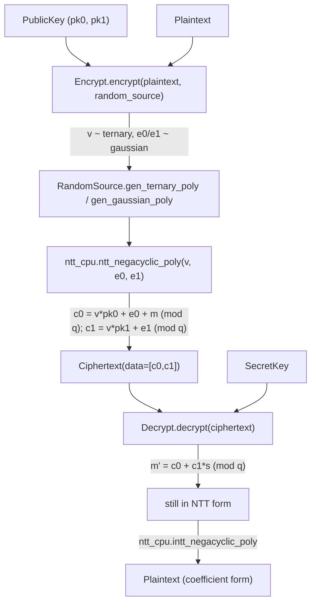

# jaxite.jaxite_ckks.encrypt — CKKS public-key encryption/decryption

## Overview

This module implements standard RLWE-based CKKS public-key encryption:
[`Encrypt.encrypt`](../catalog/jaxite/jaxite_ckks/encrypt.md#Encrypt.encrypt) masks a `Plaintext`
with a ternary secret `v` and Gaussian noise against the public key
(`c0 = v·pk0 + e0 + m`, `c1 = v·pk1 + e1`), and
[`Decrypt.decrypt`](../catalog/jaxite/jaxite_ckks/encrypt.md#Decrypt.decrypt) reverses it with the
secret key (`m = c0 + c1·s`). Like [jaxite-jaxite_ckks-encode](jaxite-jaxite_ckks-encode.md), this is
a CPU/numpy reference implementation (using `ntt_cpu` for the negacyclic NTT), not the
TPU-accelerated path. `random.RandomSource` is injected rather than hardcoded, so encryption
randomness can be swapped between a cryptographically secure source and deterministic test sources.

## Diagram

## Design rationale (why it's built this way)

**Moduli compatibility is checked explicitly before any arithmetic, comparing against a *prefix* of
the key's moduli, not an exact match.** Both
[`Encrypt.encrypt`](../catalog/jaxite/jaxite_ckks/encrypt.md#Encrypt.encrypt) and
[`Decrypt.decrypt`](../catalog/jaxite/jaxite_ckks/encrypt.md#Decrypt.decrypt) compare
`plaintext.moduli`/`ciphertext.moduli` against `self.public_key.moduli[:len(...)]`/
`self.secret_key.moduli[:len(...)]` rather than requiring exact-length equality — this is what lets
one [`PublicKey`](../catalog/jaxite/jaxite_ckks/encrypt.md)/[`SecretKey`](../catalog/jaxite/jaxite_ckks/encrypt.md)
(generated for the full modulus chain) encrypt/decrypt data at any *lower* level (fewer moduli,
after some number of rescales) without regenerating keys per level.

**Randomness is injectable via an abstract `RandomSource`, defaulting to a secure implementation.**
[`Encrypt.encrypt`](../catalog/jaxite/jaxite_ckks/encrypt.md#Encrypt.encrypt) takes an optional
[`random_source`](../catalog/jaxite/jaxite_ckks/random.md#RandomSource) parameter, defaulting to
`random.SecureRandomSource()` only if none is supplied — mirroring the same pluggable-randomness
pattern as [jaxite-jaxite_cggi-random_source](jaxite-jaxite_cggi-random_source.md) in the CGGI lane:
production code gets a secure default, while tests can inject
[`TestRandomSource`](../catalog/jaxite/jaxite_ckks/random.md#TestRandomSource)/
[`ZeroNoiseRandomSource`](../catalog/jaxite/jaxite_ckks/random.md#ZeroNoiseRandomSource) for
deterministic, noise-free verification.

**Encryption converts sampled polynomials to NTT form before combining with the public key.**
`v`/`e0`/`e1` are sampled in coefficient form (`gen_ternary_poly`/`gen_gaussian_poly`) then
immediately NTT'd (`ntt_cpu.ntt_negacyclic_poly`) — because the public key's stored data is itself
in NTT form (elementwise multiplication in NTT form implements polynomial multiplication mod
`X^N+1`), so every operand of `c0`/`c1`'s computation must be in the same domain.

## Entry points

- [`Encrypt.encrypt`](../catalog/jaxite/jaxite_ckks/encrypt.md#Encrypt.encrypt) — reached whenever a
  `Plaintext` needs to become a `Ciphertext`; the sole public-key-based entry point into CKKS
  encryption.
- [`Decrypt.decrypt`](../catalog/jaxite/jaxite_ckks/encrypt.md#Decrypt.decrypt) — reached whenever a
  `Ciphertext` (fresh or after homomorphic operations) needs to be opened with the secret key.
- [`EncryptBase.encrypt`](../catalog/jaxite/jaxite_ckks/encrypt.md#EncryptBase.encrypt)/
  [`DecryptBase.decrypt`](../catalog/jaxite/jaxite_ckks/encrypt.md#DecryptBase.decrypt) — the
  abstract interface both concrete kernels implement, mirroring the
  `EncodeBase`/`DecodeBase`/`MulPlaintextCiphertextBase` pattern elsewhere in this package.

## Mechanism (step-by-step)

1. **[`Encrypt.encrypt`](../catalog/jaxite/jaxite_ckks/encrypt.md#Encrypt.encrypt) validates
   moduli compatibility**, then draws `v` (ternary), `e0`, `e1` (Gaussian) from the
   [`RandomSource`](../catalog/jaxite/jaxite_ckks/random.md#RandomSource) via
   [`gen_ternary_poly`](../catalog/jaxite/jaxite_ckks/random.md#RandomSource.gen_ternary_poly)/
   [`gen_gaussian_poly`](../catalog/jaxite/jaxite_ckks/random.md#RandomSource.gen_gaussian_poly).
2. **All three sampled polynomials are NTT'd** via
   [`ntt_cpu.ntt_negacyclic_poly`](../catalog/jaxite/jaxite_ckks/ntt_cpu.md#ntt_negacyclic_poly).
3. **`c0`/`c1` are computed as modular polynomial arithmetic in NTT form**:
   `c0 = (v_ntt * pk0 + e0_ntt + plaintext.data) % q`, `c1 = (v_ntt * pk1 + e1_ntt) % q`, stacked
   into the [`Ciphertext`](../catalog/jaxite/jaxite_ckks/encrypt.md#Ciphertext)'s two-element
   `data`.
4. **[`Decrypt.decrypt`](../catalog/jaxite/jaxite_ckks/encrypt.md#Decrypt.decrypt) validates moduli
   compatibility against the secret key**, computes `res = (c0 + c1*s) % q` (still in NTT form),
   then applies
   [`ntt_cpu.intt_negacyclic_poly`](../catalog/jaxite/jaxite_ckks/ntt_cpu.md#intt_negacyclic_poly)
   to return to coefficient form, wrapped as a `Plaintext`.

## Key data structures

- **`PublicKey`**/`SecretKey` (re-exported from `types`) — the asymmetric key pair;
  [`data`](../catalog/jaxite/jaxite_ckks/types.md#SecretKey.data) is numpy-backed and not
  pytree-registered (never traced).
- **[`Ciphertext`](../catalog/jaxite/jaxite_ckks/encrypt.md#Ciphertext)** — the two-element
  (`c0`, `c1`) output of encryption; see [jaxite-jaxite_ckks-types](jaxite-jaxite_ckks-types.md).

## Dynamics (design intent)

Because `v`/`e0`/`e1` are freshly sampled on every
[`Encrypt.encrypt`](../catalog/jaxite/jaxite_ckks/encrypt.md#Encrypt.encrypt) call (not cached or
reused), encrypting the same plaintext twice produces two different, semantically-equivalent
ciphertexts — the standard IND-CPA security property of RLWE-based encryption, which this module
achieves simply by never memoizing the randomness draw.

## Edge cases

- Both [`Encrypt.encrypt`](../catalog/jaxite/jaxite_ckks/encrypt.md#Encrypt.encrypt) and
  [`Decrypt.decrypt`](../catalog/jaxite/jaxite_ckks/encrypt.md#Decrypt.decrypt) raise `ValueError`
  on a moduli-prefix mismatch rather than silently truncating or padding — a caller passing a
  plaintext/ciphertext whose moduli don't align with the key's prefix gets an explicit failure, not
  a corrupted result.

## Open questions

- Whether `Encrypt`/`Decrypt` are expected to gain a TPU-accelerated counterpart (paralleling
  `NTTBarrett` for the NTT step) is not addressed
  by this packet's cited subgraph — as written, both classes route every NTT/INTT through the CPU
  `ntt_cpu` reference implementation.

## See also
- [jaxite-jaxite_ckks-types](jaxite-jaxite_ckks-types.md) — `Ciphertext`/`Plaintext`, the types
  this module produces and consumes.
- [jaxite-jaxite_ckks-encode](jaxite-jaxite_ckks-encode.md) — `Encode`/`Decode`, the stage that
  produces the `Plaintext` this module encrypts.
- [jaxite-jaxite_ckks-mul](jaxite-jaxite_ckks-mul.md) — `Mul`, the homomorphic operation kernel
  that operates on the `Ciphertext` this module produces.
