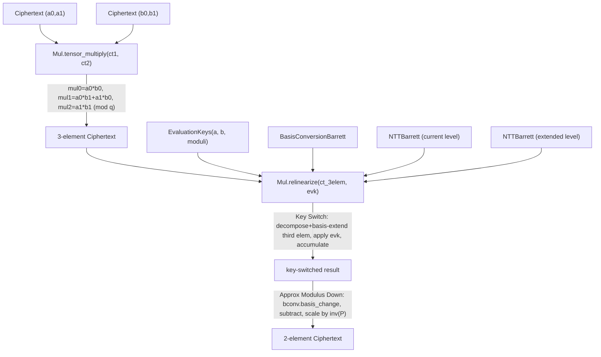

# jaxite.jaxite_ckks.mul — ciphertext multiplication and relinearization

## Overview

Multiplying two CKKS ciphertexts produces a 3-element ciphertext (a degree-2 polynomial in the
secret key) whose size grows with every subsequent multiplication unless it's brought back down to
2 elements — that reduction is **relinearization**, the most complex operation in this package.
`Mul.tensor_multiply` computes the raw
3-element product; [`Mul.relinearize`](../catalog/jaxite/jaxite_ckks/mul.md#Mul.relinearize)
performs a key-switch (using [`EvaluationKeys`](../catalog/jaxite/jaxite_ckks/mul.md) and a
[`BasisConversionBarrett`](../catalog/jaxite/jaxite_ckks/basis_conversion.md#BasisConversionBarrett))
followed by an approximate-modulus-down step to reduce the noise the key switch introduces. The
[`Mul`](../catalog/jaxite/jaxite_ckks/mul.md#Mul) class is explicitly single-level (one fixed set of
moduli) rather than multi-level, trading one `Mul` instance per RNS level for a smaller per-instance
memory footprint — an explicit TPU-memory tradeoff the class docstring states directly.
[`MulPlaintextCiphertextSimple`](../catalog/jaxite/jaxite_ckks/mul.md)/
[`MulPlaintextCiphertextBarrett`](../catalog/jaxite/jaxite_ckks/mul.md) separately handle the
simpler plaintext × ciphertext case, which needs no relinearization at all.

## Diagram

## Design rationale (why it's built this way)

**`Mul` is deliberately single-level, trading extra per-level instances for lower device memory.**
The class docstring states this explicitly: "Specializing keeps the device memory footprint small
by not loading constants for all levels at once... The cost is that separate instances of `Mul` are
needed per level." Given TPUs are memory-constrained accelerators, this codebase chooses to
precompute and hold NTT/Barrett/basis-conversion constants for exactly one modulus chain length at
a time, rather than a single `Mul` object generalized over the whole modulus chain.

**Relinearization decomposes the third ciphertext element into partitions (`dnum`), not one giant
key-switch.** [`Mul.compute_control_indices`](../catalog/jaxite/jaxite_ckks/mul.md) computes, for
[`dnum`](../catalog/jaxite/jaxite_ckks/mul.md#Mul.dnum) partitions, which RNS towers are "selected"
vs. "non-selected" per part — this is the standard RNS-decomposed key-switching technique: instead
of one key-switch operation over the full modulus product (numerically unstable / requiring a huge
special modulus), the third ciphertext element is split into `dnum` digit-groups, each extended and
key-switched with its own evaluation-key row, then accumulated.

**Optional constructor injection (`bconv`/`ntt_current`/`ntt_extend`/
[`ntt_factory`](../catalog/jaxite/jaxite_ckks/mul.md#Mul._injected_ntt_factory)/`full_ntt`) lets
callers share precomputed constants across multiple `Mul` instances.** `Mul.__init__` accepts each
of these as optional pre-built objects rather than always constructing them fresh — since
[`NTTBarrett`](../catalog/jaxite/jaxite_ckks/ntt.md#NTTBarrett)/
[`BasisConversionBarrett`](../catalog/jaxite/jaxite_ckks/basis_conversion.md#BasisConversionBarrett)
precomputation is the expensive part of setting up a `Mul` instance, sharing them across e.g.
multiple levels that happen to need the same sub-configuration avoids redundant precompute work.

## Entry points

- `Mul.tensor_multiply` — reached for every ciphertext × ciphertext homomorphic multiplication on
  a [`Mul`](../catalog/jaxite/jaxite_ckks/mul.md#Mul) instance; produces the (unreduced) 3-element
  product.
- [`Mul.relinearize`](../catalog/jaxite/jaxite_ckks/mul.md#Mul.relinearize) — reached immediately
  after every `tensor_multiply` to restore the 2-element ciphertext invariant before any further
  operation.
- [`Mul.precompute_constants`](../catalog/jaxite/jaxite_ckks/mul.md) — reached once per
  [`Mul`](../catalog/jaxite/jaxite_ckks/mul.md#Mul) instance (i.e. once per RNS level a program will
  multiply at) to build every constant `tensor_multiply`/
  [`relinearize`](../catalog/jaxite/jaxite_ckks/mul.md#Mul.relinearize) need.
- `MulPlaintextCiphertextBase.mul` — the simpler plaintext × ciphertext path, needing no
  relinearization since the result stays 2-element (see
  [`Ciphertext`](../catalog/jaxite/jaxite_ckks/mul.md#Ciphertext)).

## Mechanism (step-by-step)

1. **Constant precomputation.**
   [`Mul.precompute_constants`](../catalog/jaxite/jaxite_ckks/mul.md) stores
   [`original_moduli`](../catalog/jaxite/jaxite_ckks/mul.md#Mul.original_moduli)/
   [`extend_moduli`](../catalog/jaxite/jaxite_ckks/mul.md#Mul.extend_moduli)/
   [`dnum`](../catalog/jaxite/jaxite_ckks/mul.md#Mul.dnum), validates all moduli fit under `2^31`
   (to avoid overflow in the multiply/relinearize arithmetic), computes control indices for the
   key-switch partitions, and builds/reuses
   [`bconv`](../catalog/jaxite/jaxite_ckks/mul.md#Mul.bconv) (
   [`BasisConversionBarrett`](../catalog/jaxite/jaxite_ckks/basis_conversion.md#BasisConversionBarrett))
   and the per-level [`NTTBarrett`](../catalog/jaxite/jaxite_ckks/ntt.md#NTTBarrett) instances (
   [`ntt_current`](../catalog/jaxite/jaxite_ckks/mul.md#Mul.ntt_current)/
   [`ntt_extend`](../catalog/jaxite/jaxite_ckks/mul.md#Mul.ntt_extend)).
2. **`tensor_multiply` computes the raw 3-element product** entirely elementwise mod each modulus:
   `mul0 = a0*b0`, `mul1 = a0*b1 + a1*b0`, `mul2 = a1*b1`, returned as a 3-element
   [`Ciphertext`](../catalog/jaxite/jaxite_ckks/mul.md#Ciphertext).
3. **Relinearization's key-switch phase**: the third element is converted to coefficient domain,
   decomposed into `dnum` parts (each selecting a subset of RNS towers), basis-extended via
   [`bconv.basis_change`](../catalog/jaxite/jaxite_ckks/basis_conversion.md#BasisConversionBarrett.basis_change),
   converted back to NTT form, multiplied against the corresponding
   [`EvaluationKeys`](../catalog/jaxite/jaxite_ckks/mul.md) row, and accumulated across parts
   (deferring final reduction until after full accumulation, per the docstring).
4. **Relinearization's approximate-modulus-down phase**: the extended-basis portion of the
   key-switch result is converted to coefficient form, mapped back to the original basis (another
   [`basis_change`](../catalog/jaxite/jaxite_ckks/basis_conversion.md#BasisConversionBarrett.basis_change)),
   reconverted to NTT form, subtracted from the original-basis portion, scaled by the inverse of the
   special-prime product, and added to the ciphertext's first two elements — yielding the final
   2-element relinearized [`Ciphertext`](../catalog/jaxite/jaxite_ckks/mul.md#Ciphertext).

## Key data structures

- **[`Mul`](../catalog/jaxite/jaxite_ckks/mul.md#Mul)** — holds
  [`degree`](../catalog/jaxite/jaxite_ckks/mul.md#Mul.degree)/
  [`r`](../catalog/jaxite/jaxite_ckks/mul.md#Mul.r)/[`c`](../catalog/jaxite/jaxite_ckks/mul.md#Mul.c),
  [`drop_last_moduli`](../catalog/jaxite/jaxite_ckks/mul.md#Mul.drop_last_moduli)/
  [`extend_moduli`](../catalog/jaxite/jaxite_ckks/mul.md#Mul.extend_moduli)/
  [`drop_last_extend_moduli`](../catalog/jaxite/jaxite_ckks/mul.md#Mul.drop_last_extend_moduli),
  [`ks_num_parts_ql`](../catalog/jaxite/jaxite_ckks/mul.md#Mul.ks_num_parts_ql), plus the
  precomputed [`bconv`](../catalog/jaxite/jaxite_ckks/mul.md#Mul.bconv)/
  [`ks_ntt_kernels`](../catalog/jaxite/jaxite_ckks/mul.md#Mul.ks_ntt_kernels)/
  [`full_ntt_constants`](../catalog/jaxite/jaxite_ckks/mul.md#Mul.full_ntt_constants)/
  [`full_barrett_constants`](../catalog/jaxite/jaxite_ckks/mul.md#Mul.full_barrett_constants).
- **`EvaluationKeys`** — [`a`](../catalog/jaxite/jaxite_ckks/mul.md), `b`, `moduli`; the
  relinearization key material, shaped `(dnum, degree, num_moduli)` — one row per key-switch
  partition.

## Dynamics (design intent)

`Mul.tree_flatten`/`tree_unflatten` register the whole precomputed-constants bundle as a pytree, so
an already-`precompute_constants`-initialized `Mul` instance can be captured and passed through
`jax.jit` boundaries (e.g. as a static-ish argument to a larger traced computation) without needing
to re-derive its internal state.

## Edge cases

- [`Mul.precompute_constants`](../catalog/jaxite/jaxite_ckks/mul.md) raises `ValueError` if any
  modulus in `drop_last_moduli`/`extend_moduli` is `>= 2**31` — a hard numerical-overflow guard
  for the `uint64`-intermediate arithmetic used throughout
  `tensor_multiply`/
  [`relinearize`](../catalog/jaxite/jaxite_ckks/mul.md#Mul.relinearize).
- `is_initialized` gates both
  `tensor_multiply` (gated by [`is_initialized`](../catalog/jaxite/jaxite_ckks/mul.md#Mul.is_initialized)) and
  `relinearize` — calling either before `precompute_constants` raises `ValueError` rather than
  operating on uninitialized/`None` constants.

## Open questions

- Whether `composite_degree` (a `precompute_constants` parameter defaulting to 1, controlling how
  many trailing moduli are excluded from `drop_last_moduli`) is used for anything beyond
  single-modulus rescale steps is not fully addressed by this packet's cited subgraph.

## See also
- [jaxite-jaxite_ckks-ntt](jaxite-jaxite_ckks-ntt.md) — `NTTBarrett`, the domain-conversion kernel
  `Mul` depends on throughout relinearization.
- [jaxite-jaxite_ckks-rescale](jaxite-jaxite_ckks-rescale.md) — `Rescale`, the operation typically
  applied right after relinearization to manage the multiplication's scale growth.
- [jaxite-jaxite_ckks-types](jaxite-jaxite_ckks-types.md) — `Ciphertext`, the 2-vs-3-element type
  this module's functions transform.
