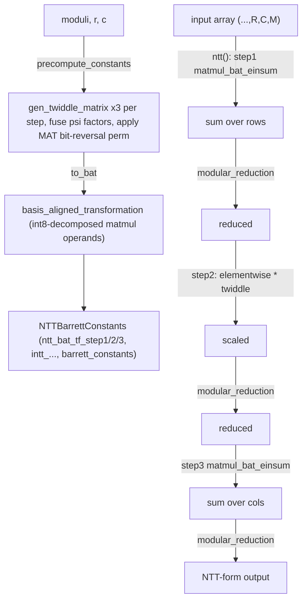

# jaxite.jaxite_ckks.ntt — matrix-decomposed NTT on TPU (CROSS-style BAT + Barrett reduction)

## Overview

This module is the TPU-accelerated counterpart to
[jaxite-jaxite_ckks-rns](jaxite-jaxite_ckks-rns.md)'s scalar reference NTT: instead of an O(N log N)
butterfly network expressed as sequential Python loops,
[`NTTBarrett`](../catalog/jaxite/jaxite_ckks/ntt.md#NTTBarrett) decomposes the length-`N` NTT into a
4-step algorithm over an `r × c` reshape (`N = r*c`), turning each step into a **matrix
multiplication** the TPU's MXU can execute efficiently, with twiddle factors and negacyclic `psi`
scaling pre-fused into the transformation matrices at precompute time. Multiplication results are
kept reduced via `barrett.modular_reduction`
(Barrett reduction, avoiding a division per multiply), and the whole scheme follows the CROSS paper
(arXiv:2501.07047) the module's own comments cite directly, including its "Memory Aligned
Transformation" (MAT) permutation baked into the twiddle matrices for TPU-friendly memory layout.

## Diagram

## Design rationale (why it's built this way)

**The NTT is a 3-matmul pipeline, not a butterfly network, specifically to target the MXU.**
[`NTTBarrett.precompute_constants`](../catalog/jaxite/jaxite_ckks/ntt.md#NTTBarrett.precompute_constants)
builds three twiddle matrices per modulus
([`gen_twiddle_matrix`](../catalog/jaxite/jaxite_ckks/math.md#gen_twiddle_matrix)) representing the
classic 4-step FFT decomposition (`N = r*c`: transform columns, twiddle-scale, transform rows); each
step becomes one `matmul_bat_einsum` call in
[`NTTBarrett.ntt`](../catalog/jaxite/jaxite_ckks/ntt.md#NTTBarrett.ntt)/
[`intt`](../catalog/jaxite/jaxite_ckks/ntt.md#NTTBarrett.intt) rather than a sequential butterfly —
trading the butterfly's better asymptotic op count for the MXU's much higher matmul throughput,
which the CROSS paper's approach is built around.

**Negacyclic `psi` scaling is fused directly into the twiddle matrices at precompute time, not
applied as a separate elementwise step.** The precompute loop multiplies specific columns of `tf1`/
`tf2` by powers of `psi` (the primitive `2n`-th root) before the matrices are ever used — this
folds what would otherwise be an extra per-call elementwise multiply into the one-time
precomputation, since the twiddle matrices are already a constant, and negacyclic scaling factors
are themselves constant once `moduli`/`r`/`c` are fixed.

**Basis-Aligned Transformation (`to_bat`) re-encodes the twiddle matrices for `int8`/MXU-native
matmul, and every step's output is Barrett-reduced immediately.**
[`to_bat`](../catalog/jaxite/jaxite_ckks/ntt.md#NTTBarrett.to_bat) calls
[`basis_aligned_transformation`](../catalog/jaxite/jaxite_ckks/bat_utils.md#basis_aligned_transformation)
to decompose each `uint64`-range twiddle value into 4-byte-shifted `uint8` components suitable for
TPU-native low-precision matmul; every subsequent
`matmul_bat_einsum` call is
immediately followed by
`barrett.modular_reduction` to bring
the summed products back into range before the next step — without this, accumulated products
across `r` or `c` terms would overflow even 64-bit accumulation for larger moduli.

## Entry points

- [`NTTBarrett.precompute_constants`](../catalog/jaxite/jaxite_ckks/ntt.md#NTTBarrett.precompute_constants) —
  reached once per `(moduli, r, c)` configuration to build the reusable
  [`NTTBarrettConstants`](../catalog/jaxite/jaxite_ckks/ntt.md#NTTBarrettConstants); expensive
  relative to a single transform, so callers construct it once and reuse the
  [`NTTBarrett`](../catalog/jaxite/jaxite_ckks/ntt.md#NTTBarrett) instance across many calls.
- [`NTTBarrett.ntt`](../catalog/jaxite/jaxite_ckks/ntt.md#NTTBarrett.ntt) /
  [`intt`](../catalog/jaxite/jaxite_ckks/ntt.md#NTTBarrett.intt) — the forward/backward transform
  entry points every CKKS kernel that needs NTT-domain conversion calls
  (`Mul`,
  [`Rescale`](../catalog/jaxite/jaxite_ckks/rescale.md)).
- [`NTTBarrettConstants.slice_moduli`](../catalog/jaxite/jaxite_ckks/ntt.md#NTTBarrettConstants.slice_moduli) —
  reached when a kernel needs the same precomputed constants restricted to a subset of moduli (e.g.
  after a rescale drops the last modulus), avoiding a full re-precompute.

## Mechanism (step-by-step)

1. **Precompute derives twiddle matrices per modulus.** For each `q` in `moduli`, a primitive root
   `psi` (via `ckks_math.root_of_unity`) yields `omega = psi^2`; three twiddle matrices
   (`tf1`/`tf2`/`tf3`, from
   [`gen_twiddle_matrix`](../catalog/jaxite/jaxite_ckks/math.md#gen_twiddle_matrix)) implement the
   4-step decomposition, with `psi` powers fused into specific columns for negacyclic correctness,
   and a bit-reversal permutation (MAT) applied per the CROSS paper.
2. **Matrices are stacked across moduli** (`transpose(1,2,0)`) and BAT-encoded
   ([`to_bat`](../catalog/jaxite/jaxite_ckks/ntt.md#NTTBarrett.to_bat)) into
   [`NTTBarrettConstants`](../catalog/jaxite/jaxite_ckks/ntt.md#NTTBarrettConstants), alongside
   [`barrett.precompute_barrett_constants`](../catalog/jaxite/jaxite_ckks/barrett.md#precompute_barrett_constants).
3. **Forward transform ([`NTTBarrett.ntt`](../catalog/jaxite/jaxite_ckks/ntt.md#NTTBarrett.ntt))
   runs three steps**: BAT matmul summing over rows, elementwise multiply by the step-2 twiddle
   factor, BAT matmul summing over columns — each followed by `barrett.modular_reduction`.
4. **Backward transform ([`NTTBarrett.intt`](../catalog/jaxite/jaxite_ckks/ntt.md#NTTBarrett.intt))
   mirrors this** with the inverse twiddle constants
   ([`intt_bat_tf_step1`](../catalog/jaxite/jaxite_ckks/ntt.md#NTTBarrettConstants.intt_bat_tf_step1)/
   [`intt_tf_step2`](../catalog/jaxite/jaxite_ckks/ntt.md#NTTBarrettConstants.intt_tf_step2)/
   [`intt_bat_tf_step3`](../catalog/jaxite/jaxite_ckks/ntt.md#NTTBarrettConstants.intt_bat_tf_step3)),
   pre-scaled by the modular inverses of `r`/`c` during precompute so no separate final
   normalization step is needed.

## Key data structures

- **[`NTTBarrettConstants`](../catalog/jaxite/jaxite_ckks/ntt.md#NTTBarrettConstants)** — frozen,
  pytree-registered: the six BAT-encoded/twiddle arrays for forward and inverse transforms, plus
  [`barrett_constants`](../catalog/jaxite/jaxite_ckks/ntt.md#NTTBarrettConstants.barrett_constants),
  [`r`](../catalog/jaxite/jaxite_ckks/ntt.md#NTTBarrettConstants.r)/
  [`c`](../catalog/jaxite/jaxite_ckks/ntt.md#NTTBarrettConstants.c) (static, in `tree_flatten`'s
  `aux_data`), and `moduli`.
- **[`NTTBarrett`](../catalog/jaxite/jaxite_ckks/ntt.md#NTTBarrett)** — a thin pytree-registered
  wrapper holding a single
  [`constants`](../catalog/jaxite/jaxite_ckks/ntt.md#NTTBarrett.constants) field, letting an
  `NTTBarrett` instance itself be a valid `jax.jit` argument (e.g. injected into
  `Mul`).

## Dynamics (design intent)

Because [`NTTBarrettConstants`](../catalog/jaxite/jaxite_ckks/ntt.md#NTTBarrettConstants) is a
pytree with `r`/`c` as static auxiliary data, changing the reshape factors triggers a
recompile of any `jax.jit`-wrapped function using it, while swapping in a different set of moduli
(same `r`/`c`) only changes traced leaf values — this lets
[`slice_moduli`](../catalog/jaxite/jaxite_ckks/ntt.md#NTTBarrettConstants.slice_moduli) produce a
smaller-modulus-count constants object cheaply without a shape-changing recompile downstream.

## Edge cases

- `jax.config.update("jax_enable_x64", True)` is set at module import time — CKKS's NTT arithmetic
  genuinely needs 64-bit intermediate products (`uint64` multiplication before Barrett reduction),
  so this module unconditionally opts the whole process into x64 mode, which can have global
  side effects on other JAX code sharing the process.

## Open questions

- Whether `precompute_constants`'s asymptotic cost (Python loops building twiddle matrices with
  Python-level modular exponentiation) becomes a bottleneck for very large `moduli`/`r`/`c`
  configurations is not addressed by this packet's cited subgraph — the design assumes precompute
  happens rarely relative to `ntt`/`intt` calls.

## See also
- [jaxite-jaxite_ckks-rns](jaxite-jaxite_ckks-rns.md) — `Ntt`, the scalar reference implementation
  this module's output is checked against.
- [jaxite-jaxite_ckks-mul](jaxite-jaxite_ckks-mul.md) — `Mul`, the primary consumer of
  `NTTBarrett` for domain conversion during ciphertext multiplication/relinearization.
- [jaxite-jaxite_ckks-rescale](jaxite-jaxite_ckks-rescale.md) — `Rescale`, another consumer needing
  NTT/INTT for its modulus-dropping arithmetic.
