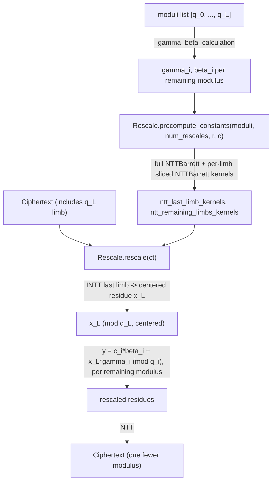

# jaxite.jaxite_ckks.rescale — approximate modulus switching to manage CKKS scale growth

## Overview

Every CKKS multiplication multiplies the plaintext scale as well as the message, so without
correction the scale grows unboundedly across a deep computation; **rescaling** drops the last RNS
modulus from the chain and divides the ciphertext by it, undoing that scale growth by
approximately one modulus's worth. `Rescale`
implements this via precomputed `gamma`/`beta` correction constants
([`_gamma_beta_calculation`](../catalog/jaxite/jaxite_ckks/rescale.md)) derived from CRT identities,
applied entirely in the NTT domain using
[`NTTBarrett`](../catalog/jaxite/jaxite_ckks/ntt.md#NTTBarrett) kernels sliced to the relevant
moduli subsets. It supports both single- and double-rescaling (dropping one or two moduli in one
kernel invocation) via
[`num_rescales`](../catalog/jaxite/jaxite_ckks/rescale.md#Rescale.num_rescales).

## Diagram

## Design rationale (why it's built this way)

**Rescaling is expressed as a linear correction (`gamma`/`beta`) rather than an explicit big-integer
division.** [`_gamma_beta_calculation`](../catalog/jaxite/jaxite_ckks/rescale.md)'s docstring derives
`y = (c_i - x_L) * q_L^{-1} = c_i * beta_i + x_L * gamma_i (mod q_i)` — i.e. the division by `q_L`
is folded into two precomputed per-modulus constants (`beta_i = q_L^{-1} mod q_i`,
`gamma_i = -q_L^{-1} mod q_i`), so the actual rescale operation on ciphertext data is just a
multiply-add per RNS limb, not a CRT-reconstruct-then-divide-then-re-split round trip.

**Rescaling only ever drops the *last* limb of the modulus chain, a documented restriction, not a
general modulus-switch.** The class docstring is explicit: "This kernel only supports rescaling the
last limb of the ciphertext's modulus chain" — CKKS's modulus chain is used in a fixed order
(largest-index modulus dropped first), so there's no need for a more general "drop an arbitrary
modulus" operation; restricting to the last limb keeps the kernel and its precomputed constants
simpler.

**Rescale kernels are sliced NTT kernels, not a single kernel applied to the whole ciphertext.**
[`Rescale.precompute_constants`](../catalog/jaxite/jaxite_ckks/rescale.md#Rescale.precompute_constants)
builds one full [`NTTBarrett`](../catalog/jaxite/jaxite_ckks/ntt.md#NTTBarrett) over all moduli,
then produces
[`ntt_last_limb_kernels`](../catalog/jaxite/jaxite_ckks/rescale.md#Rescale.ntt_last_limb_kernels)/
[`ntt_remaining_limbs_kernels`](../catalog/jaxite/jaxite_ckks/rescale.md#Rescale.ntt_remaining_limbs_kernels)
per rescale iteration via `slice_moduli` — because rescaling needs to INTT *only* the dropped limb
(to recover its centered residue `x_L`) while leaving the remaining limbs in NTT form throughout,
these two kernel sets serve genuinely different roles even though both wrap the same underlying
[`NTTBarrett`](../catalog/jaxite/jaxite_ckks/ntt.md#NTTBarrett) machinery.

## Entry points

- [`Rescale.precompute_constants`](../catalog/jaxite/jaxite_ckks/rescale.md#Rescale.precompute_constants) —
  reached once per `(moduli, num_rescales, r, c)` configuration to build every gamma/beta/threshold/
  NTT-kernel constant [`rescale`](../catalog/jaxite/jaxite_ckks/rescale.md#Rescale.rescale) needs.
- [`Rescale.rescale`](../catalog/jaxite/jaxite_ckks/rescale.md#Rescale.rescale) — reached after
  every ciphertext multiplication (and its relinearization) to bring the scale back down; the sole
  operational entry point of this module.

## Mechanism (step-by-step)

1. **Constant precomputation.**
   [`Rescale.precompute_constants`](../catalog/jaxite/jaxite_ckks/rescale.md#Rescale.precompute_constants)
   stores [`moduli`](../catalog/jaxite/jaxite_ckks/rescale.md#Rescale.moduli)/
   [`num_rescales`](../catalog/jaxite/jaxite_ckks/rescale.md#Rescale.num_rescales)/
   [`r`](../catalog/jaxite/jaxite_ckks/rescale.md#Rescale.r)/
   [`c`](../catalog/jaxite/jaxite_ckks/rescale.md#Rescale.c), builds a full
   [`NTTBarrett`](../catalog/jaxite/jaxite_ckks/ntt.md#NTTBarrett) over all moduli, then for each
   rescale iteration computes
   [`gammas_stacked`](../catalog/jaxite/jaxite_ckks/rescale.md#Rescale.gammas_stacked)/
   [`betas_stacked`](../catalog/jaxite/jaxite_ckks/rescale.md#Rescale.betas_stacked) (via
   `_gamma_beta_calculation`),
   [`thresholds`](../catalog/jaxite/jaxite_ckks/rescale.md#Rescale.thresholds) (the `(q+1)//2`
   centering midpoint per modulus), and sliced NTT kernels for the last vs. remaining limbs.
2. **[`rescale`](../catalog/jaxite/jaxite_ckks/rescale.md#Rescale.rescale) INTTs the last limb**
   using [`ntt_last_limb_kernels`](../catalog/jaxite/jaxite_ckks/rescale.md#Rescale.ntt_last_limb_kernels),
   recovering the residue `x_L` in coefficient form.
3. **The value is centered** using
   [`thresholds`](../catalog/jaxite/jaxite_ckks/rescale.md#Rescale.thresholds) — values above the
   modulus midpoint are treated as negative, giving a signed representative rather than a raw
   unsigned residue.
4. **Every remaining limb is corrected** using
   [`gammas_stacked`](../catalog/jaxite/jaxite_ckks/rescale.md#Rescale.gammas_stacked)/
   [`betas_stacked`](../catalog/jaxite/jaxite_ckks/rescale.md#Rescale.betas_stacked): `y_i = c_i *
   beta_i + x_L * gamma_i (mod q_i)`, computed directly on the NTT-form data (since `beta_i`/
   `gamma_i` are per-modulus scalars, this correction commutes with the NTT and needs no domain
   conversion for the remaining limbs).
5. **The result is a [`Ciphertext`](../catalog/jaxite/jaxite_ckks/rescale.md#Ciphertext) with one
   (or two, if `num_rescales=2`) fewer moduli**, still in NTT form.

## Key data structures

- **`Rescale`** —
  [`moduli`](../catalog/jaxite/jaxite_ckks/rescale.md#Rescale.moduli)/
  [`num_rescales`](../catalog/jaxite/jaxite_ckks/rescale.md#Rescale.num_rescales)/
  [`r`](../catalog/jaxite/jaxite_ckks/rescale.md#Rescale.r)/
  [`c`](../catalog/jaxite/jaxite_ckks/rescale.md#Rescale.c), plus precomputed
  [`gammas_stacked`](../catalog/jaxite/jaxite_ckks/rescale.md#Rescale.gammas_stacked)/
  [`betas_stacked`](../catalog/jaxite/jaxite_ckks/rescale.md#Rescale.betas_stacked)/
  [`thresholds`](../catalog/jaxite/jaxite_ckks/rescale.md#Rescale.thresholds)/
  [`ntt_last_limb_kernels`](../catalog/jaxite/jaxite_ckks/rescale.md#Rescale.ntt_last_limb_kernels)/
  [`ntt_remaining_limbs_kernels`](../catalog/jaxite/jaxite_ckks/rescale.md#Rescale.ntt_remaining_limbs_kernels).

## Dynamics (design intent)

Because `Rescale` is pytree-registered
(`tree_flatten`/`tree_unflatten`) and holds sliced
[`NTTBarrett`](../catalog/jaxite/jaxite_ckks/ntt.md#NTTBarrett) kernels rather than recomputing
them per call, a single precomputed `Rescale` instance amortizes its setup cost across every
multiplication in a program, mirroring the same one-time-precompute-then-reuse pattern seen in
`Mul`.

## Edge cases

- `_gamma_beta_calculation` asserts `len(moduli_list) > 1` — rescaling requires at least one modulus
  to remain after dropping the last, so a single-modulus ciphertext cannot be rescaled at all.
- Because rescaling always drops from the *end* of the modulus list, the order moduli are supplied
  in at scheme setup implicitly determines the rescale order for the entire computation — there is
  no way to rescale an arbitrary modulus out of sequence with this kernel.

## Open questions

- Whether `num_rescales=2` (double rescaling) shares the same asymptotic correction structure as
  two sequential single-rescales, or is a genuinely fused/optimized operation, is not fully
  resolved by this packet's cited subgraph alone.

## See also
- [jaxite-jaxite_ckks-ntt](jaxite-jaxite_ckks-ntt.md) — `NTTBarrett`, the domain-conversion kernel
  this module slices and reuses.
- [jaxite-jaxite_ckks-mul](jaxite-jaxite_ckks-mul.md) — `Mul`, whose multiplication output typically
  needs a rescale immediately afterward.
- [jaxite-jaxite_ckks-types](jaxite-jaxite_ckks-types.md) — `Ciphertext`, the type this module
  transforms in place (modulus count reduced by `num_rescales`).
