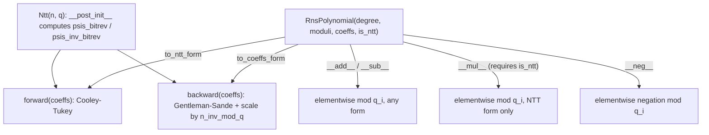

# jaxite.jaxite_ckks.rns — reference RNS polynomial arithmetic and scalar NTT

## Overview

This module is a from-scratch, pure-Python reference implementation of Residue Number System (RNS)
polynomial arithmetic over `Z[X]/(q, X^N+1)`, used as the ground truth CKKS's TPU-accelerated
kernels are checked against. [`Ntt`](../catalog/jaxite/jaxite_ckks/rns.md#Ntt.n) implements a
classic iterative Cooley-Tukey/Gentleman-Sande negacyclic NTT for a single prime modulus;
[`RnsPolynomial`](../catalog/jaxite/jaxite_ckks/rns.md#RnsPolynomial) wraps a polynomial's
per-modulus coefficient rows plus an
[`is_ntt`](../catalog/jaxite/jaxite_ckks/rns.md#RnsPolynomial.is_ntt) flag and implements
`+`/`-`/`*` directly in Python, dispatching correctness checks
([`_check_compatible`](../catalog/jaxite/jaxite_ckks/rns.md#RnsPolynomial._check_compatible)) before
every operation.

## Diagram

## Design rationale (why it's built this way)

**`_primitive_root` searches by trial rather than using a known-generator table.**
[`_primitive_root`](../catalog/jaxite/jaxite_ckks/rns.md#_primitive_root) iterates candidate values
`t` from 2 upward, testing `t^k mod q` via repeated squaring
([`_mod_exp`](../catalog/jaxite/jaxite_ckks/rns.md#_mod_exp)) until it finds one whose order is
exactly `m` — appropriate for a reference/test implementation where correctness and simplicity
matter more than the (one-time, precompute-only) search cost.

**Multiplication requires both operands already in NTT form; there is no automatic conversion.**
[`RnsPolynomial.__mul__`](../catalog/jaxite/jaxite_ckks/rns.md#RnsPolynomial.__mul__) raises
`ValueError` if either operand's
[`is_ntt`](../catalog/jaxite/jaxite_ckks/rns.md#RnsPolynomial.is_ntt) flag is false — polynomial
multiplication mod `X^N+1` is only a cheap elementwise product in NTT form; requiring the caller to
convert explicitly (via
[`to_ntt_form`](../catalog/jaxite/jaxite_ckks/rns.md#RnsPolynomial.to_ntt_form)) keeps the cost of
domain conversion visible rather than silently hidden inside every multiply.

**Compatibility checking is a single shared helper, called by every binary operator.**
[`_check_compatible`](../catalog/jaxite/jaxite_ckks/rns.md#RnsPolynomial._check_compatible)
validates degree, moduli list (length and per-element equality), coefficient-row count, and
`is_ntt` state match before
[`__add__`](../catalog/jaxite/jaxite_ckks/rns.md#RnsPolynomial.__add__)/
[`__sub__`](../catalog/jaxite/jaxite_ckks/rns.md#RnsPolynomial.__sub__)/
[`__mul__`](../catalog/jaxite/jaxite_ckks/rns.md#RnsPolynomial.__mul__) proceed — this centralizes
every "these two polynomials must actually be compatible" check in one place rather than
duplicating validation logic three times.

## Entry points

- [`gen_rns_polynomial`](../catalog/jaxite/jaxite_ckks/rns.md#gen_rns_polynomial) /
  [`gen_rns_polynomial_from_jnp_array`](../catalog/jaxite/jaxite_ckks/rns.md#gen_rns_polynomial_from_jnp_array) —
  the constructors most test code uses to build an
  [`RnsPolynomial`](../catalog/jaxite/jaxite_ckks/rns.md#RnsPolynomial) from raw coefficients.
- [`RnsPolynomial.to_ntt_form`](../catalog/jaxite/jaxite_ckks/rns.md#RnsPolynomial.to_ntt_form)/
  [`to_coeffs_form`](../catalog/jaxite/jaxite_ckks/rns.md#RnsPolynomial.to_coeffs_form) — reached
  whenever a polynomial must switch domains before an operation that requires a specific form.
- [`Ntt.forward`](../catalog/jaxite/jaxite_ckks/rns.md#Ntt.n)/`backward` — the low-level per-modulus
  transform [`RnsPolynomial`](../catalog/jaxite/jaxite_ckks/rns.md#RnsPolynomial)'s domain-switch
  methods call, one modulus at a time.

## Mechanism (step-by-step)

1. **`Ntt(n, q).__post_init__`** validates `n` is a power of two and `q ≡ 1 (mod 2n)`, computes
   [`n_inv_mod_q`](../catalog/jaxite/jaxite_ckks/rns.md#Ntt.n_inv_mod_q), finds a primitive `2n`-th
   root of unity `psi` via
   [`_primitive_root`](../catalog/jaxite/jaxite_ckks/rns.md#_primitive_root), and precomputes
   bit-reversed power tables
   [`psis_bitrev`](../catalog/jaxite/jaxite_ckks/rns.md#Ntt.psis_bitrev)/
   [`psis_inv_bitrev`](../catalog/jaxite/jaxite_ckks/rns.md#Ntt.psis_inv_bitrev).
2. **Forward transform** (`Ntt.forward`) runs the iterative Cooley-Tukey butterfly using
   [`psis_bitrev`](../catalog/jaxite/jaxite_ckks/rns.md#Ntt.psis_bitrev), converting coefficient
   form to NTT (evaluation) form negacyclically.
3. **Backward transform** (`Ntt.backward`) runs Gentleman-Sande using `psis_inv_bitrev`, then
   scales every output by [`n_inv_mod_q`](../catalog/jaxite/jaxite_ckks/rns.md#Ntt.n_inv_mod_q) to
   normalize.
4. **[`RnsPolynomial.to_ntt_form`](../catalog/jaxite/jaxite_ckks/rns.md#RnsPolynomial.to_ntt_form)/
   [`to_coeffs_form`](../catalog/jaxite/jaxite_ckks/rns.md#RnsPolynomial.to_coeffs_form) apply the
   per-modulus [`Ntt`](../catalog/jaxite/jaxite_ckks/rns.md#Ntt.n) transform to every RNS residue
   row independently**, toggling
   [`is_ntt`](../catalog/jaxite/jaxite_ckks/rns.md#RnsPolynomial.is_ntt) and short-circuiting if
   already in the target form.
5. **Binary operators check compatibility, then operate elementwise per modulus**:
   [`__add__`](../catalog/jaxite/jaxite_ckks/rns.md#RnsPolynomial.__add__)/
   [`__sub__`](../catalog/jaxite/jaxite_ckks/rns.md#RnsPolynomial.__sub__) work in either form;
   [`__mul__`](../catalog/jaxite/jaxite_ckks/rns.md#RnsPolynomial.__mul__) requires NTT form on both
   sides.

## Key data structures

- **[`RnsPolynomial`](../catalog/jaxite/jaxite_ckks/rns.md#RnsPolynomial)** —
  [`degree`](../catalog/jaxite/jaxite_ckks/rns.md#RnsPolynomial), `moduli` (list of primes),
  `coeffs` (list of per-modulus coefficient lists),
  [`is_ntt`](../catalog/jaxite/jaxite_ckks/rns.md#RnsPolynomial.is_ntt) (defaults `False`); a plain
  Python dataclass, not JAX-traced.
- **[`Ntt`](../catalog/jaxite/jaxite_ckks/rns.md#Ntt.n)** —
  [`n`](../catalog/jaxite/jaxite_ckks/rns.md#Ntt.n)/[`q`](../catalog/jaxite/jaxite_ckks/rns.md#Ntt.q)
  plus derived
  [`n_inv_mod_q`](../catalog/jaxite/jaxite_ckks/rns.md#Ntt.n_inv_mod_q)/
  [`psis_bitrev`](../catalog/jaxite/jaxite_ckks/rns.md#Ntt.psis_bitrev)/
  [`psis_inv_bitrev`](../catalog/jaxite/jaxite_ckks/rns.md#Ntt.psis_inv_bitrev); one instance per
  RNS prime.
- **`RnsParams`** — `degree`, `moduli`, and derived `ntt_params` (one `Ntt` per modulus) — the
  bundle a caller constructs once per RNS configuration.

## Dynamics (design intent)

Every method in this module operates on plain Python `list`s, in place where documented (`Ntt`'s
transforms mutate `coeffs` directly) — this module exists purely as a slow-but-obviously-correct
reference, so no attention is paid to vectorization; its entire purpose is to be checked against
by the TPU-accelerated `NTTBarrett`/`Mul` kernels' test suites.

## Edge cases

- [`Ntt.__post_init__`](../catalog/jaxite/jaxite_ckks/rns.md#Ntt.__post_init__) raises if `n` isn't
  a power of two or if `q % (2n) != 1` — both are hard prerequisites for the negacyclic NTT to have
  a valid primitive root, not soft warnings.
- [`RnsPolynomial._check_compatible`](../catalog/jaxite/jaxite_ckks/rns.md#RnsPolynomial._check_compatible)
  checks `is_ntt` equality as part of compatibility — adding two polynomials where one is in NTT
  form and the other isn't raises, rather than implicitly converting one side.

## Open questions

- Whether this module's `Ntt`/`RnsPolynomial` reference implementation and `ntt_cpu`'s
  standalone functions (used directly by [jaxite-jaxite_ckks-encode](jaxite-jaxite_ckks-encode.md)/
  [jaxite-jaxite_ckks-encrypt](jaxite-jaxite_ckks-encrypt.md)) are meant to be consolidated, or are
  intentionally two independent reference paths, is not addressed by this packet's cited subgraph.

## See also
- [jaxite-jaxite_ckks-ntt](jaxite-jaxite_ckks-ntt.md) — `NTTBarrett`, the TPU-accelerated NTT this
  module's `Ntt` class serves as a correctness reference for.
- [jaxite-jaxite_ckks-types](jaxite-jaxite_ckks-types.md) — `Ciphertext`/`Plaintext`, the
  JAX-traced analogues of this module's plain-Python `RnsPolynomial`.
