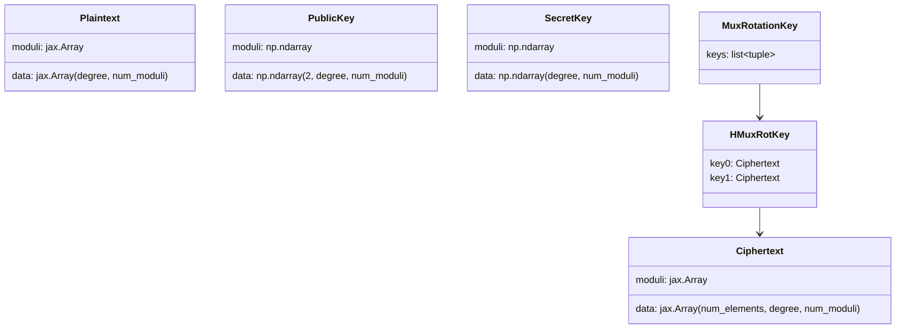

# jaxite.jaxite_ckks.types — the CKKS ciphertext/plaintext/key pytree vocabulary

## Overview

This module defines the CKKS scheme's core value types, all as JAX pytree-registered dataclasses so
they can flow directly through `jax.jit`/`jax.vmap` boundaries: a
[`Ciphertext`](../catalog/jaxite/jaxite_ckks/types.md#Ciphertext) (a stack of RNS polynomials plus
its [`moduli`](../catalog/jaxite/jaxite_ckks/types.md#Ciphertext.moduli)), a `Plaintext` (one RNS
polynomial), `PublicKey`/`SecretKey`/`EvaluationKeys` (plain numpy-backed, not pytree-registered —
these never need to flow through a trace), and `HMuxRotKey`/`MuxRotationKey` (the rotation-key
shapes used by CKKS's homomorphic slot-rotation mechanism). Every other CKKS module — encode,
encrypt, mul, rescale — imports these types as its shared vocabulary rather than defining its own.

## Diagram

## Design rationale (why it's built this way)

**`Ciphertext`/`Plaintext` are pytree-registered; `PublicKey`/`SecretKey`/`EvaluationKeys` are
not.** Ciphertexts and plaintexts are the values that actually flow through traced
`encode`/
[`encrypt`](../catalog/jaxite/jaxite_ckks/encrypt.md#Encrypt.encrypt)/
[`decode`](../catalog/jaxite/jaxite_ckks/encode.md#Decode.decode)/
[`decrypt`](../catalog/jaxite/jaxite_ckks/encrypt.md#Decrypt.decrypt)/
[`mul`](../catalog/jaxite/jaxite_ckks/mul.md#MulPlaintextCiphertextBase.mul)/
[`relinearize`](../catalog/jaxite/jaxite_ckks/mul.md#Mul.relinearize) computations, so they need
`tree_flatten`/`tree_unflatten` to be valid `jax.jit` arguments/return values; keys are constructed
once, held as plain Python objects on the encrypt/decrypt kernel instances, and never themselves
traced.

**`data`'s shape convention encodes the ciphertext degree directly in the leading axis.** A
[`Ciphertext`](../catalog/jaxite/jaxite_ckks/types.md#Ciphertext)'s
[`data`](../catalog/jaxite/jaxite_ckks/types.md#Ciphertext.data) is `(num_elements, degree,
num_moduli)` — 2 elements for a fresh/relinearized ciphertext, 3 immediately after
[`tensor_multiply`](../catalog/jaxite/jaxite_ckks/mul.md#Mul.tensor_multiply) before
relinearization brings it back down to 2 — so the same
[`Ciphertext`](../catalog/jaxite/jaxite_ckks/types.md#Ciphertext) type represents both states, with
`num_elements` as the discriminator rather than two distinct dataclasses.

**`HMuxRotKey` bundles exactly two ciphertexts because CKKS slot rotation is implemented via a
homomorphic multiplexer, not a direct automorphism-key application.** The docstring specifies
`key0`/[`key1`](../catalog/jaxite/jaxite_ckks/types.md#HMuxRotKey.key1) encrypt `P * beta *
sk(X^{5^{-j}})` and `P * beta` respectively under the *destination* key — this pair is what one
step of the "HMuxRot" (homomorphic-mux-rotate) protocol needs; `MuxRotationKey` then collects one
such pair per bit of the rotation index, so an arbitrary rotation amount can be composed from
`log2(num_slots)` conditional steps.

## Entry points

- [`Ciphertext`](../catalog/jaxite/jaxite_ckks/types.md#Ciphertext) — the type threaded through
  essentially every CKKS operation:
  [`encrypt`](../catalog/jaxite/jaxite_ckks/encrypt.md#Encrypt.encrypt),
  [`decrypt`](../catalog/jaxite/jaxite_ckks/encrypt.md#Decrypt.decrypt),
  [`mul`](../catalog/jaxite/jaxite_ckks/mul.md#MulPlaintextCiphertextSimple.mul),
  [`relinearize`](../catalog/jaxite/jaxite_ckks/mul.md#Mul.relinearize),
  [`rescale`](../catalog/jaxite/jaxite_ckks/rescale.md#Rescale.rescale),
  [`conjugate`](../catalog/jaxite/jaxite_ckks/conjugate.md#Conjugation.conjugate),
  [`hmuxrot`](../catalog/jaxite/jaxite_ckks/blind_rotate.md#BlindRotation.hmuxrot).
- [`Ciphertext.data`](../catalog/jaxite/jaxite_ckks/types.md#Ciphertext.data)/
  [`moduli`](../catalog/jaxite/jaxite_ckks/types.md#Ciphertext.moduli) — read directly by every
  kernel method that needs the raw RNS polynomial data rather than the wrapper.
- [`Plaintext.data`](../catalog/jaxite/jaxite_ckks/types.md#Plaintext.data) — produced by
  [`Decode.decode`](../catalog/jaxite/jaxite_ckks/encode.md#Decode.decode)'s counterpart
  `Encode.encode` and consumed by [`Encrypt.encrypt`](../catalog/jaxite/jaxite_ckks/encrypt.md#Encrypt.encrypt).

## Mechanism (step-by-step)

1. **[`Ciphertext`](../catalog/jaxite/jaxite_ckks/types.md#Ciphertext)/`Plaintext` are constructed**
   by the encode/encrypt kernels from raw `jax.Array` RNS-polynomial data plus a `moduli` array.
2. **[`Ciphertext.tree_flatten`](../catalog/jaxite/jaxite_ckks/types.md#Ciphertext.tree_flatten)/`tree_unflatten`**
   (registered via `jax.tree_util.register_pytree_node_class`) let both types pass through
   `jax.jit`/`jax.vmap` — `data`/`moduli` are treated as leaves, no static auxiliary data is needed
   since shape/dtype fully determine tracing behavior.
3. **Downstream kernels read [`Ciphertext.data`](../catalog/jaxite/jaxite_ckks/types.md#Ciphertext.data)/
   [`moduli`](../catalog/jaxite/jaxite_ckks/types.md#Ciphertext.moduli) directly** rather than
   through any accessor indirection — e.g. `Mul.tensor_multiply` reads `ct1.data[0]`/`ct1.data[1]`
   for the ciphertext's two polynomial components.
4. **[`HMuxRotKey`](../catalog/jaxite/jaxite_ckks/types.md#HMuxRotKey.key0)/`MuxRotationKey`
   compose the same [`Ciphertext`](../catalog/jaxite/jaxite_ckks/types.md#Ciphertext) type** into
   the key-material shapes
   [`gen_hmuxrot_key`](../catalog/jaxite/jaxite_ckks/key_gen.md#gen_hmuxrot_key) produces and
   [`BlindRotation.hmuxrot`](../catalog/jaxite/jaxite_ckks/blind_rotate.md#BlindRotation.hmuxrot)
   consumes.

## Key data structures

- **[`Ciphertext`](../catalog/jaxite/jaxite_ckks/types.md#Ciphertext)** —
  [`data`](../catalog/jaxite/jaxite_ckks/types.md#Ciphertext.data) `(num_elements, degree,
  num_moduli)`, [`moduli`](../catalog/jaxite/jaxite_ckks/types.md#Ciphertext.moduli); mutable
  (non-frozen) dataclass, pytree-registered.
- **`Plaintext`** — [`data`](../catalog/jaxite/jaxite_ckks/types.md#Plaintext.data) `(degree,
  num_moduli)`, `moduli`; same registration pattern as `Ciphertext`.
- **[`HMuxRotKey`](../catalog/jaxite/jaxite_ckks/types.md#HMuxRotKey.key0)** — frozen,
  pytree-registered; [`key0`](../catalog/jaxite/jaxite_ckks/types.md#HMuxRotKey.key0)/
  [`key1`](../catalog/jaxite/jaxite_ckks/types.md#HMuxRotKey.key1), both
  [`Ciphertext`](../catalog/jaxite/jaxite_ckks/types.md#Ciphertext)s.

## Dynamics (design intent)

Because [`Ciphertext`](../catalog/jaxite/jaxite_ckks/types.md#Ciphertext)/`Plaintext` carry their
`moduli` alongside the data (rather than the caller tracking moduli out-of-band), every kernel
method can validate compatibility (e.g. moduli-prefix checks in
[`Encrypt.encrypt`](../catalog/jaxite/jaxite_ckks/encrypt.md#Encrypt.encrypt)/
[`Decrypt.decrypt`](../catalog/jaxite/jaxite_ckks/encrypt.md#Decrypt.decrypt)) purely from the
values passed in, without a separate scheme-parameters object having to be threaded through every
call.

## Edge cases

- `Ciphertext`/`Plaintext` are *not* frozen dataclasses (unlike `PublicKey`/`SecretKey`) — nothing
  prevents in-place field mutation, which matters for pytree-transform correctness if any code
  path were to mutate a traced value in place rather than constructing a new instance.

## Open questions

- Whether `EvaluationKeys` (in this module) and the `mul.md`-defined `EvaluationKeys` (used by
  `Mul.relinearize`) are the same type or two independently-defined types with the same name isn't
  resolved by this packet's cited subgraph alone.

## See also
- [jaxite-jaxite_ckks-encode](jaxite-jaxite_ckks-encode.md) — `Encode`/`Decode`, the kernels that
  construct/consume `Plaintext`.
- [jaxite-jaxite_ckks-encrypt](jaxite-jaxite_ckks-encrypt.md) — `Encrypt`/`Decrypt`, the kernels
  that construct/consume `Ciphertext`.
- [jaxite-jaxite_ckks-mul](jaxite-jaxite_ckks-mul.md) — `Mul`, the kernel operating most heavily on
  the 2-vs-3-element `Ciphertext` shape distinction.
