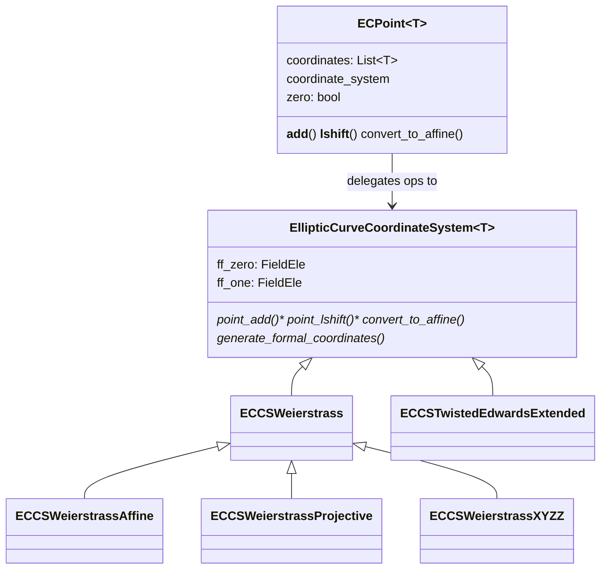

# jaxite_ec.algorithm.elliptic_curve — pluggable coordinate systems for elliptic-curve points

## Overview

This module is the scalar reference implementation of elliptic-curve point arithmetic, generic over
both the *coordinate system* (Affine, Projective, XYZZ, Twisted Edwards Extended, inverted-twisted)
and the underlying field-element representation
([`FieldEle`](../catalog/jaxite_ec/algorithm/elliptic_curve.md#FieldEle), an alias for
[jaxite_ec-algorithm-finite_field](jaxite_ec-algorithm-finite_field.md)'s `FiniteFieldElement`).
[`ECPoint`](../catalog/jaxite_ec/algorithm/elliptic_curve.md#ECPoint) is a thin, coordinate-system-
agnostic container; each concrete `EllipticCurveCoordinateSystem` subclass (
[`ECCSWeierstrass`](../catalog/jaxite_ec/algorithm/elliptic_curve.md#ECCSWeierstrass) and its
Affine/Projective/XYZZ children, `ECCSTwistedEdwardsExtended`) supplies the actual
point-add/doubling formulas for that representation. This module is the
"what should the answer be" reference the TPU-vectorized packed-point kernels in
`jaxite_ec.elliptic_curve` (top-level, outside `algorithm/`) are validated against.

## Diagram

## Design rationale (why it's built this way)

**`ECPoint` holds no arithmetic itself — every operator delegates to its `coordinate_system`.**
[`ECPoint.__add__`](../catalog/jaxite_ec/algorithm/elliptic_curve.md#ECPoint.__add__)/
[`__lshift__`](../catalog/jaxite_ec/algorithm/elliptic_curve.md#ECPoint.__lshift__) simply call
`self.coordinate_system.point_add(self, other)`/`point_lshift(self, shift)` — this is the strategy
pattern: a point is just `(coordinates, coordinate_system)`, and swapping the coordinate system
(e.g. via [`convert_to_affine`](../catalog/jaxite_ec/algorithm/elliptic_curve.md#EllipticCurveCoordinateSystem.convert_to_affine))
changes what `+`/`<<` actually compute without the point object's own type changing.

**Each coordinate system encodes its zero/identity element as `FieldEle(0)`/`FieldEle(1)` derived
from the curve's prime, computed once at coordinate-system construction, not per point.**
`EllipticCurveCoordinateSystem.__init__` builds
[`ff_zero`](../catalog/jaxite_ec/algorithm/elliptic_curve.md#EllipticCurveCoordinateSystem.ff_zero)/
[`ff_one`](../catalog/jaxite_ec/algorithm/elliptic_curve.md#EllipticCurveCoordinateSystem.ff_one)
from `config['prime']` — every point generated by that coordinate system
([`generate_point`](../catalog/jaxite_ec/algorithm/elliptic_curve.md#EllipticCurveCoordinateSystem.generate_point))
shares this same zero/one, so constants don't need to be re-derived per point.

**Point addition dispatches to a doubling formula when the two operands are equal, rather than
requiring the caller to call a separate "double" method.**
[`ECCSWeierstrassAffine.point_add`](../catalog/jaxite_ec/algorithm/elliptic_curve.md#ECCSWeierstrassAffine.point_add)
(and the Projective/XYZZ analogues) checks `if point_a == point_b` and calls
[`double_general`](../catalog/jaxite_ec/algorithm/elliptic_curve.md#ECCSWeierstrassAffine.double_general)
instead of
[`add_general`](../catalog/jaxite_ec/algorithm/elliptic_curve.md#ECCSWeierstrassAffine.add_general)
— the standard elliptic-curve-arithmetic special case where the point-addition formula has a
division-by-zero singularity at `P == P`, requiring the separate tangent-line doubling formula
instead.

**Twisted Edwards coordinates carry an explicit twist/untwist pair rather than being a wholly
separate curve model.** [`ECCSTwistedEdwardsExtended.twist`](../catalog/jaxite_ec/algorithm/elliptic_curve.md#ECCSTwistedEdwardsExtended.twist)/
[`untwist`](../catalog/jaxite_ec/algorithm/elliptic_curve.md#ECCSTwistedEdwardsExtended.untwist)
convert between the Weierstrass curve's points and their twisted-Edwards-isomorphic representation
— since Edwards addition formulas are unified (no separate doubling case, no exceptional points),
converting into this form and back is worth the twist/untwist cost for algorithms that benefit from
branch-free addition (e.g. MSM inner loops).

## Entry points

- [`EllipticCurveCoordinateSystem.generate_point`](../catalog/jaxite_ec/algorithm/elliptic_curve.md#EllipticCurveCoordinateSystem.generate_point) —
  reached to construct an [`ECPoint`](../catalog/jaxite_ec/algorithm/elliptic_curve.md#ECPoint) from
  raw coordinates under a given coordinate system.
- [`ECPoint.__add__`](../catalog/jaxite_ec/algorithm/elliptic_curve.md#ECPoint.__add__) /
  [`__lshift__`](../catalog/jaxite_ec/algorithm/elliptic_curve.md#ECPoint.__lshift__) — the
  point-addition and scalar-doubling-shift operators every curve algorithm (including the Pippenger
  MSM in [jaxite_ec-pippenger](jaxite_ec-pippenger.md)) is built from.
- [`EllipticCurveCoordinateSystem.convert_to_affine`](../catalog/jaxite_ec/algorithm/elliptic_curve.md#EllipticCurveCoordinateSystem.convert_to_affine) —
  reached whenever a result needs to be compared/printed/serialized in the canonical
  `(x, y)` affine form, regardless of which internal coordinate system produced it.

## Mechanism (step-by-step)

1. **A coordinate system is constructed from a curve config** (prime, curve coefficients,
   generator) — [`ECCSWeierstrass`](../catalog/jaxite_ec/algorithm/elliptic_curve.md#ECCSWeierstrass)'s
   `__init__` derives
   [`ff_zero`](../catalog/jaxite_ec/algorithm/elliptic_curve.md#EllipticCurveCoordinateSystem.ff_zero)/
   [`ff_one`](../catalog/jaxite_ec/algorithm/elliptic_curve.md#EllipticCurveCoordinateSystem.ff_one),
   and subclasses like
   [`ECCSWeierstrassProjective`](../catalog/jaxite_ec/algorithm/elliptic_curve.md#ECCSWeierstrassProjective.a)
   further derive
   [`a`](../catalog/jaxite_ec/algorithm/elliptic_curve.md#ECCSWeierstrassProjective.a)/`b`/
   [`generator`](../catalog/jaxite_ec/algorithm/elliptic_curve.md#ECCSWeierstrassProjective.generator).
2. **A point is created** via
   [`generate_point`](../catalog/jaxite_ec/algorithm/elliptic_curve.md#EllipticCurveCoordinateSystem.generate_point),
   which calls the coordinate system's
   [`generate_formal_coordinates`](../catalog/jaxite_ec/algorithm/elliptic_curve.md#EllipticCurveCoordinateSystem.generate_formal_coordinates)
   to normalize raw `int`/`FieldEle` inputs into a coordinate list of the right length/type for that
   system.
3. **[`ECPoint.__add__`](../catalog/jaxite_ec/algorithm/elliptic_curve.md#ECPoint.__add__) delegates
   to [`point_add`](../catalog/jaxite_ec/algorithm/elliptic_curve.md#EllipticCurveCoordinateSystem.point_add)**,
   which checks for the zero element and the equal-operands (doubling) case before applying the
   coordinate-system-specific
   [`add_general`](../catalog/jaxite_ec/algorithm/elliptic_curve.md#ECCSWeierstrassProjective.add_general)/
   [`double_general`](../catalog/jaxite_ec/algorithm/elliptic_curve.md#ECCSWeierstrassProjective.double_general)
   formula.
4. **[`ECPoint.__lshift__`](../catalog/jaxite_ec/algorithm/elliptic_curve.md#ECPoint.__lshift__)
   delegates to [`point_lshift`](../catalog/jaxite_ec/algorithm/elliptic_curve.md#ECCSWeierstrassProjective.point_lshift)**,
   which repeatedly doubles the point — the scalar-multiplication-by-power-of-2 primitive every
   binary-method scalar multiplication (and Pippenger's window-merge step) is built from.
5. **[`convert_to_affine`](../catalog/jaxite_ec/algorithm/elliptic_curve.md#ECCSWeierstrassProjective.convert_to_affine)
   normalizes a point back to `(x, y)`** by dividing through by the coordinate system's homogenizing
   factor (e.g. `Z` for projective, requiring a field inversion) — this is the one operation every
   coordinate system must support to make results comparable across systems.

## Key data structures

- **[`ECPoint`](../catalog/jaxite_ec/algorithm/elliptic_curve.md#ECPoint)`[T]`** — `coordinates:
  List[T]`, `coordinate_system`, `zero: bool`; generic over the field-element type `T`.
- **[`CoordinateSystemType`](../catalog/jaxite_ec/algorithm/elliptic_curve.md#CoordinateSystemType)** —
  an enum (`NONE`,
  [`NONE`](../catalog/jaxite_ec/algorithm/elliptic_curve.md#CoordinateSystemType.NONE) is the
  uninitialized default, plus `WEIERSTRASS_AFFINE`/`_PROJECTIVE`/`_XYZZ`) tagging which formulas a
  given `ECPoint` currently uses.
- **[`ECCSTwistedEdwardsExtended`](../catalog/jaxite_ec/algorithm/elliptic_curve.md#ECCSTwistedEdwardsExtended.alpha)** —
  carries curve-specific twist constants
  ([`alpha`](../catalog/jaxite_ec/algorithm/elliptic_curve.md#ECCSTwistedEdwardsExtended.alpha),
  [`d`](../catalog/jaxite_ec/algorithm/elliptic_curve.md#ECCSTwistedEdwardsExtended.d),
  [`s`](../catalog/jaxite_ec/algorithm/elliptic_curve.md#ECCSTwistedEdwardsExtended.s),
  [`t`](../catalog/jaxite_ec/algorithm/elliptic_curve.md#ECCSTwistedEdwardsExtended.t),
  [`mb`](../catalog/jaxite_ec/algorithm/elliptic_curve.md#ECCSTwistedEdwardsExtended.mb)) used by
  [`twist`](../catalog/jaxite_ec/algorithm/elliptic_curve.md#ECCSTwistedEdwardsExtended.twist)/
  [`untwist`](../catalog/jaxite_ec/algorithm/elliptic_curve.md#ECCSTwistedEdwardsExtended.untwist).

## Dynamics (design intent)

Because [`ECPoint.__eq__`](../catalog/jaxite_ec/algorithm/elliptic_curve.md#ECPoint.__eq__) compares
`coordinates` directly (not after normalizing to affine), two points that are mathematically equal
but stored with different homogenizing factors (e.g. two different `Z` values in projective
coordinates representing the same affine point) will *not* compare equal — callers must
[`convert_to_affine`](../catalog/jaxite_ec/algorithm/elliptic_curve.md#EllipticCurveCoordinateSystem.convert_to_affine)
before comparing points from different computation paths.

## Edge cases

- [`ECCSWeierstrassProjective.add_z2_eq_1`](../catalog/jaxite_ec/algorithm/elliptic_curve.md#ECCSWeierstrassProjective.add_z2_eq_1)
  is a special-cased "mixed addition" formula requiring one operand's `Z` coordinate to be exactly
  [`ff_one`](../catalog/jaxite_ec/algorithm/elliptic_curve.md#EllipticCurveCoordinateSystem.ff_one) —
  it raises `NotImplementedError` if neither operand satisfies this, so it is not a general-purpose
  addition path.
- [`ECPoint.__lshift__`](../catalog/jaxite_ec/algorithm/elliptic_curve.md#ECPoint.__lshift__)
  short-circuits to `self.copy()` when the point [`is_zero`](../catalog/jaxite_ec/algorithm/elliptic_curve.md#ECPoint)
  — doubling the identity element repeatedly is a no-op, handled explicitly rather than falling
  through to the general doubling formula (which may not handle the zero point correctly).

## Open questions

- Whether [`TwistedInvertedXYZ`](../catalog/jaxite_ec/algorithm/elliptic_curve.md) (declared but not
  in this packet's cited subgraph in depth) is a fully independent coordinate system or an
  optimization layered on top of `ECCSTwistedEdwardsExtended` is not resolved by this packet's
  subgraph.

## See also
- [jaxite_ec-algorithm-finite_field](jaxite_ec-algorithm-finite_field.md) — `FiniteFieldElement`
  (aliased here as `FieldEle`), the coordinate value type every coordinate system operates on.
- [jaxite_ec-elliptic_curve_test](jaxite_ec-elliptic_curve_test.md) — the test suite that computes
  ground-truth results using this module's `ECCSWeierstrassXYZZ` to validate the TPU-packed kernels.
- [jaxite_ec-pippenger](jaxite_ec-pippenger.md) — `MSMPippenger`, which composes many
  `point_add`/`point_lshift` calls (via the packed TPU kernels, not this reference layer directly)
  into a multi-scalar-multiplication.
