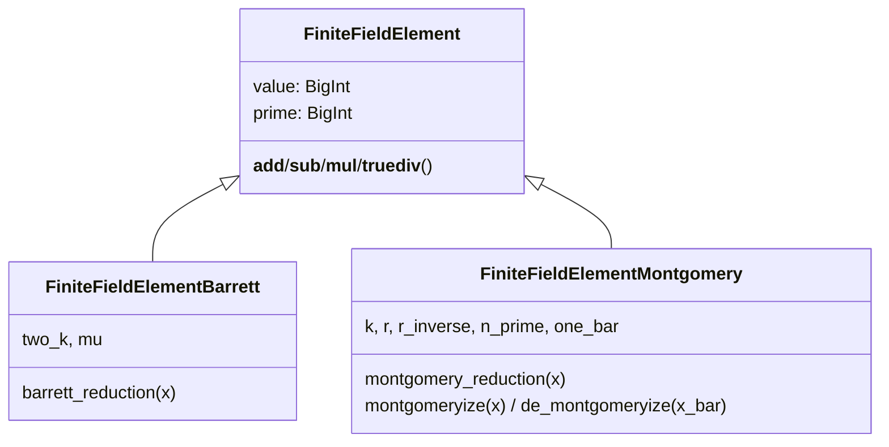

# jaxite_ec.algorithm.finite_field — pluggable modular-reduction strategies (naive/Barrett/Montgomery)

## Overview

This module is the scalar, arbitrary-precision reference implementation of a prime-field element,
used as the ground truth the TPU-vectorized big-integer kernels elsewhere in `jaxite_ec` are
checked against. [`FiniteFieldElement`](../catalog/jaxite_ec/algorithm/finite_field.md#FiniteFieldElement.__init__)
does modular arithmetic the direct way (Python's `%` operator via
[`BigInt`](../catalog/jaxite_ec/algorithm/finite_field.md#BigInt)'s GMP-backed big-integer type).
[`FiniteFieldElementBarrett`](../catalog/jaxite_ec/algorithm/finite_field.md#FiniteFieldElementBarrett.__init__)
and
[`FiniteFieldElementMontgomery`](../catalog/jaxite_ec/algorithm/finite_field.md#FiniteFieldElementMontgomery.__init__)
subclass it to instead use Barrett reduction (division-free reduction via a precomputed reciprocal
`mu`) and Montgomery reduction (division-free reduction via a power-of-two `r`) respectively —
these are the same two techniques used by the TPU-side kernels for the actual accelerated
computation, so this module doubles as executable documentation of what those kernels' scalar math
is supposed to compute.

## Diagram

## Design rationale (why it's built this way)

**Every arithmetic operator is overridden per subclass rather than centralizing reduction behind a
single hook.** [`FiniteFieldElementBarrett`](../catalog/jaxite_ec/algorithm/finite_field.md#FiniteFieldElementBarrett.__add__)/
[`FiniteFieldElementMontgomery`](../catalog/jaxite_ec/algorithm/finite_field.md#FiniteFieldElementMontgomery.__add__)
each reimplement
[`__add__`](../catalog/jaxite_ec/algorithm/finite_field.md#FiniteFieldElement.__add__)/
[`__sub__`](../catalog/jaxite_ec/algorithm/finite_field.md#FiniteFieldElement.__sub__)/
[`__mul__`](../catalog/jaxite_ec/algorithm/finite_field.md#FiniteFieldElement.__mul__)/
[`__truediv__`](../catalog/jaxite_ec/algorithm/finite_field.md#FiniteFieldElement.__truediv__)
rather than the base class centralizing a single `reduce()` hook other operators call — because
addition/subtraction under Barrett/Montgomery only need a conditional single subtraction (no
reduction algorithm needed), while multiplication/division need the full reduction; keeping each
operator's exact arithmetic explicit per subclass makes the (already numerically subtle) reduction
math directly readable at each call site instead of hidden behind an indirection.

**Montgomery elements assert the *other* operand is already Montgomery-form on every binary op.**
[`FiniteFieldElementMontgomery.__add__`](../catalog/jaxite_ec/algorithm/finite_field.md#FiniteFieldElementMontgomery.__add__)/
[`__sub__`](../catalog/jaxite_ec/algorithm/finite_field.md#FiniteFieldElementMontgomery.__sub__)/
[`__mul__`](../catalog/jaxite_ec/algorithm/finite_field.md#FiniteFieldElementMontgomery.__mul__)
all `assert other.montgomeryized` — Montgomery arithmetic is only correct when both operands are in
the same (transformed) representation, so this is a hard invariant check rather than a silent
correctness bug waiting to happen if a caller passes a non-Montgomeryized value by mistake.

**`copy()` takes `transform`/`reduction` flags specifically so all three classes share one calling
convention.** [`FiniteFieldElement.copy`](../catalog/jaxite_ec/algorithm/finite_field.md#FiniteFieldElement.copy)'s
docstring notes `transform`/`reduction` are "only placeholders for unified API" in the base class,
but [`FiniteFieldElementBarrett.copy`](../catalog/jaxite_ec/algorithm/finite_field.md#FiniteFieldElementBarrett.copy)/
[`FiniteFieldElementMontgomery.copy`](../catalog/jaxite_ec/algorithm/finite_field.md#FiniteFieldElementMontgomery.copy)
give them real meaning (apply reduction, or apply the Montgomery transform, to the new value) — this
lets calling code construct a new field element from a raw value uniformly across all three
reduction strategies, with the strategy-specific post-processing selected by flag rather than by
which concrete class's constructor is called.

## Entry points

- [`FiniteFieldElement.__init__`](../catalog/jaxite_ec/algorithm/finite_field.md#FiniteFieldElement.__init__) /
  [`FiniteFieldElementBarrett.__init__`](../catalog/jaxite_ec/algorithm/finite_field.md#FiniteFieldElementBarrett.__init__) /
  [`FiniteFieldElementMontgomery.__init__`](../catalog/jaxite_ec/algorithm/finite_field.md#FiniteFieldElementMontgomery.__init__) —
  reached whenever a scalar field element is constructed; the Montgomery constructor additionally
  transforms `value` into Montgomery form immediately (`self.montgomeryized = True` after
  construction).
- [`FiniteFieldElementBarrett.barrett_reduction`](../catalog/jaxite_ec/algorithm/finite_field.md#FiniteFieldElementBarrett.barrett_reduction) /
  [`FiniteFieldElementMontgomery.montgomery_reduction`](../catalog/jaxite_ec/algorithm/finite_field.md#FiniteFieldElementMontgomery.montgomery_reduction) —
  the core division-free reduction routines, reached from every multiply/divide on their respective
  classes.

## Mechanism (step-by-step)

1. **Construction validates the value is in range** `[0, prime)` (base class), then
   [`FiniteFieldElementBarrett`](../catalog/jaxite_ec/algorithm/finite_field.md#FiniteFieldElementBarrett.__init__)
   additionally precomputes
   [`two_k`](../catalog/jaxite_ec/algorithm/finite_field.md#FiniteFieldElementBarrett.two_k)
   (`2 * ceil(log2(prime))`) and
   [`mu`](../catalog/jaxite_ec/algorithm/finite_field.md#FiniteFieldElementBarrett.mu) (`2^(2k) /
   prime`), while
   [`FiniteFieldElementMontgomery`](../catalog/jaxite_ec/algorithm/finite_field.md#FiniteFieldElementMontgomery.__init__)
   precomputes [`k`](../catalog/jaxite_ec/algorithm/finite_field.md#FiniteFieldElementMontgomery.k),
   [`r`](../catalog/jaxite_ec/algorithm/finite_field.md#FiniteFieldElementMontgomery.r) (`2^k`),
   [`r_inverse`](../catalog/jaxite_ec/algorithm/finite_field.md#FiniteFieldElementMontgomery.r_inverse),
   and [`n_prime`](../catalog/jaxite_ec/algorithm/finite_field.md#FiniteFieldElementMontgomery.n_prime),
   then transforms its own initial value via
   [`montgomeryize`](../catalog/jaxite_ec/algorithm/finite_field.md#FiniteFieldElementMontgomery.montgomeryize).
2. **Barrett multiply/divide compute the raw product, then call
   [`barrett_reduction`](../catalog/jaxite_ec/algorithm/finite_field.md#FiniteFieldElementBarrett.barrett_reduction)**:
   `q = (x * mu) >> 2k`, `r = x - q * prime`, with one conditional final subtraction if `r >= prime`
   — approximating division by `prime` using only multiplication and shifts.
3. **Montgomery multiply/divide compute the raw product, then call
   [`montgomery_reduction`](../catalog/jaxite_ec/algorithm/finite_field.md#FiniteFieldElementMontgomery.montgomery_reduction)**:
   `m = ((x & r_mask) * n_prime) & r_mask`, `u = (x + m * prime) >> k`, with one conditional final
   subtraction — the CIOS-style Montgomery reduction identity, again avoiding a general division.
4. **[`FiniteFieldElementBarrett.__add__`](../catalog/jaxite_ec/algorithm/finite_field.md#FiniteFieldElementBarrett.__add__)/
   [`FiniteFieldElementMontgomery.__add__`](../catalog/jaxite_ec/algorithm/finite_field.md#FiniteFieldElementMontgomery.__add__)
   skip reduction entirely**, doing only a single conditional add/subtract of `prime` — since a sum
   of two already-reduced values is at most one `prime` away from being in range, no full reduction
   algorithm is needed for these two operators.

## Key data structures

- **[`FiniteFieldElement`](../catalog/jaxite_ec/algorithm/finite_field.md#FiniteFieldElement.__init__)** —
  [`value`](../catalog/jaxite_ec/algorithm/finite_field.md#FiniteFieldElement.value)/
  [`prime`](../catalog/jaxite_ec/algorithm/finite_field.md#FiniteFieldElement.prime), both
  [`BigInt`](../catalog/jaxite_ec/algorithm/finite_field.md#BigInt) (GMP-backed arbitrary
  precision).
- **[`FiniteFieldElementMontgomery`](../catalog/jaxite_ec/algorithm/finite_field.md#FiniteFieldElementMontgomery.value)**'s
  extra state — [`r`](../catalog/jaxite_ec/algorithm/finite_field.md#FiniteFieldElementMontgomery.r)/
  [`r_inverse`](../catalog/jaxite_ec/algorithm/finite_field.md#FiniteFieldElementMontgomery.r_inverse)/
  [`n_prime`](../catalog/jaxite_ec/algorithm/finite_field.md#FiniteFieldElementMontgomery.n_prime)/
  [`one_bar`](../catalog/jaxite_ec/algorithm/finite_field.md#FiniteFieldElementMontgomery.one_bar)
  (the Montgomery representation of 1) — all derived once from `prime`/`k` at construction.

## Dynamics (design intent)

Because [`BigInt`](../catalog/jaxite_ec/algorithm/finite_field.md#BigInt) wraps GMP arbitrary
precision integers, every operation in this module runs at full precision on CPU regardless of the
prime's bit width (e.g. BLS12-377's ~377-bit modulus) — this module exists purely to be a slow but
unambiguously-correct reference; the actual TPU kernels represent the same values as fixed-width
chunked JAX arrays (see [jaxite_ec-util](jaxite_ec-util.md)) and reimplement Barrett/Montgomery
reduction in that vectorized representation.

## Edge cases

- [`FiniteFieldElement.__init__`](../catalog/jaxite_ec/algorithm/finite_field.md#FiniteFieldElement.__init__)
  raises `ValueError` if `value` is outside `[0, prime)` — there is no implicit reduction of an
  out-of-range constructor argument.
- Montgomery's `__add__`/`__sub__`/`__mul__` all `assert other.montgomeryized` — passing a
  non-Montgomery-form operand crashes via assertion rather than silently producing a wrong result,
  but this is only checked on `other`, not on `self`.

## Open questions

- Whether `FiniteFieldElementMontgomery` is ever used in a "de-Montgomeryized" state for anything
  beyond [`change_montgomery_form`](../catalog/jaxite_ec/algorithm/finite_field.md#FiniteFieldElementMontgomery.change_montgomery_form)'s
  toggle, or whether arithmetic is always expected to happen in Montgomery form, isn't fully
  resolved by this packet's cited subgraph.

## See also
- [jaxite_ec-algorithm-elliptic_curve](jaxite_ec-algorithm-elliptic_curve.md) — `ECPoint`/`FieldEle`,
  which is a direct alias for `FiniteFieldElement` and builds curve point arithmetic on top of it.
- [jaxite_ec-util](jaxite_ec-util.md) — the fixed-width chunked representation the TPU-accelerated
  kernels use instead of this module's arbitrary-precision `BigInt`.
