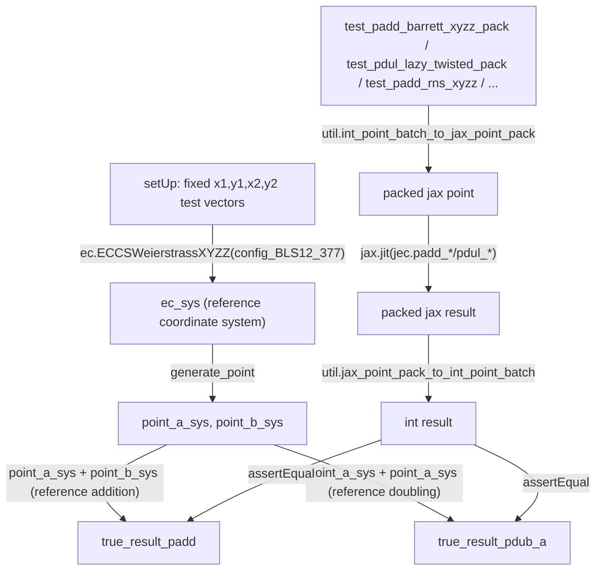

# jaxite_ec.elliptic_curve_test — the correctness oracle for packed/jitted point kernels

## Overview

`TestEllipticCurve` is the cross-validation harness between
[jaxite_ec-algorithm-elliptic_curve](jaxite_ec-algorithm-elliptic_curve.md)'s scalar,
arbitrary-precision reference point arithmetic and the TPU-vectorized, chunk-packed, `jax.jit`'d
point-add/point-double kernels in `jaxite_ec.elliptic_curve` (the top-level module, outside
`algorithm/`). [`setUp`](../catalog/jaxite_ec/elliptic_curve_test.md#TestEllipticCurve.ec_sys)
computes ground-truth results ([`true_result_padd`](../catalog/jaxite_ec/elliptic_curve_test.md#TestEllipticCurve.true_result_padd)/
[`true_result_pdub_a`](../catalog/jaxite_ec/elliptic_curve_test.md#TestEllipticCurve.true_result_pdub_a))
using the reference `ECCSWeierstrassXYZZ` coordinate system, and every `test_*` method then runs one
specific packed/jitted kernel variant (Barrett-reduced XYZZ, lazy-reduction Twisted, RNS-packed
Twisted, batched vs. non-batched) and asserts its output matches the reference bit-for-bit. This
test class is effectively the specification of what every packed point-arithmetic kernel in
`jaxite_ec` is supposed to compute.

## Diagram

## Design rationale (why it's built this way)

**One fixed pair of test points (`x1,y1`/`x2,y2`), reused across every kernel variant, rather than
randomized inputs per test.** [`setUp`](../catalog/jaxite_ec/elliptic_curve_test.md#TestEllipticCurve.point_a)
hardcodes specific BLS12-377 field element hex constants for
[`point_a`](../catalog/jaxite_ec/elliptic_curve_test.md#TestEllipticCurve.point_a)/
[`point_b`](../catalog/jaxite_ec/elliptic_curve_test.md#TestEllipticCurve.point_b) — because the
whole point of this suite is comparing dozens of *different kernel implementations* against the
*same* reference computation, keeping the input fixed means every `test_*` method's assertion is
checking the same two numbers, isolating "does this kernel implementation match" from "does it
match for this particular random input".

**Ground truth is computed once, in `setUp`, using the reference coordinate-system layer — not
duplicated per test.** [`true_result_padd`](../catalog/jaxite_ec/elliptic_curve_test.md#TestEllipticCurve.true_result_padd)/
[`true_result_pdub_a`](../catalog/jaxite_ec/elliptic_curve_test.md#TestEllipticCurve.true_result_pdub_a)
(and their affine counterparts) are computed via
[`ec_sys`](../catalog/jaxite_ec/elliptic_curve_test.md#TestEllipticCurve.ec_sys)'s
`ECCSWeierstrassXYZZ` arithmetic exactly once per test run, in `setUp` — every individual `test_*`
method (one per packed-kernel variant) then only has to run its specific kernel and compare, rather
than re-deriving the expected answer.

**Tests are named by their exact representation/coordinate-system/reduction-strategy combination,
not by what mathematical operation they test.** Names like
[`test_padd_barrett_xyzz_pack`](../catalog/jaxite_ec/elliptic_curve_test.md#TestEllipticCurve.test_padd_barrett_xyzz_pack),
[`test_pdul_lazy_twisted_pack`](../catalog/jaxite_ec/elliptic_curve_test.md#TestEllipticCurve.test_pdul_lazy_twisted_pack),
[`test_padd_rns_twisted_pack_new_twisted`](../catalog/jaxite_ec/elliptic_curve_test.md#TestEllipticCurve.test_padd_rns_twisted_pack_new_twisted)
encode operation (padd/pdul), reduction strategy (barrett/lazy/rns), and coordinate representation
(xyzz/twisted) directly in the test name — because this package maintains many parallel
implementations of the same mathematical operation (see
[jaxite_ec-pippenger](jaxite_ec-pippenger.md) vs.
[jaxite_ec-pippenger_rns](jaxite_ec-pippenger_rns.md) for the analogous pattern one layer up), and
the test name is the only place that distinguishes which specific implementation a given test
exercises.

**Each test embeds a commented-out performance-measurement hook alongside its correctness
assertion.** Every `test_*` method ends with a `tasks = [(jit_fn, args)]` list and a
`# copybara: util.profile_jax_functions(tasks, profile_name)` line — correctness-checking and
performance-profiling share the same test fixture (the same jitted function, the same input data),
so enabling profiling for any specific kernel variant is a one-line uncomment rather than a
separate benchmark harness.

## Entry points

- [`TestEllipticCurve.ec_sys`](../catalog/jaxite_ec/elliptic_curve_test.md#TestEllipticCurve.ec_sys) /
  [`point_a_sys`](../catalog/jaxite_ec/elliptic_curve_test.md#TestEllipticCurve.point_a_sys)/
  [`point_b_sys`](../catalog/jaxite_ec/elliptic_curve_test.md#TestEllipticCurve.point_b_sys) — the
  reference-computation fixtures every test's assertion is checked against.
- [`test_padd_barrett_xyzz_pack`](../catalog/jaxite_ec/elliptic_curve_test.md#TestEllipticCurve.test_padd_barrett_xyzz_pack) /
  [`test_pdul_barrett_xyzz`](../catalog/jaxite_ec/elliptic_curve_test.md#TestEllipticCurve.test_pdul_barrett_xyzz) —
  representative entry points for the Barrett-reduced XYZZ packed-kernel family.
- [`test_padd_rns_xyzz`](../catalog/jaxite_ec/elliptic_curve_test.md#TestEllipticCurve.test_padd_rns_xyzz) /
  [`test_pdul_rns_xyzz_pack`](../catalog/jaxite_ec/elliptic_curve_test.md#TestEllipticCurve.test_pdul_rns_xyzz_pack) —
  the RNS-packed kernel family's tests, validating
  [jaxite_ec-pippenger_rns](jaxite_ec-pippenger_rns.md)'s underlying point representation.

## Mechanism (step-by-step)

1. **`setUp` builds the fixed test vectors and reference results.** Constructs
   [`ec_sys`](../catalog/jaxite_ec/elliptic_curve_test.md#TestEllipticCurve.ec_sys) (an
   `ECCSWeierstrassXYZZ`), generates
   [`point_a_sys`](../catalog/jaxite_ec/elliptic_curve_test.md#TestEllipticCurve.point_a_sys)/
   [`point_b_sys`](../catalog/jaxite_ec/elliptic_curve_test.md#TestEllipticCurve.point_b_sys) from
   [`point_a`](../catalog/jaxite_ec/elliptic_curve_test.md#TestEllipticCurve.point_a)/
   [`point_b`](../catalog/jaxite_ec/elliptic_curve_test.md#TestEllipticCurve.point_b), asserts the
   generated points' coordinates round-trip correctly, then computes
   [`true_result_padd`](../catalog/jaxite_ec/elliptic_curve_test.md#TestEllipticCurve.true_result_padd)/
   [`true_result_pdub_a`](../catalog/jaxite_ec/elliptic_curve_test.md#TestEllipticCurve.true_result_pdub_a)
   via reference `+`.
2. **Each `test_*` method (e.g.
   [`test_padd_barrett_xyzz_pack`](../catalog/jaxite_ec/elliptic_curve_test.md#TestEllipticCurve.test_padd_barrett_xyzz_pack))
   packs the same fixed input points** into the specific representation its kernel variant expects
   (e.g. `util.int_point_batch_to_jax_point_pack` for XYZZ-packed variants).
3. **The kernel under test is jitted and run** inside methods like
   [`test_pdul_barrett_xyzz`](../catalog/jaxite_ec/elliptic_curve_test.md#TestEllipticCurve.test_pdul_barrett_xyzz)
   (e.g. `jax.jit(jec.padd_barrett_xyzz_pack)`), and its packed output is unpacked back
   (`util.jax_point_pack_to_int_point_batch`) into plain integers.
4. **The unpacked result is compared coordinate-by-coordinate** against the corresponding
   [`true_result_padd`](../catalog/jaxite_ec/elliptic_curve_test.md#TestEllipticCurve.true_result_padd)/
   [`true_result_pdub_a`](../catalog/jaxite_ec/elliptic_curve_test.md#TestEllipticCurve.true_result_pdub_a)
   entry via `assertEqual`.
5. **A commented-out profiling task list follows every test** (e.g.
   [`test_padd_lazy_xyzz_pack`](../catalog/jaxite_ec/elliptic_curve_test.md#TestEllipticCurve.test_padd_lazy_xyzz_pack)),
   ready to be enabled to additionally measure the jitted kernel's runtime using the same fixture
   data.

## Key data structures

- **[`TestEllipticCurve`](../catalog/jaxite_ec/elliptic_curve_test.md#TestEllipticCurve.ec_sys)** —
  an `absltest.TestCase` holding the fixed test vectors
  ([`x1_int_`](../catalog/jaxite_ec/elliptic_curve_test.md#TestEllipticCurve.x1_int_)/
  [`y1_int_`](../catalog/jaxite_ec/elliptic_curve_test.md#TestEllipticCurve.y1_int_)/
  [`x2_int_`](../catalog/jaxite_ec/elliptic_curve_test.md#TestEllipticCurve.x2_int_)/
  [`y2_int_`](../catalog/jaxite_ec/elliptic_curve_test.md#TestEllipticCurve.y2_int_)) and the
  reference results every packed-kernel test compares against.

## Dynamics (design intent)

Because ground truth is computed once in `setUp` using the pure-Python reference layer (see
[jaxite_ec-algorithm-elliptic_curve](jaxite_ec-algorithm-elliptic_curve.md)), adding a new packed
kernel variant to test requires only a new `test_*` method that packs the same fixed inputs and
compares against the already-computed
[`true_result_padd`](../catalog/jaxite_ec/elliptic_curve_test.md#TestEllipticCurve.true_result_padd)/
[`true_result_pdub_a`](../catalog/jaxite_ec/elliptic_curve_test.md#TestEllipticCurve.true_result_pdub_a) —
no new reference computation is needed per kernel variant.

## Edge cases

- Some tests (e.g.
  [`test_padd_zero_rns_twisted_pack_new_twisted`](../catalog/jaxite_ec/elliptic_curve_test.md#TestEllipticCurve.test_padd_zero_twisted_pack_new_twisted))
  specifically exercise the identity-element (`zero_twisted = [0, 1, 1, 0]`) edge case rather than
  the generic two-nonzero-point case every other test covers — the zero point is exactly the case
  branch-free packed kernels are most likely to mishandle.

## Open questions

- Whether the commented-out `util.profile_jax_functions` calls are re-enabled in a separate CI/
  benchmarking configuration, or are purely for local ad-hoc profiling, is not addressed by this
  packet's cited subgraph.

## See also
- [jaxite_ec-algorithm-elliptic_curve](jaxite_ec-algorithm-elliptic_curve.md) — `ECCSWeierstrassXYZZ`,
  the reference coordinate system this test suite's ground truth is computed from.
- [jaxite_ec-util](jaxite_ec-util.md) — the point-packing helpers every test uses to convert
  between integer and packed-JAX-array point representations.
- [jaxite_ec-pippenger](jaxite_ec-pippenger.md) /
  [jaxite_ec-pippenger_rns](jaxite_ec-pippenger_rns.md) — the higher-level MSM algorithms built on
  top of the point-add/point-double kernels this suite validates.
