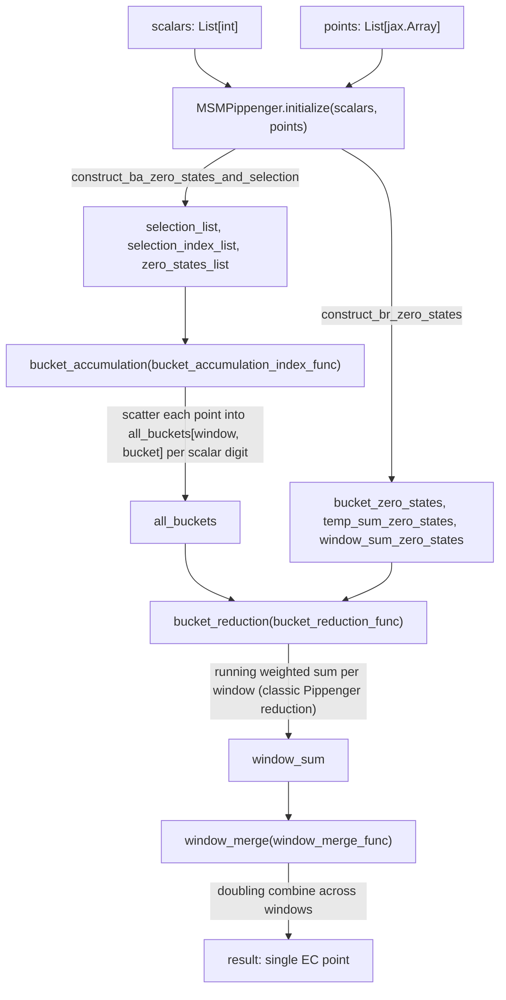

# jaxite_ec.pippenger — MSMPippenger, batched multi-scalar-multiplication on TPU

## Overview

Multi-scalar multiplication (MSM) — computing `sum(scalar_i * point_i)` for thousands to millions
of `(scalar, point)` pairs — is the dominant cost in most zk-SNARK provers, and Pippenger's
algorithm is the standard way to compute it sub-linearly in the scalar bit-width.
[`MSMPippenger`](../catalog/jaxite_ec/pippenger.md#MSMPippenger.initialize) implements the classic
three-phase structure — **bucket accumulation** (scatter each point into one of `2^slice_length`
buckets per window, based on that window's scalar digit), **bucket reduction** (collapse each
window's buckets into one point via a running weighted sum), and **window merge** (combine all
windows, doubling between them) — entirely as batched JAX array operations so it vectorizes across
every point in the MSM simultaneously rather than looping in Python. `MSMPippengerTwisted`/
`MSMPippengerTwistedSigned` are variants over the Twisted Edwards coordinate system (unified,
branch-free point addition) with additional point-parallelism and signed-digit optimizations.

## Diagram

## Design rationale (why it's built this way)

**Points are pre-converted into fixed-width chunk arrays once, at `initialize` time, not
per-operation.** [`MSMPippenger.initialize`](../catalog/jaxite_ec/pippenger.md#MSMPippenger.initialize)
converts every input point via `util.int_list_to_array` into the packed representation (see
[jaxite_ec-util](jaxite_ec-util.md)) and stacks them into
[`all_points`](../catalog/jaxite_ec/pippenger.md#MSMPippenger.all_points) once — every subsequent
bucket-accumulation call reuses this array, avoiding repeated Python-level big-integer conversion
inside the hot loop.

**Zero-state and selection bookkeeping is precomputed once and reused across every call, not
recomputed per accumulation.** [`construct_ba_zero_states_and_selection`](../catalog/jaxite_ec/pippenger.md#MSMPippenger.construct_ba_zero_states_and_selection)/
[`construct_br_zero_states`](../catalog/jaxite_ec/pippenger.md#MSMPippenger.construct_br_zero_states)
build [`selection_list`](../catalog/jaxite_ec/pippenger.md#MSMPippenger.selection_list)/
[`zero_states_list`](../catalog/jaxite_ec/pippenger.md#MSMPippenger.zero_states_list)/
[`selection_index_list`](../catalog/jaxite_ec/pippenger.md#MSMPippenger.selection_index_list) as
part of [`initialize`](../catalog/jaxite_ec/pippenger.md#MSMPippenger.initialize) — since bucket
accumulation on an accelerator can't use Python-level `if is_zero` branches, every point-add call
needs an explicit "is either operand the identity" flag threaded through as data, and precomputing
this once avoids recomputing the same zero/selection state on every one of potentially millions of
per-scalar-digit accumulation steps.

**The reduction/accumulation *algorithm* is injected as a function parameter, not hardcoded.**
[`bucket_accumulation`](../catalog/jaxite_ec/pippenger.md#MSMPippengerTwistedSigned.bucket_accumulation)/
[`bucket_reduction`](../catalog/jaxite_ec/pippenger.md#MSMPippenger.bucket_reduction) each take a
`*_func` parameter (e.g. `bucket_accumulation_index_func`) rather than calling one fixed
implementation — this lets the same [`MSMPippenger`](../catalog/jaxite_ec/pippenger.md#MSMPippenger.initialize)
state-management class be benchmarked against multiple algorithmic variants (scan-based vs.
index-based accumulation, different point-add formulas) without duplicating the state-management
code (bucket shapes, zero-state bookkeeping) for each variant.

**Buckets are shaped `(coordinate_num, window_num, bucket_num_per_window, chunk_size)` — every
window's buckets live in one contiguous array.**
`MSMPippenger.__init__` builds [`all_buckets`](../catalog/jaxite_ec/pippenger.md#MSMPippenger.all_buckets)
(shaped using [`coordinate_num`](../catalog/jaxite_ec/pippenger.md#MSMPippenger.coordinate_num)/
[`window_num`](../catalog/jaxite_ec/pippenger.md#MSMPippenger.window_num)/
[`bucket_num_per_window`](../catalog/jaxite_ec/pippenger.md#MSMPippenger.bucket_num_per_window)) as
one `jnp.broadcast_to`'d array covering every window and every bucket simultaneously — this is what
lets bucket accumulation scatter every point in the MSM into its correct `(window, bucket)` slot in
one vectorized operation rather than one window at a time.

## Entry points

- [`MSMPippenger.initialize`](../catalog/jaxite_ec/pippenger.md#MSMPippenger.initialize) — the
  entry point for a fresh MSM computation; must be called before
  [`bucket_reduction`](../catalog/jaxite_ec/pippenger.md#MSMPippenger.bucket_reduction) or bucket
  accumulation, since it builds every zero-state/selection array those steps depend on.
- [`MSMPippenger.bucket_reduction`](../catalog/jaxite_ec/pippenger.md#MSMPippenger.bucket_reduction) —
  reached after bucket accumulation has populated
  [`all_buckets`](../catalog/jaxite_ec/pippenger.md#MSMPippenger.all_buckets), to collapse each
  window's buckets into a single [`window_sum`](../catalog/jaxite_ec/pippenger.md#MSMPippenger.window_sum).
- [`MSMPippengerTwistedSigned.bucket_reduction`](../catalog/jaxite_ec/pippenger.md#MSMPippengerTwistedSigned.bucket_reduction) —
  the signed-digit Twisted Edwards variant's equivalent reduction entry point.

## Mechanism (step-by-step)

1. **Initialization converts inputs and derives every bookkeeping array.**
   [`MSMPippenger.initialize`](../catalog/jaxite_ec/pippenger.md#MSMPippenger.initialize) stores
   [`scalars`](../catalog/jaxite_ec/pippenger.md#MSMPippenger.scalars)/
   [`points`](../catalog/jaxite_ec/pippenger.md#MSMPippenger.points), sets
   [`msm_length`](../catalog/jaxite_ec/pippenger.md#MSMPippenger.msm_length), packs points into
   [`all_points`](../catalog/jaxite_ec/pippenger.md#MSMPippenger.all_points), and derives
   [`selection_list`](../catalog/jaxite_ec/pippenger.md#MSMPippenger.selection_list)/
   [`zero_states_list`](../catalog/jaxite_ec/pippenger.md#MSMPippenger.zero_states_list)/
   [`selection_index_list`](../catalog/jaxite_ec/pippenger.md#MSMPippenger.selection_index_list)/
   [`bucket_zero_states`](../catalog/jaxite_ec/pippenger.md#MSMPippenger.bucket_zero_states)/
   [`temp_sum_zero_states`](../catalog/jaxite_ec/pippenger.md#MSMPippenger.temp_sum_zero_states)/
   [`window_sum_zero_states`](../catalog/jaxite_ec/pippenger.md#MSMPippenger.window_sum_zero_states).
2. **Bucket accumulation scatters every point into its window/bucket slot** — for each window, a
   point's contribution is added into the bucket indexed by that window's slice of the point's
   scalar (`slice_length` bits at a time,
   [`slice_mask`](../catalog/jaxite_ec/pippenger.md#MSMPippenger.slice_mask)-derived), using a
   branch-free select/is-zero-aware point-add (the injected
   `bucket_accumulation_index_func`), updating
   [`all_buckets`](../catalog/jaxite_ec/pippenger.md#MSMPippenger.all_buckets).
3. **Bucket reduction runs the classic Pippenger running-sum per window**:
   [`bucket_reduction`](../catalog/jaxite_ec/pippenger.md#MSMPippenger.bucket_reduction) broadcasts
   fresh `temp_sum`/`window_sum` accumulators (shape `(coordinate_num, window_num, chunk_size)`) and
   applies the injected `bucket_reduction_func`, using
   [`bucket_zero_states`](../catalog/jaxite_ec/pippenger.md#MSMPippenger.bucket_zero_states)/
   [`temp_sum_zero_states`](../catalog/jaxite_ec/pippenger.md#MSMPippenger.temp_sum_zero_states)/
   [`window_sum_zero_states`](../catalog/jaxite_ec/pippenger.md#MSMPippenger.window_sum_zero_states)
   to track identity-element state without branching, producing
   [`window_sum`](../catalog/jaxite_ec/pippenger.md#MSMPippenger.window_sum).
4. **Window merge combines all windows' partial sums** (the
   [`window_sum`](../catalog/jaxite_ec/pippenger.md#MSMPippenger.window_sum) produced by step 3),
   doubling by `slice_length` bits between consecutive windows (the standard "evaluate the
   polynomial at base `2^slice_length`" step of Pippenger), producing the final MSM result.
5. **The Twisted/TwistedSigned variants add point-parallelism** ([`point_parallel`](../catalog/jaxite_ec/pippenger.md#MSMPippengerTwisted.point_parallel),
   batching multiple independent points' bucket work together) and, for the signed variant, use
   signed-digit decomposition to roughly halve the number of distinct buckets needed per window.

## Key data structures

- **[`MSMPippenger`](../catalog/jaxite_ec/pippenger.md#MSMPippenger.initialize)** —
  [`coordinate_num`](../catalog/jaxite_ec/pippenger.md#MSMPippenger.coordinate_num)/
  [`slice_length`](../catalog/jaxite_ec/pippenger.md#MSMPippenger.slice_length)/
  [`window_num`](../catalog/jaxite_ec/pippenger.md#MSMPippenger.window_num)/
  [`bucket_num_per_window`](../catalog/jaxite_ec/pippenger.md#MSMPippenger.bucket_num_per_window)/
  [`slice_mask`](../catalog/jaxite_ec/pippenger.md#MSMPippenger.slice_mask)/
  [`blank_point`](../catalog/jaxite_ec/pippenger.md#MSMPippenger.blank_point) (identity element in
  packed form), plus all the zero-state/selection arrays populated by
  [`initialize`](../catalog/jaxite_ec/pippenger.md#MSMPippenger.initialize).
- **[`all_buckets`](../catalog/jaxite_ec/pippenger.md#MSMPippenger.all_buckets)** — shape
  `(coordinate_num, window_num, bucket_num_per_window, chunk_size)`; the entire bucket state for
  every window, held as one array.

## Dynamics (design intent)

Because every zero-state array is a `uint8` flag array threaded alongside the actual point data
(rather than a Python-level control-flow check), the entire bucket-accumulation/reduction pipeline
composes with `jax.jit`/`jax.vmap`/`jax.pmap` without any data-dependent branching — the
[`deepcopy`](../catalog/jaxite_ec/pippenger.md#deepcopy) import at module level hints this class is
also designed to be safely copied (e.g. for running multiple independent MSM instances) without
aliasing mutable JAX array state.

## Edge cases

- [`MSMPippenger.bucket_accumulation`](../catalog/jaxite_ec/pippenger.md#MSMPippengerTwistedSigned.bucket_accumulation)
  requires [`initialize`](../catalog/jaxite_ec/pippenger.md#MSMPippenger.initialize) to have already
  run — the zero-state/selection arrays it reads
  ([`zero_states_list`](../catalog/jaxite_ec/pippenger.md#MSMPippenger.zero_states_list), etc.) are
  populated there, not lazily.
- [`bucket_reduction`](../catalog/jaxite_ec/pippenger.md#MSMPippenger.bucket_reduction) slices its
  zero-state arrays to `[:bucket_num_per_window]` — a caller changing
  [`slice_length`](../catalog/jaxite_ec/pippenger.md#MSMPippenger.slice_length) after
  [`initialize`](../catalog/jaxite_ec/pippenger.md#MSMPippenger.initialize) has already run would
  read a mismatched slice.

## Open questions

- Whether `bucket_accumulation_scan_algorithm`/`bucket_accumulation_index_algorithm` (the concrete
  injectable implementations, largely outside this packet's cited subgraph) differ meaningfully in
  TPU performance, or exist mainly to compare against GPU-oriented alternatives, is not addressed by
  this packet's cited subgraph.

## See also
- [jaxite_ec-pippenger_rns](jaxite_ec-pippenger_rns.md) — the RNS-based sibling implementation of
  the same three-phase Pippenger structure.
- [jaxite_ec-util](jaxite_ec-util.md) — `int_list_to_array`/chunking helpers used to pack points
  into `all_points`/`all_buckets`.
- [jaxite_ec-algorithm-elliptic_curve](jaxite_ec-algorithm-elliptic_curve.md) — the scalar reference
  point-arithmetic this module's packed, vectorized point-add ultimately must match.
