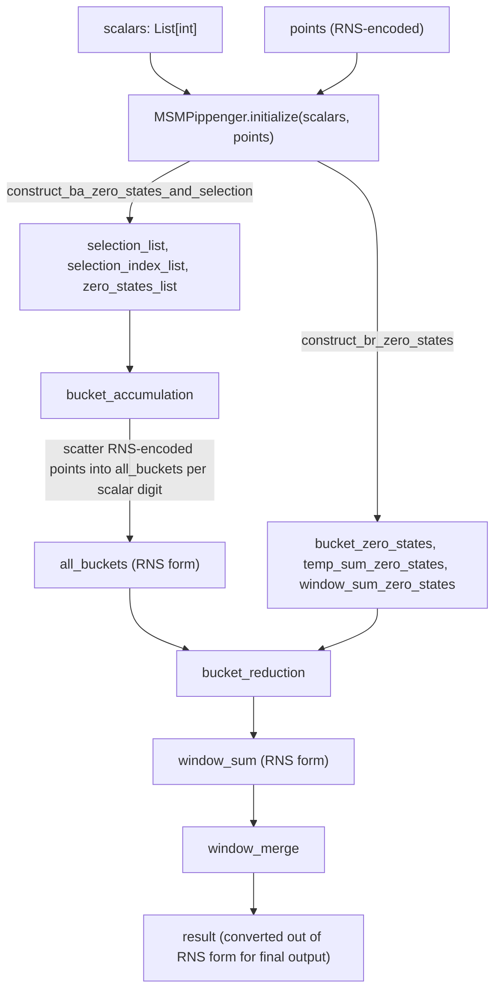

# jaxite_ec.pippenger_rns — Pippenger MSM over an RNS-represented point encoding

## Overview

This module is the RNS (Residue Number System) sibling of [jaxite_ec-pippenger](jaxite_ec-pippenger.md):
the same three-phase Pippenger structure — bucket accumulation, bucket reduction, window merge —
implemented with [`MSMPippenger`](../catalog/jaxite_ec/pippenger_rns.md#MSMPippenger.initialize)/
[`MSMPippengerTwisted`](../catalog/jaxite_ec/pippenger_rns.md#MSMPippengerTwisted.initialize)
classes whose internal point representation is RNS-encoded rather than single-modulus chunked. RNS
splits a big-integer coordinate into residues modulo several small coprime moduli
(see [jaxite_ec-util](jaxite_ec-util.md)'s `find_moduli`/`construct_rns_matrix`), so that modular
reduction during point addition becomes several small, independent, embarrassingly-parallel
reductions instead of one large-integer reduction — a different point in the same design space as
the plain-packed/Barrett/lazy-reduction representations
[jaxite_ec-pippenger](jaxite_ec-pippenger.md) and its underlying kernels use.

## Diagram

## Design rationale (why it's built this way)

**This module exists as a structurally near-identical twin of [jaxite_ec-pippenger](jaxite_ec-pippenger.md)
specifically to isolate the point-encoding choice from the algorithm's control structure.** Every
state field name — [`all_buckets`](../catalog/jaxite_ec/pippenger_rns.md#MSMPippenger.all_buckets),
[`selection_list`](../catalog/jaxite_ec/pippenger_rns.md#MSMPippenger.selection_list),
[`bucket_zero_states`](../catalog/jaxite_ec/pippenger_rns.md#MSMPippenger.bucket_zero_states), etc.
— matches [jaxite_ec-pippenger](jaxite_ec-pippenger.md)'s class of the same name; only the packed
representation the points/buckets actually hold differs (RNS residues vs. single-modulus chunks).
This lets the two representations be benchmarked head-to-head on identical algorithmic scaffolding
rather than confounding "which point encoding is faster" with "is the control structure the same".

**No `MSMPippengerTwistedSigned` variant exists here, unlike [jaxite_ec-pippenger](jaxite_ec-pippenger.md).**
Only [`MSMPippenger`](../catalog/jaxite_ec/pippenger_rns.md#MSMPippenger.initialize) and
[`MSMPippengerTwisted`](../catalog/jaxite_ec/pippenger_rns.md#MSMPippengerTwisted.initialize) are
defined — the signed-digit optimization layered on top of the Twisted variant in
[jaxite_ec-pippenger](jaxite_ec-pippenger.md) has not (yet, per this packet's cited subgraph) been
ported to the RNS representation, suggesting the two modules are not kept in perfect lockstep as
new optimizations land.

## Entry points

- [`MSMPippenger.initialize`](../catalog/jaxite_ec/pippenger_rns.md#MSMPippenger.initialize) — the
  RNS analogue of [jaxite_ec-pippenger](jaxite_ec-pippenger.md)'s entry point; converts scalars/
  points into RNS-packed form and builds the same zero-state/selection bookkeeping.
- [`MSMPippenger.bucket_reduction`](../catalog/jaxite_ec/pippenger_rns.md#MSMPippenger.bucket_reduction) /
  [`MSMPippengerTwisted.bucket_accumulation`](../catalog/jaxite_ec/pippenger_rns.md#MSMPippengerTwisted.bucket_accumulation) —
  the reduction/accumulation entry points for the plain and Twisted-coordinate variants
  respectively.

## Mechanism (step-by-step)

1. **Initialization stores scalars/points and derives bookkeeping arrays**, identical in structure
   to [jaxite_ec-pippenger](jaxite_ec-pippenger.md): [`scalars`](../catalog/jaxite_ec/pippenger_rns.md#MSMPippenger.scalars)/
   [`points`](../catalog/jaxite_ec/pippenger_rns.md#MSMPippenger.points)/
   [`msm_length`](../catalog/jaxite_ec/pippenger_rns.md#MSMPippenger.msm_length),
   [`all_points`](../catalog/jaxite_ec/pippenger_rns.md#MSMPippenger.all_points) (now RNS-encoded),
   and the [`selection_list`](../catalog/jaxite_ec/pippenger_rns.md#MSMPippenger.selection_list)/
   [`zero_states_list`](../catalog/jaxite_ec/pippenger_rns.md#MSMPippenger.zero_states_list)/
   [`selection_index_list`](../catalog/jaxite_ec/pippenger_rns.md#MSMPippenger.selection_index_list)
   family via
   [`construct_ba_zero_states_and_selection`](../catalog/jaxite_ec/pippenger_rns.md#MSMPippenger.construct_ba_zero_states_and_selection).
2. **Bucket accumulation and reduction operate on RNS-encoded coordinates throughout** — every
   point-add inside
   [`bucket_reduction`](../catalog/jaxite_ec/pippenger_rns.md#MSMPippenger.bucket_reduction)
   performs its modular reductions as several small per-modulus reductions rather than one
   large-modulus reduction, using
   [`bucket_zero_states`](../catalog/jaxite_ec/pippenger_rns.md#MSMPippenger.bucket_zero_states)/
   [`temp_sum_zero_states`](../catalog/jaxite_ec/pippenger_rns.md#MSMPippenger.temp_sum_zero_states)/
   [`window_sum_zero_states`](../catalog/jaxite_ec/pippenger_rns.md#MSMPippenger.window_sum_zero_states)
   for the same branch-free identity-tracking as the non-RNS variant.
3. **The Twisted variant additionally batches point-parallel work.**
   [`MSMPippengerTwisted.batch_window_sum`](../catalog/jaxite_ec/pippenger_rns.md#MSMPippengerTwisted.batch_window_sum)/
   [`batch_window_num`](../catalog/jaxite_ec/pippenger_rns.md#MSMPippengerTwisted.batch_window_num)
   group multiple points' window contributions together, controlled by
   [`point_parallel`](../catalog/jaxite_ec/pippenger_rns.md#MSMPippengerTwisted.point_parallel).
4. **Final output is converted out of RNS form** (via `jaxite_ec.util`'s RNS reconstruction helpers,
   outside this packet's own cited subgraph) once
   [`MSMPippenger.window_sum`](../catalog/jaxite_ec/pippenger_rns.md#MSMPippenger.window_sum)'s
   last window has been merged.

## Key data structures

- **[`MSMPippenger`](../catalog/jaxite_ec/pippenger_rns.md#MSMPippenger.initialize)** — same field
  set as [jaxite_ec-pippenger](jaxite_ec-pippenger.md)'s class of the same name:
  [`coordinate_num`](../catalog/jaxite_ec/pippenger_rns.md#MSMPippenger.coordinate_num)/
  [`slice_length`](../catalog/jaxite_ec/pippenger_rns.md#MSMPippenger.slice_length)/
  [`window_num`](../catalog/jaxite_ec/pippenger_rns.md#MSMPippenger.window_num)/
  [`bucket_num_per_window`](../catalog/jaxite_ec/pippenger_rns.md#MSMPippenger.bucket_num_per_window)/
  [`blank_point`](../catalog/jaxite_ec/pippenger_rns.md#MSMPippenger.blank_point), but the arrays
  hold RNS-encoded coordinates rather than single-modulus chunks.
- **[`MSMPippengerTwisted`](../catalog/jaxite_ec/pippenger_rns.md#MSMPippengerTwisted.initialize)** —
  adds [`point_parallel`](../catalog/jaxite_ec/pippenger_rns.md#MSMPippengerTwisted.point_parallel)/
  [`batch_window_num`](../catalog/jaxite_ec/pippenger_rns.md#MSMPippengerTwisted.batch_window_num)/
  [`br_temp_sum`](../catalog/jaxite_ec/pippenger_rns.md#MSMPippengerTwisted.br_temp_sum) over the
  base class.

## Dynamics (design intent)

Because RNS residues can be added/multiplied per-modulus independently (no carry propagation
between moduli until an explicit CRT reconstruction), bucket accumulation and reduction here can, in
principle, vectorize the modulus axis as an additional parallel dimension the way
[jaxite_ec-pippenger](jaxite_ec-pippenger.md)'s single-modulus chunk representation cannot — this is
the structural motivation for maintaining an RNS variant at all, despite the code duplication with
the non-RNS module.

## Edge cases

- Like [jaxite_ec-pippenger](jaxite_ec-pippenger.md), [`bucket_accumulation`](../catalog/jaxite_ec/pippenger_rns.md#MSMPippengerTwisted.bucket_accumulation)/
  [`bucket_reduction`](../catalog/jaxite_ec/pippenger_rns.md#MSMPippenger.bucket_reduction) require
  [`initialize`](../catalog/jaxite_ec/pippenger_rns.md#MSMPippenger.initialize) to have already
  populated every zero-state/selection array they read.

## Open questions

- Whether the RNS representation is expected to eventually replace
  [jaxite_ec-pippenger](jaxite_ec-pippenger.md)'s single-modulus representation entirely, or the
  two are maintained in parallel as genuinely different performance tradeoffs for different hardware
  targets, is not addressed by this packet's cited subgraph.

## See also
- [jaxite_ec-pippenger](jaxite_ec-pippenger.md) — the structurally parallel, non-RNS Pippenger
  implementation this module mirrors.
- [jaxite_ec-util](jaxite_ec-util.md) — `find_moduli`/`construct_rns_matrix`, the RNS moduli and
  reconstruction-coefficient precompute this module's point representation depends on.
