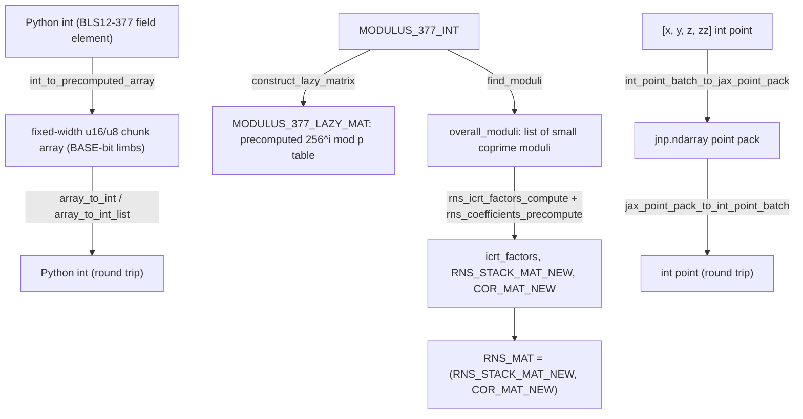

# jaxite_ec.util — chunked big-integer packing and RNS precompute for BLS12-377

## Overview

TPU vector units don't natively support ~377-bit integer arithmetic (BLS12-377's field size), so
this module is the packing layer that represents one big integer as a fixed-length array of small
(`u8`/`u16`) chunks, on which ordinary vectorized JAX ops become the primitive operations of a
big-integer arithmetic library. It also implements the offline (CPU-only, non-jittable) precompute
side of two acceleration techniques used throughout `jaxite_ec`: **lazy reduction** (
[`construct_lazy_matrix`](../catalog/jaxite_ec/util.md#construct_lazy_matrix), precomputed powers of
256 mod `p`) and **RNS (Residue Number System) reduction** (
[`find_moduli`](../catalog/jaxite_ec/util.md#find_moduli)/
[`construct_rns_matrix`](../catalog/jaxite_ec/util.md#construct_rns_matrix), splitting one big
modulus into several small coprime moduli that can each be reduced independently and cheaply).

## Diagram

## Design rationale (why it's built this way)

**Precomputable constants are computed once at module-import time as plain Python, explicitly
marked non-jittable.** The module docstring warns: "All functions that directly take Python int as
input cannot be jitted" —
[`construct_lazy_matrix`](../catalog/jaxite_ec/util.md#construct_lazy_matrix)/
[`find_moduli`](../catalog/jaxite_ec/util.md#find_moduli)/
[`construct_rns_matrix`](../catalog/jaxite_ec/util.md#construct_rns_matrix) run in plain Python
using arbitrary-precision `int`, producing constant JAX arrays
([`MODULUS_377_INT_CHUNK`](../catalog/jaxite_ec/util.md#MODULUS_377_INT_CHUNK),
[`RNS_MAT`](../catalog/jaxite_ec/util.md#RNS_MAT), etc.) that are then baked into the traced,
jittable kernels as closed-over constants — the offline/online split keeps expensive Python-level
big-integer math out of the hot path entirely.

**RNS moduli are *found*, not fixed, via a search over candidate small primes.**
[`find_moduli`](../catalog/jaxite_ec/util.md#find_moduli) searches for a list of moduli near a
target precision whose product exceeds the field modulus — this is necessary because RNS
correctness requires the chosen moduli to be pairwise coprime and their product to strictly exceed
the value range being represented; picking them algorithmically (rather than hardcoding specific
primes) lets the same machinery adapt if the target precision or field changes.

**`to_tuple` exists purely to make precomputed matrices hashable-by-value for JAX's constant
folding/caching.** [`to_tuple`](../catalog/jaxite_ec/util.md#to_tuple) recursively converts a numpy
array into nested Python tuples — module-level constants like `MODULUS_377_LAZY_MAT` are stored as
tuples-of-tuples rather than numpy/JAX arrays specifically so they can be used as `static` arguments
or hashed as part of a JIT cache key without JAX's usual "unhashable array" restriction.

## Entry points

- [`int_to_precomputed_array`](../catalog/jaxite_ec/util.md#int_to_precomputed_array) — reached
  wherever a Python-level constant (a modulus, a curve parameter) must become a chunked JAX-array
  constant usable inside a jitted kernel; explicitly documented as the jittable-precompute-safe
  counterpart to a similar `int_to_array` function.
- [`construct_rns_matrix`](../catalog/jaxite_ec/util.md#construct_rns_matrix) — the top-level
  entry point that ties together
  [`rns_icrt_factors_compute`](../catalog/jaxite_ec/util.md#rns_icrt_factors_compute)/
  [`rns_coefficients_precompute`](../catalog/jaxite_ec/util.md#rns_coefficients_precompute) into the
  final `(stack_matrix, correction_matrix)` pair used by RNS-based reduction kernels elsewhere in
  `jaxite_ec`.
- [`to_rns`](../catalog/jaxite_ec/util.md#to_rns) /
  [`total_modulus`](../catalog/jaxite_ec/util.md#total_modulus) — the basic RNS conversion
  primitives (`x mod m_i` per modulus, and the product of all moduli) every RNS-related computation
  in this module is built from.

## Mechanism (step-by-step)

1. **A Python integer is chunked into fixed-width limbs.**
   [`int_to_precomputed_array`](../catalog/jaxite_ec/util.md#int_to_precomputed_array) masks and
   shifts the value `base` bits at a time into an `array_size`-length array — the fundamental
   representation every packed point/field-element constant in `jaxite_ec` uses.
2. **The lazy-reduction matrix is derived from powers of 256 mod the field modulus.**
   [`construct_lazy_matrix`](../catalog/jaxite_ec/util.md#construct_lazy_matrix) computes
   `256^(chunk_num_u8 + i) mod p` for a small range of `i`, chunks each result via
   [`int_to_precomputed_array`](../catalog/jaxite_ec/util.md#int_to_precomputed_array), and collects
   them via [`to_tuple`](../catalog/jaxite_ec/util.md#to_tuple) — this table is what lets a
   multiply-then-reduce kernel replace a full reduction with a table lookup plus accumulation.
3. **RNS moduli are found, then their CRT reconstruction coefficients are precomputed.**
   [`find_moduli`](../catalog/jaxite_ec/util.md#find_moduli) picks
   [`overall_moduli`](../catalog/jaxite_ec/util.md#overall_moduli);
   [`rns_icrt_factors_compute`](../catalog/jaxite_ec/util.md#rns_icrt_factors_compute) derives
   [`icrt_factors`](../catalog/jaxite_ec/util.md#icrt_factors) (the per-modulus CRT reconstruction
   weights); [`rns_coefficients_precompute`](../catalog/jaxite_ec/util.md#rns_coefficients_precompute)
   turns those into the actual matrix form
   [`construct_rns_matrix`](../catalog/jaxite_ec/util.md#construct_rns_matrix) returns.
4. **Point packing wraps the [`int_to_precomputed_array`](../catalog/jaxite_ec/util.md#int_to_precomputed_array)
   chunking primitive per-coordinate.** The `int_point_*`/`jax_*_point_pack_to_int_point*` family
   (not all individually in this packet's cited subgraph) applies chunking/unchunking across all
   coordinates of an elliptic-curve point in one call, giving the shape the packed TPU kernels in
   `jaxite_ec.elliptic_curve`/`pippenger.py` expect.

## Key data structures

- **[`MODULUS_377_INT`](../catalog/jaxite_ec/util.md#MODULUS_377_INT)/`MU_377_INT`/`TWIST_D_INT`** —
  the raw BLS12-377 curve constants (field modulus, Barrett `mu`, twist parameter) as plain Python
  ints; every other precomputed constant derives from these.
- **[`BASE`](../catalog/jaxite_ec/util.md#BASE)/[`U16_CHUNK_NUM`](../catalog/jaxite_ec/util.md#U16_CHUNK_NUM)** —
  the chunking configuration (bits per limb, number of limbs) every packed representation in this
  module and its callers agrees on.
- **[`COR_MAT_NEW`](../catalog/jaxite_ec/util.md#COR_MAT_NEW)/[`RNS_MAT`](../catalog/jaxite_ec/util.md#RNS_MAT)/[`M`](../catalog/jaxite_ec/util.md#M)** —
  the final precomputed RNS reduction matrices/moduli-product constant, consumed directly by the
  RNS-based reduction kernels elsewhere in the package.

## Dynamics (design intent)

Because every heavy constant ([`MODULUS_377_INT_CHUNK`](../catalog/jaxite_ec/util.md#MODULUS_377_INT_CHUNK),
[`MU_377_INT_CHUNK`](../catalog/jaxite_ec/util.md#MU_377_INT_CHUNK),
[`RNS_MAT`](../catalog/jaxite_ec/util.md#RNS_MAT), etc.) is computed exactly once at module import
time and stored as a module-level global, every kernel elsewhere in `jaxite_ec` that imports `util`
shares the identical precomputed constants — there is no per-call or per-kernel-instance
recomputation of the curve's reduction machinery.

## Edge cases

- [`int_to_precomputed_array`](../catalog/jaxite_ec/util.md#int_to_precomputed_array) explicitly
  cannot be called from inside a `jax.jit`-traced function (it takes a Python `int`, not a traced
  value) — the module docstring's opening warning exists specifically to prevent a caller from
  assuming these helpers are jittable.
- [`find_moduli`](../catalog/jaxite_ec/util.md#find_moduli)'s search is a heuristic over candidate
  primes near a target precision; there is no guarantee it finds the minimal number of moduli, only
  a valid (product-exceeds-modulus, pairwise-coprime) set.

## Open questions

- Whether `find_moduli`'s search strategy has been tuned for a specific TPU generation's preferred
  chunk width, or is a generic search independent of target hardware, is not addressed by this
  packet's cited subgraph.

## See also
- [jaxite_ec-algorithm-finite_field](jaxite_ec-algorithm-finite_field.md) — the arbitrary-precision
  scalar reference this module's chunked/RNS representation is checked against.
- [jaxite_ec-pippenger](jaxite_ec-pippenger.md) — `MSMPippenger`, a heavy consumer of this module's
  point-packing helpers (`int_list_to_array`, `BASE`, `U16_EXT_CHUNK_NUM`) for its internal point
  representation.
- [jaxite_ec-elliptic_curve_test](jaxite_ec-elliptic_curve_test.md) — the test suite that round-trips
  through this module's `int_point_batch_to_jax_point_pack`/`jax_point_pack_to_int_point_batch`.
