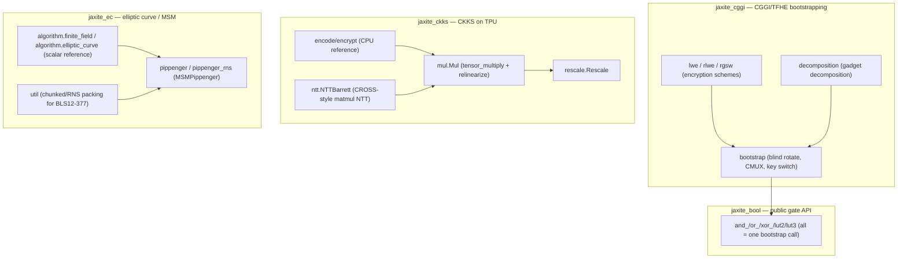

# jaxite — what it is and how it fits together

## In one paragraph

Jaxite is a fully homomorphic encryption (FHE) and TPU-accelerated elliptic-curve library written
in JAX, split into three largely independent lanes under one repo. `jaxite_cggi` implements the
CGGI/TFHE cryptosystem — LWE/RLWE/RGSW encryption, gadget decomposition, and the functional
bootstrap (blind rotation via CMUX/external product, optionally BMMP-accelerated) that lets a
boolean circuit chain unlimited gates without noise overflow — and `jaxite_bool` is its public API,
implementing every logic gate as one call to the shared programmable-bootstrap primitive.
`jaxite_ckks` is CKKS-on-TPU, actively porting the CROSS paper's matrix-decomposed NTT (turning the
FFT into MXU-friendly matmuls) to accelerate approximate real/complex-number FHE. `jaxite_ec` is a
separate elliptic-curve arithmetic and multi-scalar-multiplication (Pippenger) library for
BLS12-377, the curve used by many zk-SNARK systems, again TPU-accelerated via chunked/RNS
big-integer packing. All three lanes share one architectural pattern: a slow, arbitrary-precision
scalar reference implementation (for correctness) paired with a vectorized, `jax.jit`-compiled,
chunk-packed implementation (for TPU performance).

## Core architecture

## Main concepts

**Programmable bootstrapping: one primitive computes every boolean gate.**
[jaxite-jaxite_cggi-bootstrap](concepts/jaxite-jaxite_cggi-bootstrap.md) is the single mechanism
[jaxite-jaxite_bool](concepts/jaxite-jaxite_bool.md)'s entire gate library is built from — a gate's
identity is encoded purely in which lookup-table polynomial its bootstrap call uses, not in
different code paths per gate.

**RGSW gadget encryption enables the external product, the core of blind rotation.**
[jaxite-jaxite_cggi-rgsw](concepts/jaxite-jaxite_cggi-rgsw.md) (built on
[jaxite-jaxite_cggi-rlwe](concepts/jaxite-jaxite_cggi-rlwe.md) and parameterized by
[jaxite-jaxite_cggi-decomposition](concepts/jaxite-jaxite_cggi-decomposition.md)'s signed-digit
gadget decomposition) is what lets [jaxite-jaxite_cggi-bootstrap](concepts/jaxite-jaxite_cggi-bootstrap.md)
multiply an encrypted secret-key bit against an RLWE ciphertext without ever decrypting.

**A shared noise/encoding discipline underlies every CGGI ciphertext.**
[jaxite-jaxite_cggi-encoding](concepts/jaxite-jaxite_cggi-encoding.md)'s padding/message/noise bit
layout and [jaxite-jaxite_cggi-parameters](concepts/jaxite-jaxite_cggi-parameters.md)'s
`SchemeParameters` are the two configuration objects every encryption/decryption function in
[jaxite-jaxite_cggi-lwe](concepts/jaxite-jaxite_cggi-lwe.md)/
[jaxite-jaxite_cggi-rlwe](concepts/jaxite-jaxite_cggi-rlwe.md) reads, with
[jaxite-jaxite_cggi-random_source](concepts/jaxite-jaxite_cggi-random_source.md)'s pluggable
`RandomSource` supplying (secure or deterministic-for-testing) randomness throughout.

**CKKS pairs a CPU reference layer with a TPU matmul-based NTT for the actual acceleration.**
[jaxite-jaxite_ckks-encode](concepts/jaxite-jaxite_ckks-encode.md)/
[jaxite-jaxite_ckks-encrypt](concepts/jaxite-jaxite_ckks-encrypt.md) are CPU/numpy reference
implementations; [jaxite-jaxite_ckks-ntt](concepts/jaxite-jaxite_ckks-ntt.md)'s `NTTBarrett`
decomposes the NTT into three MXU-friendly matrix multiplications (the CROSS paper's approach),
which [jaxite-jaxite_ckks-mul](concepts/jaxite-jaxite_ckks-mul.md)'s `Mul` (tensor-multiply +
RNS-decomposed relinearization) and [jaxite-jaxite_ckks-rescale](concepts/jaxite-jaxite_ckks-rescale.md)'s
`Rescale` depend on for every homomorphic operation's domain conversions.
[jaxite-jaxite_ckks-rns](concepts/jaxite-jaxite_ckks-rns.md)'s scalar `Ntt`/`RnsPolynomial` is the
correctness oracle both layers are checked against, and
[jaxite-jaxite_ckks-types](concepts/jaxite-jaxite_ckks-types.md) is the shared pytree vocabulary
(`Ciphertext`/`Plaintext`) every CKKS operation passes around.

**Elliptic-curve arithmetic is generic over coordinate system, checked against a scalar oracle, then
packed for TPU-vectorized MSM.** [jaxite_ec-algorithm-elliptic_curve](concepts/jaxite_ec-algorithm-elliptic_curve.md)'s
strategy-pattern `ECPoint`/`EllipticCurveCoordinateSystem` (over
[jaxite_ec-algorithm-finite_field](concepts/jaxite_ec-algorithm-finite_field.md)'s pluggable
naive/Barrett/Montgomery field arithmetic) is the reference
[jaxite_ec-elliptic_curve_test](concepts/jaxite_ec-elliptic_curve_test.md) validates every packed
kernel against. [jaxite_ec-util](concepts/jaxite_ec-util.md)'s chunked and RNS big-integer packing
for BLS12-377 is what [jaxite_ec-pippenger](concepts/jaxite_ec-pippenger.md)/
[jaxite_ec-pippenger_rns](concepts/jaxite_ec-pippenger_rns.md)'s `MSMPippenger` — the three-phase
bucket-accumulation/bucket-reduction/window-merge multi-scalar-multiplication — build their
vectorized point representation from.

**Every lane pairs a scalar/reference implementation with a vectorized/packed one, and tests cross-
validate the two.** This is the load-bearing architectural idiom across all three lanes: CGGI's
`RandomSource`-parameterized reference schemes vs. their `jax.jit`'d encryption kernels, CKKS's
CPU `ntt_cpu`/`rns.Ntt` vs. `NTTBarrett`, and `jaxite_ec`'s arbitrary-precision `FiniteFieldElement`/
`ECPoint` vs. chunk-packed MSM kernels — understanding any one pair's relationship is understanding
the whole repo's testing philosophy.

## How a request flows

A typical CGGI boolean-circuit evaluation: `jaxite_bool.encrypt` → gate call (e.g. `and_`, packing
inputs into one integer) → [jaxite-jaxite_cggi-bootstrap](concepts/jaxite-jaxite_cggi-bootstrap.md)'s
`bootstrap` (modulus-switch → blind rotate via CMUX/external-product against the RGSW-encrypted
bootstrapping key → sample-extract → key-switch back to the original secret key) → `jaxite_bool.decrypt`.
A typical `jaxite_ec` MSM: pack scalars/points → `MSMPippenger.initialize` → bucket accumulation →
bucket reduction → window merge → unpack the resulting point.

## Map of the wiki

- **"How does a boolean gate actually get computed?"** → [jaxite-jaxite_bool](concepts/jaxite-jaxite_bool.md)
  then [jaxite-jaxite_cggi-bootstrap](concepts/jaxite-jaxite_cggi-bootstrap.md).
- **"What does an LWE/RLWE/RGSW ciphertext look like, and how is noise tracked?"** →
  [jaxite-jaxite_cggi-lwe](concepts/jaxite-jaxite_cggi-lwe.md),
  [jaxite-jaxite_cggi-rlwe](concepts/jaxite-jaxite_cggi-rlwe.md),
  [jaxite-jaxite_cggi-rgsw](concepts/jaxite-jaxite_cggi-rgsw.md),
  [jaxite-jaxite_cggi-encoding](concepts/jaxite-jaxite_cggi-encoding.md).
- **"How does CKKS's NTT actually run fast on TPU?"** → [jaxite-jaxite_ckks-ntt](concepts/jaxite-jaxite_ckks-ntt.md),
  then [jaxite-jaxite_ckks-mul](concepts/jaxite-jaxite_ckks-mul.md) for how it's used in
  multiplication/relinearization.
- **"How is a multi-scalar-multiplication computed on TPU?"** →
  [jaxite_ec-pippenger](concepts/jaxite_ec-pippenger.md) (or
  [jaxite_ec-pippenger_rns](concepts/jaxite_ec-pippenger_rns.md) for the RNS variant).
- **"How do I know a TPU kernel is computing the right answer?"** → the `*_test` pattern, e.g.
  [jaxite_ec-elliptic_curve_test](concepts/jaxite_ec-elliptic_curve_test.md).

For the exhaustive per-symbol index (every function/class signature, defining file:line, and caller
graph), see `catalog/` — one page per source module. For the flat list of every concept page with
its one-line description, see `index.md`.
