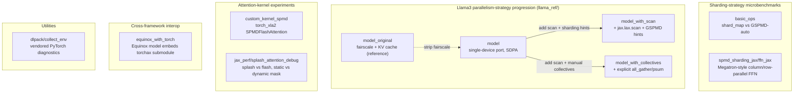

# learning-machine — what it is and how it fits together

## In one paragraph
`learning-machine` is a personal playground repo of small, independent JAX/PyTorch-on-TPU experiments — there is no shared library or entry point tying the files together. Each subdirectory or top-level script investigates one narrow question about TPU sharding, parallelism strategy, or attention-kernel choice: how `shard_map` compares to GSPMD auto-partitioning, how a Llama3 model's parallelism strategy changes across four re-implementations of the same architecture, how a custom Pallas flash-attention kernel gets bridged into PyTorch/XLA's SPMD mode, and how JAX's splash (sparse) attention kernel compares to plain flash attention under static vs dynamic masks. The common thread is TPU performance experimentation via direct, hands-on comparison of alternatives rather than a production framework.

## Core architecture

## Main concepts

### shard_map vs GSPMD-auto sharding
Two microbenchmarks — [basic_ops](concepts/basic_ops.md) and [spmd_sharding_jax/ffn_jax](concepts/spmd_sharding_jax-ffn_jax.md) — measure the same class of computation (a gated FFN / a stack of dense layers) under explicit collectives (`shard_map`, hand-placed `all_gather`/`all_reduce`) versus GSPMD hints (`with_sharding_constraint`). `ffn_jax` additionally demonstrates the classic Megatron column-parallel→row-parallel weight-sharding pattern for FFN blocks.

### The Llama3 four-way parallelism-strategy progression
[llama_ref](concepts/llama_ref-model_original.md) contains one architecture ported through four sharding strategies: [model_original](concepts/llama_ref-model_original.md) (Meta's fairscale-parallel, KV-cached reference — kept unmodified as baseline), [model](concepts/llama_ref-model.md) (single-device PyTorch port, no cache, `scaled_dot_product_attention`), [model_with_scan](concepts/llama_ref-model_with_scan.md) (adds `jax.lax.scan`-over-layers plus `with_sharding_constraint` GSPMD hints), and [model_with_collectives](concepts/llama_ref-model_with_collectives.md) (same scan structure, but with explicit JAX `all_gather`/`psum` collectives — including a per-layer FSDP weight-unshard inside the scan body). This is a controlled comparison of GSPMD-inferred versus programmer-controlled collective placement on the identical model, orchestrated by a single `run.py` driver (`model_impl='orig'|'scan'|'scan_manual'`).

### Attention-kernel substitution and sparsity tradeoffs
[custom_kernel_spmd](concepts/custom_kernel_spmd.md) bridges a JAX-defined Pallas flash-attention kernel into PyTorch/XLA's SPMD mode via manual-sharding tricks (`enable_manual_sharding`/`disable_manual_sharding`) and `torch_xla._XLAC._xla_tpu_custom_call`. [jax_perf/splash_attention_debug](concepts/jax_perf-splash_attention_debug.md) benchmarks JAX's native splash (sparse) attention kernel against plain flash attention across static vs dynamic mask specialization, with embedded measured results showing static-mask specialization roughly halves latency versus a dynamic (traced) mask, and that a causal mask allows further block-skipping — though in the benchmarked configuration, plain dense flash attention still edges out splash's sparse kernel.

### Cross-framework interop
[equinox_with_torch](concepts/equinox_with_torch.md) demonstrates embedding a `torchax`-jittable PyTorch submodule inside a native Equinox (JAX) model, trained end-to-end through one Optax step — the same `torchax`/`torch_xla2` interop primitives (`call_jax`/`jax_view`/`functional_call`) that the `llama_ref` scan variants use to invoke JAX collectives from PyTorch model code, but applied in the opposite direction (calling PyTorch from JAX).

## How a request flows
There is no single request path across this repo — each file is independently runnable. Within `llama_ref/`, the closest thing to a spine is: `run.py main()` picks a model variant by `model_impl`, builds an `(fsdp, tp)` device mesh, constructs a checkpoint/offload policy, registers a custom attention op (substituting a JAX Pallas flash-attention kernel for `scaled_dot_product_attention`), and hands the model to `train.train_loop`.

## Map of the wiki
- Read [basic_ops](concepts/basic_ops.md) or [spmd_sharding_jax/ffn_jax](concepts/spmd_sharding_jax-ffn_jax.md) for shard_map-vs-GSPMD sharding-strategy comparisons.
- Read the four `llama_ref` concept pages (linked above) in the order original → model → scan → collectives to follow the parallelism-strategy progression.
- Read [custom_kernel_spmd](concepts/custom_kernel_spmd.md) or [jax_perf/splash_attention_debug](concepts/jax_perf-splash_attention_debug.md) for attention-kernel-substitution and sparsity-tradeoff experiments.
- Read [equinox_with_torch](concepts/equinox_with_torch.md) for the `torchax`/Equinox cross-framework interop pattern.
- [dlpack/collect_env](concepts/dlpack-collect_env.md) is a vendored diagnostics utility, not TPU-perf-relevant on its own.
- See `catalog/` for the exhaustive per-module symbol index, and `index.md` for the concept table.
