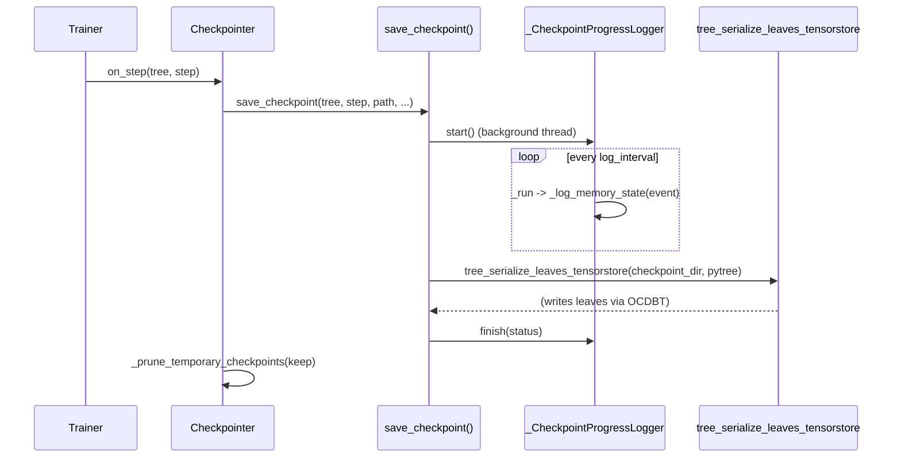

# levanter.checkpoint — TensorStore/OCDBT checkpoint save with a background progress logger

## Overview

[`save_checkpoint`](../catalog/lib/levanter/src/levanter/checkpoint.md#save_checkpoint) ("Save a
checkpoint to a given path using TensorStore with OCDBT") is the free-function checkpoint writer;
[`Checkpointer.save_checkpoint`](../catalog/lib/levanter/src/levanter/checkpoint.md#Checkpointer.save_checkpoint)/
[`Checkpointer.on_step`](../catalog/lib/levanter/src/levanter/checkpoint.md#Checkpointer.on_step) wrap
it as a trainer hook, adding temporary-checkpoint pruning
([`Checkpointer._prune_temporary_checkpoints`](../catalog/lib/levanter/src/levanter/checkpoint.md#Checkpointer._prune_temporary_checkpoints)).
A dedicated
[`_CheckpointProgressLogger`](../catalog/lib/levanter/src/levanter/checkpoint.md#_CheckpointProgressLogger._run)
runs in a background thread during the save, periodically logging process memory/tracemalloc state —
checkpoint saves of large models are slow enough to warrant their own progress/diagnostic instrumentation.

## Diagram

## Design rationale (why it's built this way)

**Checkpoint progress logging runs on a separate background thread, not inline in the save call,
because the save itself is a long-running blocking (or async-dispatching) operation that shouldn't be
interrupted by logging overhead.**
[`_CheckpointProgressLogger._run`](../catalog/lib/levanter/src/levanter/checkpoint.md#_CheckpointProgressLogger._run)
loops until `_stop_event` is set, calling
[`_log_memory_state`](../catalog/lib/levanter/src/levanter/checkpoint.md#_CheckpointProgressLogger._log_memory_state)
each iteration; [`set_phase`](../catalog/lib/levanter/src/levanter/checkpoint.md#_CheckpointProgressLogger.set_phase)
lets the main save path update *what phase* is being logged (e.g. "serializing", "committing")
without the logger thread itself needing save-path-specific knowledge.

**`_log_memory_state` optionally reports top memory allocations (`include_top_allocations`), gated by
a flag rather than always-on, because full allocation tracking (tracemalloc) has its own overhead.**
The method reads `_current_process_rss_bytes`, `_tracemalloc_baseline`, and
`_tracemalloc_memory_state` together — this is diagnostic instrumentation for debugging checkpoint
OOMs specifically, not routine logging every save performs at full detail.

**Serialization delegates to `tree_serialize_leaves_tensorstore` (TensorStore/OCDBT), keyed by
per-leaf paths derived from
[`leaf_key_paths`](../catalog/lib/levanter/src/levanter/utils/jax_utils.md#leaf_key_paths) ("Creates
unique, hopefully meaningful key paths for each leaf in a pytree") — every array in the model pytree
gets an independent, addressable storage key, not one opaque blob.** This is what makes partial
restores / per-parameter inspection possible against a saved checkpoint.

**Temporary checkpoints are a distinct concept from permanent ones, pruned separately.**
[`save_checkpoint`](../catalog/lib/levanter/src/levanter/checkpoint.md#save_checkpoint)'s
`is_temporary: bool = True` default and
[`Checkpointer._prune_temporary_checkpoints`](../catalog/lib/levanter/src/levanter/checkpoint.md#Checkpointer._prune_temporary_checkpoints)
(which calls `_rm_checkpoint`) together imply a checkpoint lifecycle where intermediate/frequent saves
are marked temporary and periodically garbage-collected, while explicitly permanent saves are kept
indefinitely.

## Entry points

- [`save_checkpoint`](../catalog/lib/levanter/src/levanter/checkpoint.md#save_checkpoint) — the
  free-function entry point; called directly or via `Checkpointer.save_checkpoint`.
- [`Checkpointer.on_step`](../catalog/lib/levanter/src/levanter/checkpoint.md#Checkpointer.on_step) —
  the trainer-hook entry point, called once per training step (subject to the checkpointer's own
  save-interval policy, `force` overriding it).
- [`_discover_checkpoint_candidates_single`](../catalog/lib/levanter/src/levanter/checkpoint.md#_discover_checkpoint_candidates_single) —
  "Discover complete checkpoint candidates in a single root path"; used by checkpoint-restore/resume
  logic to find the latest valid checkpoint.

## Mechanism (step-by-step)

1. **[`on_step`](../catalog/lib/levanter/src/levanter/checkpoint.md#Checkpointer.on_step) is called
   once per step; it delegates to `save_checkpoint` (the free function) when the
   step warrants a save** (or `force=True`).
2. **`save_checkpoint` starts a
   [`_CheckpointProgressLogger`](../catalog/lib/levanter/src/levanter/checkpoint.md#_CheckpointProgressLogger._run)
   background thread**, logging periodic memory-state snapshots via `_log_memory_state` throughout the
   save.
3. **The actual leaf-by-leaf array data is written via
   [`tree_serialize_leaves_tensorstore`](../catalog/lib/levanter/src/levanter/tensorstore_serialization.md#tree_serialize_leaves_tensorstore)**,
   using [`leaf_key_paths`](../catalog/lib/levanter/src/levanter/utils/jax_utils.md#leaf_key_paths) to
   derive each leaf's storage key and an OCDBT spec (`_create_ocdbt_spec`) for the underlying
   TensorStore backend.
4. **On completion, the progress logger's [`finish`](../catalog/lib/levanter/src/levanter/checkpoint.md#_CheckpointProgressLogger.finish)
   is called with a status string**, stopping the background thread and logging a final memory
   snapshot.
5. **[`Checkpointer._prune_temporary_checkpoints`](../catalog/lib/levanter/src/levanter/checkpoint.md#Checkpointer._prune_temporary_checkpoints)
   periodically removes old temporary checkpoints**,
   keeping only the most recent `keep` count.

## Key data structures

- **`Checkpointer`** — the trainer-facing wrapper; owns save-interval policy and calls
  `save_checkpoint`/`_prune_temporary_checkpoints`.
- **`_CheckpointProgressLogger`** — background-thread state: `phase`, `step`, `started_at`,
  `phase_started_at`, plus tracemalloc baseline/state for memory diagnostics.
- **[`PathLike`](../catalog/lib/levanter/src/levanter/checkpoint.md#PathLike)** — `Union[str,
  pathlib.Path]`, the accepted type for any checkpoint path parameter.

## Dynamics (design intent)

`_CheckpointProgressLogger`'s `_lock` (referenced by both `_run` and `set_phase`) indicates the main
save thread and the background logger thread share mutable state (`phase`, `step`) and must
synchronize access to it — a genuine multi-threaded design, not just async/await concurrency.

## Edge cases
None directly visible in this packet's subgraph beyond the temporary/permanent checkpoint distinction.

## Open questions
- The exact criteria `_discover_checkpoint_candidates_single` uses to decide a checkpoint is
  "complete" (vs. a partially-written one from an interrupted save) isn't resolved by the symbols in
  this packet's subgraph.

## See also
- [lib-levanter-src-levanter-trainer](lib-levanter-src-levanter-trainer.md) — `Trainer._add_default_hooks`,
  which wires a `Checkpointer` in as a training hook.
