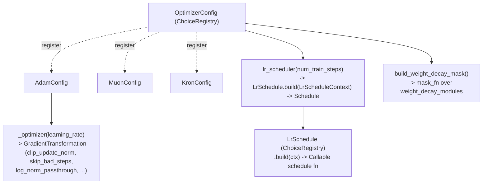

# levanter.optim.config — OptimizerConfig/LrSchedule registries and optimizer assembly

## Overview

[`OptimizerConfig`](../catalog/lib/levanter/src/levanter/config.md#OptimizerConfig) and
[`LrSchedule`](../catalog/lib/levanter/src/levanter/config.md#LrSchedule) are both
`draccus.ChoiceRegistry`-based abstract configs — the same registry-by-subclass pattern used
elsewhere in levanter (`RotaryEmbeddingsConfig`, `LmConfig`). Concrete optimizers
(`AdamConfig`, `MuonConfig`, `KronConfig`) each implement
[`_optimizer`](../catalog/lib/levanter/src/levanter/config.md#AdamConfig._optimizer) to build the
actual `optax`-style `GradientTransformation`; every optimizer additionally builds its own learning-rate
schedule via
[`OptimizerConfig.lr_scheduler`](../catalog/lib/levanter/src/levanter/config.md#OptimizerConfig.lr_scheduler)
and an optional weight-decay mask via
[`build_weight_decay_mask`](../catalog/lib/levanter/src/levanter/config.md#OptimizerConfig.build_weight_decay_mask).

## Diagram

## Design rationale (why it's built this way)

**The learning-rate schedule is itself a separately-registered choice (`LrSchedule`), not a fixed
field on `OptimizerConfig`, so schedule shape (cosine, linear, constant, ...) is independently
selectable from the optimizer algorithm.**
[`LrSchedule.build`](../catalog/lib/levanter/src/levanter/config.md#LrSchedule.build) is
`@abc.abstractmethod`, taking an
[`LrScheduleContext`](../catalog/lib/levanter/src/levanter/config.md#LrScheduleContext) (carrying
[`learning_rate`](../catalog/lib/levanter/src/levanter/config.md#LrScheduleContext.learning_rate))
and returning a plain `Callable` schedule function — every concrete schedule shares this exact
interface.

**`OptimizerConfig.lr_scheduler` resolves fraction-or-absolute-step hyperparameters
(`_convert_frac_or_steps`) and computes cycle minima (`_get_cycle_minima`) before delegating to the
schedule's own `build`, centralizing that resolution logic once rather than duplicating it per
schedule type.** This mirrors the same "resolve fraction to absolute step count once `num_train_steps`
is known" pattern seen elsewhere in schedule-adjacent code (cf. AQT's `fp_numerics`-adjacent config
patterns, structurally similar though a different codebase).

**Gradient transformation assembly composes several independent, named wrapper transformations
(`clip_update_norm`, `scan_aware_clip_by_block_rms`, `skip_bad_steps`, `log_norm_passthrough`,
`update_rms_clipping`) around the base optimizer step, rather than one monolithic update function.**
[`AdamConfig._optimizer`](../catalog/lib/levanter/src/levanter/config.md#AdamConfig._optimizer) calls
`build_weight_decay_mask`, `SkipStepConfig.from_bool_int_or_config`, `clip_update_norm`,
`scan_aware_clip_by_block_rms`, `log_norm_passthrough`, and `update_rms_clipping` together — each is
independently a `GradientTransformation`-producing wrapper, composed via `optax`-style chaining
(implied by `wrap`).

**`log_norm_passthrough` returns a `GradientTransformation` whose sole effect is logging, not
modifying updates — a diagnostic-only wrapper composed into the same chain as functional
transformations.** Its doc: "Creates a gradient transformation that logs the L2 norm of the updates" —
this lets update-norm monitoring be enabled/disabled by simply including/excluding it from the
composition chain, without special-casing logging elsewhere.

## Entry points

- [`OptimizerConfig.lr_scheduler`](../catalog/lib/levanter/src/levanter/config.md#OptimizerConfig.lr_scheduler) —
  called once per training run to build the learning-rate schedule, given `num_train_steps`.
- [`AdamConfig._optimizer`](../catalog/lib/levanter/src/levanter/config.md#AdamConfig._optimizer) —
  called once per training run (via the `OptimizerConfig` registry lookup) to build the actual
  `GradientTransformation` the `Trainer` uses.
- [`OptimizerConfig.build_weight_decay_mask`](../catalog/lib/levanter/src/levanter/config.md#OptimizerConfig.build_weight_decay_mask) —
  called during optimizer assembly to determine which parameters weight decay applies to.

## Mechanism (step-by-step)

1. **A concrete [`OptimizerConfig`](../catalog/lib/levanter/src/levanter/config.md#OptimizerConfig)
   (e.g. `AdamConfig`) is resolved by name from the registry.**
2. **`lr_scheduler` resolves the schedule's fraction/step hyperparameters against the known
   `num_train_steps`**, builds an
   [`LrScheduleContext`](../catalog/lib/levanter/src/levanter/config.md#LrScheduleContext), and calls
   the selected [`LrSchedule.build`](../catalog/lib/levanter/src/levanter/config.md#LrSchedule.build).
3. **[`build_weight_decay_mask`](../catalog/lib/levanter/src/levanter/config.md#OptimizerConfig.build_weight_decay_mask)
   constructs a `mask_fn` over `weight_decay_modules`**, determining which
   parameter subtrees weight decay is (or isn't) applied to.
4. **[`AdamConfig._optimizer`](../catalog/lib/levanter/src/levanter/config.md#AdamConfig._optimizer)
   composes the base gradient transformation with wrapper transformations** — norm
   clipping, bad-step skipping (`SkipStepConfig`), and optional norm logging — into one final
   `GradientTransformation` the trainer applies each step.

## Key data structures

- **[`OptimizerConfig`](../catalog/lib/levanter/src/levanter/config.md#OptimizerConfig)** — abstract;
  [`weight_decay`](../catalog/lib/levanter/src/levanter/config.md#OptimizerConfig.weight_decay) is the
  one field shared across all concrete optimizers cited in this packet.
- **[`LrScheduleContext`](../catalog/lib/levanter/src/levanter/config.md#LrScheduleContext)** — frozen
  dataclass carrying `learning_rate` and other resolved schedule parameters, passed into
  `LrSchedule.build`.
- **`SkipStepConfig`** — its
  [`init_fn`](../catalog/lib/levanter/src/levanter/optim/skipstep.md#SkipStepConfig.init_fn)/
  [`update_fn`](../catalog/lib/levanter/src/levanter/optim/skipstep.md#SkipStepConfig.update_fn)
  implement the "skip a training step if its update looks bad" optax-style transformation.

## Dynamics (design intent)
Not addressable beyond the config-resolution/composition pipeline from this packet's subgraph.

## Edge cases
None directly visible in this packet's subgraph.

## Open questions
- The exact criterion `SkipStepConfig.update_fn` uses to decide a step is "bad" (loss spike threshold,
  gradient-norm threshold, etc.) isn't resolved by the symbols in this packet's subgraph.

## See also
- [lib-levanter-src-levanter-trainer](lib-levanter-src-levanter-trainer.md) — the `Trainer`, which
  receives the assembled `GradientTransformation` at construction time.
