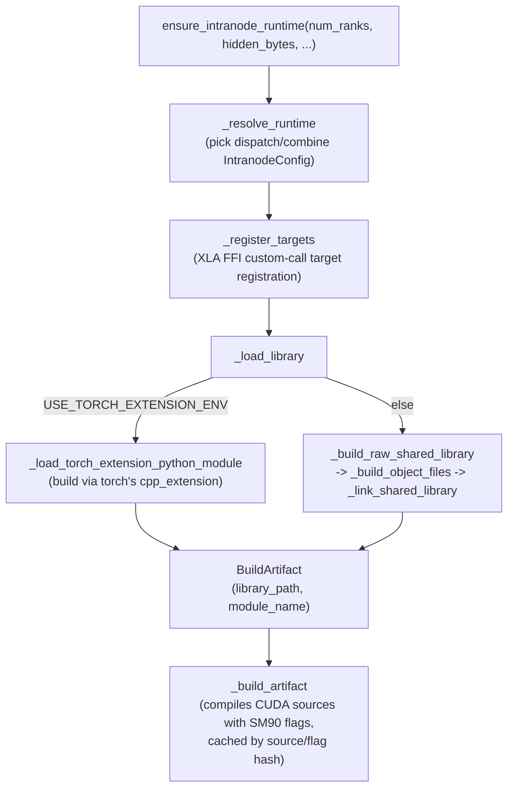

# levanter.kernels.deepep.transport_ffi — JIT-built CUDA FFI bridge for DeepEP intranode transport

## Overview

This module builds, at runtime, a CUDA shared library bridging JAX to DeepEP's intranode
expert-parallel all-to-all transport kernels, then exposes it to JAX via the XLA FFI mechanism.
[`ensure_intranode_runtime`](../catalog/lib/levanter/src/levanter/kernels/deepep/transport_ffi.md#ensure_intranode_runtime)
is the top-level entry point: it lazily builds
([`_build_artifact`](../catalog/lib/levanter/src/levanter/kernels/deepep/transport_ffi.md#_build_artifact)),
loads, and registers the compiled kernel library the first time an intranode all-to-all is needed for a
given `(num_ranks, hidden_bytes)` shape. Because this is CUDA (Hopper/SM90) kernel source compiled
just-in-time from levanter's own Python process, the module also handles the build/cache/fallback
machinery (raw shared library vs. `torch` extension build, SM90 compatibility flags) that a
pre-packaged wheel would normally hide.

## Diagram

## Design rationale (why it's built this way)

**Two independent build backends exist — a raw shared-library build and a `torch` C++/CUDA
extension build — selected by an environment flag, because the CUDA toolchain/`torch` availability
varies across deployment environments.**
[`_build_shared_library`](../catalog/lib/levanter/src/levanter/kernels/deepep/transport_ffi.md#_build_shared_library)
checks `BUILD_WITH_TORCH_EXTENSION_ENV` to decide between
[`_build_raw_shared_library`](../catalog/lib/levanter/src/levanter/kernels/deepep/transport_ffi.md#_build_raw_shared_library)
(direct compiler invocation: `_build_object_files`, `_device_link_objects`, `_link_shared_library`)
and `_build_with_torch_extension`; a further `LOAD_AS_PYTHON_MODULE_ENV` flag decides whether the
result is loaded as a `ctypes.CDLL` or an importable Python extension module
([`_load_as_python_module`](../catalog/lib/levanter/src/levanter/kernels/deepep/transport_ffi.md#_load_as_python_module)).

**SM90 (Hopper) support is compiled conditionally, gated by an explicit disable flag rather than
runtime GPU detection alone.**
[`_sm90_compile_flags`](../catalog/lib/levanter/src/levanter/kernels/deepep/transport_ffi.md#_sm90_compile_flags)
checks `DISABLE_SM90_ENV` before adding SM90-specific compile flags (`include_launch_compat`
controlling whether legacy-launch compatibility shims are included); this lets an operator explicitly
force-disable SM90 codegen (e.g. on non-Hopper hardware or when the SM90 path is suspected buggy)
without needing to patch source.

**The dispatch-thread count is overridable via environment variable, not hardcoded, since the optimal
thread count for the intranode transport kernel is hardware-dependent.**
[`_dispatch_thread_override`](../catalog/lib/levanter/src/levanter/kernels/deepep/transport_ffi.md#_dispatch_thread_override)
reads an env flag (alongside `deepep_cuda_arch`) to let this be tuned without a rebuild-from-source
round-trip for every value tried.

> [!inferred] `_intranode_source_bytes` reading the DeepEP intranode CUDA source and hashing it
> (implied by `_build_artifact`'s caching behavior, which keys on `_cache_root` plus source/flag
> content) suggests the build artifact is content-addressed — changing compile flags or the vendored
> DeepEP source triggers a rebuild, while an unchanged source+flags combination reuses a cached
> `.so`.

## Entry points

- [`ensure_intranode_runtime`](../catalog/lib/levanter/src/levanter/kernels/deepep/transport_ffi.md#ensure_intranode_runtime) —
  the sole public entry point; called before an intranode all-to-all op is first invoked for a given
  `(num_ranks, hidden_bytes)` configuration.
- [`_resolve_runtime`](../catalog/lib/levanter/src/levanter/kernels/deepep/transport_ffi.md#_resolve_runtime) —
  called by the actual dispatch/combine op implementation (outside this packet's own subgraph) to
  obtain a concrete `IntranodeConfig`, triggering `ensure_intranode_runtime` as a side effect if not
  already built.

## Mechanism (step-by-step)

1. **[`ensure_intranode_runtime`](../catalog/lib/levanter/src/levanter/kernels/deepep/transport_ffi.md#ensure_intranode_runtime)
   resolves dispatch/combine configs**, defaulting via
   `_default_dispatch_config`/`_default_combine_config` if not explicitly overridden by the caller.
2. **[`_register_targets`](../catalog/lib/levanter/src/levanter/kernels/deepep/transport_ffi.md#_register_targets)
   registers the compiled library's exported symbols as XLA FFI custom-call
   targets** — this must happen before JAX can dispatch a `jax.experimental.ffi` call into the
   library.
3. **[`_load_library`](../catalog/lib/levanter/src/levanter/kernels/deepep/transport_ffi.md#_load_library)
   builds (if not already cached) and loads the shared library**, dispatching to
   either the raw-shared-library or torch-extension build path per the environment flags described
   above.
4. **`_build_artifact` compiles the CUDA sources with SM90-aware flags**
   ([`_sm90_compile_flags`](../catalog/lib/levanter/src/levanter/kernels/deepep/transport_ffi.md#_sm90_compile_flags)),
   producing a [`BuildArtifact`](../catalog/lib/levanter/src/levanter/kernels/deepep/transport_ffi.md#BuildArtifact.library_path)
   (a `library_path` plus `module_name`).
5. **[`_load_torch_extension_python_module`](../catalog/lib/levanter/src/levanter/kernels/deepep/transport_ffi.md#_load_torch_extension_python_module)
   (torch-extension path) additionally preloads torch's own
   shared libraries** (`_preload_torch_shared_libraries`) before compiling, since the FFI shim
   references torch's runtime symbols.

## Key data structures

- **[`IntranodeConfig`](../catalog/lib/levanter/src/levanter/kernels/deepep/transport_ffi.md#IntranodeConfig)** —
  frozen dataclass describing one dispatch/combine runtime configuration (`num_max_send_tokens`,
  `num_max_recv_tokens`, `num_sms`, per its own referenced fields).
- **`BuildArtifact`** — [`library_path`](../catalog/lib/levanter/src/levanter/kernels/deepep/transport_ffi.md#BuildArtifact.library_path)
  (the compiled `.so` path) and
  [`module_name`](../catalog/lib/levanter/src/levanter/kernels/deepep/transport_ffi.md#BuildArtifact.module_name)
  (`None` when loaded as a raw `ctypes.CDLL` rather than an importable module).

## Dynamics (design intent)
Not addressable beyond the build/cache/load pipeline described above from this packet's subgraph.

## Edge cases
- [`_sm90_compile_flags`](../catalog/lib/levanter/src/levanter/kernels/deepep/transport_ffi.md#_sm90_compile_flags)
  can be forced off entirely via `DISABLE_SM90_ENV`, meaning a build on Hopper-class hardware can
  still intentionally omit SM90-specific codegen if an operator sets that flag.

## Open questions
- How the build cache (`_cache_root`) is invalidated across DeepEP source updates isn't fully
  resolved by the symbols in this packet's subgraph — only that source/flag inputs feed
  `_build_artifact`.
- Whether this GPU/CUDA-targeted transport is used on any TPU-serving path in this codebase, or is
  purely for GPU-hosted expert-parallel training/serving, isn't settled by this packet's subgraph
  alone (the sibling `ep_deepep.py`/`ep_ragged_all_to_all.py`/`ep_ring.py` files under `kernels/`
  suggest DeepEP is one of several interchangeable expert-parallel transport backends, TPU-native ones
  presumably living in the ragged-all-to-all/ring variants instead).

## See also
None — this packet's subgraph is self-contained relative to the other marin concept pages in this
wiki.
