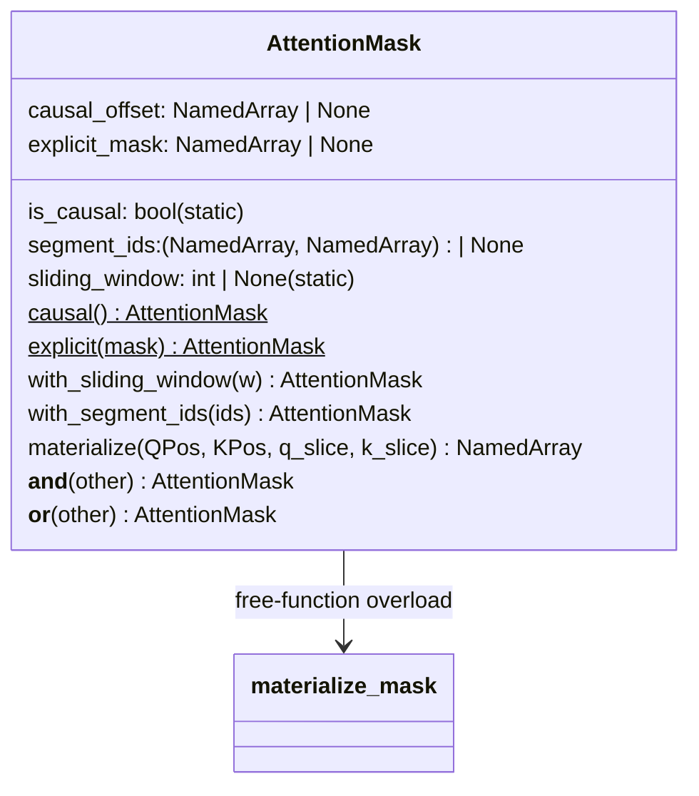

# levanter.layers.attention_mask — AttentionMask, the structural mask algebra

## Overview

[`AttentionMask`](../catalog/lib/levanter/src/levanter/layers/attention_mask.md#AttentionMask) is one
`eqx.Module` with five optional fields
([`is_causal`](../catalog/lib/levanter/src/levanter/layers/attention_mask.md#AttentionMask.is_causal),
[`causal_offset`](../catalog/lib/levanter/src/levanter/layers/attention_mask.md#AttentionMask.causal_offset),
[`explicit_mask`](../catalog/lib/levanter/src/levanter/layers/attention_mask.md#AttentionMask.explicit_mask),
[`segment_ids`](../catalog/lib/levanter/src/levanter/layers/attention_mask.md#AttentionMask.segment_ids),
[`sliding_window`](../catalog/lib/levanter/src/levanter/layers/attention_mask.md#AttentionMask.sliding_window))
combined by implicit conjunction, representing every masking need (causal, sliding-window,
packed-sequence, arbitrary explicit) across every attention backend and model architecture in the
codebase — used by every `LmHeadModel` implementation
([`Gpt2LMHeadModel`](../catalog/lib/levanter/src/levanter/models/gpt2.md#Gpt2LMHeadModel.activations),
[`LlamaLMHeadModel`](../catalog/lib/levanter/src/levanter/models/llama.md#LlamaLMHeadModel.activations),
[`Olmo2LMHeadModel`](../catalog/lib/levanter/src/levanter/models/olmo.md#Olmo2LMHeadModel.activations),
[`MistralLMHeadModel`](../catalog/lib/levanter/src/levanter/models/mistral.md#MistralLMHeadModel.activations))
and the sequence-packing pipeline.

## Diagram

## Design rationale (why it's built this way)

**A single flat class with optional fields, not a class hierarchy per mask kind — an explicit,
acknowledged trade-off, not an oversight.** The class docstring states plainly: "Due to the way jit
works, we don't use inheritance or similar to represent different kinds of masks. Instead, we use a
single class with different fields," while noting its own uncertainty ("Perhaps it's ok to use
inheritance here? I'm not sure. Splash attention landed on inheritance, so maybe that's a good
sign") — this is a documented, revisitable design tension rather than a settled decision.

**Combination (`&`/`__and__`, `|`/`__or__`) operates on the *field representation* directly, not on
materialized dense masks**, so composing a causal mask with a sliding-window mask
([`AttentionMask.with_sliding_window`](../catalog/lib/levanter/src/levanter/layers/attention_mask.md#AttentionMask.with_sliding_window))
never allocates a `[QPos, KPos]` array until
[`materialize`](../catalog/lib/levanter/src/levanter/layers/attention_mask.md#AttentionMask.materialize)
or [`materialize_mask`](../catalog/lib/levanter/src/levanter/layers/attention_mask.md#materialize_mask)
is explicitly called — every backend that natively understands structured masks (Splash, TE) can skip
materialization entirely and read the fields directly.

**`causal_offset` generalizes plain causal masking to a shifted-diagonal variant, encoding "no
offset" as `None` rather than `0`, to distinguish "not configured" from "configured to zero
offset."** The field comment states the semantics precisely: "a query at position `i` can attend to
key `j` whenever `j <= i + causal_offset`. A `None` offset means a static offset of 0." Materializing
this in [`AttentionMask.materialize`](../catalog/lib/levanter/src/levanter/layers/attention_mask.md#AttentionMask.materialize)
computes `shifted_k_start = k_slice.start - offset` and, when that value is itself a `NamedArray`
(not a Python scalar), `vmap`s the causal-mask computation across it — offsets can vary per-batch-
element, not just be a single static constant.

**Segment ids are a *pair* of (query-segment, key-segment) arrays, not one shared array, because
prefill/decode or cross-attention scenarios may need query and key segments defined over different
axes.** [`AttentionMask.with_segment_ids`](../catalog/lib/levanter/src/levanter/layers/attention_mask.md#AttentionMask.with_segment_ids)
accepts `segment_ids` and an independent optional `kv_segment_ids`; the field's type
(`tuple[NamedArray, NamedArray] | None`) makes both being set-together (or neither) the only valid
states.

> [!inferred] Sequence packing
> ([`SequencePacker.pack`](../catalog/lib/levanter/src/levanter/data/packing.md#SequencePacker.pack),
> [`greedy_pack_prompt_completions`](../catalog/lib/levanter/src/levanter/data/packing.md#greedy_pack_prompt_completions))
> constructs its `AttentionMask` as `AttentionMask.causal().with_segment_ids(segment_ids)` — meaning
> packed (concatenated, cross-document) training batches rely on `segment_ids` specifically to keep
> attention scoped within each packed document, on top of the plain causal structure.

## Entry points

- [`AttentionMask.causal`](../catalog/lib/levanter/src/levanter/layers/attention_mask.md#AttentionMask.causal) —
  the standard constructor; called by every model's example-construction path (e.g.
  [`LmExample.causal`](../catalog/lib/levanter/src/levanter/models/lm_model.md#LmExample.causal)) to
  build a causal-masked training example.
- [`AttentionMask.explicit`](../catalog/lib/levanter/src/levanter/layers/attention_mask.md#AttentionMask.explicit) —
  wraps an arbitrary pre-materialized `NamedArray` mask when neither causal nor sliding-window
  structure applies.
- [`AttentionMask.materialize`](../catalog/lib/levanter/src/levanter/layers/attention_mask.md#AttentionMask.materialize) /
  [`materialize_mask`](../catalog/lib/levanter/src/levanter/layers/attention_mask.md#materialize_mask) —
  called by every attention backend that needs an actual dense mask array (the vanilla/simple path),
  as opposed to backends that consume the structured fields directly (Splash, TE).

## Mechanism (step-by-step)

1. **A mask starts from one of two constructors** —
   [`AttentionMask.causal`](../catalog/lib/levanter/src/levanter/layers/attention_mask.md#AttentionMask.causal)
   (sets `is_causal=True`, optionally `sliding_window`/`offset`/`segment_ids` in one call) or
   [`AttentionMask.explicit`](../catalog/lib/levanter/src/levanter/layers/attention_mask.md#AttentionMask.explicit)
   (wraps a raw array).
2. **Refinements are applied via `with_*` methods, each returning a new immutable instance.**
   [`with_sliding_window`](../catalog/lib/levanter/src/levanter/layers/attention_mask.md#AttentionMask.with_sliding_window)
   and
   [`with_segment_ids`](../catalog/lib/levanter/src/levanter/layers/attention_mask.md#AttentionMask.with_segment_ids)
   both reconstruct a full `AttentionMask` copying every other field forward — there is no in-place
   mutation.
3. **[`materialize`](../catalog/lib/levanter/src/levanter/layers/attention_mask.md#AttentionMask.materialize)
   builds the dense mask lazily, combining sub-masks with `combine_masks_and`.** It
   computes the causal component (`causal_mask`, optionally `vmap`-ed over a per-batch offset), the
   explicit-mask slice, and a sliding-window component
   (`_materialize_sliding_window_mask`), ANDing them together — each component is skipped entirely
   when its corresponding field is unset (e.g. no sliding-window computation at all when
   `sliding_window is None`).
4. **Every attention-consuming model callback receives the same `AttentionMask` (or a raw
   `NamedArray`) polymorphically** — e.g.
   [`Gpt2Attention.__call__`](../catalog/lib/levanter/src/levanter/models/gpt2.md#Gpt2Attention.__call__),
   [`LlamaDecoderLayer.__call__`](../catalog/lib/levanter/src/levanter/models/llama.md#LlamaDecoderLayer.__call__),
   and
   [`Olmo2Attention.__call__`](../catalog/lib/levanter/src/levanter/models/olmo.md#Olmo2Attention.__call__)
   all accept `mask: Optional[NamedArray | AttentionMask]` and forward it unchanged into
   `dot_product_attention`.

## Key data structures

- **[`AttentionMask`](../catalog/lib/levanter/src/levanter/layers/attention_mask.md#AttentionMask)** —
  see fields above; `is_causal` and `sliding_window` are declared `eqx.field(..., static=True)`
  (Python-level/traced-as-static), while `causal_offset`/`explicit_mask`/`segment_ids` are ordinary
  (potentially traced) fields.

## Dynamics (design intent)

The class docstring warns that batching `AttentionMask`s is only safe when "all members of a batch
have the same set of combined masks" — since `is_causal`/`sliding_window` are static fields (part of
a pytree's structure, not its traced leaves), two masks with different static-field values are
different pytree structures and cannot share one batched call without producing "weird errors," per
the docstring's own words.

## Edge cases

- [`materialize`](../catalog/lib/levanter/src/levanter/layers/attention_mask.md#AttentionMask.materialize)
  handles a `NamedArray`-typed `causal_offset` by `vmap`-ing the causal-mask computation, but a plain
  Python-scalar offset takes a separate, non-`vmap`ed code path — the two cases produce the same
  logical mask through structurally different code.

## Open questions

- Whether `AttentionMask` will eventually be extended with an inheritance-based structure (the class's
  own "Perhaps it's ok to use inheritance here?" note, contrasted with Splash attention's own
  inheritance-based mask hierarchy) is left open by the source itself.
- The TODO comment "add prefixlm" visible in source indicates prefix-LM masking is a planned but not
  yet implemented mask kind.

## See also
- [root](root.md) — how each attention backend (vanilla/flash/Splash/TE) consumes `AttentionMask`.
- [lib-levanter-src-levanter-models-lm_model](lib-levanter-src-levanter-models-lm_model.md) —
  `LmExample`, whose `attn_mask` field is always an `AttentionMask`.
