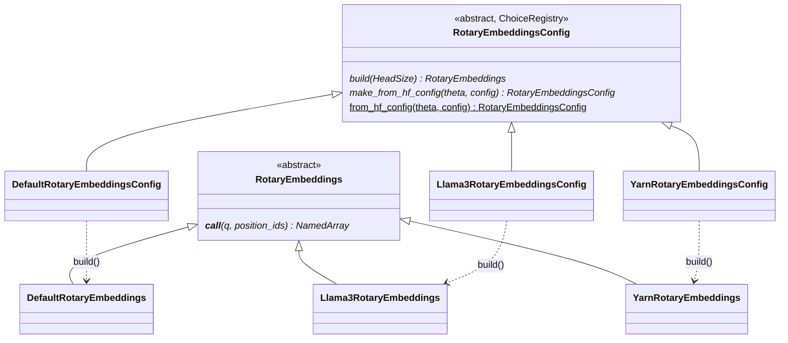

# levanter.layers.rotary — pluggable RoPE frequency schedules

## Overview

[`RotaryEmbeddingsConfig`](../catalog/lib/levanter/src/levanter/layers/rotary.md#RotaryEmbeddingsConfig)
is a `draccus.ChoiceRegistry`-based abstract config with three concrete rotary-embedding schedules —
[`DefaultRotaryEmbeddingsConfig`](../catalog/lib/levanter/src/levanter/layers/rotary.md#DefaultRotaryEmbeddingsConfig)
(plain RoPE), [`Llama3RotaryEmbeddingsConfig`](../catalog/lib/levanter/src/levanter/layers/rotary.md#Llama3RotaryEmbeddingsConfig)
(Llama 3's frequency-band context-extension scaling), and
[`YarnRotaryEmbeddingsConfig`](../catalog/lib/levanter/src/levanter/layers/rotary.md#YarnRotaryEmbeddingsConfig)
(YaRN scaling) — each `build`ing a corresponding
[`RotaryEmbeddings`](../catalog/lib/levanter/src/levanter/layers/rotary.md#RotaryEmbeddings) module
that computes the actual per-head rotation. Every attention config (Llama, Olmo2, Mistral, and the
generic `MultiHeadLatentAttention`/`Attention`) holds one `rope: RotaryEmbeddingsConfig` field,
uniformly, regardless of which schedule is chosen.

## Diagram

## Design rationale (why it's built this way)

**Config and computation are split into two parallel class hierarchies — `*Config` (frozen,
serializable) and the actual `RotaryEmbeddings` module — so a config can be round-tripped to/from a
HuggingFace checkpoint without ever touching JAX arrays.**
[`RotaryEmbeddingsConfig.from_hf_config`](../catalog/lib/levanter/src/levanter/layers/rotary.md#RotaryEmbeddingsConfig.from_hf_config)
dispatches on the HF config dict's `rope_type`/`type` key to
[`RotaryEmbeddingsConfig.get_choice_class`](../catalog/lib/levanter/src/levanter/layers/rotary.md#RotaryEmbeddingsConfig)
(the registry lookup) then calls that class's
[`make_from_hf_config`](../catalog/lib/levanter/src/levanter/layers/rotary.md#RotaryEmbeddingsConfig.make_from_hf_config)
— only [`RotaryEmbeddingsConfig.build`](../catalog/lib/levanter/src/levanter/layers/rotary.md#RotaryEmbeddingsConfig.build)
later constructs the actual `RotaryEmbeddings` module, once a `HeadSize` axis is known.

**Llama 3's rotary schedule blends two frequency regimes (original vs. extended context) rather than
uniformly rescaling every frequency, because low and high frequencies need different treatment when
extending context length.**
[`Llama3RotaryEmbeddings._compute_inv_freq_llama`](../catalog/lib/levanter/src/levanter/layers/rotary.md#Llama3RotaryEmbeddings._compute_inv_freq_llama)
reads
[`factor`](../catalog/lib/levanter/src/levanter/layers/rotary.md#Llama3RotaryEmbeddingsConfig.factor),
[`low_freq_factor`](../catalog/lib/levanter/src/levanter/layers/rotary.md#Llama3RotaryEmbeddingsConfig.low_freq_factor),
[`high_freq_factor`](../catalog/lib/levanter/src/levanter/layers/rotary.md#Llama3RotaryEmbeddingsConfig.high_freq_factor),
and
[`original_max_position_embeddings`](../catalog/lib/levanter/src/levanter/layers/rotary.md#Llama3RotaryEmbeddingsConfig.original_max_position_embeddings)
together — four independent knobs rather than the single `factor` a naive linear RoPE scaling would
need, reflecting that Llama 3's scheme treats the low-frequency (long-wavelength) and high-frequency
(short-wavelength) components of the rotation differently.

**YaRN embeddings default `theta=10000` (the original RoPE base) while Llama 3's default `theta=500000`
— the two schedules ship different defaults appropriate to what checkpoints actually use them.** This
is visible directly in the field declarations
([`YarnRotaryEmbeddingsConfig.theta`](../catalog/lib/levanter/src/levanter/layers/rotary.md#YarnRotaryEmbeddingsConfig.theta)
vs.
[`Llama3RotaryEmbeddingsConfig.theta`](../catalog/lib/levanter/src/levanter/layers/rotary.md#Llama3RotaryEmbeddingsConfig.theta)) —
each model architecture's own config
([`LlamaConfig.rope`](../catalog/lib/levanter/src/levanter/models/llama.md#LlamaConfig.rope),
[`MistralConfig.rope`](../catalog/lib/levanter/src/levanter/models/mistral.md#MistralConfig.rope),
[`Olmo2Config.rope`](../catalog/lib/levanter/src/levanter/models/olmo.md#Olmo2Config.rope)) defaults to
[`DefaultRotaryEmbeddingsConfig`](../catalog/lib/levanter/src/levanter/layers/rotary.md#DefaultRotaryEmbeddingsConfig)
unless that architecture's HF config specifies otherwise.

## Entry points

- [`RotaryEmbeddingsConfig.from_hf_config`](../catalog/lib/levanter/src/levanter/layers/rotary.md#RotaryEmbeddingsConfig.from_hf_config) —
  the entry point every model's `from_hf_config`
  ([`LlamaConfig.from_hf_config`](../catalog/lib/levanter/src/levanter/models/llama.md#LlamaConfig.from_hf_config),
  [`Olmo2Config.from_hf_config`](../catalog/lib/levanter/src/levanter/models/olmo.md#Olmo2Config.from_hf_config),
  [`MistralConfig.from_hf_config`](../catalog/lib/levanter/src/levanter/models/mistral.md#MistralConfig.from_hf_config))
  calls to resolve `rope_theta` and an optional `rope_scaling` dict into a concrete
  `RotaryEmbeddingsConfig`.
- [`RotaryEmbeddingsConfig.build`](../catalog/lib/levanter/src/levanter/layers/rotary.md#RotaryEmbeddingsConfig.build) —
  called once per attention-layer construction to materialize the `RotaryEmbeddings` module for a
  given `HeadSize`.
- [`Llama3RotaryEmbeddings.__call__`](../catalog/lib/levanter/src/levanter/layers/rotary.md#Llama3RotaryEmbeddings.__call__) /
  [`YarnRotaryEmbeddings.__call__`](../catalog/lib/levanter/src/levanter/layers/rotary.md#YarnRotaryEmbeddings.__call__) —
  called once per Q/K projection per forward pass, rotating `q`/`k` by `position_ids`.

## Mechanism (step-by-step)

1. **A model's `from_hf_config` resolves `rope_theta`/`rope_scaling` into a concrete config class**
   via [`RotaryEmbeddingsConfig.from_hf_config`](../catalog/lib/levanter/src/levanter/layers/rotary.md#RotaryEmbeddingsConfig.from_hf_config),
   dispatching through the `ChoiceRegistry` on the HF config's declared `rope_type`.
2. **The chosen config class's `make_from_hf_config`
   ([`Llama3RotaryEmbeddingsConfig.make_from_hf_config`](../catalog/lib/levanter/src/levanter/layers/rotary.md#Llama3RotaryEmbeddingsConfig.make_from_hf_config),
   [`DefaultRotaryEmbeddingsConfig.make_from_hf_config`](../catalog/lib/levanter/src/levanter/layers/rotary.md#DefaultRotaryEmbeddingsConfig.make_from_hf_config))
   extracts the schedule-specific scaling fields from the HF dict.**
3. **At attention-layer build time, [`build`](../catalog/lib/levanter/src/levanter/layers/rotary.md#RotaryEmbeddingsConfig.build)
   constructs the concrete `RotaryEmbeddings` module** — e.g.
   [`Llama3RotaryEmbeddingsConfig.build`](../catalog/lib/levanter/src/levanter/layers/rotary.md#Llama3RotaryEmbeddingsConfig.build)
   returns a [`Llama3RotaryEmbeddings`](../catalog/lib/levanter/src/levanter/layers/rotary.md#Llama3RotaryEmbeddings)
   holding the config and `HeadDim`.
4. **Per forward pass, `__call__` computes (or reads a cached) inverse-frequency vector, then rotates
   `q`/`k` by `position_ids`.**
   [`Llama3RotaryEmbeddings.__call__`](../catalog/lib/levanter/src/levanter/layers/rotary.md#Llama3RotaryEmbeddings.__call__)
   calls
   [`_compute_inv_freq_llama`](../catalog/lib/levanter/src/levanter/layers/rotary.md#Llama3RotaryEmbeddings._compute_inv_freq_llama)
   then applies `_rotate_half`; `YarnRotaryEmbeddings.__call__` similarly computes its own
   YaRN-specific frequency correction (via
   [`_find_dim`](../catalog/lib/levanter/src/levanter/layers/rotary.md#YarnRotaryEmbeddings._find_dim),
   `beta_fast`/`beta_slow`/`mscale`) before rotating.

## Key data structures

- **[`RotaryEmbeddingsConfig`](../catalog/lib/levanter/src/levanter/layers/rotary.md#RotaryEmbeddingsConfig)** —
  abstract base; `theta` is the one field every variant shares.
- **[`Llama3RotaryEmbeddingsConfig`](../catalog/lib/levanter/src/levanter/layers/rotary.md#Llama3RotaryEmbeddingsConfig)** —
  `theta` (default `500000`), `factor`, `low_freq_factor`, `high_freq_factor`,
  `original_max_position_embeddings` (default `8192`).
- **[`YarnRotaryEmbeddingsConfig`](../catalog/lib/levanter/src/levanter/layers/rotary.md#YarnRotaryEmbeddingsConfig)** —
  `theta` (default `10000`), `factor`.
- **[`RotaryEmbeddings`](../catalog/lib/levanter/src/levanter/layers/rotary.md#RotaryEmbeddings)** —
  abstract base whose `__call__` raises `NotImplementedError` directly ("This is an abstract base
  class for RotaryEmbeddings. Use a subclass instead"); every concrete subclass holds its own
  `config` and `HeadDim`.

## Dynamics (design intent)
Not addressable beyond the config→build→call pipeline described above from this packet's subgraph.

## Edge cases
- The base [`RotaryEmbeddings.__call__`](../catalog/lib/levanter/src/levanter/layers/rotary.md#RotaryEmbeddings)
  is a hard abstract stub (raises `NotImplementedError` at call time, not via `abc.abstractmethod`) —
  instantiating the base class directly and calling it fails at runtime rather than at class
  definition/instantiation time.

## Open questions
- Whether other RoPE variants (e.g. linear/NTK-aware scaling beyond Llama3/YaRN) are planned isn't
  visible from this packet's subgraph.

## See also
- [root](root.md) — `Attention`/`GatedAttention`, the consumers of `RotaryEmbeddingsConfig.rope`.
- [lib-levanter-src-levanter-models-llama](lib-levanter-src-levanter-models-llama.md) — `LlamaConfig.rope`'s
  default wiring.
