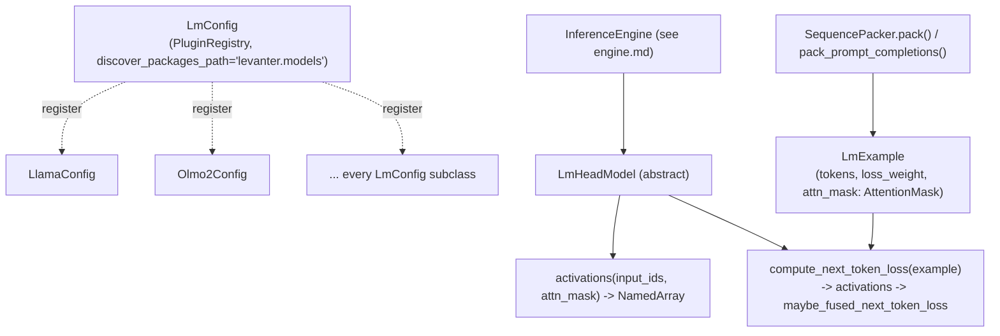

# levanter.models.lm_model — LmConfig registry, LmHeadModel, and next-token loss

## Overview

[`LmConfig`](../catalog/lib/levanter/src/levanter/models/lm_model.md#LmConfig) is a
`draccus.PluginRegistry`-based abstract config with `discover_packages_path="levanter.models"` —
every concrete architecture config (`LlamaConfig`, `Olmo2Config`, `Gpt2Config`, `MistralConfig`, ...)
registers itself into this one registry purely by living under the `levanter.models` package.
[`LmHeadModel`](../catalog/lib/levanter/src/levanter/models/lm_model.md#LmHeadModel) is the abstract
model interface every architecture implements, exposing one shared
[`compute_next_token_loss`](../catalog/lib/levanter/src/levanter/models/lm_model.md#LmHeadModel.compute_next_token_loss)
so the training loop, inference engine, and evaluation code all operate against one interface
regardless of architecture.
[`LmExample`](../catalog/lib/levanter/src/levanter/models/lm_model.md#LmExample) is the corresponding
training-example container every model consumes.

## Diagram

## Design rationale (why it's built this way)

**`LmConfig` uses package-discovery-based plugin registration (`discover_packages_path`), not an
explicit list of imports, so adding a new architecture requires no change to `lm_model.py` itself.**
The class signature —
`class LmConfig(draccus.PluginRegistry, abc.ABC, Generic[LmT], discover_packages_path="levanter.models")` —
means any module under `levanter.models` that defines an `LmConfig` subclass is automatically
discovered; this is the same registry-by-package-membership pattern
`RotaryEmbeddingsConfig`
uses via `draccus.ChoiceRegistry` (see
[lib-levanter-src-levanter-layers-rotary](lib-levanter-src-levanter-layers-rotary.md)), applied one
level up at the whole-architecture granularity.

**Loss computation is one shared method (`compute_next_token_loss`) on the abstract base, not
per-architecture, because every architecture's forward pass ultimately produces the same shape of
logits over the same `Vocab` axis.**
[`LmHeadModel.compute_next_token_loss`](../catalog/lib/levanter/src/levanter/models/lm_model.md#LmHeadModel.compute_next_token_loss)'s
doc — "Compute next-token cross-entropy for a language modeling example" — calls the (per-architecture,
abstract) `activations` method, then a shared `maybe_fused_next_token_loss` helper — the
per-architecture code only needs to implement `activations`, not loss math.

**`LmExample.attn_mask` is always a structured `AttentionMask`, not a raw array, tying training
examples directly into the same mask algebra every attention backend consumes.** Every packing
function that builds an `LmExample` —
[`SequencePacker.pack`](../catalog/lib/levanter/src/levanter/data/packing.md#SequencePacker.pack),
[`pack_prompt_completions`](../catalog/lib/levanter/src/levanter/data/packing.md#pack_prompt_completions),
[`greedy_pack_prompt_completions`](../catalog/lib/levanter/src/levanter/data/packing.md#greedy_pack_prompt_completions) —
constructs its mask via `AttentionMask.causal().with_segment_ids(...)` (see
[lib-levanter-src-levanter-layers-attention_mask](lib-levanter-src-levanter-layers-attention_mask.md)),
never a bespoke boolean array.

## Entry points

- [`LmHeadModel.compute_next_token_loss`](../catalog/lib/levanter/src/levanter/models/lm_model.md#LmHeadModel.compute_next_token_loss) —
  called once per training step by the trainer (see
  [lib-levanter-src-levanter-trainer](lib-levanter-src-levanter-trainer.md)).
- [`InferenceEngine.from_model_with_config`](../catalog/lib/levanter/src/levanter/inference/engine.md#InferenceEngine.from_model_with_config) —
  builds an inference engine from any concrete `LmHeadModel` plus sizing config; the model-architecture
  boundary between training and serving code.
- [`SequencePacker.pack`](../catalog/lib/levanter/src/levanter/data/packing.md#SequencePacker.pack) /
  [`pack_prompt_completions`](../catalog/lib/levanter/src/levanter/data/packing.md#pack_prompt_completions) —
  construct `LmExample`s from raw token sequences.

## Mechanism (step-by-step)

1. **A concrete [`LmConfig`](../catalog/lib/levanter/src/levanter/models/lm_model.md#LmConfig)
   subclass is resolved by name from the registry** (package-discovery-based,
   requiring no explicit registration call).
2. **[`compute_next_token_loss`](../catalog/lib/levanter/src/levanter/models/lm_model.md#LmHeadModel.compute_next_token_loss)
   calls the architecture's `activations`** (over `Embed`/`Pos`/`Vocab`
   axes, using the example's `attn_mask`), producing logits.
3. **Logits feed `maybe_fused_next_token_loss`** (outside this packet's own subgraph) to compute the
   cross-entropy loss, with configurable `reduction`, `loss_dtype`, and `logit_soft_cap`, downstream of
   the same [`compute_next_token_loss`](../catalog/lib/levanter/src/levanter/models/lm_model.md#LmHeadModel.compute_next_token_loss)
   call.
4. **For inference,
   [`InferenceEngine.from_model_with_config`](../catalog/lib/levanter/src/levanter/inference/engine.md#InferenceEngine.from_model_with_config)
   wraps any `LmHeadModel` instance** — `_prefill_kernel`/`_run_generation_loop` (see
   [lib-levanter-src-levanter-inference-engine](lib-levanter-src-levanter-inference-engine.md)) call
   through the same `LmHeadModel` interface regardless of concrete architecture.

## Key data structures

- **[`LmConfig`](../catalog/lib/levanter/src/levanter/models/lm_model.md#LmConfig)** — abstract,
  generic over `LmT` (the model type it produces); the registry root.
- **[`LmHeadModel`](../catalog/lib/levanter/src/levanter/models/lm_model.md#LmHeadModel)** — abstract;
  every architecture implements `activations`/`__call__`; `compute_next_token_loss` is shared.
- **[`LmExample`](../catalog/lib/levanter/src/levanter/models/lm_model.md#LmExample)** — `tokens`,
  `loss_weight`, `attn_mask` (an `AttentionMask`); constructed via
  [`LmExample.causal`](../catalog/lib/levanter/src/levanter/models/lm_model.md#LmExample.causal) or
  [`from_prompt_and_completion`](../catalog/lib/levanter/src/levanter/models/lm_model.md#LmExample.from_prompt_and_completion).

## Dynamics (design intent)
Not addressable beyond the registry/interface pattern described above from this packet's subgraph.

## Edge cases
None directly visible in this packet's subgraph.

## Open questions
- What `maybe_fused_next_token_loss`'s fusion actually does (kernel-level fusion of the logits
  projection with the cross-entropy computation, presumably to avoid materializing the full
  `[Pos, Vocab]` logits tensor) isn't resolved by the symbols in this packet's subgraph — it's outside
  scope here but see [lib-levanter-src-levanter-kernels-deepep-transport_ffi](lib-levanter-src-levanter-kernels-deepep-transport_ffi.md)'s
  sibling kernel packets for related fused-loss machinery under `kernels/pallas/fused_cross_entropy_loss/`.

## See also
- [root](root.md), [lib-levanter-src-levanter-layers-attention_mask](lib-levanter-src-levanter-layers-attention_mask.md) —
  `AttentionMask`, embedded in every `LmExample`.
- [lib-levanter-src-levanter-inference-engine](lib-levanter-src-levanter-inference-engine.md) —
  `LmHeadModel` as consumed by the serving engine.
- [lib-levanter-src-levanter-models-llama](lib-levanter-src-levanter-models-llama.md),
  [lib-levanter-src-levanter-models-olmo](lib-levanter-src-levanter-models-olmo.md) — concrete
  `LmConfig`/`LmHeadModel` implementations.
