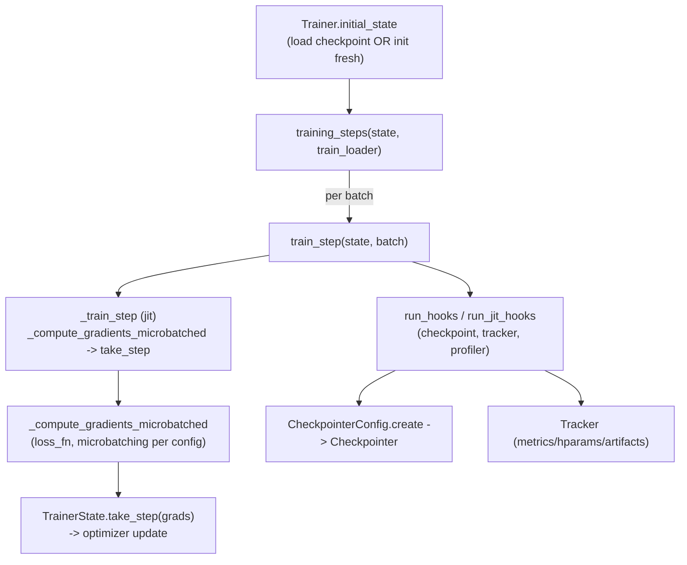

# levanter.trainer — the training-step loop, microbatched gradients, and hooks

## Overview

[`Trainer`](../catalog/lib/levanter/src/levanter/trainer.md#Trainer.__init__) owns the training loop:
[`train_step`](../catalog/lib/levanter/src/levanter/trainer.md#Trainer.train_step) ("Performs a single
training step") wraps the JIT-compiled
[`_train_step`](../catalog/lib/levanter/src/levanter/trainer.md#Trainer._train_step) with timing and
hook execution, while
[`training_steps`](../catalog/lib/levanter/src/levanter/trainer.md#Trainer.training_steps) is the
generator a caller iterates to drive the whole run. Gradient computation is delegated to
[`_compute_gradients_microbatched`](../catalog/lib/levanter/src/levanter/trainer.md#Trainer._compute_gradients_microbatched)
("Compute gradients, optionally with microbatching") and the actual optimizer update to
[`TrainerState.take_step`](../catalog/lib/levanter/src/levanter/trainer_state.md#TrainerState.take_step).
Checkpointing, metric tracking, and profiling are wired in as hooks
([`Trainer._add_default_hooks`](../catalog/lib/levanter/src/levanter/trainer.md#Trainer._add_default_hooks))
rather than being hardcoded into the step function itself.

## Diagram

## Design rationale (why it's built this way)

**`train_step` is split into an outer (hook-running, timed) layer and an inner, JIT-compiled
`_train_step`, so side effects (logging, checkpointing) never need to happen inside traced code.**
[`Trainer.train_step`](../catalog/lib/levanter/src/levanter/trainer.md#Trainer.train_step) calls
`capture_time()` around `_train_step`, then `run_hooks`/`run_jit_hooks_outside_step` — the naming
convention (`_outside_step`) makes explicit that some hooks must run outside the compiled step
boundary (anything needing Python-level I/O, e.g. checkpoint writes or logging to an external
tracker).

**Gradient computation is microbatched by default, factored into its own method rather than inlined
in `_train_step`, so the microbatch-splitting strategy can vary independently of the step logic.**
[`Trainer._compute_gradients_microbatched`](../catalog/lib/levanter/src/levanter/trainer.md#Trainer._compute_gradients_microbatched)'s
doc — "Compute gradients, optionally with microbatching" — takes the loss function and model directly,
returning `(Scalar, M, Dict[str, Metric])` (loss, updated model-shaped gradient, and any metrics
computed along the way) uniformly whether or not microbatching is active.

**Default hooks (checkpointing, tracking, profiling) are added in `__init__` via
`_add_default_hooks`, but can be skipped (`add_default_hooks=False`), keeping the base `Trainer`
usable standalone for testing or custom hook wiring.**
[`Trainer.__init__`](../catalog/lib/levanter/src/levanter/trainer.md#Trainer.__init__) calls
`self._add_default_hooks()` conditionally; `_add_default_hooks` itself wires in a
[`Checkpointer`](../catalog/lib/levanter/src/levanter/checkpoint.md#CheckpointerConfig.create) (via
`CheckpointerConfig.create(run_id)`) and profiling based on `config.profile`.

## Entry points

- [`Trainer.initial_state`](../catalog/lib/levanter/src/levanter/trainer.md#Trainer.initial_state) —
  "Either loads a checkpoint or initializes a fresh trainer state. This is the recommended way to
  initialize" a run; called once at training-loop startup.
- [`Trainer.training_steps`](../catalog/lib/levanter/src/levanter/trainer.md#Trainer.training_steps) —
  the generator a top-level training script iterates; yields one
  [`StepInfo`](../catalog/lib/levanter/src/levanter/callbacks/_core.md#StepInfo) per step.
- [`Trainer.train_step`](../catalog/lib/levanter/src/levanter/trainer.md#Trainer.train_step) — one
  training step, callable directly for finer-grained control than `training_steps`.
- [`Trainer.data_loader`](../catalog/lib/levanter/src/levanter/trainer.md#Trainer.data_loader) —
  "Creates a data loader for the given dataset and batch axis"; the trainer's own factory for
  constructing a `DataLoader` consistent with its config.

## Mechanism (step-by-step)

1. **[`initial_state`](../catalog/lib/levanter/src/levanter/trainer.md#Trainer.initial_state)
   resolves either a checkpoint restore or a fresh model init**, consulting
   `checkpoint_search_paths` and `config` before calling `init_state_and_model`.
2. **`training_steps` iterates the data loader, calling `train_step` once per batch** and yielding a
   [`StepInfo`](../catalog/lib/levanter/src/levanter/callbacks/_core.md#StepInfo) (which carries
   `step` as a property) after running hooks each iteration.
3. **`train_step` times and wraps the compiled `_train_step`**, which itself calls
   `_compute_gradients_microbatched` (honoring `config`'s microbatch settings and
   `parameter_axis_mapping` for sharding) then
   [`TrainerState.take_step`](../catalog/lib/levanter/src/levanter/trainer_state.md#TrainerState.take_step)
   to apply the optimizer update and increment `step`.
4. **After the compiled step returns, `train_step` runs any hooks that must execute outside the JIT
   boundary** (`run_jit_hooks_outside_step`) — e.g. writing metrics to a
   [`Tracker`](../catalog/lib/levanter/src/levanter/tracker/tracker.md#Tracker) ("responsible for
   logging metrics, hyperparameters, and artifacts") or triggering a checkpoint save.

## Key data structures

- **`Trainer`** — holds
  [`config`](../catalog/lib/levanter/src/levanter/trainer.md#Trainer.config) (a `TrainerConfig`), the
  optimizer, and the loss function; constructed once per run.
- **[`StepInfo`](../catalog/lib/levanter/src/levanter/callbacks/_core.md#StepInfo)** — "Information
  about a step that was just completed. This includes the trainer state, the loss, and the duration"
  — the per-step yield value of `training_steps`.
- **`TrainerState`** (see `take_step`) — the model + optimizer state threaded through every step.

## Dynamics (design intent)

The `_outside_step` naming on `run_jit_hooks_outside_step` documents an explicit design boundary: some
hooks are compatible with running *inside* the JIT-compiled step (pure-JAX metric computation via
`run_jit_hooks`), while others (host-side I/O like checkpoint writes) must run only after the compiled
call returns.

## Edge cases
None directly visible beyond the hook-timing boundary described above, from this packet's subgraph.

## Open questions
- The exact microbatching split strategy (how `_compute_gradients_microbatched` divides a batch into
  microbatches, and how gradients are accumulated across them) isn't resolved by the symbols in this
  packet's subgraph alone.

## See also
- [lib-levanter-src-levanter-checkpoint](lib-levanter-src-levanter-checkpoint.md) — the
  `Checkpointer`/`CheckpointerConfig` wired in by `_add_default_hooks`.
- [lib-levanter-src-levanter-config](lib-levanter-src-levanter-config.md) — `OptimizerConfig`/`LrSchedule`,
  configuring the optimizer `Trainer.__init__` receives.
- [lib-levanter-src-levanter-models-lm_model](lib-levanter-src-levanter-models-lm_model.md) —
  `LmHeadModel.compute_next_token_loss`, the typical `loss_fn` a language-model `Trainer` uses.
