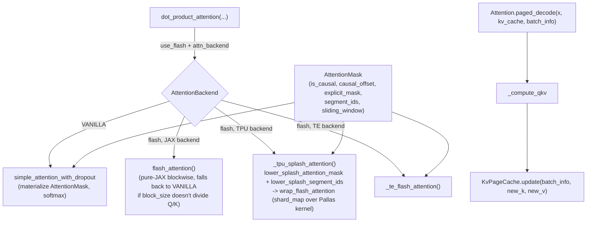

# levanter.layers.attention — backend-dispatching attention with paged decode

## Overview

`levanter.layers.attention` is levanter's one attention layer, parameterized to dispatch across four
compute backends (vanilla dense, a pure-JAX flash attention, TPU Pallas splash attention, and a
transformer-engine flash path) behind a single `Attention`/`GatedAttention`/`AttentionWithSink`
`__call__` signature. The structural mask abstraction —
[`AttentionMask`](../catalog/lib/levanter/src/levanter/layers/attention_mask.md#AttentionMask) — is
what makes backend-swapping safe: causal/sliding-window/segment/explicit masking is represented
declaratively so each backend can lower it to whatever native mask format it needs (e.g. Splash's own
mask objects via
[`lower_splash_attention_mask`](../catalog/lib/levanter/src/levanter/kernels/pallas/splash_attention.md#lower_splash_attention_mask)),
rather than every backend reimplementing masking semantics.

## Diagram

## Design rationale (why it's built this way)

**`AttentionMask` is one class with optional fields combined by implicit conjunction, not a class
hierarchy per mask kind — explicitly because JAX's `jit` doesn't play well with dispatching on
inheritance.** Its own docstring states the reasoning directly: "Due to the way jit works, we don't
use inheritance or similar to represent different kinds of masks. Instead, we use a single class with
different fields," while noting Splash attention itself "landed on inheritance" as a competing data
point the author is not fully settled on. Fields present:
[`is_causal`](../catalog/lib/levanter/src/levanter/layers/attention_mask.md#AttentionMask.is_causal),
[`causal_offset`](../catalog/lib/levanter/src/levanter/layers/attention_mask.md#AttentionMask.causal_offset)
(a shifted-causal variant — query `i` may attend key `j` when `j <= i + causal_offset`),
[`explicit_mask`](../catalog/lib/levanter/src/levanter/layers/attention_mask.md#AttentionMask.explicit_mask),
[`segment_ids`](../catalog/lib/levanter/src/levanter/layers/attention_mask.md#AttentionMask.segment_ids),
and [`sliding_window`](../catalog/lib/levanter/src/levanter/layers/attention_mask.md#AttentionMask.sliding_window).

**Splash attention lowers the same structured mask into its own mask-object algebra rather than
materializing a dense mask array, because Pallas's Splash kernel wants block-sparse structure, not a
full `[Q, K]` boolean tensor.**
[`lower_splash_attention_mask`](../catalog/lib/levanter/src/levanter/kernels/pallas/splash_attention.md#lower_splash_attention_mask)
converts `is_causal`/`sliding_window` into `splash_attention_mask.CausalMask`/`LocalMask` objects
combined via `LogicalAnd`, explicitly raising `NotImplementedError` for causal offsets and explicit
masks (unsupported by the Splash kernel) rather than silently falling back to a slower path.
[`lower_splash_segment_ids`](../catalog/lib/levanter/src/levanter/kernels/pallas/splash_attention.md#lower_splash_segment_ids)
does the analogous packaging for packed-sequence segment boundaries.

**Splash block sizes are derived from the *per-shard* sequence length, not the global sequence
length, because sequence-parallel sharding changes what each shard's kernel actually sees.**
[`splash_attention_block_sizes`](../catalog/lib/levanter/src/levanter/kernels/pallas/splash_attention.md#splash_attention_block_sizes)
divides `q_seq_len`/`kv_seq_len` by `q_seq_shards`/`kv_seq_shards` before picking a compatible block
size — a block size computed against the unsharded length could exceed what a single shard actually
holds. Relatedly,
[`splash_partition_spec_shard_factor`](../catalog/lib/levanter/src/levanter/kernels/pallas/splash_attention.md#splash_partition_spec_shard_factor)
computes the product of mesh-axis sizes a `PartitionSpec` entry references, purely from the
mesh shape — the shard factor for an axis absent from the mesh, or `PartitionSpec.UNCONSTRAINED`, is
defined as `1`.

**`flash_attention` (the pure-JAX path) silently falls back to the vanilla path when the block size
doesn't evenly divide Q or K, and forces that same fallback whenever an attention sink is present.**
[`flash_attention`](../catalog/lib/levanter/src/levanter/models/flash_attention.md#flash_attention)'s
own docstring — "Crappy pure-jax Flash Attention impl, vaguely following the v2 paper" — and its body
comment "When `attn_sink` is provided, that fallback is forced to VANILLA to avoid recursion" together
document that this is a simplicity-over-completeness implementation, not a fully general one.

> [!inferred] [`KvPageCache`](../catalog/lib/levanter/src/levanter/layers/kv_cache.md#KvPageCache)
> stores key and value interleaved in one `kv_pages` array (`2 * KVHeads` on the head axis, per its
> `init`'s `2 * kv_heads.size`) rather than as two separate K/V arrays — likely to keep the paged
> layout's per-page memory access pattern contiguous across both K and V for a given page/slot.

## Entry points

- `Attention.__call__`/`GatedAttention.__call__`/`AttentionWithSink.__call__` (e.g.
  [`Olmo2Attention.__call__`](../catalog/lib/levanter/src/levanter/models/olmo.md#Olmo2Attention.__call__)
  for the concrete OLMo 2 case) — the training-time
  forward pass; all route through `dot_product_attention`, differing only in whether Q/K/V
  projection uses gating or an attention sink.
- `Attention.paged_decode`/`GatedAttention.paged_decode` — the serving-time decode path over a
  [`KvPageCache`](../catalog/lib/levanter/src/levanter/layers/kv_cache.md#KvPageCache) and
  [`PageBatchInfo`](../catalog/lib/levanter/src/levanter/inference/page_table.md#PageBatchInfo)
  (continuous-batching metadata), called once per decode step per attention layer.
- [`flash_attention`](../catalog/lib/levanter/src/levanter/models/flash_attention.md#flash_attention) —
  the pure-JAX flash backend, called from `dot_product_attention` whenever `use_flash=True` and the
  TPU/TE backends aren't selected.

## Mechanism (step-by-step)

1. **`_compute_qkv` projects `x` to Q/K/V and applies per-head processing** (rotary embeddings via a
   [`RotaryEmbeddings`](../catalog/lib/levanter/src/levanter/layers/rotary.md#RotaryEmbeddings)
   built from a [`RotaryEmbeddingsConfig`](../catalog/lib/levanter/src/levanter/layers/rotary.md#RotaryEmbeddingsConfig),
   and optional QK-norm) before any attention math runs.
2. **`dot_product_attention` dispatches on `attn_backend`/`use_flash` to one of four attention
   implementations**, all sharing the same
   [`AttentionMask`](../catalog/lib/levanter/src/levanter/layers/attention_mask.md#AttentionMask)
   input — e.g. Olmo2's `__call__` calls it with `attn_backend=self.config.attn_backend,
   flash_block_size=self.config.flash_attention_block_size`.
3. **On the TPU backend, the structured mask and segment ids are lowered into Splash's own mask
   algebra before the kernel runs**, via
   [`lower_splash_attention_mask`](../catalog/lib/levanter/src/levanter/kernels/pallas/splash_attention.md#lower_splash_attention_mask)
   and
   [`lower_splash_segment_ids`](../catalog/lib/levanter/src/levanter/kernels/pallas/splash_attention.md#lower_splash_segment_ids),
   with block sizes chosen by
   [`splash_attention_block_sizes`](../catalog/lib/levanter/src/levanter/kernels/pallas/splash_attention.md#splash_attention_block_sizes)
   against the per-shard sequence length.
4. **At decode time, `paged_decode` reads/writes a per-layer
   [`KvPageCache`](../catalog/lib/levanter/src/levanter/layers/kv_cache.md#KvPageCache) instead of
   running full self-attention over the whole sequence** — `_compute_qkv` still projects the new
   token(s)' Q/K/V, but K/V are appended into the paged cache
   ([`KvPageCache.update`](../catalog/lib/levanter/src/levanter/layers/kv_cache.md#KvPageCache)
   consumes a [`PageBatchInfo`](../catalog/lib/levanter/src/levanter/inference/page_table.md#PageBatchInfo)
   to know which page/slot each new token lands in) rather than recomputed from scratch.
5. **Normalization layers are built polymorphically from a `LayerNormConfigBase` choice, not a fixed
   class**, via [`LayerNormConfigBase.build`](../catalog/lib/levanter/src/levanter/layers/normalization.md#LayerNormConfigBase.build)
   (an abstract method every concrete norm config implements) — the same pattern
   [`LlamaDecoderLayer.init`](../catalog/lib/levanter/src/levanter/models/llama.md#LlamaDecoderLayer.init)
   uses to build its own layer norms via `config.mk_LayerNorm`.

## Key data structures

- **[`AttentionMask`](../catalog/lib/levanter/src/levanter/layers/attention_mask.md#AttentionMask)** —
  the structural mask every backend consumes; fields combine as an implicit conjunction.
- **[`KvPageCache`](../catalog/lib/levanter/src/levanter/layers/kv_cache.md#KvPageCache)** — one
  `kv_pages: NamedArray` of shape `[Page, Slot, 2*KVHeads, Embed]`, interleaving K and V.
- **[`ListCache`](../catalog/lib/levanter/src/levanter/layers/kv_cache.md#ListCache)** — a
  `PageCache` composed of a tuple of child caches, delegating every operation
  (`reset`/`copy_page`/`replace`) across all of them — used when multiple cache "kinds" must be
  addressed uniformly (e.g. one per attention-layer type in a hybrid architecture).
- **[`PageBatchInfo`](../catalog/lib/levanter/src/levanter/inference/page_table.md#PageBatchInfo)** —
  per-decode-step batch metadata: `slot_ids`, `page_indices`, `seq_lens`, `cu_q_lens`, `num_seqs`,
  `new_token_dests`; its own docstring warns its sequence indices are *not* the same as
  `DecodeState`'s — `slot_ids` is the mapping back.

## Dynamics (design intent)

`PageBatchInfo.__post_init__` asserts `num_seqs` is a JAX ndarray (not a Python int) — this is a
signal that batch composition is itself meant to be traced/dynamic under `jit`, not a Python-level
constant baked into the compiled program.

## Edge cases

- [`lower_splash_attention_mask`](../catalog/lib/levanter/src/levanter/kernels/pallas/splash_attention.md#lower_splash_attention_mask)
  raises `NotImplementedError` for a causal offset or an explicit mask under the Splash backend —
  these mask features are only supported by the vanilla/pure-JAX-flash paths.
- [`flash_attention`](../catalog/lib/levanter/src/levanter/models/flash_attention.md#flash_attention)
  raises `ValueError` if `dropout > 0` and no PRNG `key` is supplied during training, and if
  `dropout` is outside `[0, 1]`.

## Open questions

- Whether `AttentionMask` will eventually move to an inheritance-based design (per its own docstring's
  ambivalence, citing Splash's own inheritance-based mask hierarchy as a counter-example) isn't settled
  by this packet's subgraph.

## See also
- [lib-levanter-src-levanter-layers-attention_mask](lib-levanter-src-levanter-layers-attention_mask.md) —
  deep dive on `AttentionMask` itself.
- [lib-levanter-src-levanter-layers-rotary](lib-levanter-src-levanter-layers-rotary.md) — `RotaryEmbeddings`/`RotaryEmbeddingsConfig`.
- [lib-levanter-src-levanter-inference-jit_scheduler](lib-levanter-src-levanter-inference-jit_scheduler.md) —
  the page-allocation scheduler that produces the `PageBatchInfo` this layer consumes.
- [lib-levanter-src-levanter-models-llama](lib-levanter-src-levanter-models-llama.md),
  [lib-levanter-src-levanter-models-olmo](lib-levanter-src-levanter-models-olmo.md) — concrete model
  architectures wiring `Attention` into a decoder layer.
